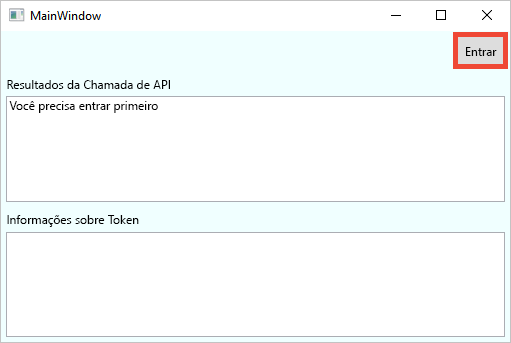
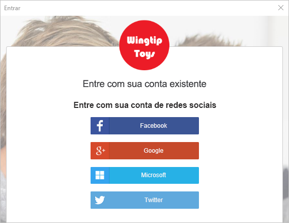
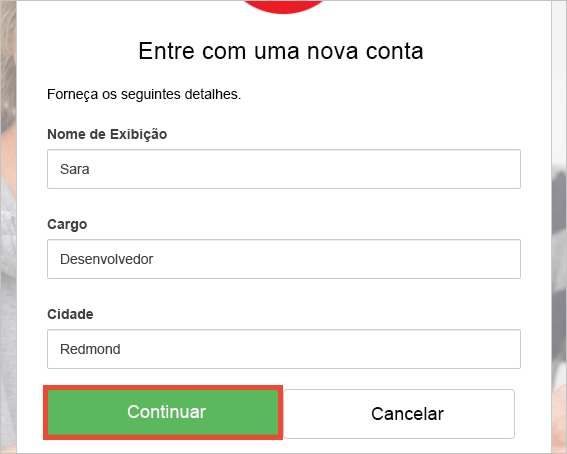
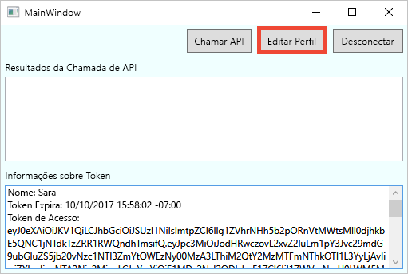
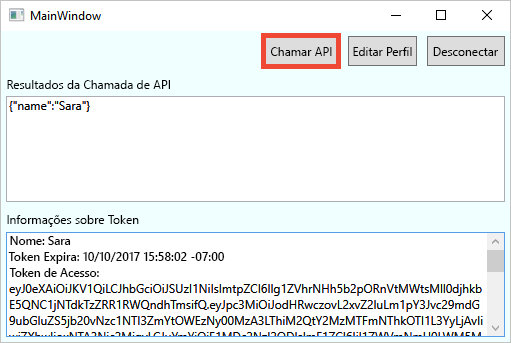

# Fazer test drive de um aplicativo da área de trabalho configurado com o Azure AD B2C

O Azure Active Directory B2C fornece gerenciamento de identidades de nuvem para manter seu aplicativo, negócios e clientes protegidos.  Este guia de início rápido usa um aplicativo da área de trabalho do WPF (Windows Presentation Foundation) de exemplo para demonstrar:

* Como usar a política **Criar conta ou entrar** para criar ou entrar com um provedor de identidade social ou uma conta local usando um endereço de email. 
* **Como chamar uma API** para recuperar o nome de exibição de um recurso protegido do Azure AD B2C.

## Pré-requisitos

* Instale o [Visual Studio 2017](https://www.visualstudio.com/downloads/) com as cargas de trabalho a seguir:
    - **Desenvolvimento para área de trabalho .NET**

* Uma conta social do Facebook, Google, Microsoft ou Twitter. Se você não tiver uma conta social, será necessário ter um endereço de email válido.

[!INCLUDE [quickstarts-free-trial-note](../../includes/quickstarts-free-trial-note.md)]

## Baixar o exemplo

[Baixar ou clonar o aplicativo de exemplo](https://github.com/Azure-Samples/active-directory-b2c-dotnet-desktop) do GitHub.

## Executar o aplicativo no Visual Studio

Na pasta de projeto do aplicativo de exemplo, abra a solução `active-directory-b2c-wpf.sln` no Visual Studio. 

Selecione **Depurar > Iniciar depuração** para compilar e executar o aplicativo. 

## Criar uma conta

Clique em **Entrar** para iniciar o fluxo de trabalho **Criar conta ou entrar**. Ao criar uma conta, você poderá usar a conta de um provedor de identidade social existente ou uma conta de email.

### Inscrever-se usando um provedor de identidade social

Para inscrever-se usando um provedor de identidade social, clique no botão do provedor de identidade que você deseja usar. Se você preferir usar um endereço de email, vá para a seção [Criar conta usando um endereço de email](#sign-up-using-an-email-address).

Você precisará autenticar-se (entrar) usando as credenciais da sua conta social e autorizar o aplicativo a ler as informações dessa conta. Ao conceder o acesso, o aplicativo poderá recuperar informações de perfil da conta social, tais como seu nome e cidade. 

Os detalhes do perfil da sua nova conta são populados previamente com as informações da sua conta social. Modifique os detalhes, se você desejar, e clique em **Continuar**.

Você criou com êxito uma nova conta de usuário do Azure AD B2C que usa um provedor de identidade. Depois de entrar, o token de acesso é exibido na caixa de texto *Informações de token*. O token de acesso é usado para acessar o recurso da API.

Próxima etapa: seção [Ir para Editar seu perfil](#edit-your-profile).

### Criar conta usando um endereço de email

Se você optar por não usar uma conta social para fornecer autenticação, você poderá criar uma conta de usuário do Azure AD B2C usando um endereço de email válido. Uma conta de usuário local do Azure AD B2C usa o Azure Active Directory como o provedor de identidade. Para usar seu endereço de email, clique no link **Não tem uma conta? Inscreva-se agora mesmo**.

Insira um endereço de email válido e clique em **Enviar o código de verificação**. É necessário ter um endereço de email válido para receber o código de verificação do Azure AD B2C.

Insira o código de verificação que você recebeu por email e clique em **Verificar código**.

Adicione suas informações de perfil e clique em **Criar**.

Você criou com êxito uma nova conta de usuário local do Azure AD B2C. Depois de entrar, o token de acesso é exibido na caixa de texto *Informações de token*. O token de acesso é usado para acessar o recurso da API.

## Editar o perfil

O Azure Active Directory B2C fornece funcionalidade para permitir que usuários atualizem seus perfis. Clique em **Editar perfil** para editar o perfil que você criou.

Escolha o provedor de identidade associado à conta que você criou. Por exemplo, se você usou o Twitter como o provedor de identidade quando criou a conta, escolha Twitter para modificar os detalhes do perfil associado.

Altere seu **Nome de exibição** ou **Cidade**. 

Um novo token de acesso é exibido na caixa de texto *Informações de token*. Se você quiser verificar as alterações no seu perfil, copie e cole o token de acesso no decodificador de token https://jwt.ms.

## Acessar um recurso

Clique em **Chamar API** para fazer uma solicitação para o recurso protegido do Azure AD B2C https://fabrikamb2chello.azurewebsites.net/hello. 

O aplicativo inclui o token de acesso exibido na caixa de texto *Informações de token* na solicitação. A API retorna o nome de exibição contido no token de acesso.

## Próximas etapas

A próxima etapa será criar seu próprio locatário do Azure AD B2C e configurar o exemplo para ser executado usando o seu locatário. 

> [!div class="nextstepaction"]
> [Criar um locatário do Azure Active Directory B2C no Portal do Azure](active-directory-b2c-get-started.md)
