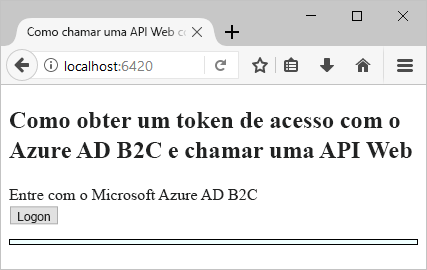
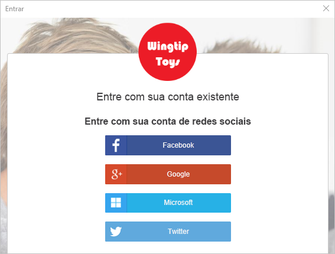
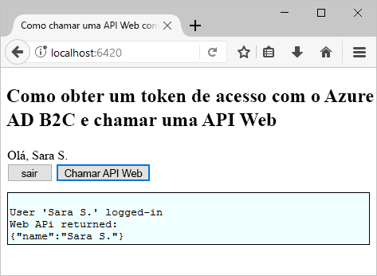

# <a name="test-drive-a-single-page-application-configured-with-azure-ad-b2c"></a>Fazer test drive de um aplicativo de página única configurado com o Azure AD B2C

## <a name="about-this-sample"></a>Sobre este exemplo

O Azure Active Directory B2C fornece gerenciamento de identidades de nuvem para manter seu aplicativo, negócios e clientes protegidos.  Este guia de início rápido usa um aplicativo de página única de exemplo para demonstrar:

* Como usar a política **Criar conta ou entrar** para criar ou entrar com um provedor de identidade social ou uma conta local usando um endereço de email. 
* **Como chamar uma API** para recuperar o nome de exibição de um recurso protegido do Azure AD B2C.

## <a name="prerequisites"></a>Pré-requisitos

* Instale o [Visual Studio 2017](https://www.visualstudio.com/downloads/) com as cargas de trabalho a seguir:
    - **Desenvolvimento Web e do ASP.NET**

* Instale o [Node.js](https://nodejs.org/en/download/)

* Uma conta social do Facebook, Google, Microsoft ou Twitter. Se você não tiver uma conta social, será necessário ter um endereço de email válido.

[!INCLUDE [quickstarts-free-trial-note](../../includes/quickstarts-free-trial-note.md)]

## <a name="download-the-sample"></a>Baixar o exemplo

[Baixar ou clonar o aplicativo de exemplo](https://github.com/Azure-Samples/active-directory-b2c-javascript-msal-singlepageapp) do GitHub.

## <a name="run-the-sample-application"></a>Executar o aplicativo de exemplo

Para executar esse exemplo no prompt de comando de Node.js: 

```
cd active-directory-b2c-javascript-msal-singlepageapp
npm install && npm update
node server.js
```

A janela do console mostra o número da porta para o aplicativo Web em execução no seu computador.

```
Listening on port 6420...
```

Abra `http://localhost:6420` em um navegador da Web para acessar o aplicativo Web.




## <a name="create-an-account"></a>Criar uma conta

Clique no botão **Logon** para iniciar o fluxo de trabalho **Criar conta ou entrar** do Azure AD B2C. Ao criar uma conta, você poderá usar a conta de um provedor de identidade social existente ou uma conta de email.

### <a name="sign-up-using-a-social-identity-provider"></a>Inscrever-se usando um provedor de identidade social

Para inscrever-se usando um provedor de identidade social, clique no botão do provedor de identidade que você deseja usar. Se você preferir usar um endereço de email, vá para a seção [Criar conta usando um endereço de email](#sign-up-using-an-email-address).



Você precisará autenticar-se (entrar) usando as credenciais da sua conta social e autorizar o aplicativo a ler as informações dessa conta. Ao conceder o acesso, o aplicativo poderá recuperar informações de perfil da conta social, tais como seu nome e cidade. 


Os detalhes do perfil da sua nova conta são populados previamente com as informações da sua conta social. 


Atualize os campos Nome de exibição, Cargo e Cidade e clique em **Continuar**.  Os valores inseridos são usados seu perfil de conta de usuário do Azure AD B2C.

Você criou com êxito uma nova conta de usuário do Azure AD B2C que usa um provedor de identidade. 

Próxima etapa: seção [Chamar um recurso](#call-a-resource).

### <a name="sign-up-using-an-email-address"></a>Criar conta usando um endereço de email

Se você optar por não usar uma conta social para fornecer autenticação, você poderá criar uma conta de usuário do Azure AD B2C usando um endereço de email válido. Uma conta de usuário local do Azure AD B2C usa o Azure Active Directory como o provedor de identidade. Para usar seu endereço de email, clique no link **Não tem uma conta? Inscreva-se agora mesmo**.


Insira um endereço de email válido e clique em **Enviar o código de verificação**. É necessário ter um endereço de email válido para receber o código de verificação do Azure AD B2C. 

Insira o código de verificação que você recebeu por email e clique em **Verificar código**.

Adicione suas informações de perfil e clique em **Criar**.


Você criou com êxito uma nova conta de usuário local do Azure AD B2C.

## <a name="call-a-resource"></a>Chamar um recurso

Depois de conectado, você pode clicar no botão **Chamar API da Web** para que seu nome de exibição seja retornado na chamada à API da Web como um objeto JSON. 



## <a name="next-steps"></a>Próximas etapas

A próxima etapa será criar seu próprio locatário do Azure AD B2C e configurar o exemplo para ser executado usando o seu locatário. 

> [!div class="nextstepaction"]
> [Criar um locatário do Azure Active Directory B2C no Portal do Azure](active-directory-b2c-get-started.md)