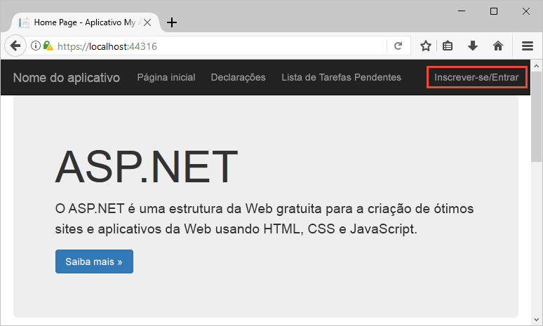
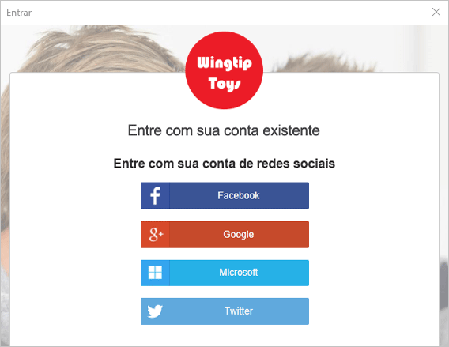
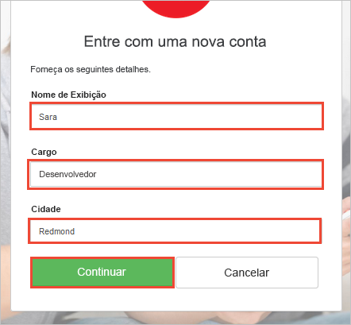
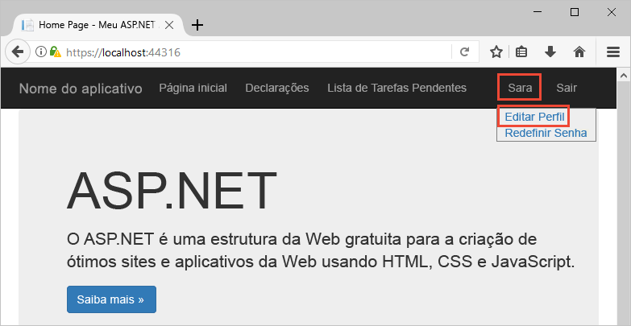
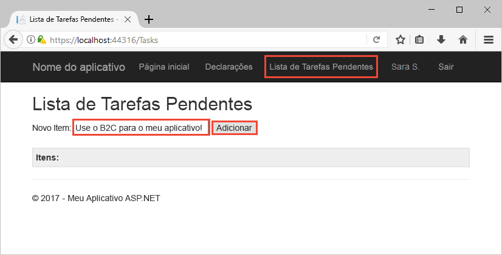

# Fazer test drive de um aplicativo Web configurado com o Azure AD B2C

O Azure Active Directory B2C fornece gerenciamento de identidades de nuvem para manter seu aplicativo, negócios e clientes protegidos.  Este guia de início rápido usa um aplicativo de lista de tarefas pendentes de exemplo para demonstrar:

* Como usar a política **Criar conta ou entrar** para criar ou entrar com um provedor de identidade social ou uma conta local usando um endereço de email. 
* Como chamar uma API protegida pelo Azure AD B2C para criar e editar itens de tarefas pendentes.

## Pré-requisitos

* Instale o [Visual Studio 2017](https://www.visualstudio.com/downloads/) com as cargas de trabalho a seguir:
    - **Desenvolvimento Web e do ASP.NET**

* Uma conta social do Facebook, Google, Microsoft ou Twitter. Se você não tiver uma conta social, será necessário ter um endereço de email válido.

[!INCLUDE [quickstarts-free-trial-note](../../includes/quickstarts-free-trial-note.md)]

## Baixar o exemplo

[Baixar ou clonar o aplicativo de exemplo](https://github.com/Azure-Samples/active-directory-b2c-dotnet-webapp-and-webapi) do GitHub.

## Executar o aplicativo no Visual Studio

Na pasta de projeto do aplicativo de exemplo, abra a solução `B2C-WebAPI-DotNet.sln` no Visual Studio. 

A solução é composta por dois projetos:

* **TaskWebApp** – Um aplicativo Web ASP.NET MVC no qual um usuário pode gerenciar seus itens de lista de tarefas pendentes.  
* **TaskService** – Um back-end da API Web ASP.NET que gerencia todas as operações CRUD executada nos itens de lista de tarefas pendentes do usuário. O aplicativo Web chama essa API e exibe os resultados.

Para este início rápido, você precisará executar ambos os projetos `TaskWebApp` e `TaskService` ao mesmo tempo. 

1. No Gerenciador de Soluções, clique com o botão direito do mouse na solução e selecione **Definir projetos de inicialização...**. 
2. Selecione o botão de opção **Vários projetos de inicialização**.
3. Altere a **Ação** para ambos os projetos para **Iniciar**. Clique em **OK**.

Selecione **Depurar > Iniciar depuração** para compilar e executar ambos os aplicativos. Cada aplicativo é aberto em sua própria guia do navegador:

* `https://localhost:44316/` – Esta página é o aplicativo Web ASP.NET. Você interage diretamente com este aplicativo no início rápido.
* `https://localhost:44332/` – Essa página é a API Web que é chamada pelo aplicativo Web ASP.NET.

## Criar uma conta

Clique no link **Criar conta / Entrar** no aplicativo Web ASP.NET para iniciar o fluxo de trabalho **Criar conta ou entrar**. Ao criar uma conta, você poderá usar a conta de um provedor de identidade social existente ou uma conta de email.

### Inscrever-se usando um provedor de identidade social

Para inscrever-se usando um provedor de identidade social, clique no botão do provedor de identidade que você deseja usar. Se você preferir usar um endereço de email, vá para a seção [Criar conta usando um endereço de email](#sign-up-using-an-email-address).

Você precisará autenticar-se (entrar) usando as credenciais da sua conta social e autorizar o aplicativo a ler as informações dessa conta. Ao conceder o acesso, o aplicativo poderá recuperar informações de perfil da conta social, tais como seu nome e cidade. 

Conclua o processo de entrada para o provedor de identidade. Por exemplo, clique no botão **Entrar** do Twitter.

Os detalhes do perfil da sua nova conta são populados previamente com as informações da sua conta social.

Atualize os campos Nome de exibição, Cargo e Cidade e clique em **Continuar**.  Os valores inseridos são usados seu perfil de conta de usuário do Azure AD B2C.

Você criou com êxito uma nova conta de usuário do Azure AD B2C que usa um provedor de identidade. 

Próxima etapa: seção [Ir para a exibição das suas declarações](#view-your-claims).

### Criar conta usando um endereço de email

Se você optar por não usar uma conta social para fornecer autenticação, você poderá criar uma conta de usuário do Azure AD B2C usando um endereço de email válido. Uma conta de usuário local do Azure AD B2C usa o Azure Active Directory como o provedor de identidade. Para usar seu endereço de email, clique no link **Não tem uma conta? Inscreva-se agora mesmo**.

Insira um endereço de email válido e clique em **Enviar o código de verificação**. É necessário ter um endereço de email válido para receber o código de verificação do Azure AD B2C. 

Insira o código de verificação que você recebeu por email e clique em **Verificar código**.

Adicione suas informações de perfil e clique em **Criar**.

Você criou com êxito uma nova conta de usuário local do Azure AD B2C.

## Redefinir sua senha

Se você criou sua conta usando um endereço de email, o Azure AD B2C tem uma funcionalidade para permitir que os usuários redefinam suas senhas. Para editar o perfil que você criou, clique no nome do perfil na barra de menus e selecione **Redefinir senha**.

Verifique o endereço de email inserindo-o e clicando em **Enviar o código de verificação**. Um código de verificação é enviado para o endereço de email.

Insira o código de verificação que você recebeu por email e clique em **Verificar código**.

Depois que o endereço de email foi verificado, clique em **Continuar**.

Insira a nova senha e clique em **Continuar**.

## Exibir suas declarações

Clique em **Declarações** na barra de menus do aplicativo Web para exibir as declarações associadas à última ação. 

Neste exemplo, a última ação ocorreu para a experiência de *criar conta ou entrar*. Observe que o **Tipo de declaração** `http://schemas.microsoft.com/claims/authnclassreference` é `b2c_1_susi`, indicando que a última ação foi criar conta ou entrar. Se a última ação tivesse sido uma redefinição de senha, o **Tipo de declaração** seria `b2c_1_reset`.

## Editar o perfil

O Azure Active Directory B2C fornece funcionalidade para permitir que usuários atualizem seus perfis. Na barra de menus do aplicativo Web, clique no nome do perfil e selecione **Editar perfil** para editar o perfil criado.

Altere seu **Nome de exibição** e **Cidade**.  Clique em **Continuar** para atualizar seu perfil.

Observe como seu nome de exibição é atualizado na parte superior direita da página depois de alterar seu nome. 

Clique em **Declarações**. As alterações feitas no **Nome de exibição** e **Cidade** são refletidas nas declarações.

 Observe que o **Tipo de declaração** `http://schemas.microsoft.com/claims/authnclassreference` foi atualizado para `b2c_1_edit_profile`, indicando que a última ação executada foi uma edição de perfil. Observe também que o nome e a cidade são os novos valores *Sara S.* e *Seattle*.

## Acessar um recurso

Clique em **Lista de tarefas pendentes** para inserir e modificar os itens da lista de tarefas pendentes. O aplicativo Web ASP.NET inclui um token de acesso na solicitação para a recurso da API Web que solicita a permissão para executar operações em itens de lista de tarefas pendentes do usuário. 

Insira texto na caixa de texto **Novo Item**. Clique em **Adicionar** para chamar a API Web protegida do Azure AD B2C que adiciona um item de lista de tarefas pendentes.

## Outros cenários

Outros cenários para fazer test drive são os seguintes:

* Saia do aplicativo e clique em **Lista de tarefas pendentes**. Observe como será solicitado que você entre e como seus itens de lista são mantidos. 
* Crie uma nova conta usando um tipo diferente de conta. Por exemplo, use um provedor de identidade social se tiver criado uma conta usando um endereço de email anteriormente.

## Próximas etapas

A próxima etapa será criar seu próprio locatário do Azure AD B2C e configurar o exemplo para ser executado usando o seu locatário. 

> [!div class="nextstepaction"]
> [Criar um locatário do Azure Active Directory B2C no Portal do Azure](active-directory-b2c-get-started.md)