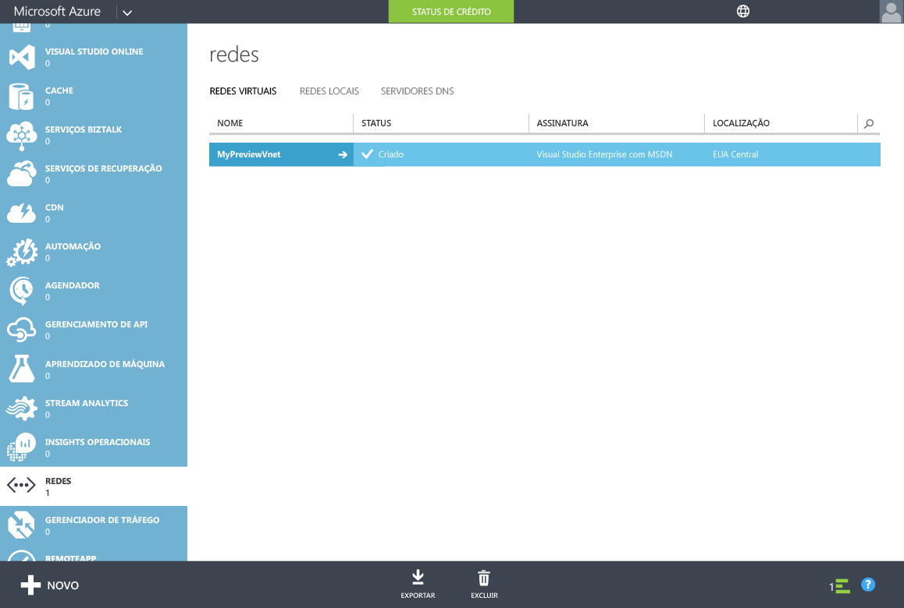
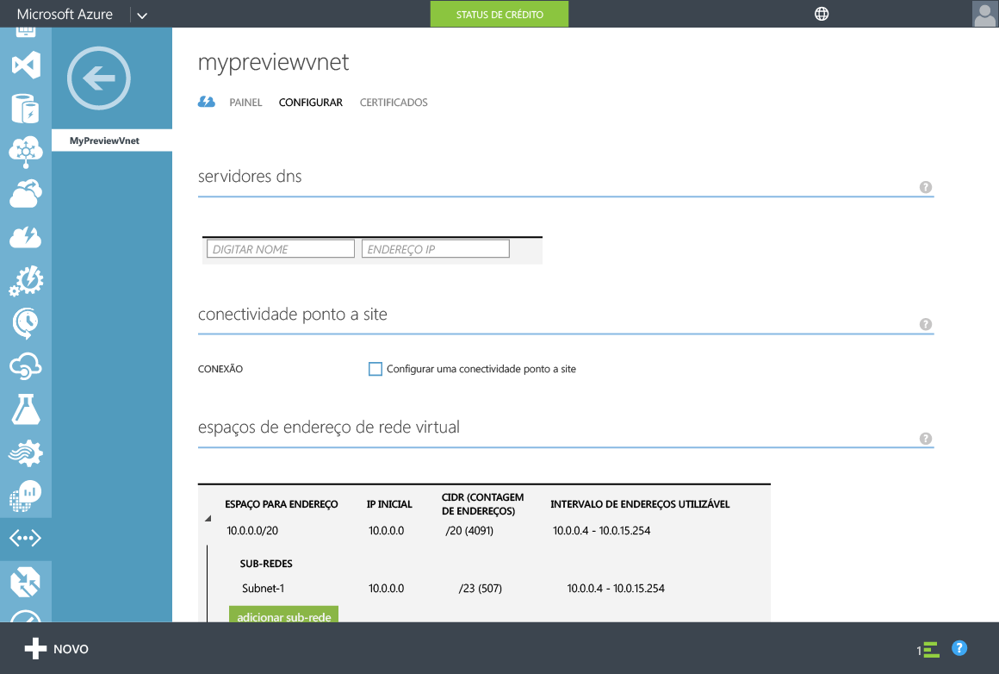
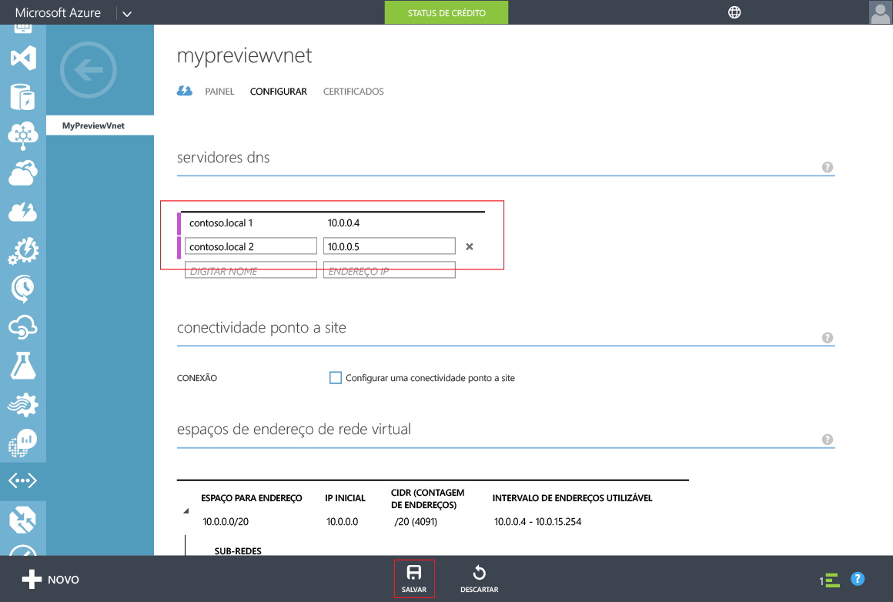

# Serviços de Domínio do Azure AD - atualizar configurações do DNS para a rede virtual do Azure
## Tarefa 4: atualizar as configurações do DNS para a rede virtual do Azure
Nas tarefas de configuração anteriores, você habilitou com êxito os Serviços de Domínio do Azure AD para seu diretório. A próxima tarefa é garantir que os computadores na rede virtual possam se conectar e consumir esses serviços. Atualize as configurações do servidor DNS para sua rede virtual para apontar para os dois endereços IP em que os Serviços de Domínio do Azure AD estão disponíveis na rede virtual.

> [!NOTE]
> Anote os endereços IP para os Serviços de Domínio do Azure AD exibidos na guia **Configurar** do seu diretório, depois de ter habilitado os Serviços de Domínio do Azure AD para o diretório.
> 
> 

Execute as seguintes etapas de configuração para atualizar uma configuração do servidor DNS para a rede virtual na qual você tiver habilitado os Serviços de Domínio do Azure AD.

1. Navegue até o **portal clássico do Azure** ([https://manage.windowsazure.com](https://manage.windowsazure.com)).
2. Selecione o nó **Redes** no painel esquerdo.
   
    
3. Na guia **Redes Virtuais**, selecione a rede virtual na qual você habilitou os Serviços de Domínio do Azure AD para exibir suas propriedades.
4. Clique na guia **Configurar**.
   
    
5. Na seção **Servidores DNS**, digite os endereços IP dos Serviços de Domínio do Azure AD.
6. Certifique-se de inserir os endereços IP que foram exibidos na seção **Serviços de Domínio** da guia **Configurar** do seu diretório.
7. Para salvar as configurações do servidor DNS para essa rede virtual, clique em **Salvar** no painel de tarefas na parte inferior da página.
   
   

> [!NOTE]
> Depois de atualizar as configurações do servidor DNS para a rede virtual, pode levar algum tempo para as máquinas virtuais na rede obterem a configuração de DNS atualizada. Se uma máquina virtual não puder se conectar ao domínio, você pode liberar o cache do DNS (por exemplo, 'ipconfig /flushdns') na máquina virtual. Esse comando força uma atualização das configurações de DNS na máquina virtual.
> 
> 

## Tarefa 5: Habilitar a sincronização de senhas para os Serviços de Domínio do AD do Azure
A próxima tarefa de configuração é [habilitar a sincronização de senhas para os Serviços de Domínio do Azure AD](active-directory-ds-getting-started-password-sync.md).

<!---HONumber=AcomDC_0928_2016-->