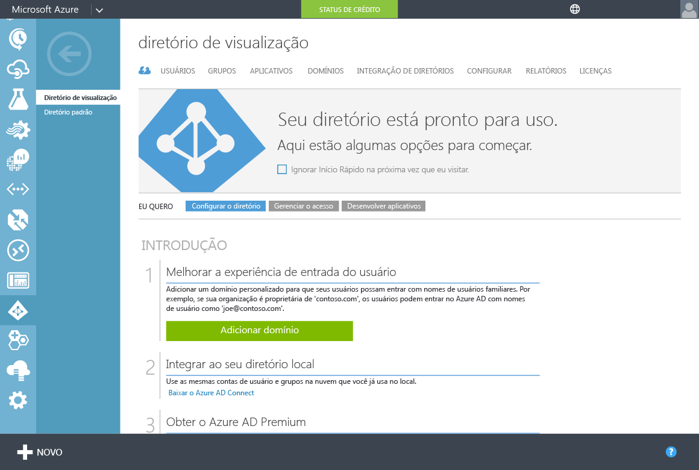
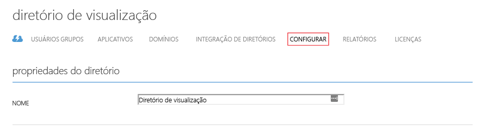
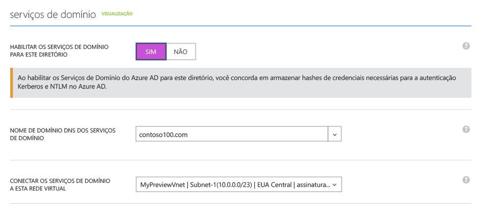
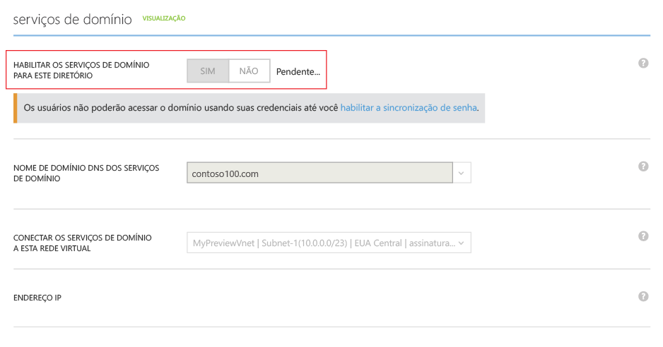
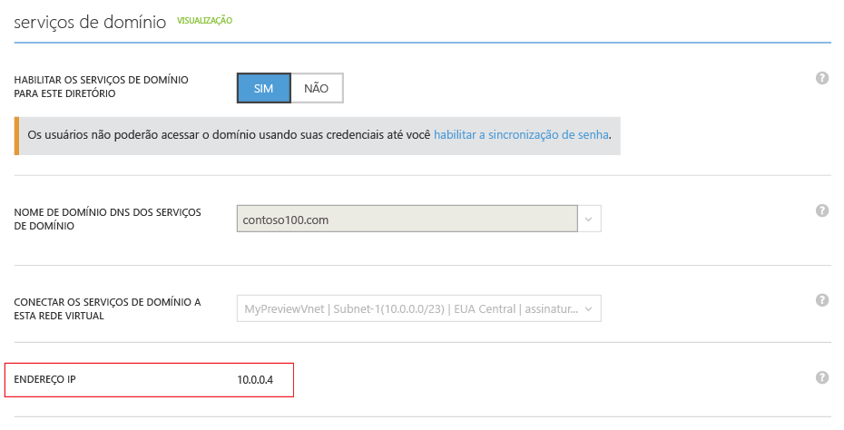
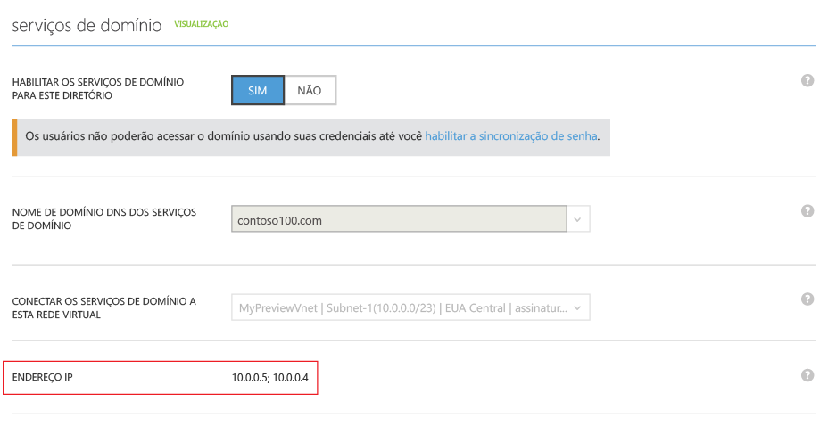

# Habilitar o Azure Active Directory Domain Services usando o portal clássico do Azure

## Tarefa 3: habilitar o Azure Active Directory Domain Services
Nesta tarefa, você habilita o Azure Active Directory Domain Services (Azure AD DS) para seu diretório executando as seguintes etapas:

1. Vá para o [portal clássico do Azure](https://manage.windowsazure.com).
2. No painel esquerdo, selecione o botão **Active Directory**.
3. Selecione o locatário do Azure Active Directory (Azure AD) (diretório) para o qual você deseja habilitar o Azure AD DS.

    
4. No **diretório de visualização**, clique na guia **Configurar**.

    
5. Em **serviços de domínio**, altere a opção **Habilitar serviços de domínio para este diretório** para **Sim**.  
    Opções adicionais de configuração do Azure Active Directory Domain Services aparecem na página.

    

   > [!NOTE]
   > Quando você habilitar os Azure Active Directory Domain Services o seu locatário, o Azure AD gerará e armazenará os hashes de credencial de NTLM e Kerberos necessários para autenticar usuários.
   >
   >
6. Especifique o **nome de domínio DNS dos serviços de domínio**.

   * O nome de domínio padrão do diretório (com um sufixo **.onmicrosoft.com**) é selecionado por padrão.

   * A lista contém todos os domínios configurados para o diretório do Azure AD, incluindo domínios verificados e não verificados que você configura na guia **Domínios**.

   * Você também pode inserir um nome de domínio personalizado. Neste exemplo, o nome de domínio personalizado é *contoso100.com*.

     > [!WARNING]
     > O prefixo do nome do domínio especificado (por exemplo, *contoso100* no nome de domínio *contoso100.com*) deve conter 15 caracteres ou menos. Você não pode criar um domínio do Azure Active Directory Domain Services com um prefixo que contenha mais de 15 caracteres.
     >
     >
7. Garanta que o nome de domínio DNS escolhido para o domínio gerenciado ainda não exista na rede virtual. Especificamente, verifique se:

   * Você já tiver um domínio com o mesmo nome de domínio DNS na rede virtual.

   * A rede virtual que você selecionou tiver uma conexão VPN com a rede local e se tiver um domínio com o mesmo nome de domínio DNS na sua rede local.

   * Você tiver um serviço de nuvem existente com esse nome na rede virtual.
8. Selecione uma rede virtual na qual você deseja que o Azure Active Directory Domain Services esteja disponível. Selecione a rede virtual e a sub-rede dedicada que você criou na lista suspensa **Conectar serviços de domínio a essa rede virtual**. Considere também o seguinte:

   * Verifique se a rede virtual especificada pertence a uma região do Azure que tem suporte no Azure Active Directory Domain Services. Para conhecer as regiões do Azure nas quais o Azure Active Directory Domain Services está disponível, confira [Serviços do Azure por região](https://azure.microsoft.com/regions/#services/).

   * Redes virtuais que pertencem a uma região em que o Azure Active Directory Domain Services não é suportado não aparecem na lista suspensa.

   * Use uma sub-rede dedicada na rede virtual para o Azure Active Directory Domain Services. *Não* selecione a sub-rede de gateway. Confira [Considerações de rede](active-directory-ds-networking.md).

   * Da mesma forma, as redes virtuais criadas usando o Azure Resource Manager não aparecerão na lista suspensa. No momento, as redes virtuais baseadas no Resource Manager não têm suporte dos Azure Active Directory Domain Services.
9. Para habilitar o Azure Active Directory Domain Services, no painel de tarefas na parte inferior da página, clique em **Salvar**.
    * Enquanto o Azure Active Directory Domain Services está sendo habilitado para seu diretório, a página exibe o status *Pendente*.

        

        > [!NOTE]
        > O Azure Active Directory Domain Services fornece alta disponibilidade para seu domínio gerenciado. Após habilitar o Azure Active Directory Domain Services, os endereços IP em que domínio os serviços estão disponíveis na rede virtual serão exibidos um de cada vez. O segundo endereço IP é exibido brevemente após o primeiro, assim que o serviço permite a alta disponibilidade para seu domínio. Quando a alta disponibilidade estiver configurada e ativa para seu domínio, você deverá ver dois endereços IP na seção **serviços de domínio** da guia **Configurar**.
        >
        >
    * Após cerca de 20 a 30 minutos, o primeiro endereço IP em que os Serviços de Domínio estão disponíveis em sua rede virtual no campo **endereço IP** na página **Configurar**.

        
    * Quando a alta disponibilidade estiver operacional para seu domínio, dois endereços IP serão exibidos na página. O domínio gerenciado está disponível em sua rede virtual selecionada nesses dois endereços IP.

10. Observe os dois endereços IP para que você possa atualizar as configurações de DNS para sua rede virtual. Isso permite às máquinas virtuais na rede virtual se conectarem ao domínio para operações como o ingresso no domínio.

    

> [!NOTE]
> Dependendo do tamanho do locatário do Azure AD (por exemplo, o número de usuários ou grupos), a sincronização para o domínio gerenciado leva algum tempo. Esse processo de sincronização ocorre em segundo plano. Para locatários maiores com dezenas de milhares de objetos, pode levar um ou dois dias para todos os usuários membros do grupo e credenciais a serem sincronizados.
>
>

## Próxima etapa
Tarefa 4: [atualizar as configurações do DNS para a rede virtual do Azure](active-directory-ds-getting-started-update-dns.md)

