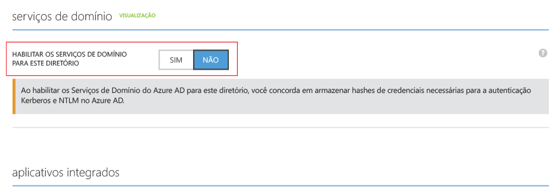

# Habilitar os Serviços de Domínio do Azure AD
## Tarefa 3: Habilitar os Serviços de Domínio do AD do Azure
Nesta tarefa, você habilita os Serviços de Domínio do Azure AD para seu diretório. Execute as seguintes etapas de configuração para habilitar os Serviços de Domínio do Azure AD para seu diretório.

1. Navegue até o **portal clássico do Azure** ([https://manage.windowsazure.com](https://manage.windowsazure.com)).
2. No painel esquerdo, selecione o nó **Active Directory** .
3. Selecione o locatário do AD do Azure (diretório) para o qual você deseja habilitar os Serviços de Domínio do AD do Azure.
   
    
4. Clique na guia **Configurar** .
   
    
5. Role para baixo até uma seção chamada **serviços de domínio**.
   
    
6. Alterne a opção chamada **Habilitar serviços de domínio para este diretório** para **SIM**. Você vê que algumas opções adicionais de configuração para serviços de domínio do Azure AD são exibidas na página.
   
    
   
   > [!NOTE]
   > Quando você habilitar os Serviços de Domínio do Azure AD para seu locatário, o Azure AD irá gerar e armazenar os hashes de credencial de NTLM e Kerberos necessários para autenticar usuários.
   > 
   > 
7. Especifique o **nome de domínio DNS dos serviços de domínio**.
   
   * O nome de domínio padrão do diretório (ou seja, terminando com sufixo de domínio **.onmicrosoft.com** ) é selecionado por padrão.
   * A lista contém todos os domínios configurados para o diretório do AD do Azure, incluindo domínios verificados e não verificados que você configura na guia "Domínios".
   * Além disso, você também pode digitar um nome de domínio personalizado. Neste exemplo, digitamos o nome de domínio personalizado 'contoso100.com'.
     
     > [!WARNING]
     > Verifique se o prefixo do nome de domínio especificado por você (por exemplo, 'contoso100' no nome de domínio 'contoso100.com') tem menos de 15 caracteres. Você não pode criar um domínio dos Serviços de Domínio do AD do Azure com um prefixo de domínio maior do que 15 caracteres.
     > 
     > 
8. Garanta que o nome de domínio DNS escolhido para o domínio gerenciado ainda não exista na rede virtual. Especificamente, verifique se:
   
   * você já tiver um domínio com o mesmo nome de domínio DNS na rede virtual.
   * a rede virtual que você selecionou tiver uma conexão VPN com a rede local e se tiver um domínio com o mesmo nome de domínio DNS na sua rede local.
   * você tiver um serviço de nuvem existente com esse nome na rede virtual.
9. A próxima etapa é selecionar uma rede virtual na qual você gostaria que os Serviços de Domínio do AD do Azure estivesse disponível. Selecione a rede virtual e a sub-rede dedicada que você criou na lista suspensa chamada **Conectar serviços de domínio a essa rede virtual**.
   
   * Certifique-se de que a rede virtual especificada pertença a uma região do Azure com suporte dos Serviços de Domínio do AD do Azure. Consulte a página [Serviços do Azure por região](https://azure.microsoft.com/regions/#services/) para conhecer as regiões do Azure nas quais os Serviços de Domínio do Azure AD estão disponíveis.
   * As redes virtuais pertencentes a uma região onde não há suporte para serviços de domínio do Azure AD não aparecem na lista suspensa.
   * Use uma sub-rede dedicada na rede virtual para os Serviços de Domínio do Azure AD. Verifique se você não selecionou a sub-rede de gateway. Confira [Considerações de rede](active-directory-ds-networking.md). 
   * Da mesma forma, as redes virtuais criadas usando o Azure Resource Manager não aparecerão na lista suspensa. No momento, as redes virtuais baseadas no Resource Manager não têm suporte dos Serviços de Domínio do Azure AD.
10. Para habilitar os Serviços de Domínio do Azure AD, clique em **Salvar** no painel de tarefas na parte inferior da página.
11. A página exibe ‘Pendente...’ enquanto os Serviços de Domínio do Azure AD estão sendo habilitados para seu diretório.
    
    
    
    > [!NOTE]
    > Os Serviços de Domínio do AD do Azure fornecem alta disponibilidade para seu domínio gerenciado. Depois de habilitar os Serviços de Domínio do Azure AD, você verá os endereços IP em que os Serviços de Domínio estão disponíveis na rede virtual aparecerem um por um. O segundo endereço IP é exibido em seguida, assim que o serviço permite a alta disponibilidade para seu domínio. Quando a alta disponibilidade estiver configurada e ativa para seu domínio, você deverá ver dois endereços IP na seção **serviços de domínio** da guia **Configurar**.
    > 
    > 
12. Após cerca de 20 a 30 minutos, você verá o primeiro endereço IP em que os Serviços de Domínio estão disponíveis em sua rede virtual no campo **endereço IP** na página **Configurar**.
    
    
13. Quando a alta disponibilidade estiver operacional para seu domínio, você verá dois endereços IP sendo exibidos na página. O domínio gerenciado está disponível em sua rede virtual selecionada nesses dois endereços IP. Anote os endereços IP para que você possa atualizar as configurações de DNS para sua rede virtual. Essa etapa permite às máquinas virtuais na rede virtual se conectarem ao domínio para operações como o ingresso no domínio.
    
    

> [!NOTE]
> Dependendo do tamanho do locatário do Azure AD (número de usuários, grupos, etc.), a sincronização com seu domínio gerenciado pode ser demorada. Esse processo de sincronização ocorre em segundo plano. Para locatários maiores com dezenas de milhares de objetos, pode levar um ou dois dias para todos os usuários membros do grupo e credenciais a serem sincronizados.
> 
> 

 

## Tarefa 4: atualizar as configurações do DNS para a rede virtual do Azure
A próxima tarefa de configuração é [atualizar as configurações do DNS para a rede virtual do Azure](active-directory-ds-getting-started-dns.md).

<!--HONumber=Dec16_HO2-->

