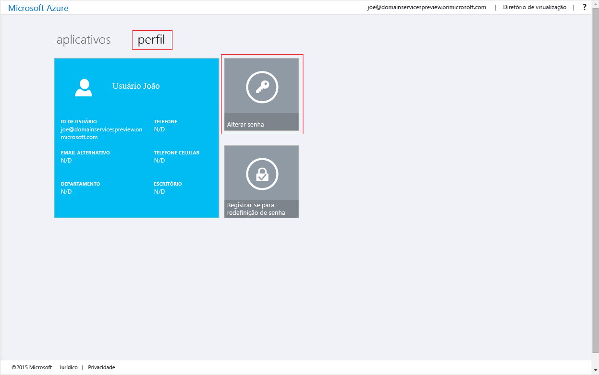
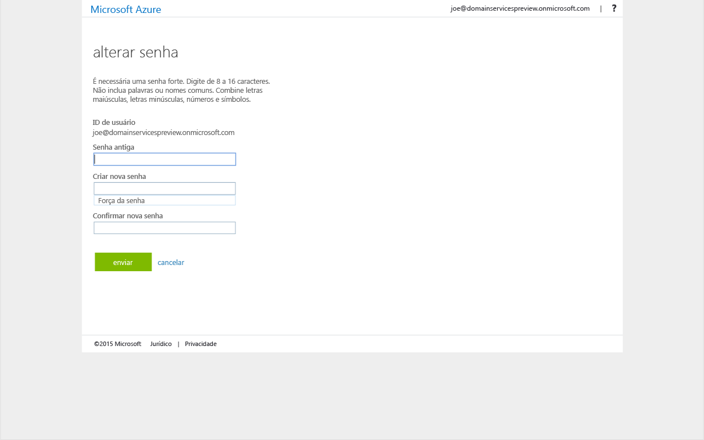

# Habilitar a sincronização de senhas para o Azure Active Directory Domain Services
Nas tarefas anteriores, você habilitou o Azure Active Directory Domain Services para seu locatário do Azure AD (Azure Active Directory). A próxima tarefa é habilitar a sincronização de hashes de credencial necessários para a autenticação Kerberos e NTLM para o Azure AD Domain Services. Depois que a sincronização de credenciais é configurada, os usuários podem entrar no domínio gerenciado com suas credenciais corporativas.

As etapas envolvidas são diferentes para as contas de usuário somente em nuvem versus contas de usuário sincronizadas do seu diretório local usando o Azure AD Connect. 

 
| **Tipo de conta de usuário** | **Etapas a serem executadas** |
| --- |---|
| **Contas de usuário de nuvem criadas no Azure AD** |**&#x2713;** [Siga as instruções deste artigo](active-directory-ds-getting-started-password-sync.md#task-5-enable-password-synchronization-to-your-managed-domain-for-cloud-only-user-accounts) |
| **Contas de usuário sincronizadas de um diretório local** |**&#x2713;** [Sincronizar senhas para as contas de usuário sincronizadas de seu AD local para seu domínio gerenciado](active-directory-ds-getting-started-password-sync-synced-tenant.md) | 

 

> [!TIP]
> **Talvez seja necessário concluir os dois conjuntos de etapas.**
> Se o seu locatário do AD do Azure tiver uma combinação de usuários somente em nuvem e os usuários do seu AD local, será necessário concluir ambos os conjuntos de etapas.
>

## Tarefa 5: habilitar a sincronização de senha para o domínio gerenciado para contas de usuário somente na nuvem
Para autenticar os usuários no domínio gerenciado, o Azure Active Directory Domain Services precisa de hashes de credenciais em um formato adequado para a autenticação NTLM e Kerberos. O Azure AD não gera nem armazena hashes de credenciais no formato necessário para a autenticação NTLM ou Kerberos, até que você habilite o Azure Active Directory Domain Services para seu locatário. Por motivos de segurança óbvios, o Azure AD também não armazena credenciais de senha no formato de texto não criptografado. Portanto, o Azure AD não tem uma maneira de gerar automaticamente esses hashes de credenciais NTLM ou Kerberos com base em credenciais de usuários existentes.

> [!NOTE]
> **Se a sua organização tiver contas de usuário somente na nuvem, todos os usuários que precisarem usar o Azure Active Directory Domain Services deverão alterar suas senhas.** Uma conta de usuário somente na nuvem é uma conta que foi criada no diretório do Azure AD usando o portal do Azure ou os cmdlets do Azure AD PowerShell. Essas contas de usuário não são sincronizadas de um diretório local.
>
>

Esse processo de alteração de senhas faz com que os hashes de credencial requeridos pelo Azure Active Directory Domain Services para a autenticação Kerberos e NTLM sejam gerados no AD do Azure. Você também pode expirar senhas para todos os usuários no locatário que precisam usar o Azure Active Directory Domain Services ou instrui-los para alterar suas senhas.

### Habilitar a geração de hashes de credencial Kerberos e NTLM para uma conta de usuário somente na nuvem
Aqui estão as instruções que você precisa fornecer aos usuários para que eles possam alterar suas senhas:

1. Vá para a página do [Painel de acesso do Azure AD](http://myapps.microsoft.com) da sua organização.

    

2. No canto superior direito, clique em seu nome e selecione **Perfil** no menu.

    

3. Na página **Perfil**, clique em **Alterar senha**.

    

   > [!TIP]
   > Se a opção **Alterar senha** não for exibida na janela Painel de Acesso, verifique se sua organização configurou [gerenciamento de senhas no Azure AD](../active-directory/active-directory-passwords-getting-started.md).
   >
   >
4. Na página **Alterar senha** , digite sua senha (antiga) existente, digite uma nova senha e confirme-a.

    

5. Clique em **Enviar**.

A nova senha poderá ser utilizada no Azure Active Directory Domain Services alguns minutos após a sua alteração. Depois de cerca de 20 minutos, você poderá entrar em computadores que ingressaram no domínio gerenciado usando a senha recém-alterada.

## Conteúdo relacionado
* [Como atualizar sua própria senha](../active-directory/active-directory-passwords-update-your-own-password.md)
* [Introdução ao Gerenciamento de Senhas no Azure AD](../active-directory/active-directory-passwords-getting-started.md)
* [Habilitar a sincronização de senhas para o Azure Active Directory Domain Services em um locatário do Azure AD sincronizado](active-directory-ds-getting-started-password-sync-synced-tenant.md)
* [Administrar um domínio gerenciado do Azure Active Directory Domain Services](active-directory-ds-admin-guide-administer-domain.md)
* [Ingressar em uma máquina virtual do Windows para um domínio gerenciado do Azure Active Directory Domain Services](active-directory-ds-admin-guide-join-windows-vm.md)
* [Ingressar em uma máquina virtual do Red Hat Enterprise Linux para um domínio gerenciado do Azure Active Directory Domain Services](active-directory-ds-admin-guide-join-rhel-linux-vm.md)
