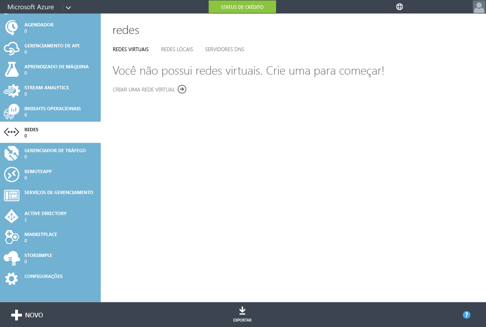
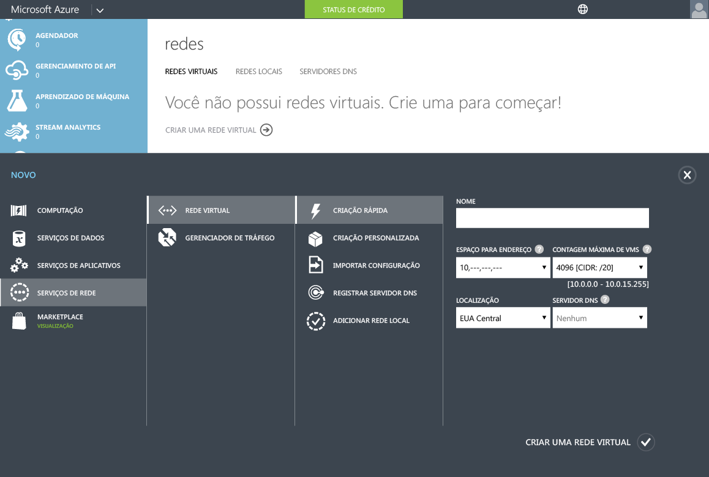
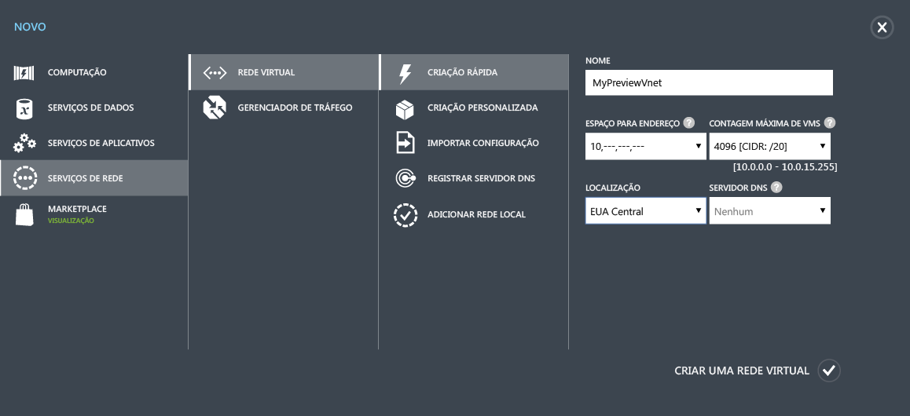
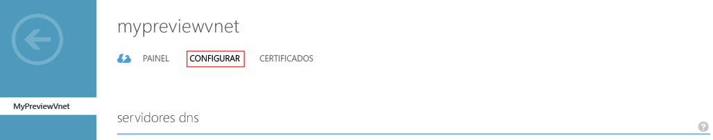
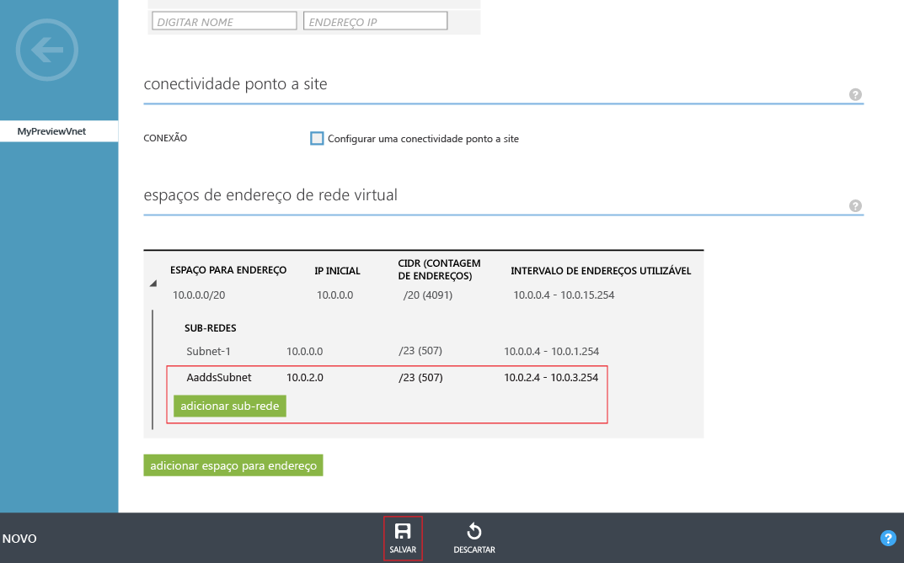

# Criar ou selecionar uma rede virtual para o Azure Active Directory Domain Services

> [!IMPORTANT]
> A experiência do portal clássico do Azure para habilitar o Azure AD Domain Services mostrado neste artigo será removida em breve. Para novas implantações, [ **use a nova experiência do portal do Azure (versão prévia)**](active-directory-ds-getting-started.md).
>

## Antes de começar
Consulte as [Considerações de rede para o Azure Active Directory Domain Services](active-directory-ds-networking.md).

## Tarefa 2: criar uma rede virtual do Azure
A próxima tarefa de configuração é criar uma rede virtual do Azure e uma sub-rede dentro dela. Você pode habilitar o Azure Active Directory Domain Services nessa sub-rede dentro de sua rede virtual. Se você tem uma rede virtual preferida, pode ignorar esta etapa.

> [!NOTE]
> Verifique se a rede virtual do Azure que você criar ou escolher usar com o Azure Active Directory Domain Services pertença a uma região do Azure com suporte pelo Azure Active Directory Domain Services. Para ver as regiões do Azure nas quais o Azure Active Directory Domain Services está disponível, confira [Serviços do Azure por região](https://azure.microsoft.com/regions/#services/).
>
>Anote o nome da rede virtual para selecionar a rede virtual correta ao habilitar o Azure Active Directory Domain Services em uma etapa de configuração subsequente.

Para criar uma rede virtual do Azure no qual você deseja habilitar o Azure Active Directory Domain Services, siga estas instruções de configuração:

1. Vá para o [portal clássico do Azure](https://manage.windowsazure.com).
2. No painel esquerdo, selecione **Redes**.

      
    A janela **Redes Virtuais** é aberta.
3. No painel de tarefas na parte inferior da página, clique em **Novo**.

    
4. Clique em **Serviços de Rede**e selecione **Rede Virtual**.

    
5. Para criar uma rede virtual, clique em **Criação Rápida**.

6. Especifique um **nome** para sua rede virtual e considere o seguinte:
    * Você pode optar por configurar o **Espaço de endereço** ou a **Contagem máxima de VMs** para essa rede.
    * Por enquanto, você pode deixar a configuração **Servidor DNS** definida como **Nenhum**. Depois de habilitar o Azure Active Directory Domain Services, você pode atualizar a configuração.
7. Na lista suspensa **Local**, selecione uma região do Azure com suporte.  
    Para conhecer as regiões do Azure nas quais o Azure Active Directory Domain Services está disponível, confira [Serviços do Azure por região](https://azure.microsoft.com/regions/#services/).
8. Para criar sua rede virtual, clique em **Criar uma Rede Virtual**.

    
9. Depois de criar uma rede virtual, selecione o nome da rede virtual e clique na guia **Configurar**.

    
10. Em **espaços de endereço de rede virtual**, clique em **adicionar sub-rede**e especifique uma sub-rede com o nome **AaddsSubnet**.

    

11. Para criar a sub-rede, clique em **Salvar**.

## Próxima etapa
[Tarefa 3: habilitar o Azure Active Directory Domain Services](active-directory-ds-getting-started-enableaadds.md)

