<properties
	pageTitle="Serviços de Federação do Active Directory no Azure | Microsoft Azure"
	description="Neste documento, você aprenderá a implantar o AD FS no Azure para obter alta disponibilidade."
    keywords="introdução ao AD FS, Azure, visão geral do Azure AD Connect, AD FS no Azure, iaas, ADFS"
	services="active-directory"
	documentationCenter=""
	authors="anandyadavmsft"
	manager="femila"
	editor=""/>

<tags
	ms.service="active-directory"
	ms.workload="identity"
	ms.tgt_pltfrm="na"
	ms.devlang="na"
	ms.topic="get-started-article"
	ms.date="07/13/2016"
	ms.author="anandy;billmath"/>

# Implantação do AD FS no Azure 

O AD FS fornece recursos simplificados e seguros de federação de identidade e de logon único (SSO) da Web. A federação com o Azure AD ou o O365 habilita os usuários a se autenticar usando credenciais locais e acessar todos os recursos na nuvem. Como resultado, é importante ter uma infraestrutura altamente disponível do AD FS para garantir o acesso a recursos locais e na nuvem. Implantar o AD FS no Azure pode ajudar a atingir a alta disponibilidade necessária com esforço mínimo. Há várias vantagens na implantação do AD FS no Azure. Algumas delas são listadas abaixo:

* **Alta disponibilidade** -com a tecnologia de Conjuntos de Disponibilidade do Azure, você garante uma infraestrutura altamente disponível.
* **Fácil de dimensionar** – precisa de mais desempenho? Migre facilmente para computadores mais eficientes com apenas alguns cliques no Azure
* **Redundância geográfica cruzada** – com a Redundância Geográfica do Azure, você pode ter certeza de que sua infraestrutura é altamente disponível em todo o mundo
* **Fácil de gerenciar** – com opções de gerenciamento altamente simplificado no portal do Azure, o gerenciamento da infraestrutura é muito fácil e não tem complicações

## Princípios de design

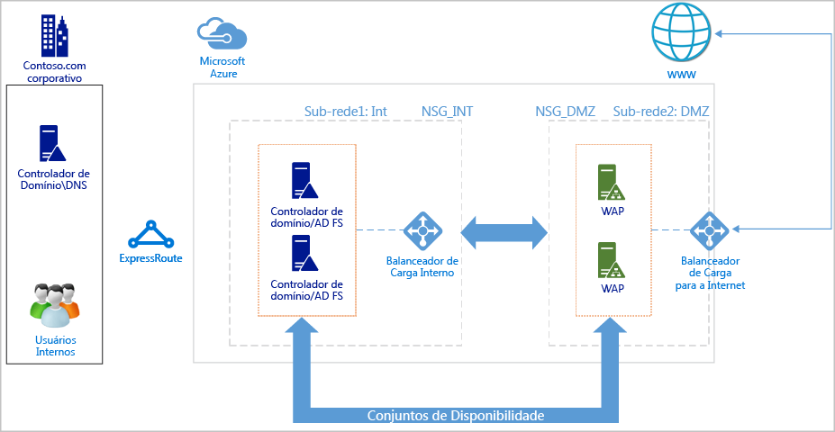

O diagrama acima mostra a topologia básica recomendada para começar a implantar a infraestrutura do AD FS no Azure. Os princípios por trás dos vários componentes da topologia são listados abaixo:

* **DC/Servidores ADFS**: se tem menos de 1.000 usuários, você pode simplesmente instalar a função do AD FS nos controladores de domínio. Se não quiser que haja impacto no desempenho nos controladores de domínio ou se tiver mais de 1.000 usuários, implante o AD FS em servidores separados.
* **Servidor WAP** – é necessário implantar servidores de Proxy de Aplicativo Web para que os usuários também possam acessar o AD FS quando não estiverem na rede da empresa.
* **Rede de Perímetro**: os servidores de Proxy de Aplicativo Web serão colocados na rede de perímetro, e o acesso TCP/443 só será permitido entre a rede de perímetro e a sub-rede interna.
* **Balanceadores de Carga**: para garantir a alta disponibilidade do AD FS e dos servidores de Proxy de Aplicativo Web, é recomendável usar um balanceador de carga interno para servidores do AD FS e o Azure Load Balancer para servidores Proxy de Aplicativo Web.
* **Conjuntos de disponibilidade**: para fornecer redundância para sua implantação do AD FS, é recomendável agrupar duas ou mais máquinas virtuais em um Conjunto de Disponibilidade para cargas de trabalho semelhantes. Essa configuração garante que durante um evento de manutenção planejada ou não planejada, pelo menos uma máquina virtual esteja disponível
* **Contas de armazenamento**: é recomendável ter duas contas de armazenamento. Ter uma única conta de armazenamento pode levar à criação de um ponto único de falha e pode fazer com que a implantação fique indisponível em um cenário improvável, em que a conta de armazenamento fica inativa. Duas contas de armazenamento ajudarão a associar uma conta de armazenamento a cada linha de falha.
* **Segregação de rede**: servidores de Proxy de Aplicativo Web devem ser implantados em uma rede de perímetro separada. Você pode dividir uma rede virtual em duas sub-redes e implantar servidores de Proxy de Aplicativo Web em uma sub-rede isolada. Você pode simplesmente definir as configurações de grupo de segurança de rede para cada sub-rede e permitir somente a comunicação necessária entre as duas sub-redes. Mais detalhes são fornecidos para cada cenário de implantação abaixo

##Etapas para implantar o AD FS no Azure

As etapas mencionadas nesta seção descrevem o guia para implantar no Azure a infraestrutura do AD FS descrita abaixo.

### 1\. Implantar a rede

Conforme descrito acima, você pode criar duas sub-redes em uma única rede virtual ou criar duas redes virtuais completamente diferentes (VNet). Este artigo abordará a implantação de uma única rede virtual e sua divisão em duas sub-redes. Essa é uma abordagem mais fácil, pois duas redes virtuais separadas exigiriam um gateway de rede virtual para rede virtual para comunicações.

**1.1 Criar rede virtual**

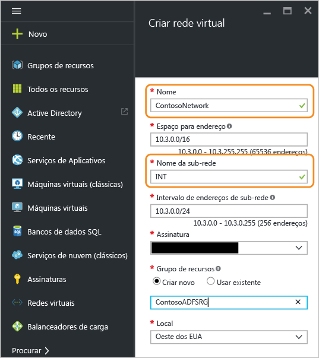
	
No portal do Azure, selecione a rede virtual, e você poderá implantar a rede virtual e uma sub-rede imediatamente com apenas um clique. A sub-rede INT também é definida e agora está pronta para que as VMs sejam adicionadas. A próxima etapa é adicionar outra sub-rede à rede, ou seja, a sub-rede de perímetro. Para criar a sub-rede de perímetro, simplesmente

* Selecione a rede recém-criada
* Nas propriedades, selecione sub-rede
* No painel de sub-rede, clique no botão Adicionar
* Forneça o nome da sub-rede e as informações de espaço de endereço para criar a sub-rede

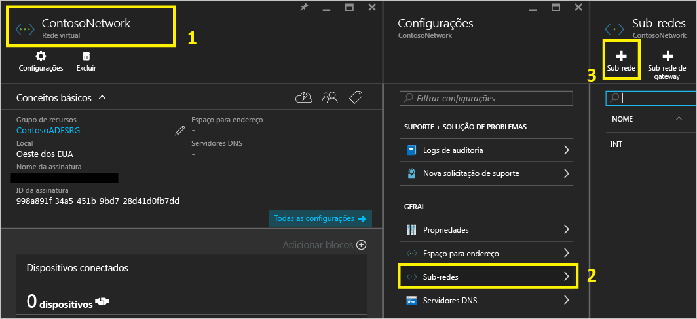

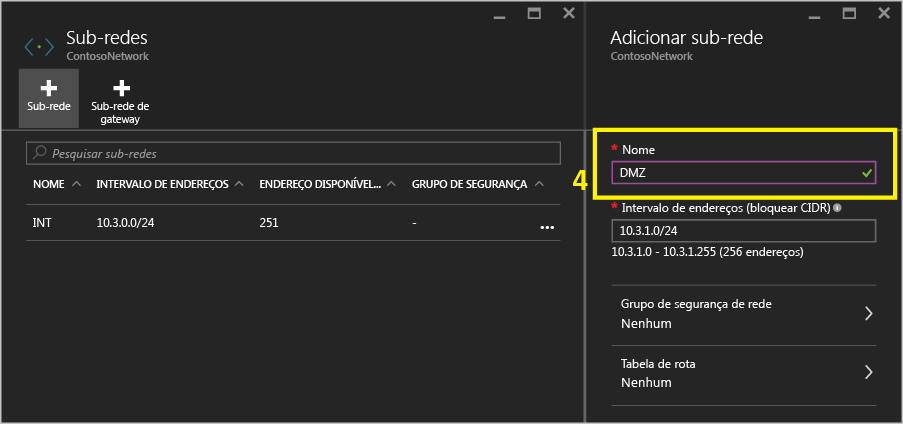

**1.2. Criar grupos de segurança de rede**

Um NSG (Grupo de segurança de rede) contém uma lista de regras de ACL (Lista de Controle de Acesso) que permitem ou negam o tráfego de rede para suas instâncias de VM em uma Rede Virtual. Os NSGs podem ser associados a sub-redes ou instâncias de VM individuais dentro dessa sub-rede. Quando um NSG é associado a uma sub-rede, as regras de ACL se aplicam a todas as instâncias de VM na sub-rede. Para os fins deste guia, vamos criar dois NSGs: um para uma rede interna e uma rede de perímetro. Eles serão rotulados como NSG\_INT e NSG\_DMZ, respectivamente.

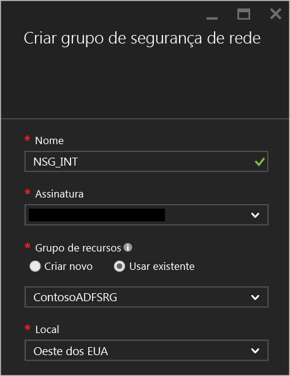

Depois que o NSG for criado, haverá 0 regra de saída e 0 regra de entrada. Quando as funções nos respectivos servidores estiverem instaladas e funcionais, as regras de entrada e saída poderão ser criadas de acordo com o nível de segurança desejado.

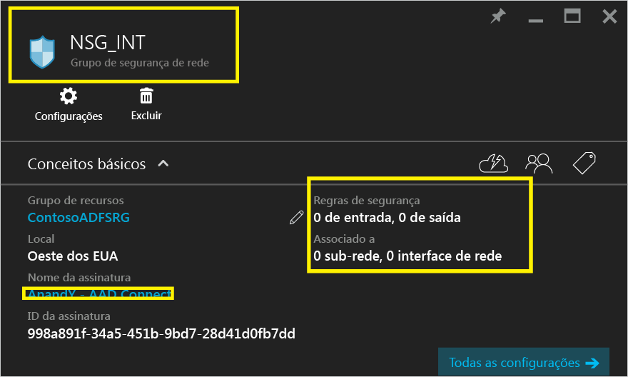

Depois que os NSGs forem criados, associe NSG\_INT à sub-rede INT e NSG\_DMZ à sub-rede de perímetro. Uma captura de tela de exemplo é fornecida abaixo:

* Clique em sub-redes para abrir o painel para sub-redes
* Selecione a sub-rede a ser associada ao NSG

Após a configuração, o painel Sub-redes deverá ser semelhante ao exemplo abaixo:

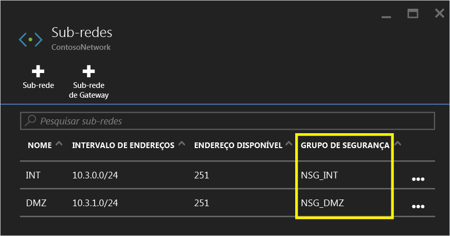

**1.3. Criar conexão local**

Será necessária uma conexão local para implantar o DC (controlador de domínio) no Azure. O Azure oferece várias opções de conectividade para conectar a infraestrutura local à infraestrutura do Azure.

* Point-to-site
* Rede virtual Site a Site
* Rota Expressa

É recomendável usar a Rota Expressa. A Rota Expressa permite criar conexões privadas entre os datacenters do Azure e a infraestrutura no local ou em um ambiente de colocalização. As conexões da Rota Expressa não passam pela Internet pública. Elas oferecem mais confiabilidade e velocidade, latências menores e maior segurança do que as conexões comuns pela Internet. Embora seja recomendável usar a Rota Expressa, você pode escolher qualquer método de conexão mais adequado à sua organização. Para saber mais sobre a Rota Expressa e as diversas opções de conectividade que a utilizam, confira [Visão geral técnica da Rota Expressa](https://aka.ms/Azure/ExpressRoute).

### 2\. Criar contas de armazenamento

Para manter a alta disponibilidade e evitar a dependência de uma única conta de armazenamento, você pode criar duas contas de armazenamento. Divida os computadores em cada conjunto de disponibilidade em dois grupos e atribua a cada grupo uma conta de armazenamento separada. Lembre-se, você será cobrado apenas pelo uso real do armazenamento.

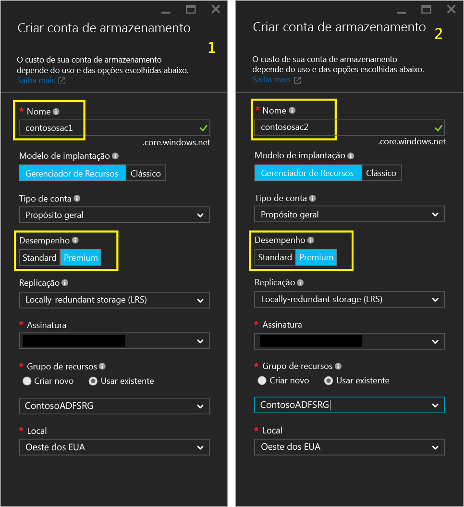

### 3\. Criar conjuntos de disponibilidade

Para cada função (DC/AD FS e WAP), crie conjuntos de disponibilidade com 2 computadores cada, no mínimo. Isso ajudará a obter maior disponibilidade para cada função. Ao criar os conjuntos de disponibilidade, é essencial decidir o seguinte:
* **Domínios de falha**: máquinas virtuais no mesmo domínio de falha compartilham a mesma fonte de energia e o mesmo comutador de rede física. É recomendável ter no mínimo 2 domínios de falha. O valor padrão é 3, e você pode mantê-lo como está para os fins desta implantação
* **Atualizar domínios**: computadores que pertencem ao mesmo domínio de atualização são reiniciados juntos durante uma atualização. Convém ter no mínimo 2 domínios de atualização. O valor padrão é 5, e você pode mantê-lo como está para os fins desta implantação

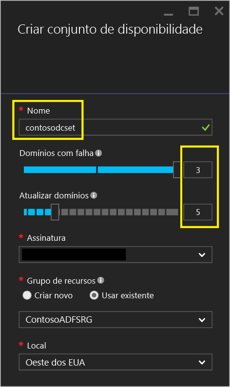

Crie os conjuntos de disponibilidade a seguir

| Conjunto de disponibilidade | Função | Domínios de falha | Domínios de atualização |
|:----------------:|:----:|:-----------:|:-----------|
| contosodcset | DC/ADFS | 3 | 5 |
| contosowapset | WAP | 3 | 5 |

### 4\. Implantar máquinas virtuais
A próxima etapa é implantar máquinas virtuais que hospedam as diferentes funções na infraestrutura. No mínimo duas máquinas são recomendadas em cada conjunto de disponibilidade. Crie seis máquinas virtuais para a implantação básica.

| Computador | Função | Sub-rede | Conjunto de disponibilidade | Conta de armazenamento | Endereço IP |
|:-----:|:-----:|:-----:|:-----:|:-----:|:-----:|
|contosodc1|DC/ADFS|INT|contosodcset|contososac1|Estático|
|contosodc2|DC/ADFS|INT|contosodcset|contososac2|Estático|
|contosowap1|WAP|Rede de Perímetro|contosowapset|contososac1|Estático|
|contosowap2|WAP|Rede de Perímetro|contosowapset|contososac2|Estático|

Como você deve ter notado, nenhum NSG foi especificado. Isso ocorre porque o Azure permite que você use NSG no nível de sub-rede. Em seguida, você pode controlar o tráfego de rede de máquinas usando o NSG individual associado à sub-rede ou ao objeto NIC. Leia mais em [O que é um NSG (grupo de segurança de rede)?](https://aka.ms/Azure/NSG). Um endereço IP estático é recomendável se você estiver gerenciando o DNS. Você pode usar o DNS do Azure e, em vez disso, nos registros DNS do domínio, referir-se às novas máquinas por seus FQDNs do Azure. O painel da máquina virtual deve ser semelhante ao exemplo abaixo após a implantação ser concluída:

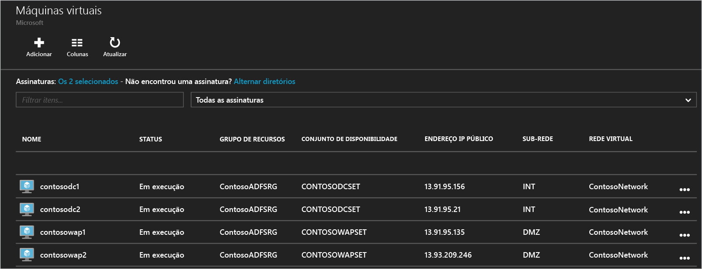

### 5\. Configurar o controlador de domínio/servidores do AD FS
 Para autenticar qualquer solicitação de entrada, o AD FS precisará contatar o controlador de domínio. Para evitar a viagem dispendiosa do Azure para o DC local para autenticação, é recomendável implantar uma réplica do controlador de domínio no Azure. Para alcançar a alta disponibilidade, é recomendável criar um conjunto de disponibilidade com pelo menos 2 controladores de domínio.

|Controlador de domínio|Função|Conta de armazenamento|
|:-----:|:-----:|:-----:|
|contosodc1|Réplica|contososac1|
|contosodc2|Réplica|contososac2|

* Promova os dois servidores como controladores de domínio de réplica com DNS
* Configure os servidores do AD FS instalando a função AD FS usando o gerenciador de servidores.

###6\. Implantar o ILB (Balanceador de Carga Interno)

**6.1. Criar ILB**

Para implantar um ILB, selecione Balanceadores de Carga no portal do Azure e clique em adicionar (+).
>[AZURE.NOTE] Se você não encontrar **Balanceadores de Carga** no menu, clique em **Procurar** na parte inferior esquerda do portal e role até ver **Balanceadores de Carga**. Clique na estrela amarela para adicioná-lo ao menu. Agora, selecione o novo ícone de balanceador de carga para abrir o painel e iniciar a configuração do balanceador de carga.

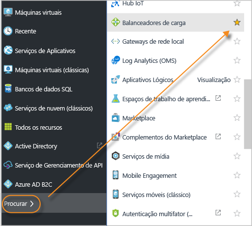

* **Nome**: atribua qualquer nome adequado ao balanceador de carga
* **Esquema**: como esse balanceador de carga será colocado na frente dos servidores do AD FS e se destina a conexões de rede internas, selecione “Interno”
* **Rede virtual**: escolha a rede virtual em que você está implantando o AD FS
* **Sub-rede**: selecione a sub-rede interna aqui
* **Atribuição de Endereço IP**: Dinâmico

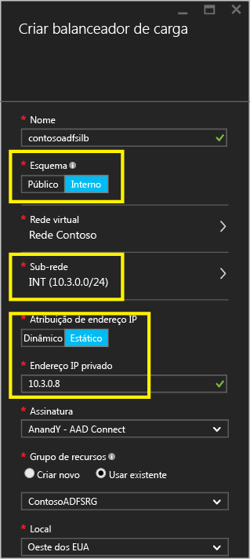
 
Depois que você clicar em Criar e o ILB for implantado, você deverá vê-lo na lista de balanceadores de carga:

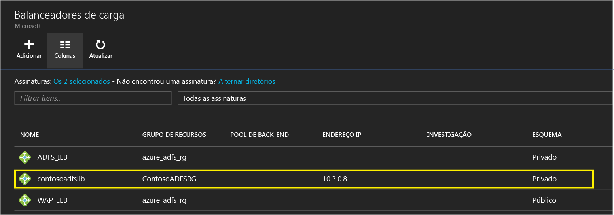
 
A próxima etapa é configurar o pool de back-end e a investigação de back-end.

**6.2. Configurar pool de back-end ILB**

Selecione o ILB recém-criado no painel Balanceadores de Carga. Isso abrirá o painel de configurações.
1.	Selecione pools de back-end no painel de configurações
2.	No painel Adicionar pool de back-end, clique em Adicionar máquina virtual
3.	Você verá um painel em que pode escolher o conjunto de disponibilidade
4.	Escolha o conjunto de disponibilidade do AD FS

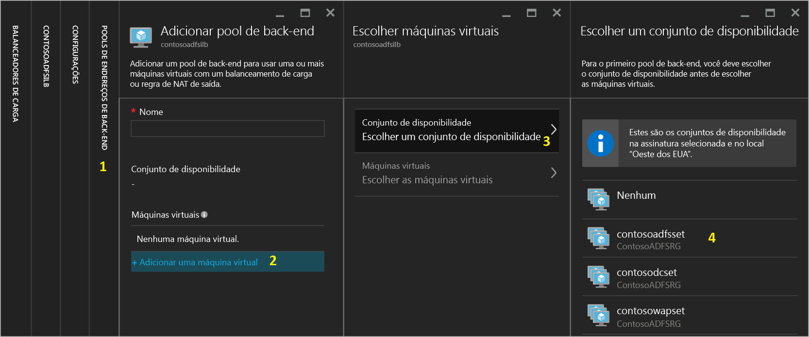
 
**6.3. Configurando investigação**

No painel de configurações de ILB, selecione Investigações.
1.	Clique em adicionar
2.	Fornecer detalhes para investigação a. **Nome**: nome de investigação b. **Protocolo**: TCP c. **Porta**: 443 (HTTPS) d. **Intervalo**: 5 (valor padrão) – é o intervalo em que o ILB investigará as máquinas no pool de back-end e. **Limite não íntegro**: 2 (valor padrão) – esse é o limite de falhas de investigação consecutivas após o qual o ILB declarará que uma máquina no pool de back-end não está respondendo e interromperá o envio de tráfego para ela.

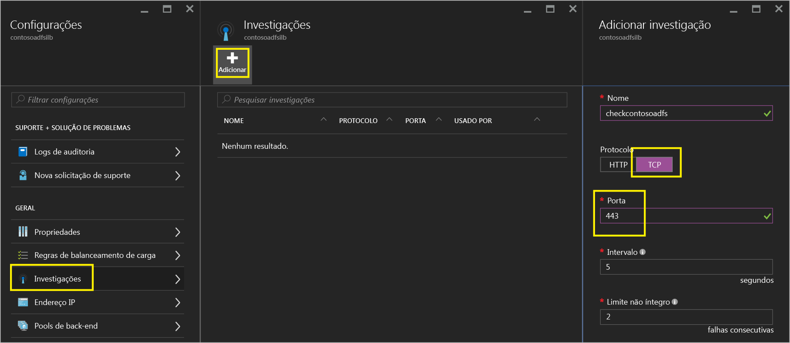
 
**6.4. Criar regras de balanceamento de carga**

Para equilibrar o tráfego de modo eficiente, o ILB deve ser configurado com regras de balanceamento de carga. Para criar uma regra de balanceamento de carga,
1.	Selecione a regra de balanceamento de carga no painel de configurações do ILB
2.	Clique em Adicionar no painel de regra de balanceamento de carga
3.	No painel adicionar regra de balanceamento de carga a. **Nome**: forneça um nome para a regra b. **Protocolo**: selecione TCP c. **Porta**: 443 d. **Porta de back-end**: 443 e. **Pool de back-end**: selecione o pool criado para o cluster do AD FS anteriormente f. **Investigação**: selecione a investigação criada anteriormente para os servidores do AD FS

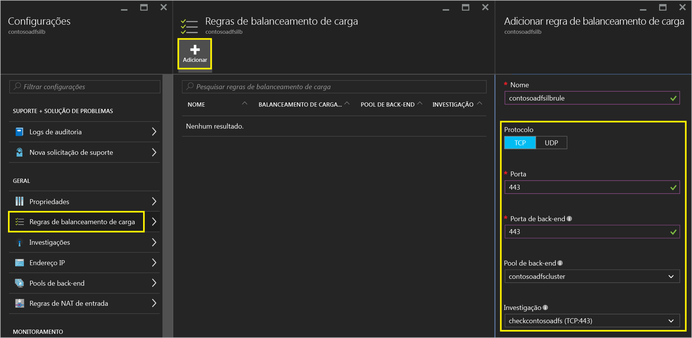

**6.5. Atualizar DNS com ILB**

Vá para o servidor DNS e crie um CNAME para o ILB. O CNAME deve ser para o serviço de federação com o endereço IP que aponta para o endereço IP do ILB. Por exemplo, se o endereço DIP ILB for 10.3.0.8 e o serviço de federação instalado for fs.contoso.com, crie um CNAME para fs.contoso.com apontando para 10.3.0.8. Isso garantirá que todas as comunicações relacionadas a fs.contoso.com sejam direcionadas para o ILB e sejam roteadas adequadamente.

###7\. Configurar o servidor de Proxy de Aplicativo Web

**7.1. Configurar os servidores de Proxy de Aplicativo Web para acessar os servidores do AD FS**

Para garantir que os servidores de Proxy de Aplicativo Web possam acessar os servidores do AD FS por trás do ILB, crie um registro em %systemroot%\\system32\\drivers\\etc\\hosts para o ILB. Observe que o DN (nome diferenciado) deve ser o nome de serviço de federação, por exemplo, fs.contoso.com. E a entrada IP deve ser a do endereço IP do ILB (10.3.0.8, como no exemplo).

**7.2. Instalar a função de Proxy de Aplicativo Web**

Depois de garantir que os servidores de Proxy de Aplicativo da Web possam acessar os servidores do AD FS por trás do ILB, você pode instalar os servidores de Proxy de Aplicativo Web. Os servidores de Proxy de Aplicativo Web não serão associados ao domínio. Instale as funções de Proxy de Aplicativo Web em dois servidores de Proxy de Aplicativo Web selecionando a função de Acesso Remoto. O gerenciador de servidores o guirá para concluir a instalação do WAP. Para obter mais informações sobre como implantar o WAP, leia [Instalar e configurar o servidor de Proxy de Aplicativo Web](https://technet.microsoft.com/library/dn383662.aspx).

###8\. Implantar o Balanceador de Carga para a Internet (Público)

**8.1. Criar o Balanceador de Carga para a Internet (Público)**
 
No portal do Azure, selecione Balanceadores de Carga e clique em Adicionar. No painel Criar balanceador de carga, insira as informações a seguir
1. **Nome**: nome para o balanceador de carga
2. **Esquema**: público – essa opção informa ao Azure que este balanceador de carga precisará de um endereço público.
3. **Endereço IP**: crie um novo endereço IP (dinâmico)

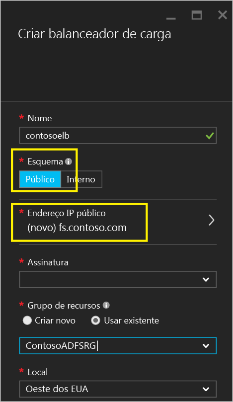

Após a implantação, o balanceador de carga será exibido na lista de balanceadores de carga.

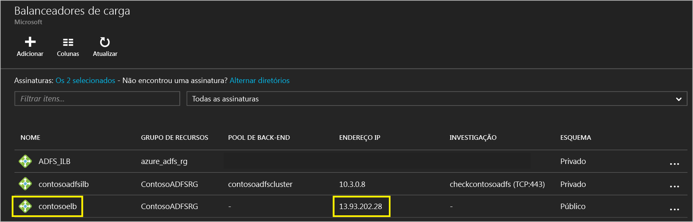
 
**8.2. Atribuir um rótulo DNS ao IP público**

Clique na entrada do balanceador de carga recém-criado no painel Balanceadores de carga para exibir o painel de configuração. Execute as seguintes etapas para configurar o rótulo DNS para o IP público:
1.	Clique no endereço IP público. Isso abrirá o painel para o IP público e suas configurações
2.	Clique em Configuração
3.	Forneça um rótulo DNS. Esse se tornará o rótulo DNS público que você pode acessar de qualquer lugar, por exemplo, contosofs.westus.cloudapp.azure.com. Você pode adicionar uma entrada no DNS externo para o serviço de federação (como fs.contoso.com) que é resolvida como o rótulo DNS do balanceador de carga externo (contosofs.westus.cloudapp.azure.com).

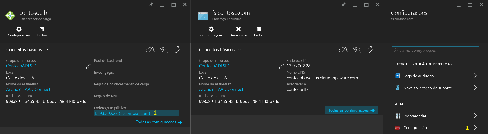

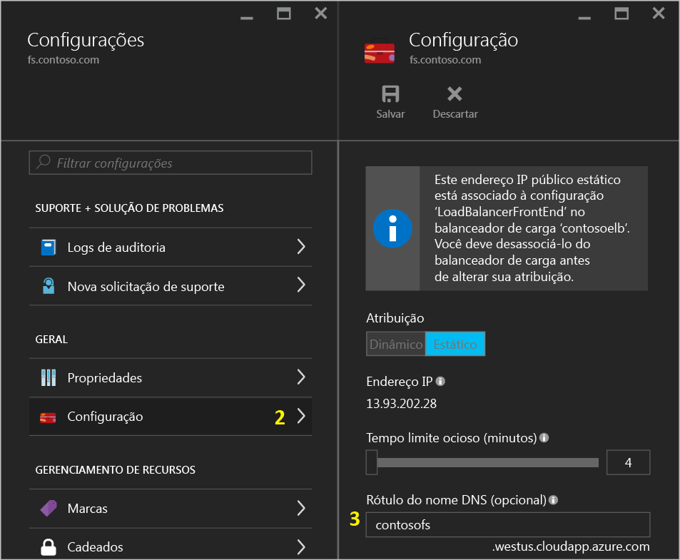

**8.3. Configurar o pool de back-end para o Balanceador de Carga para a Internet (Público)**

Siga as mesmas etapas usadas para criar o balanceador de carga interno a fim de configurar o pool de back-end para o Balanceador de Carga para a Internet (Público) como o conjunto de disponibilidade para os servidores WAP. Por exemplo, contosowapset.

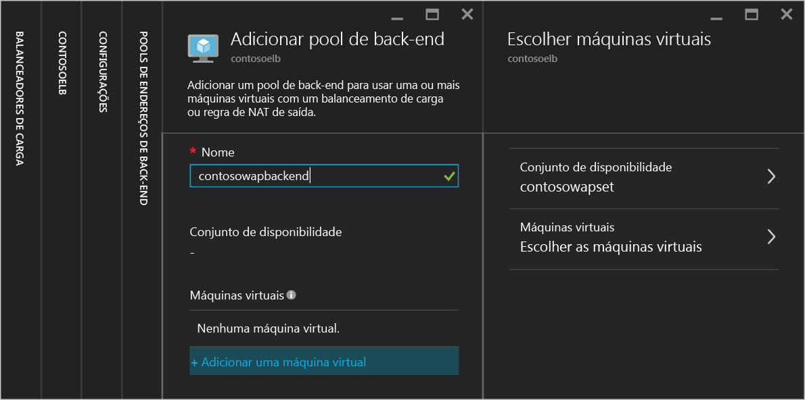
 
**8.4. Configurar investigação**

Siga as mesmas etapas usadas para configurar o balanceador de carga interno a fim de configurar a investigação do pool de back-end de servidores WAP.

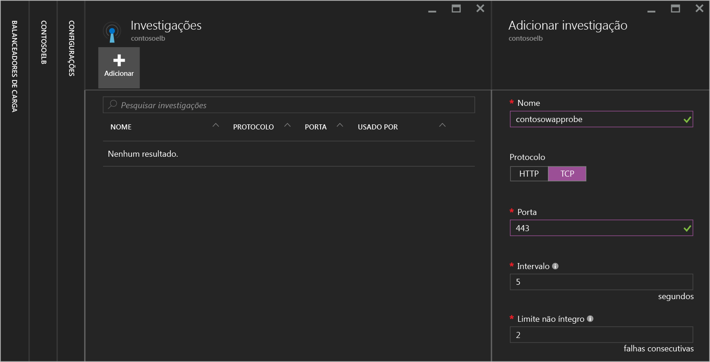
 
**8.5. Criar regra(s) de balanceamento de carga**

Siga as mesmas etapas usadas no ILB para configurar a regra de balanceamento de carga para TCP 443.

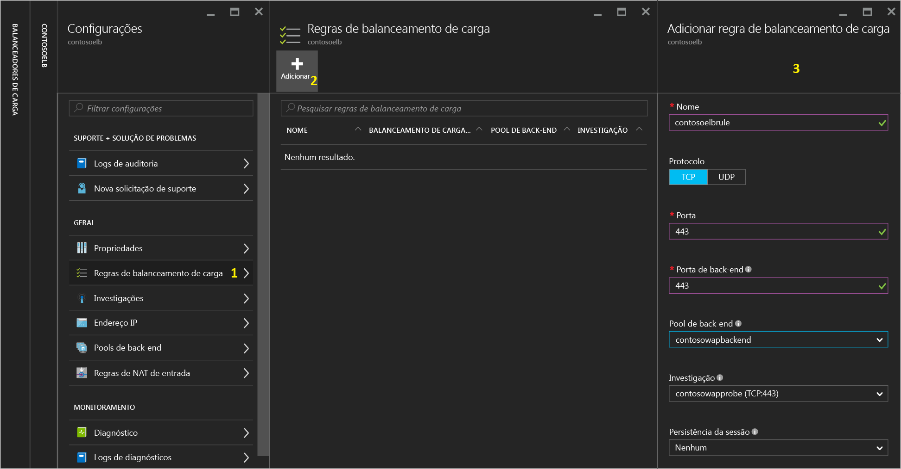
 
###9\. Proteger o aplicativo

**9.1. Proteger a sub-rede interna**

Em geral, você precisa das regras a seguir para proteger com eficiência sua sub-rede interna (na ordem listada abaixo)

|Regra|Descrição|Fluxo|
|:----|:----|:------:|
|AllowHTTPSFromDMZ| Permitir a comunicação HTTPS de rede de perímetro | Entrada |
|DenyAllFromDMZ| Esta regra bloqueará todo o tráfego da rede de perímetro para a sub-rede interna. A regra AllowHTTPSFromDMZ já se encarrega de garantir que a comunicação HTTPS seja transmitida, e qualquer outro item é bloqueado por essa regra | Entrada |
|DenyInternetOutbound| Sem acesso à Internet | Saída |

[comentário]: <> (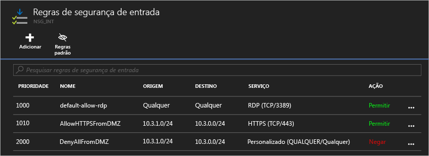) [comentário]: <> (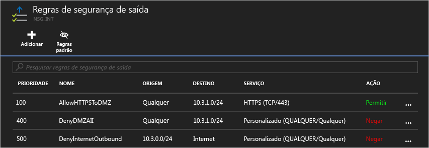)
 
**9.2. Proteger a sub-rede de perímetro**

|Regra|Descrição|Fluxo|
|:----|:----|:------:|
|AllowHttpsFromVirtualNetwork| Permitir HTTPS de rede virtual | Entrada |
|AllowHTTPSInternet| Permitir HTTPS da Internet para a rede de perímetro | Entrada|
|DenyingressexceptHTTPS| Bloquear tudo que não seja HTTPS da Internet | Entrada |
|DenyOutToInternet|	Tudo para a Internet é bloqueado, exceto HTTPS | Saída |

[comentário]: <> (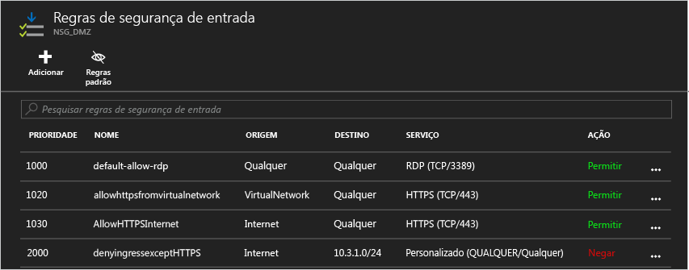) [comentário]: <> (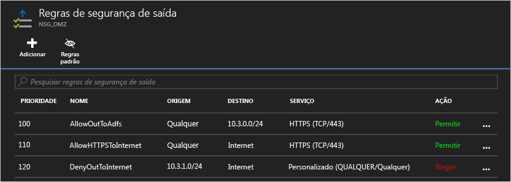)

>[AZURE.NOTE] Se a autenticação de certificado de usuário do cliente (autenticação do clientTLS usando certificados de usuário X509) for necessária, o AD FS exigirá que a porta TCP 49443 seja habilitada para acesso de entrada.

###10\. Testar a entrada do AD FS

A maneira mais fácil é testar o AD FS usando a página IdpInitiatedSignon.aspx. Para fazer isso, é necessário habilitar IdpInitiatedSignOn nas propriedades do AD FS. Siga as etapas abaixo para verificar a instalação do AD FS
1.	Execute o cmdlet abaixo no servidor do AD FS, usando o PowerShell, para defini-lo como habilitado. Set-AdfsProperties -EnableIdPInitiatedSignonPage $true
2.	De qualquer computador externo, acesse https://adfs.thecloudadvocate.com/adfs/ls/IdpInitiatedSignon.aspx
3.	Você deve ver a página do AD FS como indicado abaixo:

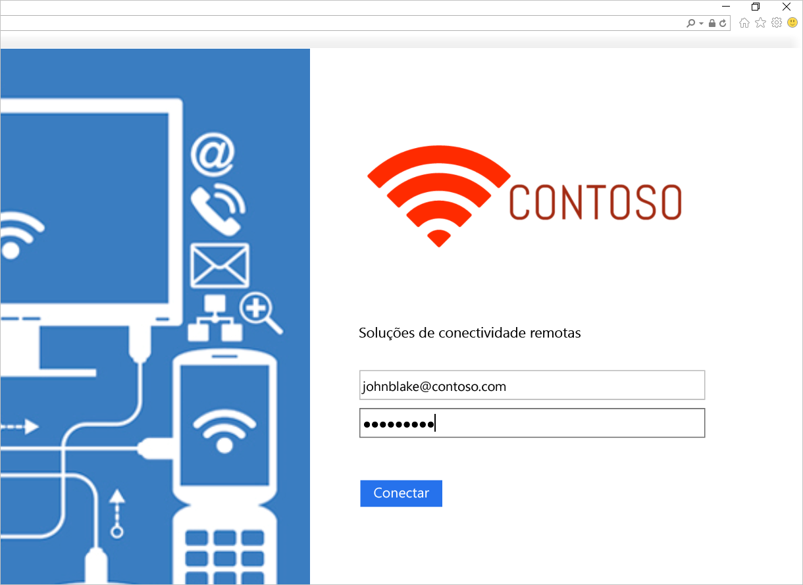

Quando você entrar com êxito, ele lhe fornecerá uma mensagem de êxito, conforme mostrado abaixo:

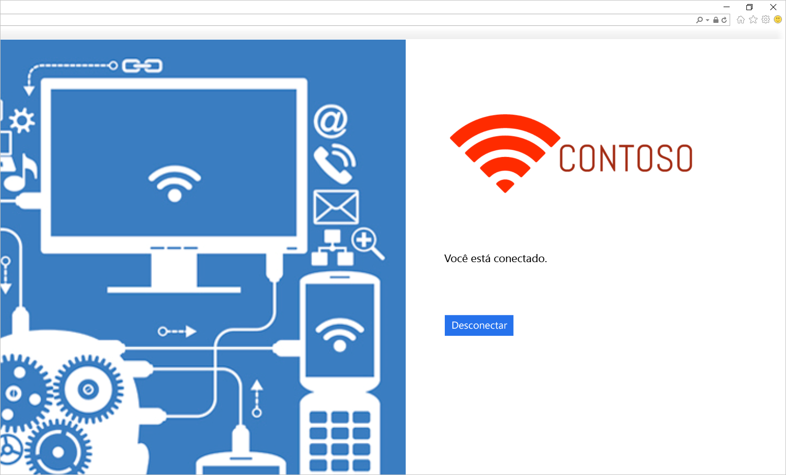

## Recursos adicionais
* [Conjuntos de Disponibilidade](https://aka.ms/Azure/Availability)
* [Azure Load Balancer](https://aka.ms/Azure/ILB)
* [Balanceador de Carga Interno](https://aka.ms/Azure/ILB/Internal)
* [Balanceador de Carga para a Internet](https://aka.ms/Azure/ILB/Internet)
* [Contas de armazenamento](https://aka.ms/Azure/Storage)
* [Redes Virtuais do Azure](https://aka.ms/Azure/VNet)
* [AD FS e Links de Proxy de Aplicativo Web](http://aka.ms/ADFSLinks)

## Próximas etapas

* [Integração de suas identidades locais com o Active Directory do Azure](active-directory-aadconnect.md)
* [Configurar e gerenciar o AD FS usando o Azure AD Connect](active-directory-aadconnectfed-whatis.md)

<!---HONumber=AcomDC_0727_2016-->