<properties
   pageTitle="Microsoft Azure AD Connect - Atualizar a partir da ferramenta de sincronização do AD do Microsoft Azure (DirSync)"
   description="Saiba como atualizar do DirSync para o Azure AD Connect. Este artigo descreve as etapas para atualizar sua atual ferramenta de sincronização do AD do Microsoft Azure (DirSync) ao Azure AD Connect."
   services="active-directory"
   documentationCenter=""
   authors="shoatman"
   manager="terrylanfear"
   editor="billmath"/>

<tags
   ms.service="active-directory"
   ms.workload="identity"
   ms.tgt_pltfrm="na"
   ms.devlang="na"
   ms.topic="article"
   ms.date="09/02/2015" 
   ms.author="shoatman"/>

# Atualizando a sincronização do Active Directory do Microsoft Azure (DirSync) com o Azure Active Directory Connect

A documentação a seguir o ajudará a atualizar sua instalação DirSync existente para o Azure AD Connect

## Baixar o Azure AD Connect

Para começar a usar o Azure AD Connect, você pode baixar a versão mais recente usando o seguinte: [Baixar o Azure AD Connect](http://go.microsoft.com/fwlink/?LinkId=615771)

## Antes de instalar o Azure AD Connect
Antes de instalar o Azure Connect AD e atualizar a partir do DirSync, aqui estão algumas coisas que você precisará.

- A senha da conta do administrador global existente para a instância do AD do Azure (a instalação irá lembrá-lo de qual conta se trata)
- Uma conta de administrador corporativo para o Active Directory local
- Opcional: se você tiver configurado o DirSync para usar uma versão completa do SQL Server - as informações para essa instância do banco de dados.

### Implantação paralela

Se você estiver sincronizando mais de 50K objetos, terá a opção de executar uma implantação paralela. Implantação paralela requer um servidor separado ou conjunto de servidores (se você precisar de um servidor separado para o SQL Server). O benefício de implantação paralela é a oportunidade para evitar o tempo de inatividade de sincronização. A instalação do Azure AD Connect tentará estimar o tempo de inatividade que esperamos, mas se você tiver atualizado o DirSync no passado, sua própria experiência é provavelmente o melhor guia.

## Instalando o Azure AD Connect

Baixe o Azure AD Connect e copie para o servidor DirSync existente.

1. Navegue até AzureADConnect.msi e clique duas vezes
2. Comece a percorrer o assistente

Para a atualização in-loco ocorrem as seguintes etapas de alto nível:

1. Bem-vindo ao Azure AD Connect
2. Análise da atual configuração do DirSync
3. Coletar senha de administrador global do AD do Azure
4. Coletar credenciais para uma conta de administrador corporativo (usado somente durante a instalação do Azure AD Connect)
5. Instalação do AAD Connect
    * Desinstalar o DirSync
	* Instalar o ADD Connect
	* Opcionalmente, comece a integração

Etapas/informações adicionais são necessárias quando:

* Você está usando no momento o SQL Server completo - local ou remoto
* Você tem mais de 50K objetos no escopo para sincronização

## Atualização in-loco - menos de 50K objetos - SQL Express (passo a passo)

0. Inicie o instalador do Azure AD Connect

1. Examine e concorde com os termos de licença e aviso de privacidade.

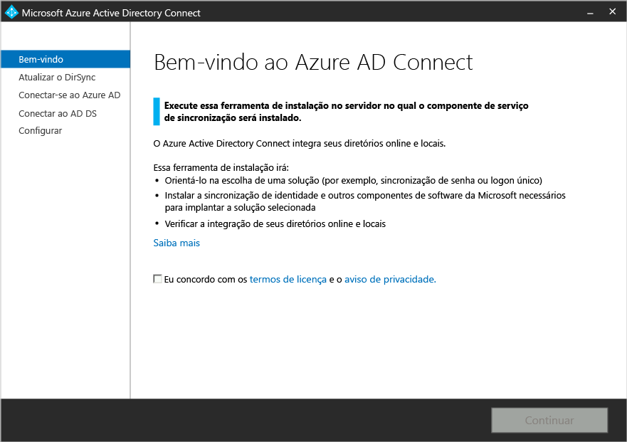

2. Clique em Avançar para a análise de sua instalação DirSync existente

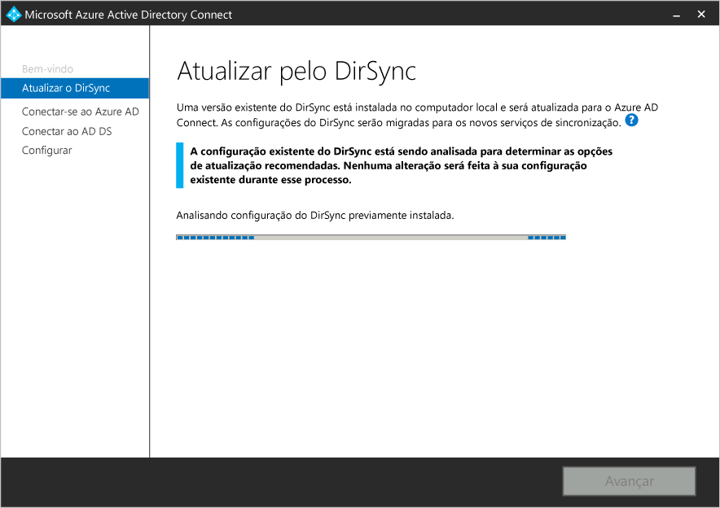

3. Quando a análise for concluída, faremos recomendações de como proceder. Neste cenário (menos de 50K objetos usando o SQL Express) é exibida a tela a seguir.

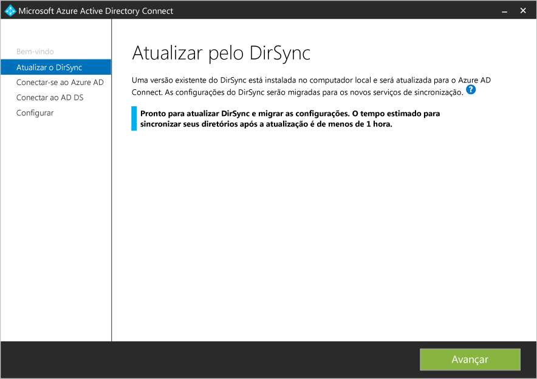

4. Forneça a senha da conta que você usa atualmente para se conectar ao AD do Azure.

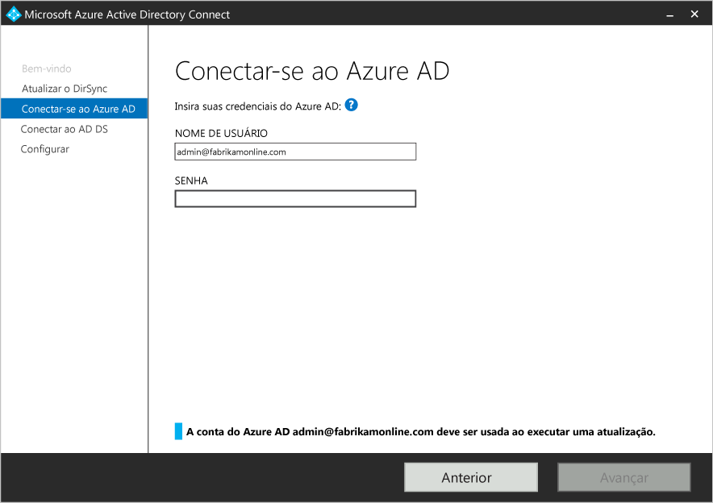

5. Forneça uma conta de administrador corporativo para o Active Directory.

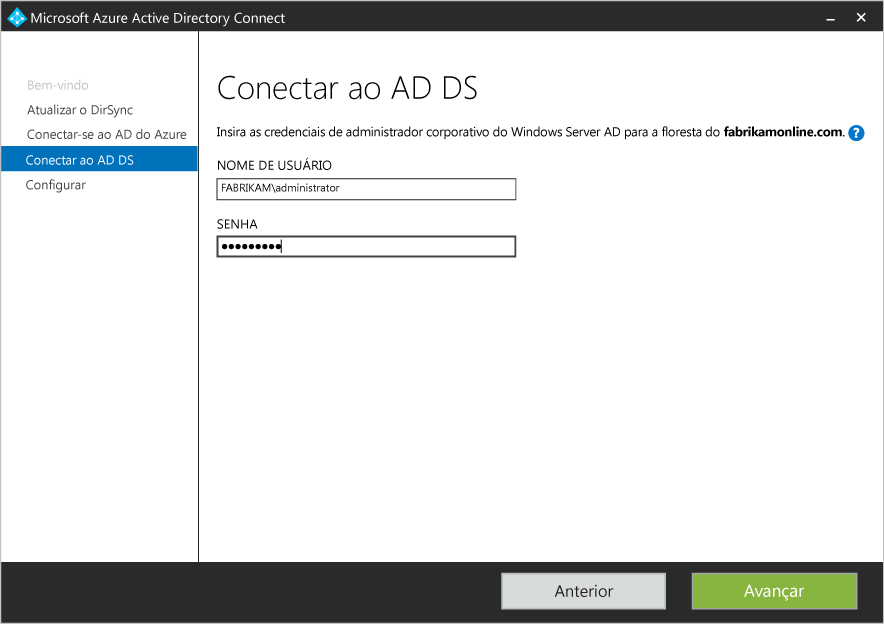

6. Agora você está pronto para configurar. Quando você clicar em Avançar, o DirSync será desinstalado e o Azure AD Connect será configurado e começará a sincronizar.  

## Atualização in-loco - mais de 50K objetos
Na etapa 3 você verá uma mensagem diferente se tiver mais de 50K objetos no escopo de sincronização. Será exibida uma tela semelhante à seguinte:

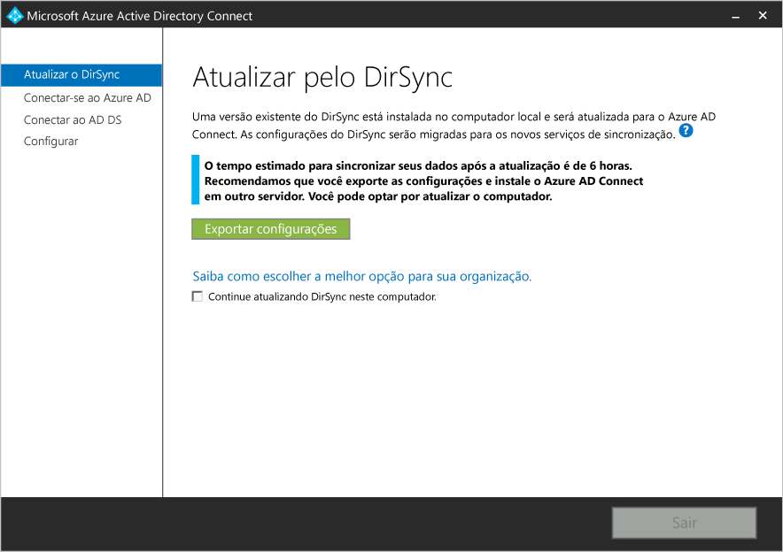

Nesse caso, é recomendável considerar uma atualização paralela em um servidor separado. Nosso motivo para essa recomendação é que, dependendo do tamanho da sua organização, uma atualização in-loco pode afetar seus contratos de nível de serviço com a empresa, referente à rapidez do reflexo das alterações do Active Directory local no AD do Azure/Office 365. Vamos tentar estimar quanto tempo levará para a primeira sincronização usando o Azure AD Connect. Conforme mencionado acima, sua própria experiência com a instalação original do DirSync ou atualizações no DirSync são, provavelmente, o melhor indicador.

Implantação paralela requer um servidor ou servidores separados (se você for solicitado a executar o SQL Server em um servidor separado do Azure AD Connect). Por esse motivo, é completamente razoável considerar uma atualização in-loco, se puder ser agendada de forma a evitar impactos na organização.

Para continuar com uma atualização in-loco, clique na caixa de seleção ao lado da mensagem: "Continuar atualizando o DirSync neste computador".

## Atualização in-loco - SQL Server completo

Na etapa 3 você verá uma mensagem diferente se a instalação do DirSync estiver usando uma versão completa local ou remota do SQL Server. Será exibida uma tela semelhante à seguinte:

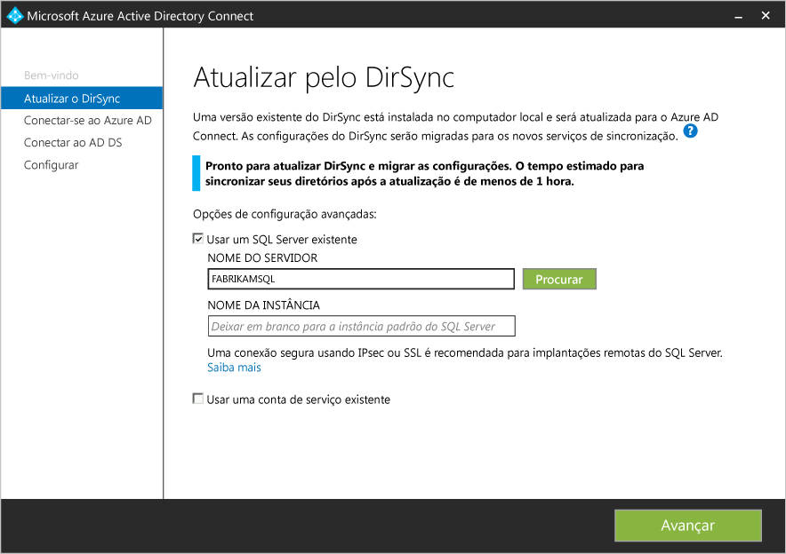

As informações sobre o servidor de banco de dados existente do SQL Server que está sendo usado pelo DirSync serão exibidas a você. Se necessário, faça os ajustes apropriados. Clique em "Avançar" para continuar a instalação.

## Implantação paralela - mais de 50K objetos

Na etapa 3, se você tiver mais de 50K objetos, a instalação do Azure AD Connect recomendará uma implantação paralela. Consulte "Atualização in-loco - mais de 50K objetos" acima para obter informações sobre a implantação in-loco ou paralela do Azure AD Connect. Será exibida uma tela semelhante à seguinte:

Se você quiser continuar com a implantação paralela, precisará executar as seguintes etapas:

- Clique no botão “Exportar configurações”. Quando você instala o Azure AD Connect em um servidor separado, essas configurações serão importadas para migrar todas as configurações de seu DirSync atual para a nova instalação do AAD Connect.

Quando suas configurações tiverem sido exportadas com sucesso, você poderá sair do assistente Azure AD Connect no servidor DirSync.

### Instalação do Azure AD Connect em um servidor separado

Quando você instala o Azure AD Connect em um novo servidor, ele não localiza o DirSync e assume que você deseja executar uma instalação limpa do Azure AD Connect. Há algumas etapas especiais aqui:

1. Execute o instalador do Azure AD Connect (MSI)
2. Quando você vir a tela "Bem-vindo ao Azure AD Connect". Saia do assistente clicando no "X" no canto superior direito das janelas.
3. Abra um prompt de comando
4. Do local de instalação do Azure AD Connect (padrão: C:\\Program Files\\Microsoft Azure Active Directory Connect) execute o seguinte comando:
    * AzureADConnect.exe/migrar

O Azure AD Connect é conectado e apresenta a seguinte interface de usuário:

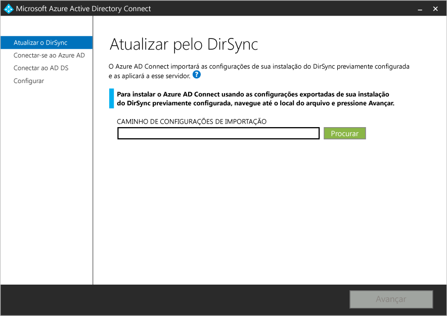

5. Selecione o arquivo de configurações exportado de sua instalação DirSync.
6. Configure as opções avançadas incluindo:
    * Um local de instalação personalizada para o Azure AD Connect
	* Uma instância existente do SQL Server (padrão: o Azure AD Connect instala o SQL Server 2012 Express)
	* Uma conta de serviço usada para conectar ao SQL Server (se o banco de dados do SQL Server for remoto, essa conta deverá ser uma conta de serviço de domínio)

Consulte as opções na seguinte interface do usuário:

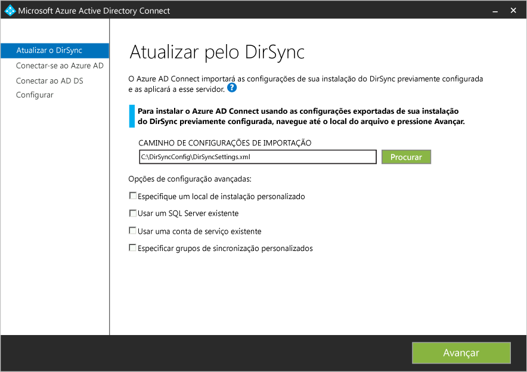

7. Clique em Avançar.
8. Na página "Pronto para configurar", mantenha marcada a opção "Iniciar o processo de sincronização assim que a configuração for concluída".[AZURE.NOTE]A sincronização entre o Active Directory do Windows Server e o Active Directory do Azure começará, mas nenhuma alteração será exportada para o AD do Azure. Apenas uma ferramenta de sincronização pode exportar ativamente alterações de cada vez.
9. Clique em "Instalar".

[AZURE.NOTE]Desmarque a caixa de seleção de sincronização inicial para garantir que o DirSync, que ainda está instalado e em execução, e o Azure AD Connect não tentem gravar no AAD ao mesmo tempo.

### Verifique se Azure AD Connect está pronto para começar a sincronização

Para determinar se o Azure Connect AD está pronto para assumir a partir do DirSync, você precisará abrir o Gerenciador de serviços de sincronização do Azure AD Connect. A pesquisa usando "Sincronização" no menu Iniciar do Windows revelará esse aplicativo.

Dentro do aplicativo será necessário exibir a guia "Operações". Nessa guia, você procure confirmar se as operações a seguir foram concluídas:

- Importar no Agente de gerenciamento do AD
- Importar no Agente de gerenciamento do AD do Azure
- Sincronização completa no Agente de gerenciamento do AD
- Sincronização completa no Agente de gerenciamento do AD do Azure

Depois de concluir essas 4 operações, você estará pronto para desinstalar o DirSync e habilitar a sincronização do Azure AD Connect.

### Desinstalar o DirSync (servidor antigo)

- Em "Adicionar ou remover programas" localize a "Ferramenta de sincronização do Active Directory do Microsoft Azure”
- Desinstale a “ferramenta de sincronização do "Active Directory do Microsoft Azure"

### Abrir o Azure AD Connect (novo servidor)
Após a instalação, a reabertura do Azure AD Connect fornecerá uma experiência de configuração. Abra o Azure AD Connect.

Você deve ver o seguinte:

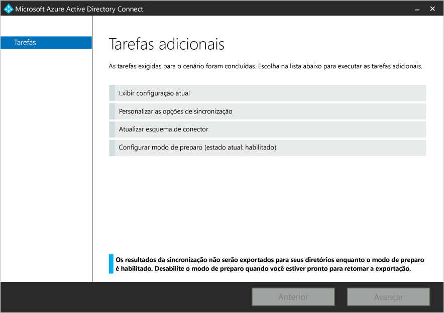

* Selecione "Configurar modo de preparo"
    * A atualização do DirSync usando configurações exportadas coloca automaticamente o Azure AD Connect no modo de preparo. Modo de preparo basicamente significa que a sincronização ocorrerá no Azure AD Connect, mas as alterações não serão exportadas para o AD do Azure ou AD.
* Desative o preparo desmarcando a caixa de seleção "Modo de preparo habilitado".

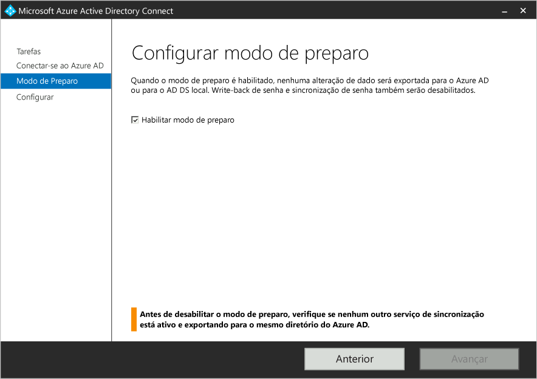

* Clique no botão Instalar

Parabéns! Você migrou com êxito para o Azure AD Connect usando implantação paralela.

## Componentes de suporte do Azure AD Connect

A seguir, uma lista de pré-requisitos e componentes de suporte que o Azure AD Connect irá instalar no servidor em que você instalou o Azure AD Connect. Esta lista é para uma instalação básica do Express. Se você optar por usar um SQL Server diferente na página de serviços de sincronização de instalação, os componentes do SQL Server 2012 listados abaixo não serão instalados.

- Forefront Identity Manager Azure Active Directory Connector
- Utilitários de linha de comando do Microsoft SQL Server 2012
- Microsoft SQL Server 2012 Native Client
- LocalDB do Microsoft SQL Server 2012 Express
- Módulo do Active Directory do Azure para Windows PowerShell
- Assistente de Conexão do Microsoft Online Services para profissionais de TI
- Pacote de redistribuição de Microsoft Visual C++ 2013

**Recursos adicionais**

* [Usar sua infraestrutura de identidade local na nuvem](active-directory-aadconnect.md)
* [Como o Azure AD Connect funciona](active-directory-aadconnect-how-it-works.md)
* [O que vem a seguir com o Azure AD Connect](active-directory-aadconnect-whats-next.md)
* [Saiba mais](active-directory-aadconnect-learn-more.md)
* [Azure AD Connect no MSDN](active-directory-aadconnect.md)

<!---HONumber=Sept15_HO2-->