<properties
	pageTitle="Instalação personalizada do Azure AD Connect | Microsoft Azure"
	description="Este documento fornece detalhes sobre as opções de instalação personalizada para o Azure AD Connect. Use estas instruções para instalar o Active Directory por meio do Azure AD Connect."
	services="active-directory"
    keywords="o que é o Azure AD Connect, instalar o Active Directory, componentes necessários do AD do Azure"
	documentationCenter=""
	authors="billmath"
	manager="stevenpo"
	editor="curtand"/>

<tags
	ms.service="active-directory"  
	ms.workload="identity"
	ms.tgt_pltfrm="na"
	ms.devlang="na"
	ms.topic="get-started-article"
	ms.date="04/27/2016"
	ms.author="billmath;andkjell"/>

# Instalação personalizada do Azure AD Connect
A documentação a seguir fornece informações sobre como usar a opção de instalação personalizada para o Azure AD Connect. Você poderá usar essa opção para obter mais opções de configuração adicionais ou se precisar de recursos opcionais que não são abrangidos pela instalação expressa.

## Documentação relacionada
Se você não leu a documentação em [Integrando suas identidades locais com o Active Directory do Azure](active-directory-aadconnect.md), a tabela a seguir fornece links para tópicos relacionados. Os três primeiros tópicos em negrito são necessários antes de iniciar a instalação.

Tópico | |
--------- | --------- |
**Baixar o Azure AD Connect** | [Baixar o Azure AD Connect](http://go.microsoft.com/fwlink/?LinkId=615771) |
**Hardware e pré-requisitos** | [Azure AD Connect: hardware e pré-requisitos](active-directory-aadconnect-prerequisites.md#hardware-requirements-for-azure-ad-connect) |
**Contas usadas para instalação** | [Contas e permissões do Azure AD Connect](active-directory-aadconnect-accounts-permissions.md) |
Instalar usando as Configurações expressas | [Instalação expressa do Azure AD Connect](active-directory-aadconnect-get-started-express.md) |
Atualizar do DirSync | [Atualizar a partir da ferramenta de sincronização do AD do Azure (DirSync)](active-directory-aadconnect-dirsync-upgrade-get-started.md) |
Após a instalação | [Verifique a instalação e atribua licenças](active-directory-aadconnect-whats-next.md) |

## Instalar componentes necessários
Quando você instala os serviços de sincronização, pode deixar a seção de configuração opcional desmarcada e o Azure AD Connect configura tudo automaticamente. Ele configura uma instância do LocalDB do SQL Server 2012 Express, cria os grupos apropriados e atribui permissões a eles. Se quiser alterar os padrões, você poderá usar a tabela a seguir para entender as opções de configuração opcionais disponíveis.

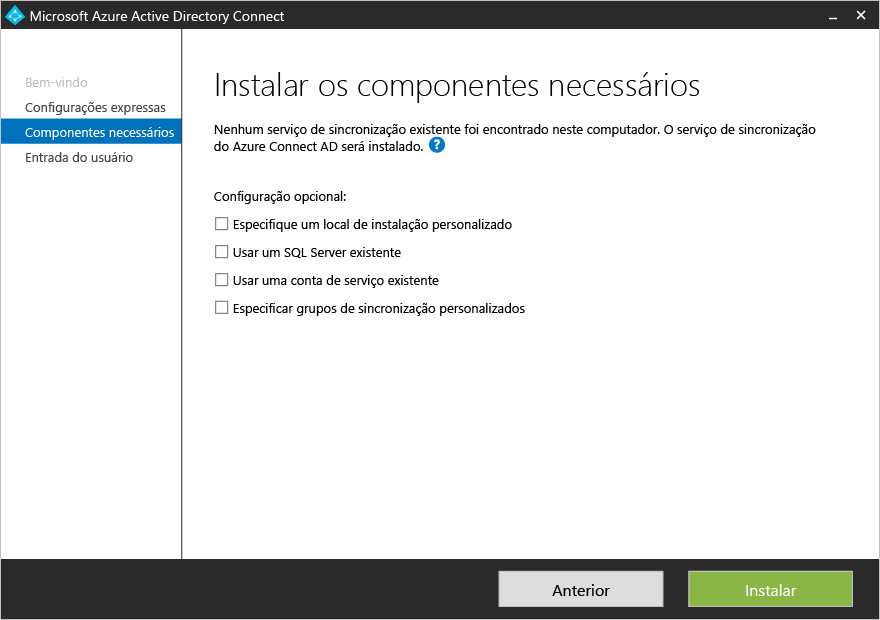

Configuração opcional | Descrição |
------------- | ------------- |
Usar um SQL Server existente | Permite que você especifique o nome do SQL Server e o nome da instância. Escolha essa opção se já tiver um servidor de banco de dados que você quer usar. Insira o nome da instância seguido por uma vírgula e pelo número da porta em **Nome da Instância** se seu SQL Server não tiver a navegação habilitada. |
Usar uma conta de serviço existente | Por padrão, o Azure AD Connect cria uma conta de serviço local a ser usada pelos serviços de sincronização. A senha é gerada automaticamente e desconhecida para a pessoa que está instalando o Azure AD Connect. Se usar um SQL Server remoto ou usar um proxy que requer autenticação, você precisará de uma conta de serviço no domínio e da senha. Nesses casos, insira a conta de serviço a ser usada. Verifique se o usuário que está executando a instalação é um SA no SQL para que um logon para a conta de serviço possa ser criado. Veja [Contas e permissões do Azure AD Connect](active-directory-aadconnect-accounts-permissions.md#custom-settings-installation) |
Especificar grupos de sincronização personalizados | Por padrão, o Azure Connect AD cria quatro grupos locais para o servidor quando os serviços de sincronização estiverem instalados. Esses grupos são: grupo de administradores, grupo de operadores, grupo de navegação e grupo de redefinição de senha. Você pode especificar seus próprios grupos aqui. Os grupos devem ser locais no servidor e não podem ser localizados no domínio. |

## Entrada do usuário
Depois de instalar os componentes necessários, será solicitado que você selecione o método de logon único de seus usuários. A tabela a seguir fornece uma breve descrição das opções disponíveis. Para obter uma descrição completa dos métodos de entrada, consulte [Entrada do usuário](active-directory-aadconnect-user-signin.md).

Opção de logon único | Descrição |
------------- | ------------- |
Sincronização de senha | Os usuários podem entrar em serviços de nuvem da Microsoft, como o Office 365, usando a mesma senha usada na rede local deles. As senhas dos usuários são sincronizadas com o AD do Azure por meio de um hash de senha, e a autenticação ocorre na nuvem. Veja [Sincronização de senha](active-directory-aadconnectsync-implement-password-synchronization.md) para obter mais informações. |
Federação com o AD FS | Os usuários podem entrar em serviços de nuvem da Microsoft, como o Office 365, usando a mesma senha usada na rede local deles. Os usuários são redirecionados para a instância local do AD FS para entrar e a autenticação ocorre no local. |
Não configurar | Nenhum dos recursos é instalado e configurado. Escolha essa opção se você já tiver um servidor de federação de terceiros ou outra solução existente em vigor. |

## Conectar-se ao AD do Azure
Na tela Conectar ao AD do Azure, digite uma senha e uma conta de administrador global. Se você tiver selecionado **Federação com o AD FS** na página anterior, não entre com uma conta de um domínio que será habilitado para a federação. Uma recomendação é usar uma conta do domínio **onmicrosoft.com** padrão, que é fornecida com o diretório do AD do Azure.

Lembre-se de que essa conta só será usada para criar uma conta de serviço no AD do Azure e não será usada após a conclusão do assistente. 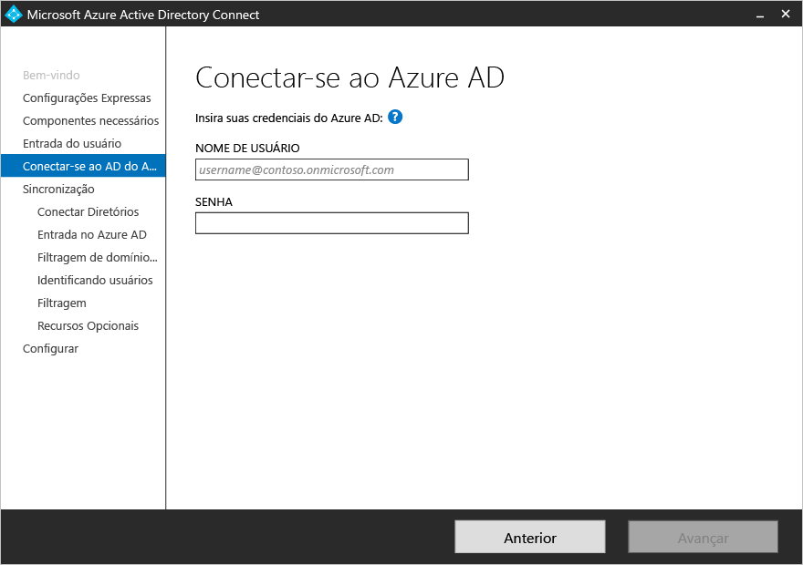

Se sua conta de administrador global tiver o MFA habilitado, você precisará fornecer a senha novamente no pop-up de entrada e concluir o desafio do MFA. O desafio poderia ser fornecer um código de verificação ou uma chamada telefônica. 

A conta de administrador global também pode ter o [Privileged Identity Management](active-directory-privileged-identity-management-getting-started.md) habilitado.

Se você receber um erro e se tiver problemas de conectividade, veja [Solucionar problemas de conectividade](active-directory-aadconnect-troubleshoot-connectivity.md).

## Páginas na seção Sincronização

### Conectar seus diretórios
Para se conectar a seu Serviço de Domínio do Active Directory, o Azure AD Connect precisa das credenciais de uma conta com permissões suficientes. Você pode inserir a parte do domínio no formato NetBios ou FQDN, isto é, FABRIKAM\\syncuser ou fabrikam.com\\syncuser. Essa conta pode ser uma conta de usuário regular, pois ele precisa apenas de permissões de leitura padrão. No entanto, dependendo do cenário, talvez você precise de mais permissões. Para saber mais, veja [Contas e permissões do Azure AD Connect](active-directory-aadconnect-accounts-permissions.md#create-the-ad-ds-account)

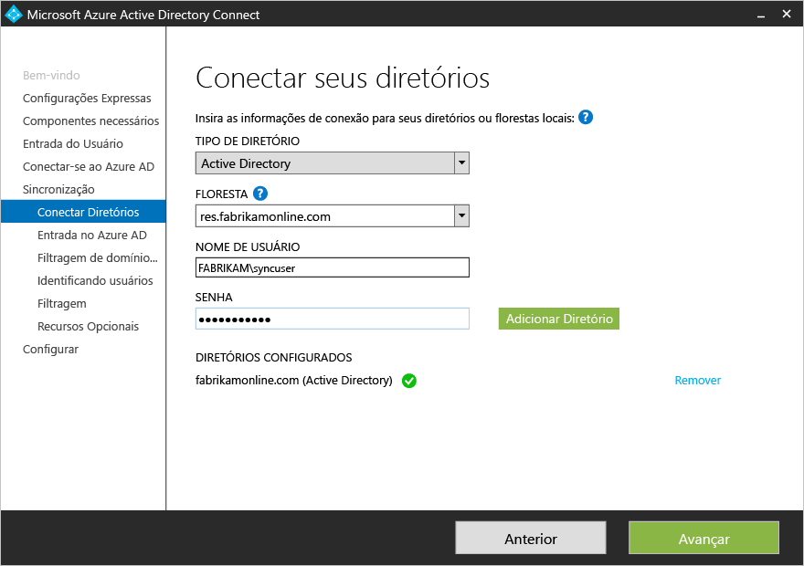

### Domínio e filtragem de unidade organizacional
Por padrão, todos os domínios e UOs são sincronizados. Se houver algum domínio ou UO que você não queira sincronizar com o AD do Azure, desmarque-os. 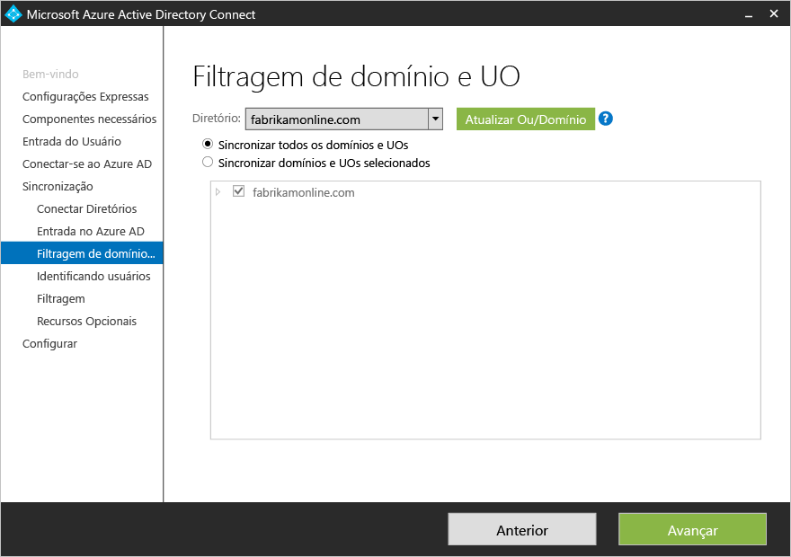 Esta página do assistente está configurando a filtragem baseada em domínio. Para saber mais, veja [filtragem baseada em domínio](active-directory-aadconnectsync-configure-filtering.md#domain-based-filtering).

Também é possível que alguns domínios não estejam acessíveis devido a restrições de firewall. Esses domínios estão desmarcados por padrão e têm um aviso. 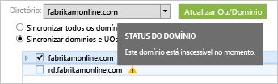 Se você vir esse aviso, verifique se os domínios realmente não podem ser acessados e se esse aviso é esperado.

### Identificando seus usuários com exclusividade
A correspondência entre os recursos de florestas permite que você defina como os usuários de suas florestas do AD DS são representados no AD do Azure. Um usuário também pode ser representado somente uma vez em todas as florestas ou ter uma combinação de contas habilitadas e desabilitadas. O usuário também pode ser representado como um contato em algumas florestas.

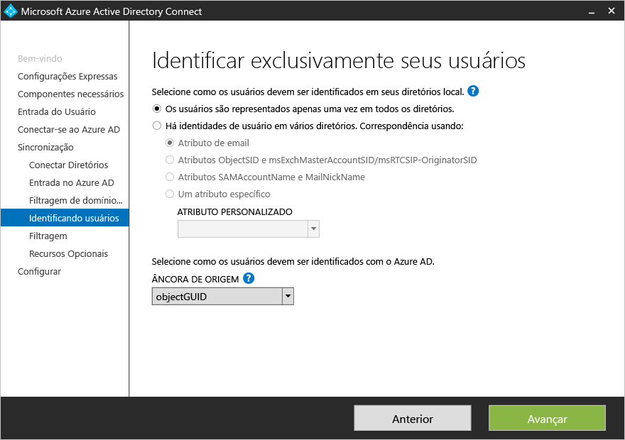

Configuração | Descrição |
------------- | ------------- |
[Os usuários são representados apenas uma vez em todas as florestas](active-directory-aadconnect-topologies.md#multiple-forests-separate-topologies) | Todos os usuários são criados como objetos individuais no AD do Azure. Os objetos não são associados ao metaverso. |
[Atributo de email](active-directory-aadconnect-topologies.md#multiple-forests-full-mesh-with-optional-galsync) | Essa opção associa usuários e contatos quando o atributo de email tem o mesmo valor em florestas diferentes. Será recomendável usar essa opção quando seus contatos tiverem sido criados com GALSync. |
[ObjectSID e msExchangeMasterAccountSID/ msRTCSIP-OriginatorSid](active-directory-aadconnect-topologies.md#multiple-forests-account-resource-forest) | Essa opção associa um usuário habilitado em uma floresta de conta com um usuário desabilitado em uma floresta de recursos. No Exchange, essa configuração é conhecida como uma caixa de correio vinculada. Essa opção também pode ser usada se você usar somente o Lync e o Exchange não estiver presente na floresta de recursos. |
sAMAccountName e MailNickName | Essa opção une atributos onde é esperada a ID de entrada para que o usuário possa ser encontrado. |
Um atributo específico | Essa opção permite que você selecione seu próprio atributo. **Limitação:** escolha um atributo que já possa ser encontrado no metaverso. Se você escolher um atributo personalizado (que não esteja no metaverso), o assistente não poderá ser concluído. |

- **Âncora de Origem** - o atributo sourceAnchor é um atributo imutável durante o tempo de vida de um objeto de usuário. É a chave primária de vinculação de usuário local com o usuário no AD do Azure. Como o atributo não pode ser alterado, você deve planejar um bom atributo para usar. Um bom candidato é objectGUID. Esse atributo não será alterado, a menos que a conta de usuário seja movida entre florestas/domínios. Em um ambiente de várias floresta em que você move contas entre florestas, outro atributo deve ser usado, como um atributo com employeeID. Evite os atributos que seriam alterados quando uma pessoa casasse ou mudasse de cargo. Você não pode usar atributos com um caractere @. Portanto, email e userPrincipalName não podem ser usados. O atributo também diferencia maiúsculas de minúsculas. Portanto, se você mover um objeto entre florestas, preserve as maiúsculas/minúsculas. Os atributos binários são codificados em base64, mas outros tipos de atributo permanecem no estado não codificado. Em cenários de federação e em algumas interfaces do AD do Azure, esse atributo também é conhecido como immutableID. Mais informações sobre a âncora de origem podem ser encontradas nos [conceitos de design](active-directory-aadconnect-design-concepts.md#sourceAnchor).

- **UserPrincipalName** - o atributo userPrincipalName é o atributo que os usuários usam ao entrarem no AD do Azure e no Office 365. Os domínios usados, também conhecidos como sufixo UPN, devem ser verificados no AD do Azure antes que os usuários sejam sincronizados. É recomendável manter o atributo padrão userPrincipalName. Se esse atributo não for roteável e não puder ser verificado, será possível selecionar outro atributo. Por exemplo, você pode selecionar o email como o atributo que contém a ID de entrada. O uso de outro atributo diferente de userPrincipalName é conhecido como **ID Alternativa**. O valor do atributo da ID Alternativa deve seguir o padrão RFC822. Uma ID Alternativa pode ser usada com a sincronização de senha e com a federação.

>[AZURE.WARNING]
Usar uma ID alternativa não é compatível com todas as cargas de trabalho do Office 365. Para obter mais informações, veja [Configurando ID de logon alternativa](https://technet.microsoft.com/library/dn659436.aspx).

### Filtragem de sincronização com base em grupos
A filtragem no recurso de grupos permite que você sincronize apenas um pequeno subconjunto de objetos para um piloto. Para usar esse recurso, crie um grupo para essa finalidade no seu Active Directory local. Em seguida, adicione usuários e grupos que devem ser sincronizados ao AD do Azure como membros diretos. Posteriormente, você pode adicionar e remover usuários nesse grupo para manter a lista de objetos que devem estar presentes no AD do Azure. Todos os objetos que você deseja sincronizar devem ser membros diretos do grupo. Isso incluirá os usuários, os grupos, os contatos e os computadores/dispositivos. A associação de grupos aninhados não é resolvida. Quando você adiciona um grupo como um membro, o grupo em si é adicionado e não seus membros.

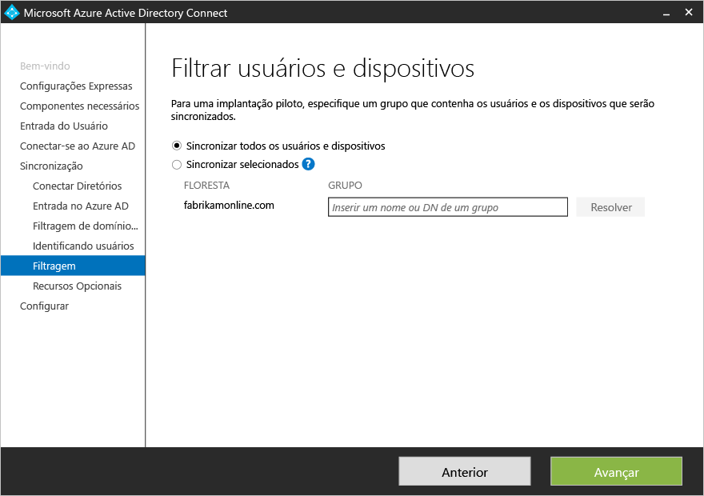

>[AZURE.WARNING]
Esse recurso destina-se somente a oferecer suporte a uma implantação piloto. Não o utilize em uma implantação de produção completa.

Em uma implantação de produção completa, será ser difícil manter um único grupo com todos os objetos a sincronizar. Em vez disso, use um dos métodos em [Configurar filtragem](active-directory-aadconnectsync-configure-filtering.md).

### Recursos opcionais
Essa tela permite que você selecione os recursos opcionais para seus cenários específicos.

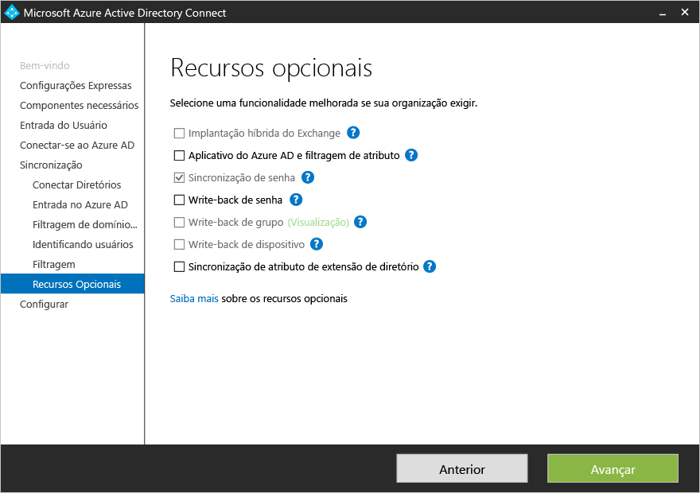

>[AZURE.WARNING]
Se você tiver o DirSync ou a Sincronização do AD do Azure ativa, não ative os recursos de write-back no Azure AD Connect.

Recursos opcionais | Descrição |
------------------- | ------------- |
Implantação híbrida do Exchange | O recurso de implantação híbrida do Exchange permite a coexistência de caixas de correio do Exchange no local e no Office 365. O Azure AD Connect está sincronizando um conjunto específico de [atributos](active-directory-aadconnectsync-attributes-synchronized.md#exchange-hybrid-writeback) do AD do Azure no seu diretório local. |
Aplicativo AD do Azure e filtragem de atributos | Ao habilitar o aplicativo AD do Azure e filtragem de atributo, o conjunto de atributos sincronizados pode ser adaptado. Essa opção adiciona mais duas páginas de configuração ao assistente. Para saber mais, veja [Aplicativo e filtragem de atributos do AD do Azure](#azure-ad-app-and-attribute-filtering). |
Sincronização de senha | Se você tiver selecionado a federação como a solução de entrada, então poderá habilitar essa opção. Em seguida, a sincronização de senha pode ser usada como uma opção de backup. Para saber mais, veja [Sincronização de senha](active-directory-aadconnectsync-implement-password-synchronization.md). |
Write-back de senha | Ao habilitar o write-back de senha, as alterações de senha que se originam no AD do Azure serão gravadas no diretório local. Para saber mais, veja [Introdução ao gerenciamento de senhas](active-directory-passwords-getting-started.md). |
Write-back de grupo | Se você usar o recurso **Grupos do Office 365**, poderá ter esses grupos representados em seu Active Directory local. Essa opção só estará disponível se você tiver o Exchange presente no seu Active Directory local. Para saber mais, veja [Write-back de grupo](active-directory-aadconnect-feature-preview.md#group-writeback). |
Write-back de dispositivo | Permite o write-back de objetos de dispositivo no AD do Azure para seu Active Directory local para cenários de acesso condicional. Para saber mais, veja [Habilitando o write-back do dispositivo no Azure AD Connect](active-directory-aadconnect-feature-device-writeback.md). |
Sincronização de atributo de extensão de diretório | Ao habilitar a sincronização de atributo de extensão de diretório, os atributos especificados serão sincronizados com o AD do Azure. Para saber mais, veja [Extensões de diretório](active-directory-aadconnectsync-feature-directory-extensions.md). |

### Aplicativo AD do Azure e filtragem de atributos
Se você quiser limitar quais atributos serão sincronizados ao AD do Azure, comece ao selecionar quais serviços você está usando. Se você fizer alterações de configuração nesta página, um novo serviço deve ser selecionado explicitamente por meio da de uma nova execução do assistente de instalação.

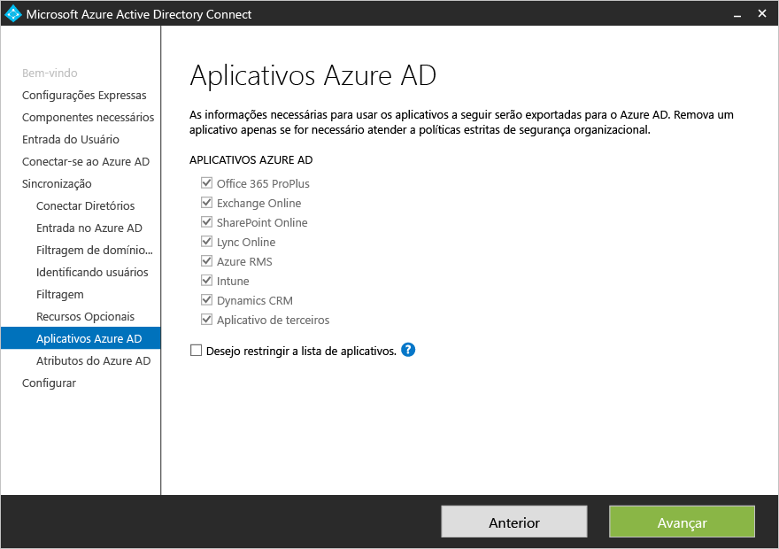

De acordo com os serviços selecionados na etapa anterior, essa página mostrará todos os atributos sincronizados. Esta lista é uma combinação de todos os tipos de objeto que estão sendo sincronizado. Se houver alguns atributos específicos que não devam ser sincronizados, você poderá desmarcar esses atributos.

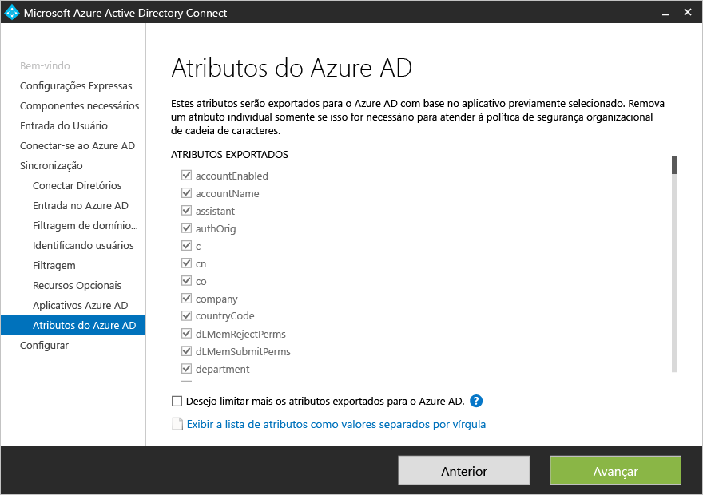

>[AZURE.WARNING]
A remoção de atributos pode afetar a funcionalidade de impacto. Para obter práticas recomendadas e recomendações, veja [atributos sincronizados](active-directory-aadconnectsync-attributes-synchronized.md#attributes-to-synchronize).

### Sincronização de atributo de extensão de diretório
Você pode estender o esquema no AD do Azure com atributos personalizados adicionados por sua organização ou outros atributos no Active Directory. Selecione **Sincronização do atributo Extensão de Diretório** na página **Recursos Opcionais** para usar esse recurso. Você pode selecionar mais atributos para sincronizar nesta página.

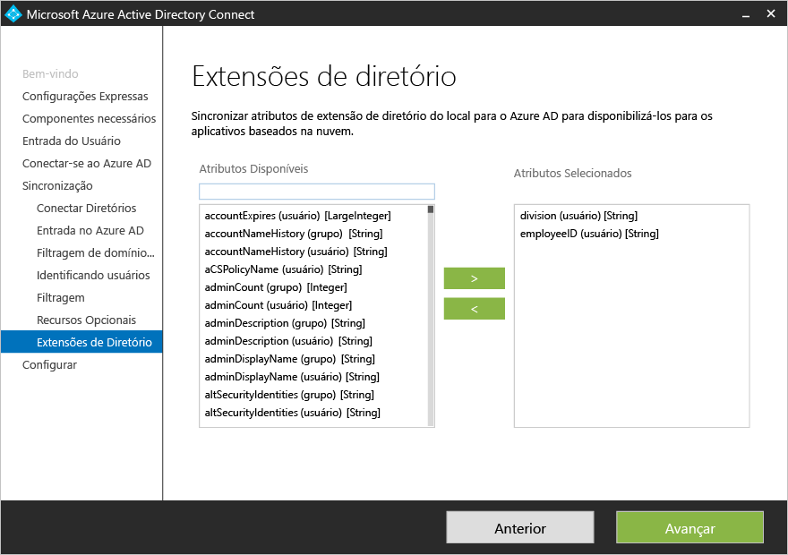

Para saber mais, veja [Extensões de diretório](active-directory-aadconnectsync-feature-directory-extensions.md).

## Configurando a federação com o AD FS
Configurar o AD FS com o Azure AD Connect é simples, com apenas alguns cliques. É necessário o seguinte antes da configuração.

- Um servidor Windows Server 2012 R2 para o servidor de federação com gerenciamento remoto habilitado
- Um servidor Windows Server 2012 R2 para o servidor de proxy de aplicativo Web com gerenciamento remoto habilitado
- Um certificado SSL para o nome do serviço de federação que você pretende usar (por exemplo, sts.contoso.com)

### Pré-requisitos de configuração do AD FS
Para configurar com êxito o farm do AD FS usando o Azure AD Connect, verifique se o WinRM está habilitado nos servidores remotos. Além disso, percorra o requisito de portas listado na [Tabela 3 - Azure AD Connect e Servidores de Federação/WAP](active-directory-aadconnect-ports.md#table-3---azure-ad-connect-and-federation-serverswap)

### Criar um novo farm do AD FS ou usar um farm do AD FS existente
Você pode usar um farm do AD FS existente ou pode optar por criar um novo farm do AD FS. Se optar por criar um novo, você precisará fornecer o certificado SSL. Se o certificado SSL estiver protegido por senha, a senha será solicitada.

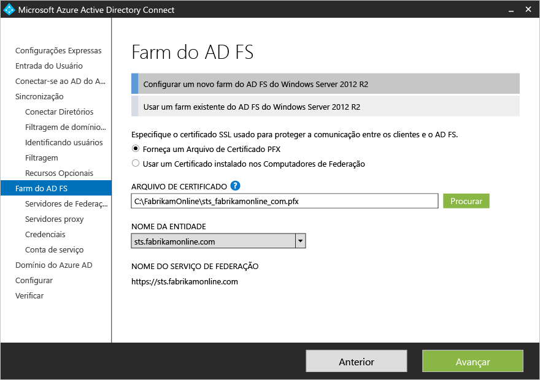

Se você optar por usar um farm existente do AD FS, irá ignorar algumas páginas e será levado diretamente para a tela de configuração da relação de confiança entre o AD FS e o AD do Azure.

### Especificar os servidores do AD FS
Insira os servidores específicos em que deseja instalar o AD FS. Você pode adicionar um ou mais servidores com base em sua necessidades de planejamento de capacidade. Una todos os servidores do Active Directory antes de executar essa configuração. É recomendável instalar um único servidor do AD FS para implantações de teste e piloto. Em seguida, adicione e implante mais servidores para atender às suas necessidades de dimensionamento executando o Azure AD Connect novamente após a configuração inicial.

>[AZURE.NOTE]
Verifique se todos os servidores foram adicionados a um domínio do AD antes de realizar essa configuração.

### Especificar os servidores proxy de aplicativo Web
Insira os servidores que deseja definir como os servidores proxy de Aplicativo Web. O servidor proxy de aplicativo Web é implantado em sua rede de DMZ (voltada para a extranet) e dá suporte a solicitações de autenticação da extranet. Você pode adicionar um ou mais servidores com base em sua necessidades de planejamento de capacidade. É recomendável instalar um único servidor proxy de aplicativo Web para implantações de teste e piloto. Em seguida, adicione e implante mais servidores para atender às suas necessidades de dimensionamento executando o Azure AD Connect novamente após a configuração inicial. É recomendável ter um número equivalente de servidores proxy para satisfazer à autenticação da intranet.

>[AZURE.NOTE]
<li> Se a conta que você usa para instalar o Azure AD Connect não for um administrador local nos servidores do AD FS, suas credenciais de administrador serão solicitadas.</li>
<li> Verifique se há conectividade HTTP/HTTPS entre o servidor do Azure AD Connect e o servidor de Proxy de Aplicativo Web antes de executar esta etapa.</li>
<li> Verifique se há conectividade HTTP/HTTPS entre o Servidor de Aplicativos Web e o servidor do AD FS para permitir o fluxo de solicitações de autenticação.</li>

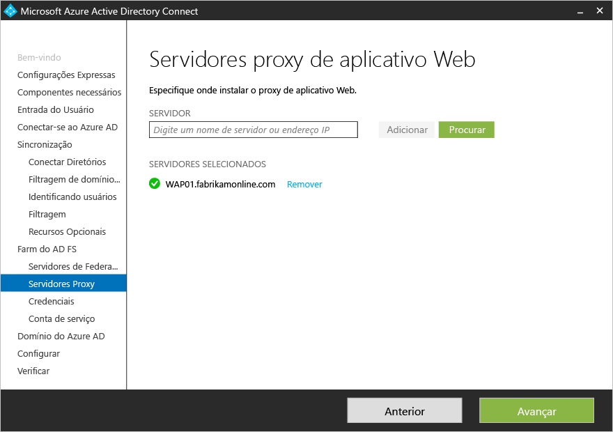

Você deverá inserir as credenciais para que o servidor de aplicativos Web possa estabelecer uma conexão segura com o servidor do AD FS. Essas credenciais precisam ser um administrador local no servidor do AD FS.

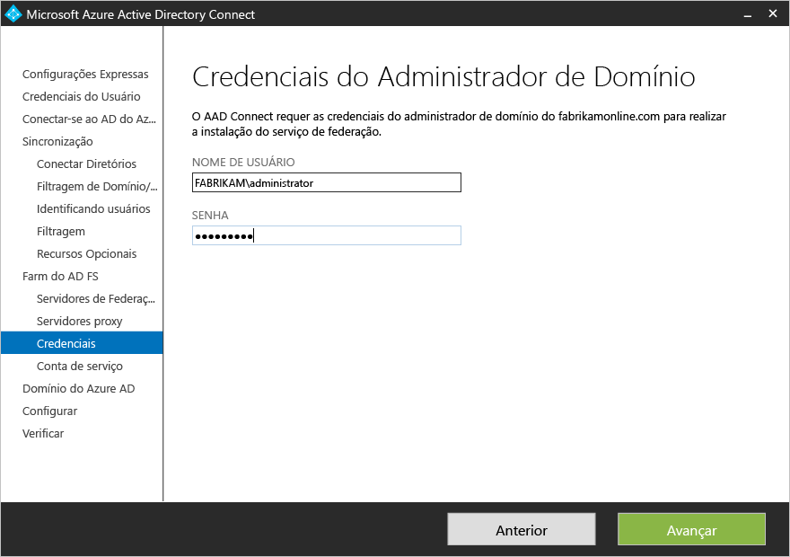

### Especifique a conta de serviço para o serviço AD FS
O serviço AD FS requer uma conta de serviço de domínio para autenticar usuários e informações de usuário de pesquisa no Active Directory. Ele pode dar suporte a dois tipos de contas de serviço:

- **Conta do Serviço Gerenciado de Grupo** - introduzida no Serviço de Domínio do Active Directory com o Windows Server 2012. Esse tipo de conta fornece serviços como o AD FS, uma única conta sem a necessidade de atualizar a senha da conta regularmente. Use essa opção se você já tiver controladores de domínio do Windows Server 2012 no domínio ao qual os servidores do AD FS pertencem.
- **Conta de usuário de domínio** - esse tipo de conta exige que você forneça uma senha e atualize a senha regularmente quando a senha for alterada ou expirar. Use essa opção somente quando você não tiver controladores de domínio do Windows Server 2012 no domínio ao qual os servidores do AD FS pertencem.

Se você tiver selecionado a Conta de Serviço Gerenciado de Grupo e se esse recurso nunca tiver sido usado no Active Directory, as credenciais de Administrador Corporativo também serão solicitadas. Essas credenciais são usadas para iniciar o repositório de chaves e para habilitar o recurso no Active Directory.

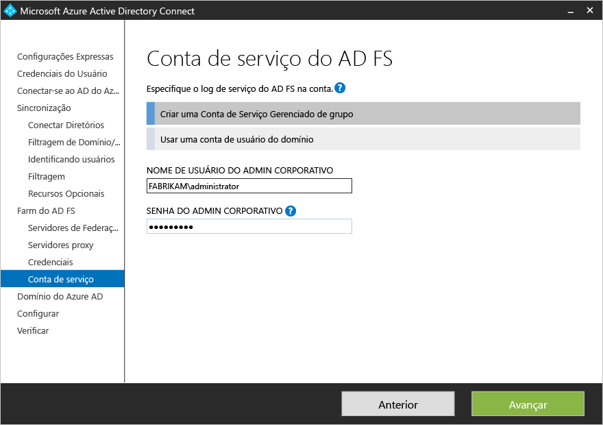

### Selecione o domínio do AD do Azure que você deseja federar
Essa configuração é usada para configurar a relação de federação entre o AD FS e o AD do Azure. Ela configura o AD FS para emitir tokens de segurança para o AD do Azure e configura o AD do Azure para confiar em tokens dessa instância específica do AD FS. Essa página só permite configurar um único domínio na instalação inicial. Você pode configurar domínios adicionais posteriormente, executando novamente o Azure AD Connect.

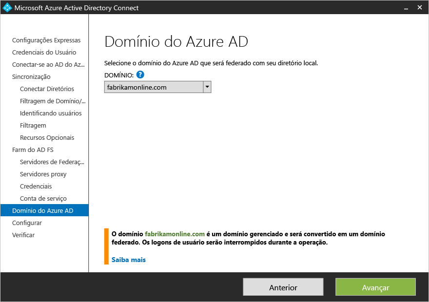

### Verificar o domínio do Azure AD selecionado para federação
Quando você seleciona o domínio a ser federado, o Azure AD Connect fornece informações necessárias para verificar um domínio não verificado. Veja [Adicionar e verificar o domínio](active-directory-add-domain.md) sobre como usar essas informações.

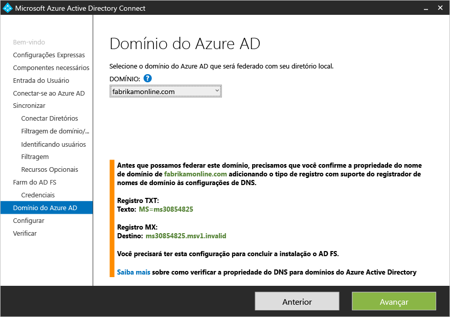

>[AZURE.NOTE]
O AD Connect tenta verificar o domínio durante o estágio de configuração. Se você continuar a configurar sem adicionar os registros DNS necessários onde seu domínio DNS está hospedado, o assistente não conseguirá concluir a configuração.

## Configurar e verificar páginas
A configuração realmente ocorrerá nessa página.

>[AZURE.NOTE]
Antes de continuar a instalação e se você configurou a federação, verifique se configurou a [Resolução de nomes para servidores de federação](active-directory-aadconnect-prerequisites.md#name-resolution-for-federation-servers).

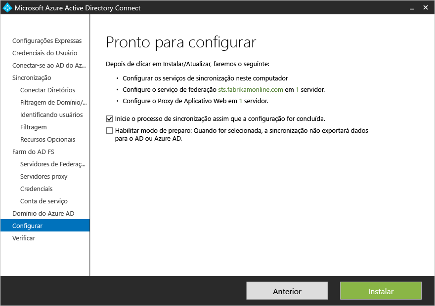

### Modo de preparo
É possível configurar um novo servidor de sincronização em paralelo com o modo de preparo. Há suporte apenas para ter um servidor de sincronização conectado a um diretório na nuvem. Porém, se você quiser mover de outro servidor, por exemplo, um que esteja executando o DirSync, poderá habilitar o Azure AD Connect no modo de preparo. Quando habilitado, o mecanismo de sincronização importa e sincroniza dados como normal, mas ele não exportará nada para o AD do Azure ou o AD. Os recursos sincronização de senha e write-back de senha são desabilitados durante o modo de preparo.

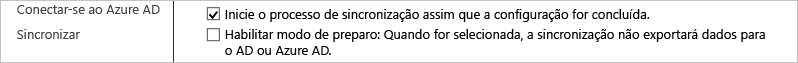

No modo de preparo, é possível fazer as alterações necessárias no mecanismo de sincronização e examinar o que está prestes a ser exportado. Quando a configuração parecer adequada, execute novamente o assistente de instalação e desabilite o modo de preparo. Agora, os dados são exportados para o AD do Azure deste servidor. Desabilite o outro servidor ao mesmo tempo, para que somente um servidor esteja exportando ativamente.

Para saber mais, veja [Modo de preparo](active-directory-aadconnectsync-operations.md#staging-mode).

### Verificar a configuração de federação
O Azure AD Connect verificará as configurações de DNS para você quando você clicar no botão Verificar.

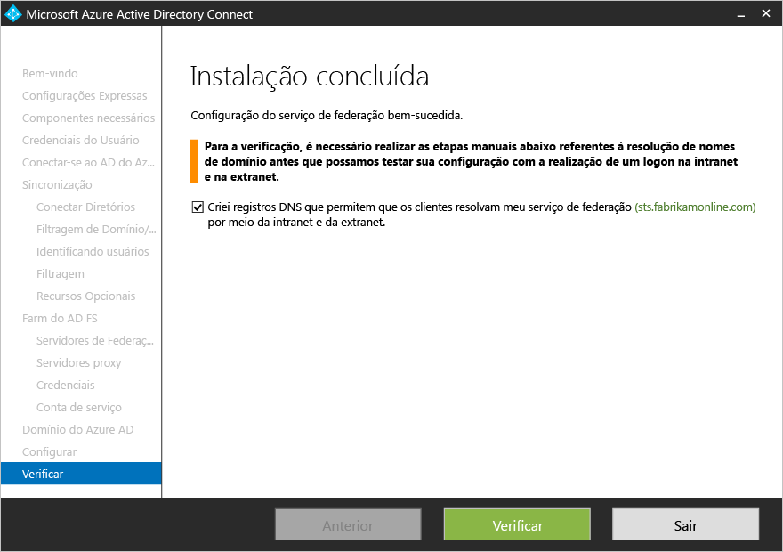

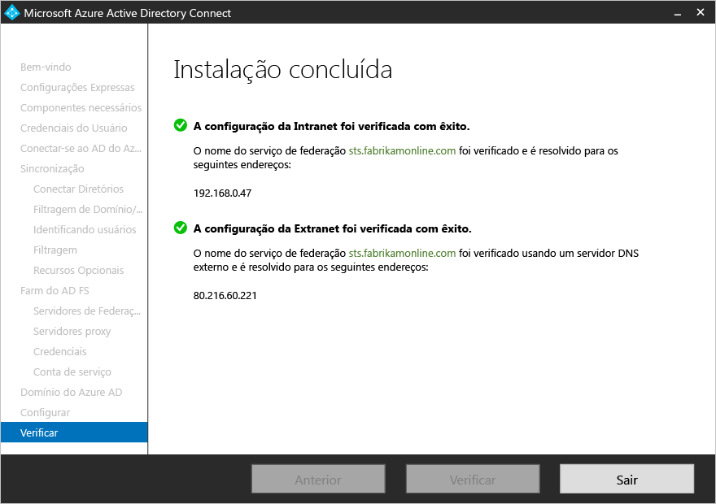

Além disso, execute as seguintes etapas de verificação:

- Valide que você pode entrar de um navegador de um computador ingressado no domínio na intranet: conecte-se a https://myapps.microsoft.com e verifique a entrada com sua conta conectada. A conta interna de administrador do AD DS não está sincronizada e não pode ser usada para a verificação.
- Valide que você pode entrar em um dispositivo da extranet. Em um computador doméstico ou em um dispositivo móvel, conecte-se ao https://myapps.microsoft.com e forneça suas credenciais.
- Valide a entrada do cliente avançado. Conecte-se a https://testconnectivity.microsoft.com, escolha a guia **Office 365** e escolha o **Teste de Logon Único do Office 365**.

## Próximas etapas
Após a instalação, saia e entre novamente no Windows antes de usar o Gerenciador de Serviços de Sincronização ou o Editor de Regra de Sincronização.

Agora que você tem o Azure AD Connect instalado, é possível [verificar a instalação e atribuir licenças](active-directory-aadconnect-whats-next.md).

Saiba mais sobre [Como integrar suas identidades locais ao Active Directory do Azure](active-directory-aadconnect.md).

<!---HONumber=AcomDC_0504_2016-->