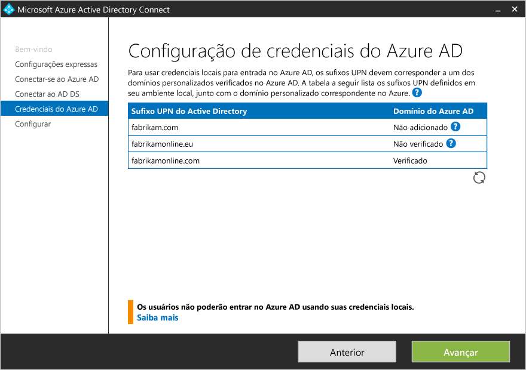

<properties
	pageTitle="Introdução ao Azure AD Connect usando configurações expressas | Microsoft Azure"
	description="Saiba como baixar, instalar e executar o assistente de instalação do Azure AD Connect."
	services="active-directory"
	documentationCenter=""
	authors="billmath"
	manager="stevenpo"
	editor="curtand"/>

<tags
	ms.service="active-directory"
	ms.workload="identity"
	ms.tgt_pltfrm="na"
	ms.devlang="na"
	ms.topic="get-started-article"
	ms.date="05/19/2016"
	ms.author="billmath;andkjell"/>

# Introdução ao Azure AD Connect usando configurações expressas
Este tópico ajuda você a começar com o Azure Active Directory Connect. Esta documentação explica a instalação expressa para o Azure AD Connect. As configurações expressas são usadas em uma topologia de floresta única com a sincronização de senhas. São apenas alguns cliques curtos para estender seu diretório local para a nuvem.

## Documentação relacionada
Se você não leu a documentação em [Integrando suas identidades locais com o Active Directory do Azure](active-directory-aadconnect.md), a tabela a seguir fornece links para tópicos relacionados. Os dois primeiros tópicos em negrito são necessários antes de iniciar a instalação.

Tópico |  
--------- | ---------
**Baixar o Azure AD Connect** | [Baixar o Azure AD Connect](http://go.microsoft.com/fwlink/?LinkId=615771)
**Hardware e pré-requisitos** | [Azure AD Connect: hardware e pré-requisitos](active-directory-aadconnect-prerequisites.md)
Instalar usando configurações personalizadas | [Instalação personalizada do Azure AD Connect](active-directory-aadconnect-get-started-custom.md)
Atualizar do DirSync | [Atualizar a partir da ferramenta de sincronização do AD do Azure (DirSync)](active-directory-aadconnect-dirsync-upgrade-get-started.md)
Após a instalação | [Verifique a instalação e atribua licenças](active-directory-aadconnect-whats-next.md)
Contas usadas para instalação | [Mais informações sobre permissões e contas do Azure AD Connect](active-directory-aadconnect-accounts-permissions.md)

## Instalação expressa do Azure AD Connect
**Configurações Expressas** é a opção padrão e é usada para o cenário de implantação mais comum. Ao usar as configurações expressas, o Azure AD Connect implanta a sincronização de uma topologia de floresta única. [A sincronização de senhas](active-directory-aadconnectsync-implement-password-synchronization.md) está habilitada e permite que os usuários usem sua senha local para entrar na nuvem. [A atualização automática](active-directory-aadconnect-feature-automatic-upgrade.md) está habilitada, facilitando a manutenção. O uso das Configurações Expressas iniciará automaticamente uma sincronização quando a instalação estiver concluída (embora você possa optar por não realizar esta etapa).

### Para instalar o Azure AD Connect usando configurações expressas

1. Entre como um administrador local no servidor no qual você deseja instalar o Azure AD Connect. Você deve fazer isso no servidor que deseja ser o servidor de sincronização.
2. Navegue até **AzureADConnect.msi** e clique duas vezes nessa opção.
3. Na tela de boas-vindas, marque a caixa para concordar com os termos da licença e clique em **Continuar**. 
4. Na tela de configurações expressas, clique em **Usar configurações expressas**.
5. Na tela Conectar AD do Azure, insira o nome de usuário e senha de um administrador global do seu AD do Azure. Clique em **Próximo**.  Se você encontrar um erro e tiver problemas de conectividade, confira [Solucionar problemas de conectividade](active-directory-aadconnect-troubleshoot-connectivity.md).
6. Na tela Conectar AD DS, digite o nome de usuário e senha para uma conta de administrador corporativa. Você pode inserir a parte do domínio no formato NetBios ou FQDN, isto é, FABRIKAM\\administrador ou fabrikam.com\\administrador. Clique em **Próximo**. 
7. Se houver domínios UPN registrados no Active Directory local que estejam ausentes ou não tenham sido verificados, esta página será exibida. Se todos os domínios UPN no AD DS local tiverem sido verificados, esta página não será exibida.  Se esta página for mostrada, examine todos os domínios marcados como **Não Adicionado** e **Não Verificado**. Verifique se os que você usa foram verificados no Azure AD. Clique no símbolo de Atualização quando tiver verificado os domínios. Para saber mais, confira [adicionar e verificar o domínio](active-directory-add-domain.md)
8. Na tela Pronto para configurar, clique em **Instalar**.
	- Opcionalmente, na página Pronto para configurar, você pode desmarcar a caixa de seleção **Iniciar o processo de sincronização assim que a configuração for concluída**. Você deverá desmarcar essa caixa de seleção se desejar fazer configurações adicionais, como a [filtragem](active-directory-aadconnectsync-configure-filtering.md). Se você desmarcar essa opção, o assistente irá configurar a sincronização, mas deixará o agendador desabilitado. Ele não será executado até você habilitá-lo manualmente executando novamente o assistente de instalação.
	- Também é possível configurar os serviços de sincronização para a **Implantação híbrida do Exchange** marcando a caixa de seleção correspondente. Habilite essa opção se você planeja ter caixas de correio do Exchange na nuvem e no local ao mesmo tempo. 
9. Quando a instalação for concluída, clique em **Sair**.
10. Após a conclusão da instalação, saia e entre novamente antes de usar o Gerenciador de Serviços de Sincronização ou o Editor de Regra de Sincronização.

Para ver um vídeo sobre como usar a instalação expressa, consulte:

>[AZURE.VIDEO azure-active-directory-connect-express-settings]

## Próximas etapas
Agora que você tem o Azure AD Connect instalado, pode [verificar a instalação e atribuir licenças](active-directory-aadconnect-whats-next.md).

Saiba mais sobre a [Integração de suas identidades locais com o Active Directory do Azure](active-directory-aadconnect.md).

<!---HONumber=AcomDC_0525_2016-->