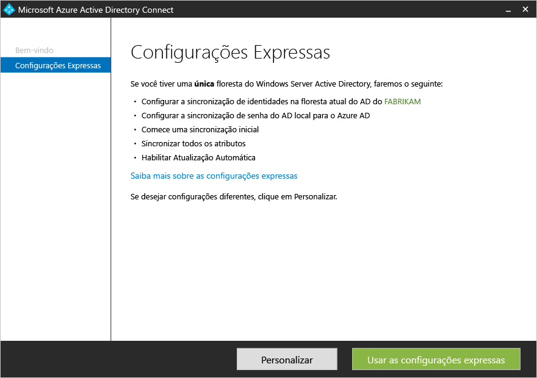
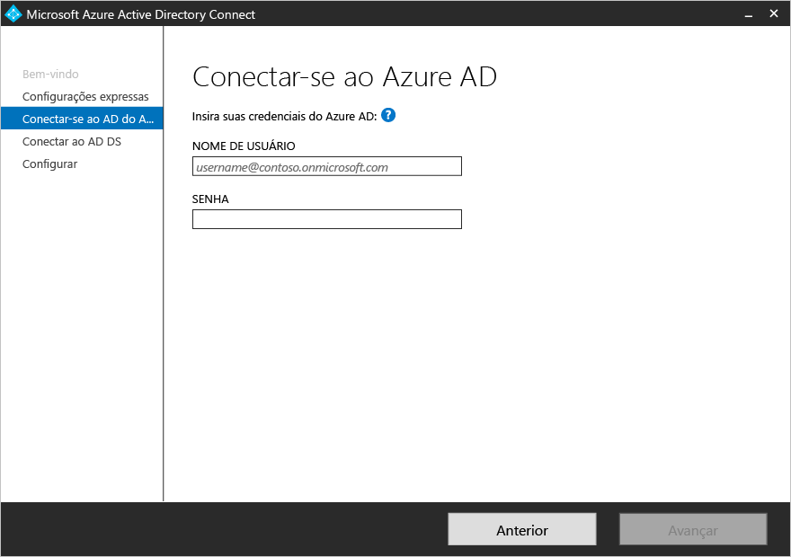
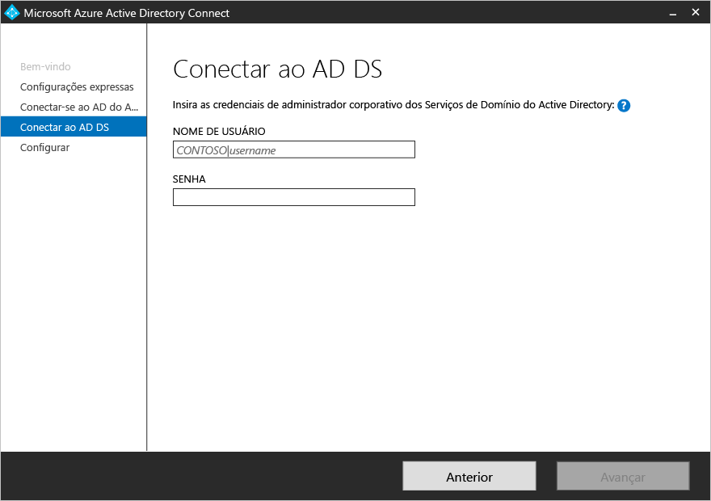
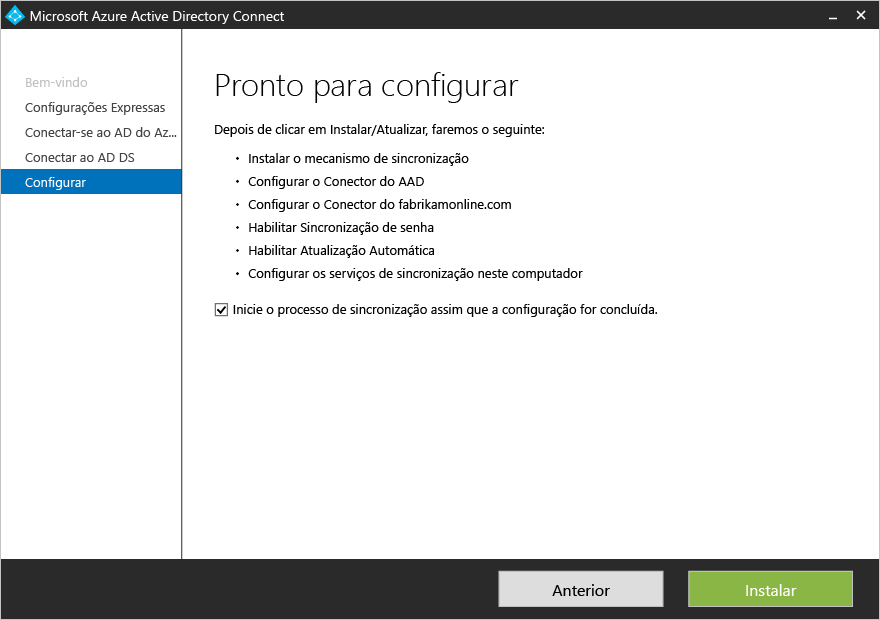

<properties
	pageTitle="Introdução ao Azure AD Connect usando configurações expressas | Microsoft Azure"
	description="Saiba como baixar, instalar e executar o assistente de instalação do Azure AD Connect."
	services="active-directory"
	documentationCenter=""
	authors="billmath"
	manager="stevenpo"
	editor="curtand"/>

<tags
	ms.service="active-directory"
	ms.workload="identity"
	ms.tgt_pltfrm="na"
	ms.devlang="na"
	ms.topic="get-started-article"
	ms.date="03/22/2016"
	ms.author="billmath;andkjell"/>

# Introdução ao Azure AD Connect usando configurações expressas
A documentação a seguir o ajudará a começar com o Azure Active Directory Connect. Essa documentação lida com o uso da instalação expressa para o Azure AD Connect.

## Documentação relacionada
Se você não leu a documentação em [Integrando suas identidades locais com o Active Directory do Azure](active-directory-aadconnect.md), a tabela a seguir fornece links para tópicos relacionados. Os dois primeiros tópicos em negrito são necessários antes de iniciar a instalação.

| Tópico | |
| --------- | --------- |
| **Baixar o Azure AD Connect** | [Baixar o Azure AD Connect](http://go.microsoft.com/fwlink/?LinkId=615771) |
| **Hardware e pré-requisitos** | [Azure AD Connect: hardware e pré-requisitos](active-directory-aadconnect-prerequisites.md) |
| Instalar usando configurações personalizadas | [Instalação personalizada do Azure AD Connect](active-directory-aadconnect-get-started-custom.md) |
| Atualizar do DirSync | [Atualizar a partir da ferramenta de sincronização do AD do Azure (DirSync)](active-directory-aadconnect-dirsync-upgrade-get-started.md) |
| Após a instalação | [Verifique a instalação e atribua licenças](active-directory-aadconnect-whats-next.md) |
| Contas usadas para instalação | [Mais informações sobre permissões e contas do Azure AD Connect](active-directory-aadconnect-accounts-permissions.md) |

## Instalação expressa do Azure AD Connect
Selecionar as configurações expressas é a opção padrão e é um dos cenários mais comuns. Ao fazer isso, o Azure AD Connect implanta a sincronização com a opção de sincronização de senha. Isso é apenas para uma única floresta e permite que os usuários usem suas senhas locais para entrar na nuvem. O uso das configurações expressas iniciará automaticamente uma sincronização depois que a instalação for concluída (embora você possa optar por não fazer isso). Com essa opção, bastam alguns cliques breves para estender seu diretório local para a nuvem.

### Para instalar o Azure AD Connect usando configurações expressas

1. Entre no servidor no qual você deseja instalar o Azure AD Connect como um Administrador local. Esse deve ser o servidor que você deseja que seja o servidor de sincronização.
2. Navegue até AzureADConnect.msi e clique duas vezes
3. Na tela de boas-vindas, marque a caixa de concordar com os termos da licença e clique em **Continuar**.
4. Na tela de configurações expressas, clique em **Usar configurações expressas**.
5. Na tela Conectar ao AD do Azure, insira o nome de usuário e a senha de um administrador global do Azure para seu AD do Azure. Clique em **Próximo**.  Se você receber um erro e se tiver problemas de conectividade, veja [Solucionar problemas de conectividade](active-directory-aadconnect-troubleshoot-connectivity.md).
6. Na tela Conectar-se ao AD DS, digite o nome de usuário e a senha para uma conta de administrador corporativa. Você pode inserir a parte do domínio no formato NetBios ou FQDN, isto é, FABRIKAM\\administrador ou fabrikam.com\\administrador. Clique em **Próximo**. 
7. Na tela Pronto para configurar, clique em **Instalar**.
	- Na página Pronto para configurar, você pode desmarcar a caixa de seleção **Iniciar o processo de sincronização assim que a configuração for concluída**. Se você fizer isso, o assistente vai configurar a sincronização, mas deixará a tarefa desabilitada para que ela não seja executada até você habilitá-la manualmente no Agendador de Tarefas. Quando a tarefa for habilitada, a sincronização será executada a cada 30 minutos.
	- Também é possível configurar os serviços de sincronização para **implantação híbrida do Exchange** marcando a caixa de seleção correspondente. Se você não planeja ter caixas de correio do Exchange na nuvem e no local, isso não será necessário. 
8. Quando a instalação for concluída, clique em **Sair**.
9. Após a conclusão da instalação, saia e entre novamente antes de usar o Gerenciador de Serviços de Sincronização ou o Editor de Regra de Sincronização.

Para ver um vídeo sobre como usar a instalação expressa, verifique o seguinte:

>[AZURE.VIDEO azure-active-directory-connect-express-settings]

## Próximas etapas
Agora que você tem o Azure AD Connect instalado, pode [verificar a instalação e atribuir licenças](active-directory-aadconnect-whats-next.md).

Saiba mais sobre a [Integração de suas identidades locais com o Active Directory do Azure](active-directory-aadconnect.md).

<!---HONumber=AcomDC_0420_2016-->