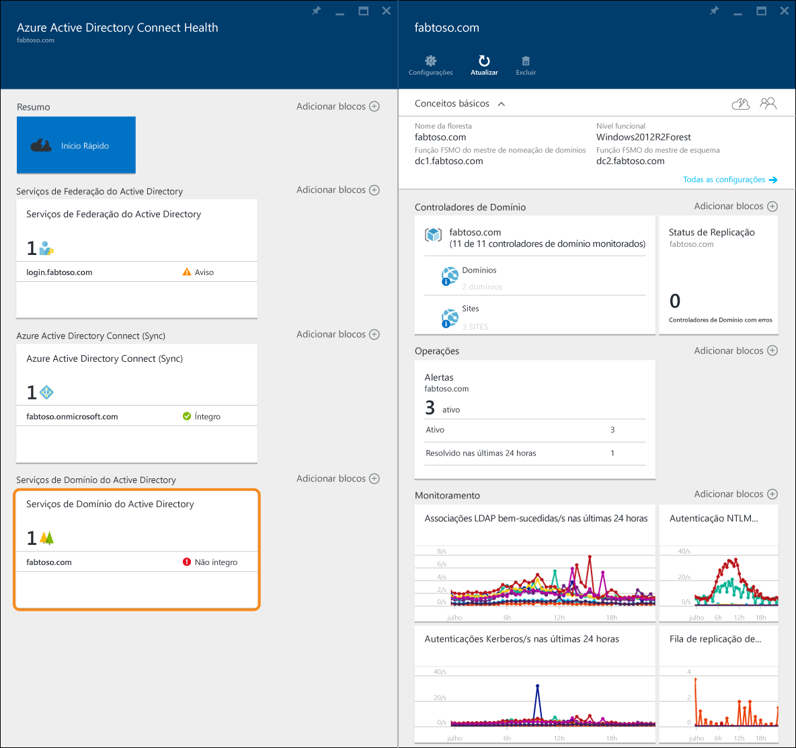
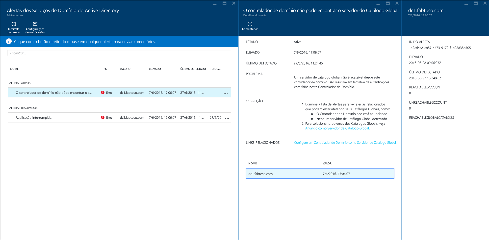
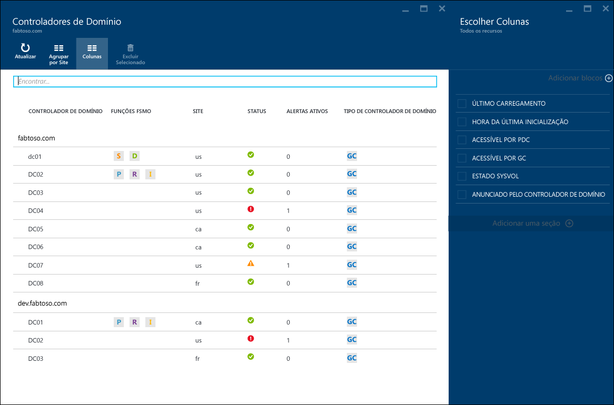
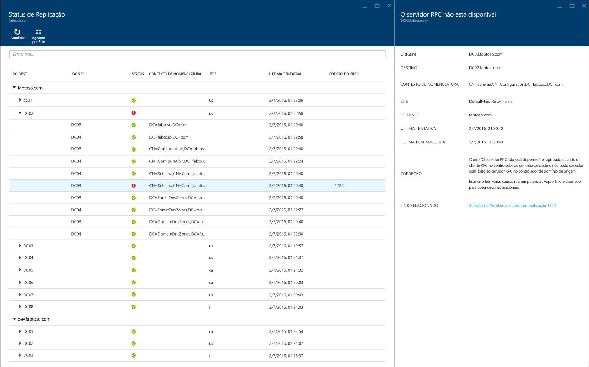

<properties
	pageTitle="Usando o Azure AD Connect Health com o AD DS | Microsoft Azure"
	description="Esta é a página Azure AD Connect Health que discutirá como monitorar o AD DS."
	services="active-directory"
	documentationCenter=""
	authors="arluca"
	manager="samueld"
	editor="curtand"/>

<tags
	ms.service="active-directory"
	ms.workload="identity"
	ms.tgt_pltfrm="na"
	ms.devlang="na"
	ms.topic="get-started-article"
	ms.date="07/14/2016"
	ms.author="arluca"/>

# Usar o Azure AD Connect Health com o AD DS
A documentação a seguir é específica para o monitoramento dos Serviços de Domínio do Active Directory com o Azure AD Connect Health. Isso inclui o AD DS instalado no Windows Server 2008 R2, no Windows Server 2012 e no Windows Server 2012 R2.

Para saber mais sobre como monitorar o AD FS com o Azure AD Connect Health, consulte [Usando o Azure AD Connect Health com o AD FS](active-directory-aadconnect-health-adfs.md). Além disso, para obter informações sobre como monitorar o Azure AD Connect (Sincronização) com o Azure AD Connect Health, confira [Usar o Azure AD Connect Health para Sincronização](active-directory-aadconnect-health-sync.md).

## Alertas do Azure AD Connect Health para AD DS
A seção de alertas no Azure AD Connect Health para o AD DS fornece uma lista de alertas ativos e resolvidos, relacionados aos Controladores de Domínio. A seleção de um alerta ativo ou resolvido abrirá uma nova folha com informações adicionais, juntamente com as etapas de resolução e links para a documentação de suporte. Cada tipo de alerta pode ter uma ou mais instâncias, que correspondem a cada um dos controladores de domínio afetados por esse alerta específico. Na parte inferior da folha de alerta, você pode selecionar um controlador de domínio afetado, e uma nova folha será aberta com detalhes adicionais sobre essa instância específica do alerta.

A habilitação de notificações por email para alertas está disponível nessa folha, bem como a alteração do intervalo de tempo no modo de exibição. A expansão do intervalo de tempo permitirá que você veja alertas resolvidos anteriormente.

## Controladores de Domínio
Esse painel fornece uma exibição topológica de seu ambiente, juntamente com as principais métricas operacionais e o status de integridade de cada um dos controladores de domínio monitorados. As métricas apresentadas ajudam a identificar rapidamente os controladores de domínio que podem exigir mais investigação. Por padrão, somente um subconjunto de colunas é exibido. No entanto, clicando no comando de colunas, você obterá todo o conjunto de colunas que estão disponíveis. A seleção das colunas mais importantes torna esse painel um local único e simples para exibir a integridade de seu ambiente do AD DS.

Os Controladores de Domínio podem ser agrupados por seu respectivo domínio ou site, o que é útil para entender a topologia do ambiente. Por fim, se você clicar duas vezes no título da folha, o painel será maximizado para utilizar o espaço disponível na tela. Isso pode ser particularmente útil quando você exibe várias colunas.

## Status de replicação
Esse painel fornece uma exibição do status de replicação e da topologia de replicação dos controladores de domínio monitorados. O status da tentativa de replicação mais recente é listado juntamente com a documentação útil para qualquer erro encontrado. A seleção de um controlador de domínio com um erro abrirá uma nova folha com informações adicionais, juntamente com etapas de resolução e links para documentação de solução de problemas.

## Monitoramento
Esse recurso fornece tendências gráficas de diferentes contadores de desempenho, que são continuamente coletados de cada um dos controladores de domínio monitorados. O desempenho de um controlador de domínio pode ser comparado facilmente em todos os outros controladores de domínio monitorados na floresta. Além disso, você pode ver vários contadores de desempenho lado a lado, o que é útil ao solucionar problemas no ambiente.

Por padrão, selecionamos previamente quatro contadores de desempenho. No entanto, você pode incluir outros clicando no comando de filtro e marcando ou desmarcando todos os contadores de desempenho desejados. Além disso, se você clicar no gráfico de um contador de desempenho específico, será aberta uma nova folha, que inclui os respectivos pontos de dados de cada um dos controladores de domínio monitorados.

## Links relacionados

* [Azure AD Connect Health](active-directory-aadconnect-health.md)
* [Instalação do Agente do Azure AD Connect Health](active-directory-aadconnect-health-agent-install.md)
* [Operações de Azure AD Connect Health](active-directory-aadconnect-health-operations.md)
* [Usando o Azure AD Connect Health com o AD FS](active-directory-aadconnect-health-adfs.md)
* [Usando o Azure AD Connect Health para sincronização](active-directory-aadconnect-health-sync.md)
* [Perguntas frequentes do Azure AD Connect Health](active-directory-aadconnect-health-faq.md)
* [Histórico de versão do Azure AD Connect Health](active-directory-aadconnect-health-version-history.md)

<!----HONumber=AcomDC_0720_2016-->