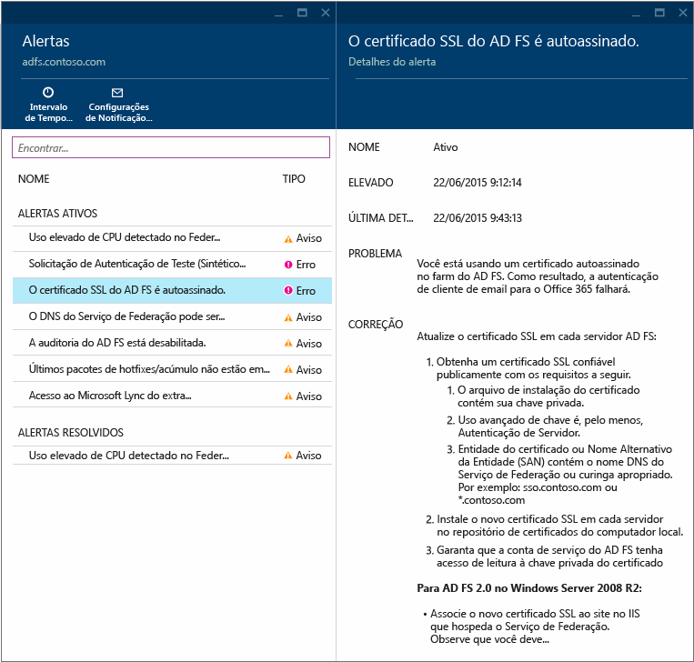
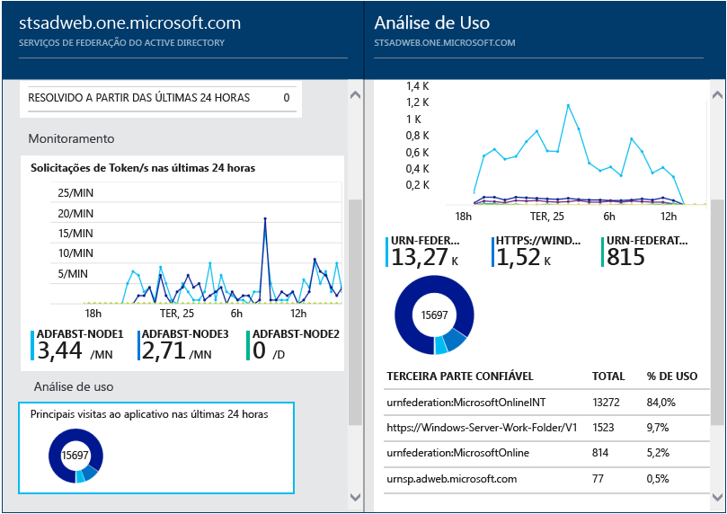
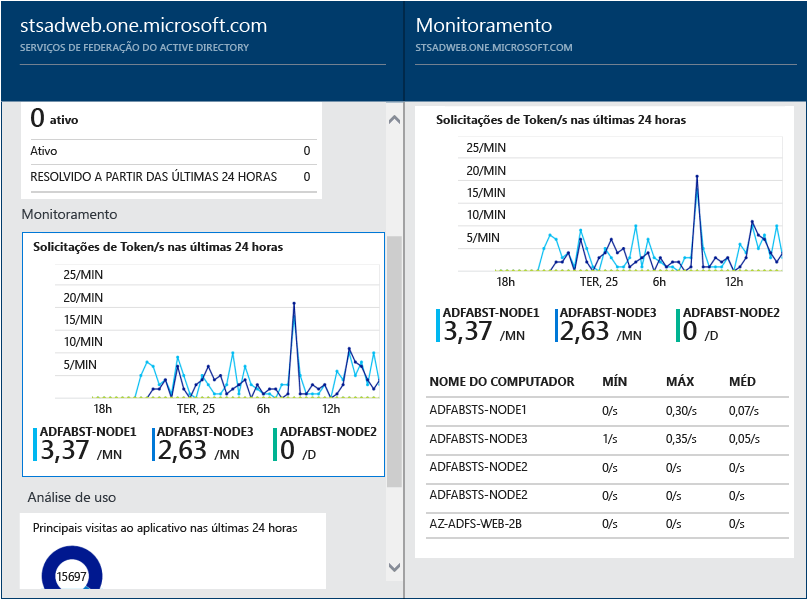

<properties
	pageTitle="Usando o Azure AD Connect Health com o AD FS | Microsoft Azure"
	description="Esta é a página do Azure AD Connect Health sobre como monitorar a sua infraestrutura local do AD FS."
	services="active-directory"
	documentationCenter=""
	authors="billmath"
	manager="stevenpo"
	editor="curtand"/>

<tags
	ms.service="active-directory"
	ms.workload="identity"
	ms.tgt_pltfrm="na"
	ms.devlang="na"
	ms.topic="get-started-article"
	ms.date="02/16/2016"
	ms.author="billmath"/>

# Usando o Azure AD Connect Health com o AD FS
A documentação a seguir é específica para monitorar a sua infraestrutura do AD FS com o Azure AD Connect Health.

## Alertas do AD FS
A seção de Alertas do Azure AD Connect Health fornece a lista de alertas ativos. Cada alerta inclui informações relevantes, etapas de resolução e links para documentação relacionada. Ao selecionar um alerta ativo ou resolvido, você verá uma nova folha com informações adicionais, bem como etapas a que serem seguidas para resolver o alerta e links para documentação adicional. Você também pode exibir dados históricos sobre alertas que foram resolvidas no passado.

Ao selecionar um alerta, você receberá informações adicionais, bem como etapas que você pode seguir para resolver o alerta e links para documentação adicional.

## Análises de Uso do AD FS
A Análise de Uso do Azure AD Connect Health analisa o tráfego de autenticação de servidores de Federação. Ao selecionar a caixa de análise de uso será aberta a folha de análise de uso, que mostra as métricas e os agrupamentos.

>[AZURE.NOTE] Para usar a análise de uso com o AD FS, você deve garantir que a auditoria do AD FS esteja habilitada. Para obter mais informações, consulte [Habilitar a auditoria do AD FS](active-directory-aadconnect-health-operations.md#enable-auditing-for-ad-fs).

Para selecionar métricas adicionais, especifique um intervalo de tempo ou, para alterar o agrupamento, simplesmente clique no gráfico de análise de uso e selecione Editar gráfico. Em seguida, você pode especificar o intervalo de tempo, alterar ou selecionar métricas e alterar o agrupamento. Você pode exibir a distribuição do tráfego de autenticação com base em diferentes “métricas” e agrupar cada métrica usando parâmetros "agrupar por" relevantes descritos abaixo.

| Métrica | Agrupar Por | O que significa que o agrupamento e por que ele é útil? |
| ------ | -------- | -------------------------------------------- |
| Total de solicitações: o número total de solicitações processado pelo serviço de Federação | Todos | Isso mostrará a contagem do número total de solicitações sem agrupamento. |
| | Aplicativo | Essa opção agrupará o total de solicitações com base na terceira parte confiável de destino. Esse agrupamento é útil para entender qual aplicativo está recebendo o percentual do tráfego total. |
| | Servidor | Essa opção agrupará o total de solicitações com base no servidor que processa a solicitação. Esse agrupamento é útil para entender a distribuição de carga do tráfego total. |
| | Ingresso no local | Essa opção agrupará o total de solicitações com base em se as solicitações são provenientes de dispositivos que são ingressados no local (conhecido). Esse agrupamento é útil para compreender se os recursos são acessados usando dispositivos desconhecidos para a infraestrutura de identidades. |
| | Método de autenticação | Essa opção agrupará o total de solicitações com base no método de autenticação usado para autenticação. Esse agrupamento é útil para entender o método de autenticação comum que é usado para autenticação. Estes são os métodos de autenticação possíveis<ol><li>Autenticação integrada do Windows (Windows)</li><li>Autenticação baseada em formulários (formulários)</li><li>SSO (logon único)</li><li>Autenticação de certificado X 509 (certificado)</li> Observe que uma solicitação é contabilizada como SSO (logon único) se os servidores de Federação receberem a solicitação com um Cookie do SSO. Nesses casos, se o cookie for válido, o usuário não precisa fornecer credenciais e obtém acesso contínuo ao aplicativo. Isso é comum se você tiver várias partes confiáveis protegidas pelos servidores da Federação. |
| | Local de rede | Essa opção agrupará o total de solicitações com base no local de rede do usuário. Pode ser qualquer intranet ou extranet. Esse agrupamento é útil para saber qual é a porcentagem do tráfego que está vindo da intranet em comparação com a extranet. |
| Total de solicitações com falha: o número total de solicitações com falha processadas pelo serviço de Federação.   (Essa métrica só está disponível no AD FS para o Windows Server 2012 R2)| Tipo de erro | Ela mostrará o número de erros com base nos tipos de erro predefinidos. Esse agrupamento é útil para entender os tipos comuns de erros. <ul><li>Nome de usuário ou senha incorretos: erros causados por nome de usuário ou senha incorretos.</li> <li>"Bloqueio extranet": falhas causadas por solicitações recebidas de um usuário bloqueado na extranet. </li><li> "Senha expirada": falhas causadas por usuários que fazem logon com uma senha expirada.</li><li>"Conta desabilitada": falhas causadas por usuários que fazem logon com uma conta desabilitada.</li><li>"Autenticação de dispositivo": falhas causadas por usuários que não se autenticam usando a autenticação de dispositivo.</li><li>"Autenticação de certificado de usuário": falhas causadas por usuários que não se autenticam devido a um certificado inválido.</li><li>"MFA": falhas causadas por usuário que não se autentica usando Multi-Factor Authentication.</li><li>"Outra credencial": "Autorização de emissão": falhas causadas por falhas de autorização.</li><li>"Delegação de emissão": falhas causadas por erros de delegação de emissão.</li><li>"Aceitação do token": falhas causadas pela rejeição por parte do ADFS do token de um provedor de identidade de terceira parte.</li><li>"Protocolo": falha causada por erros de protocolo.</li><li>"Desconhecido": envolve todo o restante. Quaisquer outras falhas que não se encaixam nas categorias definidas.</li> |
| | Servidor | Isso agrupará os erros com base no servidor. Isso é útil para entender a distribuição de erro entre servidores. A distribuição desigual poderia ser um indicador de um servidor em um estado com falha. |
| | Local de rede | Isso agrupará os erros com base no local de rede das solicitações (intranet vs extranet). Isso é útil para entender o tipo de solicitações com falha. |
| | Aplicativo | Isso agrupará as falhas com base no aplicativo de destino (terceira parte confiável). Isso é útil para entender qual aplicativo de destino está tendo maior número de erros. |
| Contagem de usuários: o número médio de usuários exclusivos ativos no sistema | Todos | Isso fornece uma contagem do número médio de usuários que usam o serviço de federação na fração de tempo selecionada. Os usuários não estão agrupados.  A média dependerá da fração de tempo selecionada. |
| | Aplicativo | Isso agrupará o número médio de usuários com base no aplicativo de destino (terceira parte confiável). Isso é útil para entender a quantos usuários estão usando o aplicativo. |

## Monitoramento de desempenho do AD FS
O Monitoramento de Desempenho do Azure Active Directory Connect Health fornece informações de monitoramento nas métricas. Ao selecionar a caixa Monitoramento, será aberta uma folha que fornece informações detalhadas sobre as métricas.

Ao selecionar a opção de filtro na parte superior da folha, você pode filtrar por servidor para ver as métricas individuais de um servidor. Para alterar as métricas, basta clicar com o botão direito do mouse no gráfico de monitoramento na abaixo da folha de monitoramento e selecione Editar gráfico. Em seguida, na nova folha que é aberta, você pode selecionar métricas adicionais na lista suspensa e especificar um intervalo de tempo para exibir os dados de desempenho.

## Links relacionados

* [Azure AD Connect Health](active-directory-aadconnect-health.md)
* [Instalação do Agente do Azure AD Connect Health](active-directory-aadconnect-health-agent-install.md)
* [Operações de Azure AD Connect Health](active-directory-aadconnect-health-operations.md)
* [Usando o Azure AD Connect Health para sincronização](active-directory-aadconnect-health-sync.md)
* [Perguntas frequentes do Azure AD Connect Health](active-directory-aadconnect-health-faq.md)

<!---HONumber=AcomDC_0218_2016-->