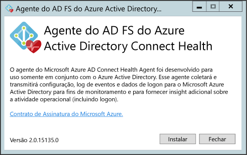
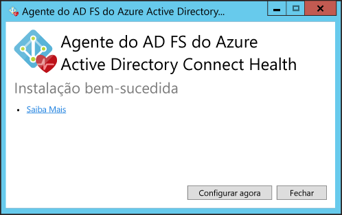
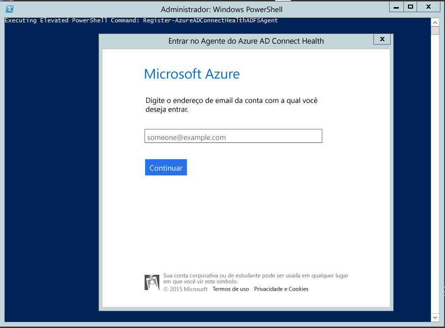

<properties
	pageTitle="Instalação do Agente do Azure AD Connect Health | Microsoft Azure"
	description="Esta é a página do Azure AD Connect Health que descreve a instalação do agente para o AD FS e Sincronização."
	services="active-directory"
	documentationCenter=""
	authors="billmath"
	manager="stevenpo"
	editor="curtand"/>

<tags
	ms.service="active-directory"
	ms.workload="identity"
	ms.tgt_pltfrm="na"
	ms.devlang="na"
	ms.topic="get-started-article"
	ms.date="03/08/2016"
	ms.author="billmath"/>

# Instalação do Agente do Azure AD Connect Health

Este documento explicará como instalar e configurar o Agente do Azure AD Connect Health para AD FS e sincronização.

>[AZURE.NOTE]Lembre-se de que, antes de você ver dados do AD FS em sua instância do Azure AD Connect Health, é necessário instalar o agente do Azure AD Connect Health nos servidores de destino. Não se esqueça de concluir os requisitos [aqui](active-directory-aadconnect-health.md#requirements) antes de instalar o agente. Você pode baixar o agente [aqui](http://go.microsoft.com/fwlink/?LinkID=518973).

## Instalando o Agente do Azure AD Connect Health para AD FS
Para iniciar a instalação do agente, clique duas vezes no arquivo .exe que você baixou. Na primeira tela, clique em instalar.

Depois que a instalação for concluída, clique em Configurar agora.

Isso iniciará um prompt de comando, seguido pelo PowerShell que executará Register-AzureADConnectHealthADFSAgent. Você será solicitado a entrar no Azure. Vá em frente e entre.

Depois de entrar, o PowerShell continuará. Depois de concluir feche o PowerShell e a configuração está concluída.

Nesse ponto, os serviços devem ser iniciados automaticamente e o agente estará agora monitorando e coletando dados. Lembre-se de que você verá avisos na janela do PowerShell caso não atenda a todos os pré-requisitos descritos nas seções anteriores. Não se esqueça de concluir os requisitos [aqui](active-directory-aadconnect-health.md#requirements) antes de instalar o agente. A seguinte captura de tela é um exemplo desses erros.

Para verificar se o agente foi instalado, abra serviços e procure pelo seguinte. Esses serviços devem ser executados se você concluir a configuração. Caso contrário, eles não serão iniciados até que a configuração esteja concluída.

- Serviço de diagnóstico do AD FS do Azure AD Connect Health
- Serviço do Insights do AD FS do Azure AD Connect Health
- Serviço de Monitoramento do AD FS do Azure AD Connect Health

### Instalação do agente em servidores do Windows Server 2008 R2

Para servidores Windows Server 2008 R2 faça o seguinte:

1. Certifique-se de que o servidor esteja em execução no Service Pack 1 ou superior.
1. Desative a ESC do IE para instalação do agente:
1. Instale o Windows PowerShell 4.0 em cada um dos servidores antes de instalar o agente de integridade do AD. Para instalar o Windows PowerShell 4.0:
 - Instale o [Microsoft .NET Framework 4.5](https://www.microsoft.com/download/details.aspx?id=40779) usando o link a seguir para baixar o instalador offline.
 - Instale o PowerShell ISE (de recursos do Windows)
 - Instale o [Windows Management Framework 4.0.](https://www.microsoft.com/download/details.aspx?id=40855)
 - Instale o Internet Explorer versão 10 ou superior no servidor. Isso é necessário para que o serviço de integridade faça sua autenticação usando suas credenciais de administrador do Azure.
1. Para obter informações adicionais sobre como instalar o Windows PowerShell 4.0 no Windows Server 2008 R2, consulte o artigo no wiki [aqui](http://social.technet.microsoft.com/wiki/contents/articles/20623.step-by-step-upgrading-the-powershell-version-4-on-2008-r2.aspx).

### Habilitar a auditoria do AD FS

Para que o recurso de Análise de Uso colete e analise dados, o agente do Azure AD Connect Health precisa das informações nos Logs de auditoria do AD FS. Esses logs não estão habilitados por padrão. Isso se aplica apenas aos servidores de Federação do AD FS. Você não precisa habilitar a auditoria em servidores de Proxy de aplicativo Web ou servidores Proxy do AD FS. Use os procedimentos a seguir para habilitar a auditoria do AD FS e localizar os logs de auditoria do AD FS.

#### Para habilitar a auditoria do AD FS 2.0

1. Clique em **Iniciar**, aponte para **Programas**, aponte para **Ferramentas Administrativas** e clique em **Política de Segurança Local**.
2. Navegue até a pasta **Configurações de segurança\\Políticas locais\\Gerenciamento de direitos de usuário** e, em seguida, clique duas vezes em Gerar auditorias de segurança.
3. Na guia **Configuração de Segurança Local**, verifique se a conta de serviço do AD FS 2.0 está listada. Se ela não estiver presente, clique em **Adicionar Usuário ou Grupo**, adicione-a à lista e clique em **OK**.
4. Abra um prompt de comando com privilégios elevados e execute o seguinte comando para habilitar auditoria: <code>auditpol.exe /set /subcategory:"Application Generated" /failure:enable /success:enable</code>
5. Feche a Política de segurança Local e, em seguida, abra o snap-in de Gerenciamento. Para abrir o snap-in de Gerenciamento, clique em **Iniciar**, aponte para **Programas**, aponte para **Ferramentas Administrativas** e clique em Gerenciamento do AD FS 2.0.
6. No painel de ações, clique em Editar propriedades do serviço de federação.
7. Na caixa de diálogo **Propriedades do Serviço de Federação**, clique na guia **Eventos**.
8. Marque as caixas de seleção **Auditorias com êxito** e **Auditorias com falha**.
9. Clique em **OK**.

#### Para habilitar a auditoria do AD FS no Windows Server 2012 R2

1. Abra **Política de Segurança Local** abrindo o **Gerenciador do Servidor** na tela Iniciar ou o Gerenciador do Servidor na barra de tarefas na área de trabalho e, em seguida, clique em **Ferramentas/Política de Segurança Local**.
2. Navegue até a pasta **Configurações de Segurança\\Políticas Locais\\Atribuição de Direitos de Usuário** e clique duas vezes em **Gerar auditorias de segurança**.
3. Na guia **Configuração de Segurança Local**, verifique se a conta de serviço do AD FS está listada. Se ela não estiver presente, clique em **Adicionar Usuário ou Grupo**, adicione-a à lista e clique em **OK**.
4. Abra um prompt de comando com privilégios elevados e execute o seguinte comando para habilitar auditoria: <code>auditpol.exe /set /subcategory:"Application Generated" /failure:enable /success:enable.</code>
5. Feche **Política de Segurança Local** e abra o snap-in de **Gerenciamento do AD FS** (no Gerenciador do Servidor, clique em Ferramentas e selecione Gerenciamento do AD FS).
6. No painel Ações, clique em **Editar Propriedades do Serviço de Federação**.
7. Na caixa de diálogo Propriedades do Serviço de Federação, clique na guia **Eventos**.
8. Marque as caixas de seleção **Auditorias com êxito e Auditorias com falha** e clique em **OK**.

#### Para localizar os logs de auditoria do AD FS

1. Abra o **Visualizador de Eventos**.
2. Vá para Logs do Windows e selecione **Segurança**.
3. À direita, clique em **Filtrar Logs Atuais**.
4. Em Origem do Evento, selecione **Auditoria do AD FS**.

> [AZURE.WARNING] Se você tiver uma política de grupo que esteja desabilitando a auditoria do AD FS, o agente do Azure AD Connect Health não poderá coletar informações. Certifique-se de que você não tem uma política de grupo que pssa desativar a auditoria.

[//]: # "Início da Seção de configuração de Proxy do agente"

## Instalando o agente do Azure AD Connect Health para sincronização
O agente do Azure AD Connect Health para sincronização é instalado automaticamente na compilação mais recente do Azure AD Connect. Para usar o Azure AD Connect para sincronização, você precisará baixar a versão mais recente do Azure AD Connect e instalá-lo. Você pode baixar a versão mais recente [aqui](http://www.microsoft.com/download/details.aspx?id=47594).

Para verificar se o agente foi instalado, abra serviços e procure pelo seguinte. Esses serviços devem ser executados se você concluir a configuração. Caso contrário, eles não serão iniciados até que a configuração esteja concluída.

- Serviço de Informações do Azure AD Connect Health para Sincronização
- Serviço de Monitoramento do Azure AD Connect Health para Sincronização

>[Azure.NOTE] Lembre-se de que usar o Azure AD Connect Health requer o Azure AD Premium. Se você não tiver o Azure AD Premium, você não poderá concluir a configuração no portal do Azure. Para obter mais informações, veja os requisitos [aqui](active-directory-aadconnect-health.md#requirements).

## Registro manual do Azure AD Connect Health para Sincronização
Se o registro do agente do Azure AD Connect Health para Sincronização falhar após a instalação bem-sucedida do Azure AD Connect, você poderá usar o comando a seguir do PowerShell para registrar manualmente o agente.

>[AZURE.IMPORTANT] O uso desse comando do PowerShell só será necessário se o registro do agente falhar após a instalação do Azure AD Connect.

O comando a seguir do PowerShell é necessário somente quando o registro do agente de integridade falha mesmo após a instalação e a configuração bem-sucedidas do Azure AD Connect. Nesses casos, os serviços do Azure AD Connect Health não serão iniciados até que o agente seja registrado com êxito.
 	
Você pode registrar manualmente o agente do Azure AD Connect Health para sincronização usando o seguinte comando do PowerShell:

`Register-AzureADConnectHealthSyncAgent -AttributeFiltering $false -StagingMode $false`

O comando usa os seguintes parâmetros:

- AttributeFiltering: $true (padrão) - se o Azure AD Connect não estiver sincronizando o conjunto de atributos padrão e tiver personalizado para usar um conjunto de atributos filtrados. Caso contrário, o valor será $false.
- StagingMode: $false (padrão) - se o servidor do Azure AD Connect NÃO estiver no modo de preparo; o valor será $true se o servidor estiver configurado para o modo de preparo.
 
Quando for solicitado a realizar a autenticação, você deverá usar a mesma conta de administrador global (como admin@domain.onmicrosoft.com) que foi usada para configurar o Azure AD Connect.

## Configurar agentes do Azure AD Connect Health para usar HTTP Proxy
Você pode configurar agentes do Azure AD Connect Health para trabalhar com um HTTP Proxy.

>[AZURE.NOTE]
- Usar "Netsh WinHttp set ProxyServerAddress" não funcionará, pois o agente usa System.Net para fazer solicitações da web em vez do Microsoft Windows HTTP Services.
- O endereço do Http Proxy configurado será usado para mensagens de passagem criptografadas de Https.
- Não há suporte para proxies autenticados (usando HTTPBasic).

### Alterar a configuração de proxy do agente de integridade
Você tem as seguintes opções para configurar o agente do Azure AD Connect Health para usar um HTTP Proxy.

>[AZURE.NOTE] Você deve reiniciar todos os serviços do agente do Azure AD Connect Health para que as configurações de proxy sejam atualizadas. Execute o seguinte comando:  Restart-Service AdHealth*

#### Importar configurações de proxy existentes

##### Importar do Internet Explorer
Você pode importar as configurações de HTTP proxy do Internet Explorer e usá-las para os agentes Azure AD Connect Health executando o seguinte comando do PowerShell em cada servidor que executa o Agente de integridade.

	Set-AzureAdConnectHealthProxySettings -ImportFromInternetSettings

##### Importar do WinHTTP
Você pode importar as configurações de proxy do WinHTTP executando o seguinte comando do PowerShell em cada servidor que executa o Agente de integridade.

	Set-AzureAdConnectHealthProxySettings -ImportFromWinHttp

#### Especificar endereços de Proxy manualmente
Você pode executar um servidor proxy manualmente executando o seguinte comando do PowerShell em cada servidor que executa o Agente de integridade.

	Set-AzureAdConnectHealthProxySettings -HttpsProxyAddress address:port

Exemplo: *Set-AzureAdConnectHealthProxySettings -HttpsProxyAddress myproxyserver:443*

- "address" pode ser um nome do servidor DNS que pode ser resolvido ou um endereço IPv4
- "port" pode ser omitida. Se omitida, 443 é escolhida como a porta padrão.

#### Limpar a configuração de proxy existente
Você pode limpar a configuração de proxy existente executando o comando a seguir.

	Set-AzureAdConnectHealthProxySettings -NoProxy

### Ler configurações de proxy atuais
Você pode usar o comando a seguir para ler as configurações de proxy atuais.

	Get-AzureAdConnectHealthProxySettings

## Testar a conectividade com o serviço Azure AD Connect Health
É possível haver problemas que façam com que o agente do Azure AD Connect Health perca a conectividade com o serviço Azure AD Connect Health. Isso inclui problemas de rede, problemas de permissão, entre vários outros.

Se o agente não puder enviar dados para o serviço do Azure AD Connect Health por mais de duas horas, você verá um alerta indicando "Os dados do Serviço de Integridade não estão atualizados". Se isso ocorrer, você poderá testar se os agentes do Azure AD Connect Health são capazes de carregar dados para o serviço Azure AD Connect Health executando o seguinte comando do PowerShell no computador cujo agente está tendo o problema.

    Test-AzureADConnectHealthConnectivity -Role Adfs

O parâmetro de função usa os seguintes valores:
	
- ADFS
- Sincronizar

Você pode usar o sinalizador -ShowResults no comando para exibir logs detalhados. Use o seguinte exemplo:

    Test-AzureADConnectHealthConnectivity -Role Sync -ShowResult

>[AZURE.NOTE]Para usar a ferramenta de conectividade, você deve primeiro concluir o registro do agente. Se conseguir concluir o registro do agente, verifique se você atende a todos os [requisitos](active-directory-aadconnect-health.md#requirements) do Azure AD Connect Health. Esse teste de conectividade é executado por padrão durante o registro do agente.

## Links relacionados

* [Azure AD Connect Health](active-directory-aadconnect-health.md)
* [Operações de Azure AD Connect Health](active-directory-aadconnect-health-operations.md)
* [Usando o Azure AD Connect Health com o AD FS](active-directory-aadconnect-health-adfs.md)
* [Usando o Azure AD Connect Health para sincronização](active-directory-aadconnect-health-sync.md)
* [Perguntas frequentes do Azure AD Connect Health](active-directory-aadconnect-health-faq.md)
* [Histórico de versão do Azure AD Connect Health](active-directory-aadconnect-health-version-history.md)

<!---HONumber=AcomDC_0316_2016-->