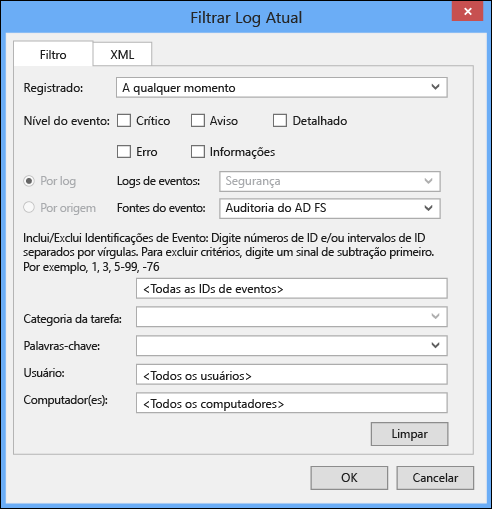

<properties 
	pageTitle="Operações de Azure AD Connect Health."
	description="Esta é a página de Azure AD Connect Health que descreve as operações adicionais que podem ser executadas depois da implantação do Azure AD Connect Health."
	services="active-directory"
	documentationCenter=""
	authors="billmath"
	manager="stevenpo"
	editor="curtand"/>

<tags 
	ms.service="active-directory"
	ms.workload="identity"
	ms.tgt_pltfrm="na"
	ms.devlang="na"
	ms.topic="article"
	ms.date="08/14/2015"
	ms.author="billmath"/>

# Operações de Azure AD Connect Health

O tópico a seguir descreve as várias operações que podem ser executadas usando o Azure AD Connect Health.

## Habilitar notificações por email
Você pode configurar o serviço do Azure AD Connect Health para enviar notificações por email quando os alertas são gerados indicando que sua infraestrutura de serviço de Federação não está íntegra. Isso ocorrerá quando um alerta for gerado, bem como quando ele é marcado como resolvido. Siga as instruções abaixo para configurar notificações por email. Observe que, por padrão, notificações por email estão desabilitadas.

### Para habilitar notificações por Email do Azure AD Connect Health

1. Abra a folha de alertas para o farm para o qual você deseja receber notificação por email.
2. Clique no botão "Configurações de notificação" na barra de ação.
3. Ative a opção de Notificação por email como ON.
4. Marque a caixa de seleção para configurar todos os administradores de locatários globais para receber notificações por email.
5. Se você deseja receber notificações por email em qualquer outro endereço de email, pode especificá-los nas caixas de destinatários de Email adicionais. Para remover um endereço de email da lista, clique com o botão direito na entrada e selecione Excluir.
6. Para finalizar as alterações clique em "Salvar". Todas as alterações entrarão em vigor somente depois que você selecionar "Salvar".

## Excluir um servidor do serviço de Azure AD Connect Health

Em alguns casos, você poderá remover um servidor que está sendo monitorado. Siga as instruções abaixo para remover um servidor do serviço de Azure AD Connect Health.

Ao excluir um servidor, esteja ciente das seguintes opções:

- Esta ação irá PARAR de coletar todos os demais dados desse servidor. Esse servidor será removido do serviço de monitoramento. Após essa ação, você não poderá exibir os novos alertas, monitoramento ou o uso de dados de análise para esse servidor.
- Essa ação NÃO irá desinstalar ou remover o agente de integridade do servidor. Se você não tiver desinstalado o agente de integridade antes de executar essa etapa, será possível ver os eventos de erro no servidor relacionados ao agente de integridade.
- Essa ação NÃO excluirá os dados já coletados deste servidor. Esses dados serão excluídos de acordo com a política de retenção de dados do Microsoft Azure. 
- Depois de executar essa ação, se você quiser iniciar o monitoramento do mesmo servidor novamente, será necessário desinstalar e reinstalar o agente de integridade neste servidor. 

### Para excluir um servidor do serviço do Azure AD Connect Health

1. Abra a folha do servidor da folha da lista do servidor, selecionando o nome do servidor a ser removido. 
2. Na folha do servidor, clique no botão "Excluir" na barra de ação.
3. Confirme a ação para excluir o servidor digitando o nome do servidor na caixa de confirmação.
4. Clique no botão "Excluir".

## Exclua uma instância de serviço do serviço do Azure AD Connect Health Service

Em alguns casos, será possível remover uma instância do serviço. Siga as instruções abaixo para remover uma instância de serviço do Azure AD Connect Health.

Ao excluir uma instância de serviço, esteja ciente do seguinte:

- Esta ação irá remover a instância do serviço atual do serviço de monitoramento. 
- Essa ação NÃO irá desinstalar ou remover o agente de integridade de nenhum um dos servidores que foram monitorados como parte desta instância de serviço. Se você não tiver desinstalado o agente de integridade antes de executar essa etapa, poderá ver os eventos de erro no(s) servidor(es) relacionado(s) ao agente de integridade. 
- Todos os dados dessa instância do serviço serão excluídos de acordo com a política de retenção de dados do Microsoft Azure. 
- Depois de executar essa ação, se você quiser iniciar o serviço de monitoramento, desinstale e reinstale o agente de integridade em todos os servidores que serão monitorados. Depois de executar essa ação, se você quiser iniciar o monitoramento do mesmo servidor novamente, será necessário desinstalar e reinstalar o agente de integridade neste servidor.

### Para excluir uma instância de serviço do Azure AD Connect Health Service

1. Abra uma folha de serviço na folha da lista do serviço, selecionando o identificador de serviço (nome do farm) que você deseja remover. 
2. Na folha do servidor, clique no botão "Excluir" na barra de ação.
3. Confirme o nome do serviço digitando-o na caixa de confirmação. (por exemplo: sts.contoso.com) 
4. Clique no botão "Excluir".

## Habilitar a auditoria do AD FS

Para que o recurso de Análise de uso colete e analise dados, o agente do Azure AD Connect Health precisa das informações nos Logs de auditoria do AD FS. Esses logs não estão habilitados por padrão. Isso se aplica apenas aos servidores de Federação do AD FS. Você não precisa habilitar a auditoria em servidores de Proxy de aplicativo Web ou servidores Proxy do AD FS. Use os procedimentos a seguir para habilitar a auditoria do AD FS e localizar os logs de auditoria do AD FS.

#### Para habilitar a auditoria do AD FS 2.0

1. Clique em **Iniciar**, aponte para **Programas**, aponte para **Ferramentas Administrativas** e clique em **Política de Segurança Local**.
2. Navegue até a pasta **Configurações de Segurança\\Políticas Locais\\Gerenciamento de Direitos de Usuário** e clique duas vezes em Gerar auditorias de segurança.
3. Na guia **Configuração de Segurança Local**, verifique se a conta de serviço do AD FS 2.0 está listada. Se ela não estiver presente, clique em **Adicionar Usuário ou Grupo**, adicione-a à lista e clique em **OK**.
4. Abra um prompt de comando com privilégios elevados e execute o seguinte comando para habilitar auditoria.<code>auditpol.exe /set /subcategory:"Application Generated" /failure:enable /success:enable</code>
5. Feche a Política de segurança Local e, em seguida, abra o snap-in de Gerenciamento. Para abrir o snap-in de Gerenciamento, clique em **Iniciar**, aponte para **Programas**, aponte para **Ferramentas Administrativas** e clique em Gerenciamento do AD FS 2.0.
6. No painel de ações, clique em Editar propriedades do serviço de federação.
7. Na caixa de diálogo **Propriedades do Serviço de Federação**, clique na guia **Eventos**.
8. Marque as caixas de seleção **Auditorias com êxito** e **Auditorias com falha**.
9. Clique em **OK**.

#### Para habilitar a auditoria do AD FS no Windows Server 2012 R2

1. Abra **Política de Segurança Local** abrindo o **Gerenciador do Servidor** na tela Iniciar ou o Gerenciador do Servidor na barra de tarefas na área de trabalho e, em seguida, clique em **Ferramentas/Política de Segurança Local**.
2. Navegue até a pasta **Configurações de Segurança\\Políticas Locais\\Atribuição de Direitos de Usuário** e clique duas vezes em **Gerar auditorias de segurança**.
3. Na guia **Configuração de Segurança Local**, verifique se a conta de serviço do AD FS está listada. Se ela não estiver presente, clique em **Adicionar Usuário ou Grupo**, adicione-a à lista e clique em **OK**.
4. Abra um prompt de comando com privilégios elevados e execute o seguinte comando para habilitar auditoria: <code>auditpol.exe /set /subcategory:"Application Generated" /failure:enable /success:enable.</code>
5. Feche **Política de Segurança Local** e abra o snap-in de **Gerenciamento do AD FS** (no Gerenciador do Servidor, clique em Ferramentas e selecione Gerenciamento do AD FS).
6. No painel Ações, clique em **Editar Propriedades do Serviço de Federação**.
7. Na caixa de diálogo Propriedades do Serviço de Federação, clique na guia **Eventos**.
8. Marque as caixas de seleção **Auditorias com êxito e Auditorias com falha** e clique em **OK**.

#### Para localizar os logs de auditoria do AD FS

1. Abra o **Visualizador de Eventos**.
2. Vá para Logs do Windows e selecione **Segurança**.
3. À direita, clique em **Filtrar Logs Atuais**.
4. Em Origem do Evento, selecione **Auditoria do AD FS**.

> [AZURE.WARNING]Se você tiver uma política de grupo que esteja desabilitando a auditoria do AD FS, o agente do Azure AD Connect Health não poderá coletar informações. Certifique-se de que você não tem uma política de grupo que pssa desativar a auditoria.

## Links relacionados

* [Azure AD Connect Health](active-directory-aadconnect-health.md)
* [Instalação do Agente do Azure AD Connect Health para AD FS](active-directory-aadconnect-health-agent-install-adfs.md)
* [Usando o Azure AD Connect Health com o AD FS](active-directory-aadconnect-health-adfs.md)
* [Perguntas frequentes do Azure AD Connect Health](active-directory-aadconnect-health-faq.md)

<!---HONumber=August15_HO9-->