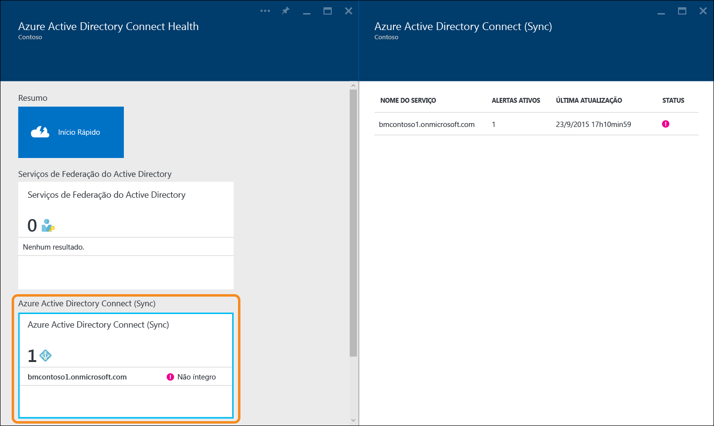
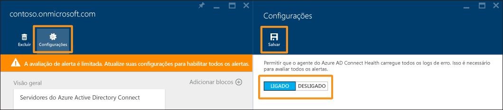

<properties
	pageTitle="Usando o Azure AD Connect Health com sincronização | Microsoft Azure"
	description="Esta é a página Azure AD Connect Health que discutirá como monitorar a sincronização do Azure Connect AD."
	services="active-directory"
	documentationCenter=""
	authors="billmath"
	manager="femila"
	editor="curtand"/>

<tags
	ms.service="active-directory"
	ms.workload="identity"
	ms.tgt_pltfrm="na"
	ms.devlang="na"
	ms.topic="get-started-article"
	ms.date="08/08/2016"
	ms.author="billmath"/>

# Usando o Azure AD Connect Health para sincronização
A documentação a seguir é específica do monitoramento da sincronização do Azure AD Connect (Sync) com o Azure AD Connect Health. Para saber mais sobre como monitorar o AD FS com o Azure AD Connect Health, consulte [Usando o Azure AD Connect Health com o AD FS](active-directory-aadconnect-health-adfs.md). Além disso, para obter informações sobre como monitorar os Serviços de Domínio do Active Directory com o Azure AD Connect Health, confira [Usar o Azure AD Connect Health com o AD DS](active-directory-aadconnect-health-adds.md).

## Alertas do Azure AD Connect Health para sincronização
A seção Alertas do Azure AD Connect Health para sincronização fornece a lista de alertas ativos. Cada alerta inclui informações relevantes, etapas de resolução e links para documentação relacionada. Ao selecionar um alerta ativo ou resolvido, você verá uma nova folha com informações adicionais, bem como etapas a que serem seguidas para resolver o alerta e links para documentação adicional. Você também pode exibir dados históricos sobre alertas que foram resolvidas no passado.

Ao selecionar um alerta, você receberá informações adicionais, bem como etapas que você pode seguir para resolver o alerta e links para documentação adicional.

### Avaliação limitada de alertas
Se o Azure AD Connect não estiver usando a configuração padrão (por exemplo, se a Filtragem de Atributos for alterada da configuração padrão para uma configuração personalizada), o agente do Azure AD Connect Health não carregará os eventos de erro relacionados ao Azure AD Connect.

Isso limita a avaliação de alertas pelo serviço. Você verá uma faixa que indica essa condição no Portal do Azure em seu serviço.

Você pode alterar isso clicando em "Configurações" e permitindo que o agente do Azure AD Connect Health carregue todos os logs de erro.

## Detalhes da sincronização
Com a versão mais recente do Azure AD Connect Health para sincronização, estes recursos novos foram adicionados:

- Latência de operações de sincronização
- Tendência de alteração de objeto

### Latência de Sincronização
Esse recurso oferece uma tendência gráfica de latência das operações de sincronização (importação, exportação etc.) para conectores. Isso oferece uma maneira rápida e fácil de entender não apenas a latência das operações (ótimo se você tiver um grande conjunto de alterações), mas também uma maneira de detectar anomalias na latência que possam exigir mais investigação.

Por padrão, somente a latência da operação 'Exportar' para o conector do AD do Azure é mostrada. Para ver mais operações no conector ou para exibir as operações de outros conectores, clique com o botão direito do mouse no gráfico e escolha a operação e o conector específicos.

### Alterações de objeto de sincronização
Esse recurso oferece uma tendência gráfica do número de alterações que estão sendo avaliadas e exportadas para o AD do Azure. Hoje, é difícil tentar coletar essas informações de logs de sincronização. O gráfico oferece não só uma maneira mais simples de monitorar o número de alterações que estão ocorrendo em seu ambiente, como também uma exibição visual das falhas ocorridas.

## Links relacionados

* [Azure AD Connect Health](active-directory-aadconnect-health.md)
* [Instalação do Agente do Azure AD Connect Health](active-directory-aadconnect-health-agent-install.md)
* [Operações de Azure AD Connect Health](active-directory-aadconnect-health-operations.md)
* [Usando o Azure AD Connect Health com o AD FS](active-directory-aadconnect-health-adfs.md)
* [Usar o Azure AD Connect Health com o AD DS](active-directory-aadconnect-health-adds.md)
* [Perguntas frequentes do Azure AD Connect Health](active-directory-aadconnect-health-faq.md)
* [Histórico de versão do Azure AD Connect Health](active-directory-aadconnect-health-version-history.md)

<!---HONumber=AcomDC_0928_2016-->