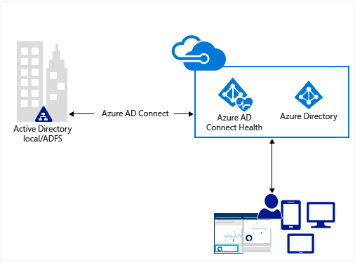
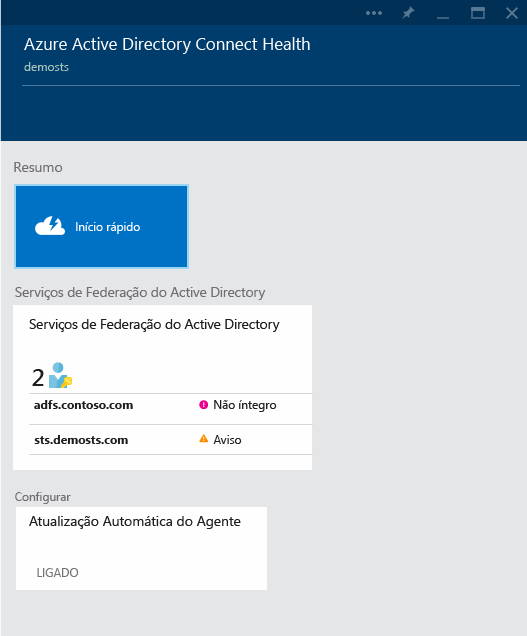

<properties
	pageTitle="Monitorar sua infraestrutura de identidade local na nuvem."
	description="Esta é a página de Integridade do Azure AD Connect que descreve o que ele é e por que você deve usá-lo."
	services="active-directory"
	documentationCenter=""
	authors="karavar"
	manager="stevenpo"
	editor="karavar"/>

<tags
	ms.service="active-directory"
	ms.workload="identity"
	ms.tgt_pltfrm="na"
	ms.devlang="na"
	ms.topic="get-started-article"
	ms.date="03/21/2016"
	ms.author="vakarand"/>

# Monitorar infraestrutura de identidade local e serviços de sincronização na nuvem

O Azure AD Connect Health ajuda no monitoramento e na obtenção de informações sobre a sua infraestrutura de identidade local e os serviços de sincronização. Ele permite manter uma conexão confiável com o Office 365 e o Microsoft Online Services, fornecendo recursos de monitoramento para os componentes de identidade de chave, como servidores do AD FS, servidores do Azure AD Connect (também conhecido como Mecanismo de Sincronização), Controladores de Domínio do Active Directory etc. Ele também torna os pontos de dados principais sobre esses componentes facilmente acessíveis, facilitando seu uso e outras informações importantes.

As informações são apresentadas no [Portal do Azure AD Connect Health](https://aka.ms/aadconnecthealth). Usando o portal do Azure AD Connect Health, você poderá exibir alertas, o monitoramento de desempenho, a análise de uso e muito mais. O Azure AD Connect Health permite a lente única da integridade sobre seus componentes de identidade de chave, tudo em um único lugar.

As atualizações futuras do Azure AD Connect Health incluirão o monitoramento adicional e informações sobre outros componentes de identidade. Assim, você obtém um painel único da perspectiva da identidade, habilitando-o a ter um ambiente ainda mais robusto, íntegro e integrado que seus usuários podem aproveitar para aumentar sua produtividade.

<!-- 

 -->

## Por que usar a Integridade do Azure AD Connect

A integração de seus diretórios locais ao AD do Azure torna os usuários mais produtivos fornecendo uma identidade comum para acesso aos recursos na nuvem e locais. No entanto, essa integração gera os desafios de garantir de que esse ambiente esteja íntegro, para que os usuários possam acessar de forma confiável recursos locais e na nuvem por meio de qualquer dispositivo. O Azure AD Connect Health fornece uma abordagem fácil baseada na nuvem para monitorar e obter percepções sobre sua infraestrutura de identidade local usada para acessar o Office 365 ou outros aplicativos do Azure AD. É tão simples quanto instalar um agente em cada um de seus servidores de identidade locais.

## [Azure AD Connect Health para AD FS](active-directory-aadconnect-health-adfs.md)

O Azure AD Connect Health para AD FS dá suporte ao AD FS 2.0 no Windows Server 2008 R2, ao AD FS no Windows Server 2012 e no Windows Server 2012R2. Isso também inclui servidores Proxy do AD FS ou Proxy de Aplicativo Web que dão suporte à autenticação para acesso à extranet. Com uma instalação muito fácil e de baixo custo do agente de integridade, o Azure AD Connect Health para AD FS oferece o seguinte conjunto de recursos principais:

- Monitoramento com alertas para saber quando os servidores do AD FS e Proxy do AD FS não estão íntegros
- Notificações de email para alertas críticos
- Exibir tendências nos dados de desempenho, útil para planejamento de capacidade do AD FS
- Análise de uso para logons do AD FS com pivô diferente (aplicativos, usuários, local de rede etc.), útil para entender como o AD FS está sendo utilizado.
- Relatórios para o AD FS, como os 50 primeiros usuários com tentativas inválidas de Nome de Usuário/Senha

O vídeo a seguir fornecerá uma visão geral do Azure AD Connect Health para AD FS

>[AZURE.VIDEO azure-ad-connect-health--monitor-you-identity-bridge]

## [Azure AD Connect Health para sincronização](active-directory-aadconnect-health-sync.md)
O Azure AD Connect Health for Sync monitora e fornece informações sobre as sincronizações que ocorrem entre seu Active Directory local e o Active Directory do Azure. O Azure AD Connect Health for Sync fornece o seguinte conjunto de recursos principais:

- Monitoramento com alertas para saber quando os servidores do Azure AD Connect, também conhecido como Mecanismo de Sincronização, não estão íntegros
- Notificações de email para alertas críticos
- Informações operacionais de sincronização, incluindo gráficos de latência para Operações de Sincronização e tendências em operações de sincronização, como adições, atualizações, exclusões.
- Informações rápidas sobre propriedades de sincronização, a última exportação com êxito para o AD do Azure

O vídeo a seguir fornecerá uma visão geral do Azure AD Connect Health para sincronização

[Azure Active Directory Connect Health: monitoramento do mecanismo de sincronização](https://channel9.msdn.com/Series/Azure-Active-Directory-Videos-Demos/Azure-Active-Directory-Connect-Health-Monitoring-the-sync-engine)

## Introdução ao Azure AD Connect Health
É muito fácil começar a usar o Azure AD Connect Health. Siga as etapas abaixo:

1. [Obter o Azure AD Premium](active-directory-get-started-premium) ou [iniciar uma avaliação](https://azure.microsoft.com/trial/get-started-active-directory/)

2. [Baixe e Instale os agentes do Azure AD Connect Health](#download-and-install-azure-ad-connect-health-agent) nos seus servidores de identidade.

3. Exibir o painel do Azure AD Connect Health em [https://aka.ms/aadconnecthealth](https://aka.ms/aadconnecthealth)

>[AZURE.NOTE]Lembre-se de que, antes de você ver todos os dados no Painel do Azure AD Connect Health, será necessário instalar o agente do Azure AD Connect Health nos servidores de destino.

## Baixar e instalar o agente do Azure AD Connect Health

- Consultar os [Requisitos](active-directory-aadconnect-health-agent-install.md#Requirements) do Azure AD Connect Health

- Para começar a usar o Azure AD Connect Health para AD FS, você pode baixar a versão mais recente do agente aqui: [Baixar o Agente do Azure AD Connect Health para AD FS.](http://go.microsoft.com/fwlink/?LinkID=518973) 

- Para começar a usar o Azure AD Connect Health para sincronizar, baixe e instale a [versão mais recente do Azure AD Connect](http://go.microsoft.com/fwlink/?linkid=615771). O agente de integridade será instalado como parte da instalação do Azure AD Connect (versão 1.0.9125.0 ou superior). O Azure AD Connect oferece suporte a uma atualização in-loco de versões anteriores.

## Portal do Azure AD Connect Health
O portal do Azure AD Connect Health permite exibir alertas, o monitoramento do desempenho e a análise de uso. O https://aka.ms/aadconnecthealth leva você à folha principal do Azure AD Connect Health. Você pode pensar uma folha como uma janela. Na folha principal, você vê o Início Rápido, os Serviços no Azure AD Connect Health e opções de configuração adicionais. Abaixo a captura de tela é uma breve explicação de cada um deles. Depois que você tiver implantado os agentes, os identificadores dos serviços do Azure AD Connect Health estarão monitorando.

- **Início Rápido** – selecionar esta opção abrirá a folha Início Rápido. Aqui você poderá baixar o agente de Azure AD Connect Health, escolhendo Obter Ferramentas, acessar a documentação e fornecer comentários.

- **Serviços de Federação do Active Directory** – representa todos os serviços do AD FS que o Azure AD Connect Health está monitorando no momento. Ao selecionar uma das instâncias, uma folha abrirá com informações sobre essa instância de serviços. Essas informações incluem uma análise de visão geral, propriedades, alertas, monitoramento e análise de uso. Leia mais sobre os recursos [aqui.](active-directory-aadconnect-health-adfs.md)

- **Azure Active Directory Connect (Sincronização)** – representa seus servidores do Azure AD Connect que o Azure AD Connect Health está monitorando atualmente. Quando você selecionar a entrada, a folha abrirá com informações sobre seus servidores do Azure AD Connect. Leia mais sobre os recursos [aqui.](active-directory-aadconnect-health-sync.md)

- **Configurar** – permite ativar ou desativar o seguinte:

	1. Atualização para atualizar automaticamente o agente do Azure AD Connect Health para a versão mais recente automática - isso significa que você será atualizada automaticamente para a versão mais recente do agente do Azure AD Connect Health quando ela estiver disponível. Isso é habilitado por padrão.

	2. Permitir que o Microsoft accesse os dados de integridade do seu diretório AD do Azure para fins de solução de problemas: isso significa que, se isso estiver habilitado, o Microsoft será capaz de ver os mesmos dados que você está vendo. Isso pode ajudar na solução de problemas e obter ajuda com problemas. Isso está desabilitado por padrão.

## Links relacionados

* [Instalação do Agente do Azure AD Connect Health](active-directory-aadconnect-health-agent-install.md)
* [Operações de Azure AD Connect Health](active-directory-aadconnect-health-operations.md)
* [Usando o Azure AD Connect Health com o AD FS](active-directory-aadconnect-health-adfs.md)
* [Usando o Azure AD Connect Health for Sync](active-directory-aadconnect-health-sync.md)
* [Perguntas frequentes do Azure AD Connect Health](active-directory-aadconnect-health-faq.md)
* [Histórico de versão do Azure AD Connect Health](active-directory-aadconnect-health-version-history.md)

<!---HONumber=AcomDC_0427_2016-->