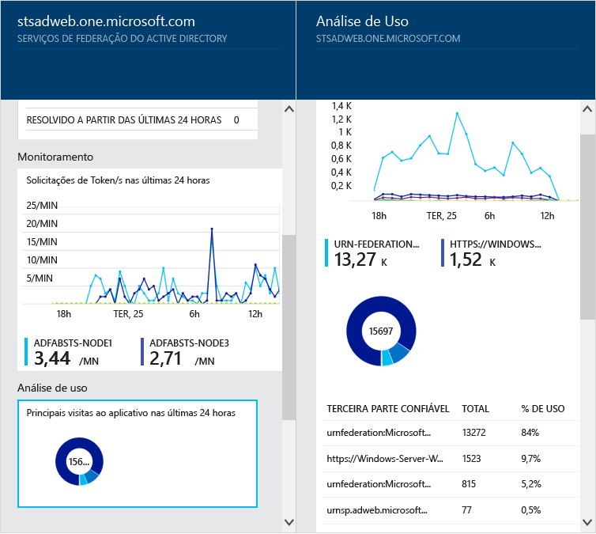

<properties
	pageTitle="Monitorar sua infraestrutura de identidade local na nuvem."
	description="Esta é a página de Integridade do Azure AD Connect que descreve o que ele é e por que você deve usá-lo."
	services="active-directory"
	documentationCenter=""
	authors="billmath"
	manager="stevenpo"
	editor="curtand"/>

<tags
	ms.service="active-directory"
	ms.workload="identity"
	ms.tgt_pltfrm="na"
	ms.devlang="na"
	ms.topic="get-started-article"
	ms.date="02/09/2016"
	ms.author="billmath"/>

# Monitorar infraestrutura de identidade local e serviços de sincronização na nuvem

O Azure AD Connect Health ajuda no monitoramento e na obtenção de informações sobre a sua infraestrutura de identidade local e os serviços de sincronização disponíveis por meio do Azure AD Connect. Ela oferece a você a capacidade de exibir alertas, desempenho, padrões de uso e definições de configuração, o habilita a manter uma conexão confiável para o Office 365 e muito mais. Isso é feito usando um agente instalado nos servidores de destino.

Todas essas informações são apresentadas no portal de Integridade do Azure AD Connect. Usando o portal de Integridade do Azure AD Connect, você pode exibir alertas, monitoramento de desempenho e análise de uso. Essas informações são apresentadas em um local fácil de usar para que você não precise perder tempo procurando as informações necessárias.

Atualizações futuras do Azure AD Connect Health incluem monitoramento adicional e percepções sobre outros componentes de identidade. Assim, você obtém um painel único da perspectiva da identidade, habilitando-o a ter um ambiente ainda mais robusto, íntegro e integrado que seus usuários podem aproveitar para aumentar sua produtividade.

## Por que usar a Integridade do Azure AD Connect

A integração de seus diretórios locais ao AD do Azure torna os usuários mais produtivos fornecendo uma identidade comum para acesso aos recursos na nuvem e locais. No entanto, essa integração gera os desafios de garantir de que esse ambiente esteja íntegro, para que os usuários possam acessar de forma confiável recursos locais e na nuvem por meio de qualquer dispositivo. A Integridade do Azure AD Connect fornece uma abordagem fácil baseada na nuvem para monitorar e obter percepções sobre sua infraestrutura de identidade local usada para acessar o Office 365 ou outros aplicativos do Azure AD. É tão simples quanto instalar um agente em cada um de seus servidores de identidade locais.

Integridade do Azure AD Connect para o AD FS dá suporte ao AD FS 2.0 no Windows Server 2008/2008 R2 e ao AD FS no Windows Server 2012/2012R2. Isso também inclui servidores Proxy do AD FS ou Proxy de Aplicativo Web que dão suporte à autenticação para acesso à extranet. A Integridade do Azure AD Connect para o AD FS fornece o seguinte conjunto de recursos principais:

- Exibir e tomar medidas sobre alertas para acesso confiável a aplicativos protegidos do AD FS, incluindo o AD do Azure
- Notificações de email para alertas críticos
- Exibir dados de desempenho para determinar o planejamento de capacidade
- Exibições detalhadas de seus padrões de logon do AD FS para determinar anomalias ou estabelecer linhas de base para planejamento de capacidade

O Azure AD Connect Health for Sync monitora e fornece informações sobre as sincronizações que ocorrem entre seu Active Directory local e o Active Directory do Azure. O Azure AD Connect Health for Sync fornece o seguinte conjunto de recursos principais:

- Exibir e realizar ações em relação a alertas para garantir sincronizações confiáveis entre sua infraestrutura local e o Active Directory do Azure.
- Notificações de email para alertas críticos
- Exibir dados de desempenho

O vídeo a seguir fornece uma visão geral do Azure AD Connect Health:

[AZURE.VIDEO azure-ad-connect-health--monitor-you-identity-bridge]

## Introdução ao Portal do Azure
Para começar com o Azure Active Directory Connect Health, siga as etapas abaixo.

1. Entre no [Portal do Microsoft Azure.](https://portal.azure.com/)
2. O Azure Active Directory Connect Health pode ser acessado pelo Marketplace e pesquisando por ele ou selecionando-o no Marketplace e selecionando Segurança + Identidade.
3. Na folha introdutória (uma folha é uma parte do modo de exibição geral. Você pode pensar em uma folha como sendo uma janela ou uma apresentação), clique em **Criar**. Isso abrirá outra folha com informações de seu diretório.
4. Na folha do diretório, clique em **Criar**. Se você não tiver uma licença do Azure Active Directory Premium, você precisará usar o Azure AD Connect Health. Para obter informações sobre o Azure AD Premium, consulte Introdução ao AD Premium do Azure.

>[AZURE.NOTE]Lembre-se de que, antes de você ver todos os dados em sua instância do Azure AD Connect Health, é necessário instalar o agente do Azure AD Connect Health nos servidores de destino. Para baixar o agente do Azure AD Connect Health, na primeira folha, selecione Início Rápido e Obter Ferramentas. Você também pode baixar o agente diretamente usando o [link](#download-the-agent) abaixo. Para usar o Azure Active Directory Connect Health, faça o seguinte:

### O portal e os serviços do Azure AD Connect Health
O portal de Azure AD Connect Health permite a visualização de alertas, monitoramento de desempenho e análise de uso. No primeiro acesso ao Azure AD Connect Health, você verá a primeira folha. Você pode pensar uma folha como uma janela. A primeira folha que você vir mostra o Início rápido, Serviços e Configuração. Abaixo a captura de tela é uma breve explicação de cada um deles. A seção de serviços mostra os serviços e as instâncias ativas desses serviços que o Azure AD Connect Health está monitorando.

- **Início Rápido** – selecionar esta opção abrirá a folha Início Rápido. Aqui você poderá baixar o agente de Azure AD Connect Health, escolhendo Obter Ferramentas, acessar a documentação e fornecer comentários.
- **Serviços de Federação do Active Directory** – representa todos os serviços do AD FS que o Azure AD Connect Health está monitorando no momento. Ao selecionar uma das instâncias, uma folha abrirá com informações sobre essa instância de serviços. Essas informações incluem uma análise de visão geral, propriedades, alertas, monitoramento e análise de uso.
- Configurar – isso permite ativar ou desativar o seguinte:
<ol>
1. Atualização para atualizar automaticamente o agente do Azure AD Connect Health para a versão mais recente automática - isso significa que você será atualizada automaticamente para a versão mais recente do agente do Azure AD Connect Health quando ela estiver disponível. Isso é habilitado por padrão.
2. Permitir que o Microsoft accesse os dados de integridade do seu diretório AD do Azure para fins de solução de problemas: isso significa que, se isso estiver habilitado, o Microsoft será capaz de ver os mesmos dados que você está vendo. Isso pode ajudar na solução de problemas e obter ajuda com problemas. Isso está desabilitado por padrão.

## Requisitos
A tabela a seguir é uma lista de requisitos que devem ser atendidos antes de usar o Azure AD Connect Health.

| Requisito | Descrição|
| ----------- | ---------- |
|AD Premium do Azure| O Azure AD Connect Health é um recurso do Azure AD Premium e requer o Azure AD Premium.   Para saber mais, confira [Introdução ao Azure AD Premium](active-directory-get-started-premium.md).  Para iniciar uma avaliação gratuita de 30 dias, confira [Iniciar uma avaliação.](https://azure.microsoft.com/trial/get-started-active-directory/)|.
|Você deve ser um administrador global do Azure AD para habilitar (criar) o Azure AD Connect Health|Por padrão, somente administradores globais podem habilitar (criar), acessar todas as informações e executar todas as operações no Azure AD Connect Health. Para obter informações adicionais, confira [Administrando seu diretório no AD do Azure](active-directory-administer.md).    Usando o Controle de Acesso com Base em Funções, você pode permitir acesso ao Azure AD Connect Health para outros usuários em sua organização. Para saber mais, confira [Controle de Acesso com Base em Funções para Azure AD Connect Health.](active-directory-aadconnect-health-operations.md#manage-access-with-role-based-access-control)   **Importante:** a conta que você usará ao instalar os agentes deve ser uma conta do trabalho ou da escola e não pode ser uma conta da Microsoft. Para saber mais, confira [Inscrever-se no Azure como uma organização](sign-up-organization.md)|
|Para o AD FS, a auditoria do AD FS deve ser ativada para usar a Análise de uso| Se você planeja usar a Análise de Uso com o AD FS, a auditoria do AD FS deve ser habilitada.   Confira [Instalando o Agente do Azure AD Connect Health para AD FS.](active-directory-aadconnect-health-agent-install.md#installing-the-azure-ad-connect-health-agent-for-ad-fs)
|Atender aos requisitos do Agente do Azure AD Connect Health|Consulte a tabela abaixo para ver os requisitos específicos para o agente.

A tabela a seguir é uma lista de requisitos do agente que devem ser atendidos antes de usar o Azure AD Connect Health.

| Requisito | Descrição|
| ----------- | ---------- |
|O agente do Azure AD Connect Health instalado em cada servidor de destino| O Azure AD Connect Health requer que um agente esteja instalado nos servidores de destino para fornecer os dados que serão exibidos no portal.   Por exemplo, para obter dados sobre sua infraestrutura local do AD FS, o agente deverá estar instalado nos servidores do AD FS. Isso inclui servidores de Proxy do AD FS e servidores de Proxy de aplicativo Web.   Para obter informações sobre a instalação do agente, consulte [Azure AD Connect Health Agent Installation (Instalação do Agente do Azure AD Connect Health)](active-directory-aadconnect-health-agent-install.md).  **Importante:** a conta usada ao instalar os agentes deve ser uma conta do trabalho ou da escola e não pode ser uma conta da Microsoft. Para saber mais, confira [Inscrever-se no Azure como uma organização](sign-up-organization.md)|
|Agente do Azure AD Connect Health for Sync| Esse agente é instalado automaticamente com a versão mais recente do Azure AD Connect.   Se você estiver apenas começando, não será necessário fazer mais nada. O Agente será instalado quando você instalar o Azure AD Connect.   Se você já tiver o Azure AD Connect instalado, será necessário atualizar para a versão mais recente, que pode ser baixada [aqui](http://www.microsoft.com/download/details.aspx?id=47594).
|Conectividade de saída para os pontos de extremidade de serviço do Azure|Durante a instalação e o tempo de execução, o agente requer conectividade com os pontos de extremidade de serviço do Azure AD Connect Health listados a seguir. Se você bloquear a conectividade de saída verifique se os recursos a seguir foram adicionados à lista de permissões:   <li>**new**: https://management.azure.com </li><li>**new**: &#42;.blob.core.windows.net </li><li>**new**: &#42;.queue.core.windows.net</li><li>&#42;.servicebus.windows.net - Porta: 5671</li><li>https://&#42;.adhybridhealth.azure.com/</li><li>https://&#42;.table.core.windows.net/</li><li>https://policykeyservice.dc.ad.msft.net/</li><li>https://login.windows.net</li><li>https://login.microsoftonline.com</li><li>https://secure.aadcdn.microsoftonline-p.com</li> |
|Portas de firewall no servidor que executa o agente.| O agente exige que as seguintes portas de firewall estejam abertas para que o agente se comunique com os pontos de extremidade de serviço do Azure AD Health.  <li>Porta TCP/UDP 80</li><li>Porta TCP/UDP 443</li><li>Porta TCP/UDP 5671</li>
|Permita os sites a seguir se a segurança reforçada do IE estiver habilitada|Os sites a seguir precisarão ser permitidos se a Segurança Aprimorada do IE estiver habilitada no servidor no qual o agente será instalado.  <li>https://login.microsoftonline.com</li><li>https://secure.aadcdn.microsoftonline-p.com</li><li>https://login.windows.net</li><li>O servidor de federação da sua organização confiável pelo Active Directory do Azure, por exemplo: https://sts.contoso.com</li>

## Baixar o agente

Para começar, siga um destes procedimentos:

- Para começar a usar o Azure AD Connect Health para AD FS, você poderá baixar a versão mais recente do agente aqui: [Baixar o Agente do Azure AD Connect Health para AD FS.](http://go.microsoft.com/fwlink/?LinkID=518973) Verifique se você adicionou o serviço do Marketplace antes de instalar os agentes.
- Para começar a usar o Azure AD Connect Health para sincronizar, baixe e instale a [versão mais recente do Azure AD Connect](http://go.microsoft.com/fwlink/?linkid=615771). O agente de integridade será instalado como parte da instalação do Azure AD Connect. O Azure AD Connect oferece suporte a uma atualização in-loco de versões anteriores.

## Links relacionados

* [Instalação do Agente do Azure AD Connect Health](active-directory-aadconnect-health-agent-install.md)
* [Operações de Azure AD Connect Health](active-directory-aadconnect-health-operations.md)
* [Usando o Azure AD Connect Health com o AD FS](active-directory-aadconnect-health-adfs.md)
* [Usando o Azure AD Connect Health for Sync](active-directory-aadconnect-health-sync.md)
* [Perguntas frequentes do Azure AD Connect Health](active-directory-aadconnect-health-faq.md)

<!---HONumber=AcomDC_0218_2016-->