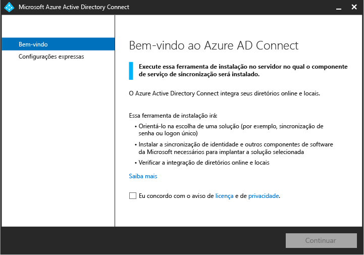
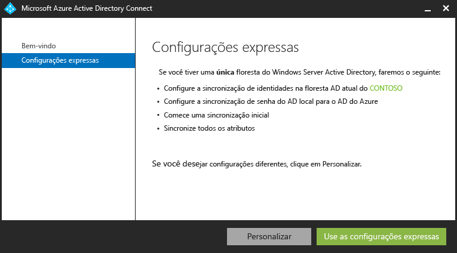
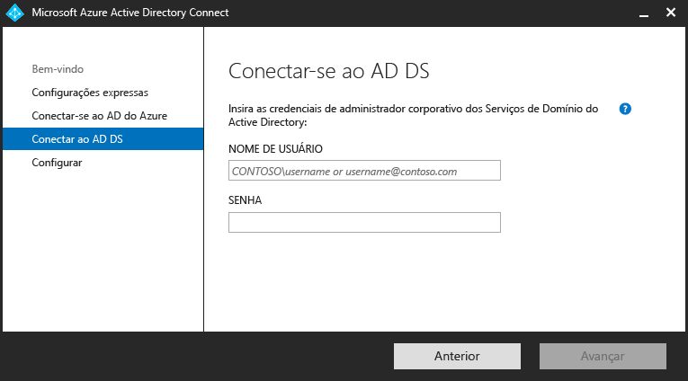
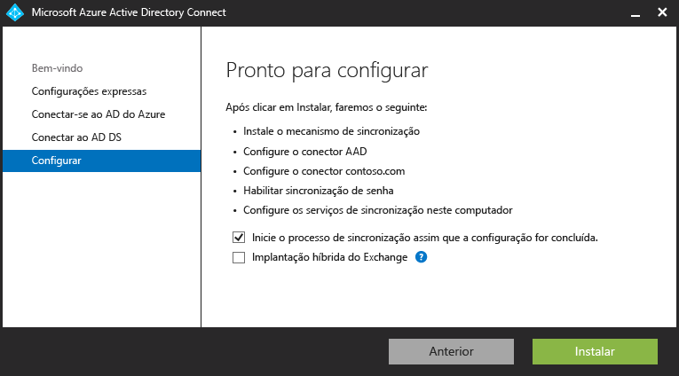
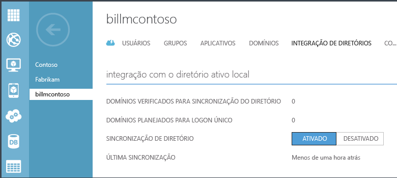
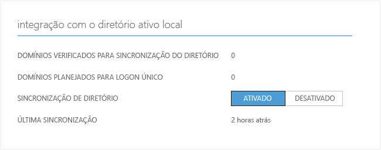
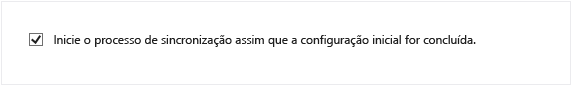
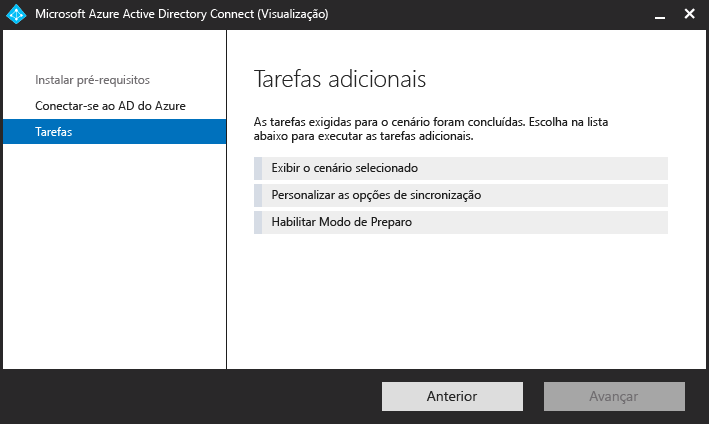

<properties 
	pageTitle="Integrando suas identidades locais ao Active Directory do Azure." 
	description="Este é o Azure AD Connect que descreve o que ele é e por que usá-lo." 
	services="active-directory" 
	documentationCenter="" 
	authors="billmath" 
	manager="swadhwa" 
	editor="curtand"/>

<tags 
	ms.service="active-directory" 
	ms.workload="identity" 
	ms.tgt_pltfrm="na" 
	ms.devlang="na" 
	ms.topic="article" 
	ms.date="07/13/2015" 
	ms.author="billmath"/>

# Integração de suas identidades locais com o Active Directory do Azure

Hoje, os usuários desejam poder acessar aplicativos no local e na nuvem. Eles querem poder fazer isso de qualquer dispositivo, seja de um laptop, smartphone ou tablet. Para isso, você e sua organização precisam estar aptos a fornecer uma maneira para que os usuários acessem esses aplicativos. No entanto, migrar integralmente para a nuvem nem sempre será uma opção.

Com a introdução do Azure Active Directory Connect, fornecer acesso a esses aplicativos e migrar para a nuvem nunca foi tão fácil. O Azure AD Connect proporciona os seguintes benefícios:

- Os usuários podem entrar com a mesma identidade na nuvem e no local. Eles não precisam se lembrar de várias senhas ou de contas e os administradores não precisam se preocupar com a sobrecarga adicional que pode ser introduzida pelas várias contas.
- Uma única ferramenta e uma experiência orientada para conectar seus diretórios locais ao Active Directory do Azure. Depois de instalado, o assistente implanta e configura todos os componentes necessários para que a integração do seu diretório funcione, incluindo serviços de sincronização, sincronização de senhas ou AD FS e pré-requisitos, como o módulo PowerShell do AD do Azure.

## Por que usar o Azure AD Connect 

A integração de seus diretórios locais ao AD do Azure torna os usuários mais produtivos ao fornecer uma identidade comum para acesso aos recursos na nuvem e locais. Com essa integração, os usuários e as organizações podem se beneficiar do seguinte:
	
* As organizações podem fornecer aos usuários uma identidade híbrida comum para serviços baseados em nuvem ou locais, aproveitando o Active Directory do Windows Server e, em seguida, conectando-se ao Active Directory do Azure. 
* Os administradores podem fornecer acesso condicional com base no recurso do aplicativo, na identidade de usuário e dispositivo, no local de rede e na autenticação multifator.
* Os usuários podem aproveitar sua identidade comum por meio das contas no AD do Azure para o Office 365, o Intune, os aplicativos SaaS e os aplicativos de terceiros.  
* Os desenvolvedores podem criar aplicativos que aproveitam o modelo de identidade comum, integrando aplicativos ao Active Directory local ou o Azure para aplicativos baseados em nuvem.

O Azure Connect AD facilita essa integração e simplifica o gerenciamento da infraestrutura de identidade local e na nuvem.

----------------------------------------------------------------------------------------------------------
## Baixar o Azure AD Connect

Para começar a usar o Azure AD Connect, você pode baixar a versão mais recente usando o seguinte: [Baixar o Azure AD Connect](http://go.microsoft.com/fwlink/?LinkId=615771)

----------------------------------------------------------------------------------------------------------

## Como o Azure AD Connect funciona

O Azure Active Directory Connect é composto de três partes principais. Elas são: os serviços de sincronização, a parte opcional de Serviços de Federação do Active Directory e a parte de monitoramento que é feita usando o [Azure AD Connect Health](https://msdn.microsoft.com/library/azure/dn906722.aspx).

 

- Sincronização - Esta parte é composta de componentes e funcionalidades lançados anteriormente como Dirsync e AAD Sync. Essa é a parte responsável pela criação de usuários e grupos. Ela também é responsável por garantir que as informações sobre usuários e grupos em seu ambiente local correspondam às da nuvem.
- AD FS - Esta é uma parte opcional do Azure AD Connect e pode ser usada para configurar um ambiente híbrido usando uma infraestrutura de AD FS local. Esta parte pode ser usada pelas organizações para abordar implantações complexas que incluem itens como SSO de ingresso no domínio, imposição de política de logon de AD e cartão inteligente ou MFA de terceiros. Para obter informações adicionais sobre como configurar SSO, consulte [DirSync com logon único](https://msdn.microsoft.com/library/azure/dn441213.aspx).
- Monitoramento de integridade - Para implantações complexas usando AD FS, o Azure AD Connect Health pode fornecer monitoramento robusto de seus servidores de federação e uma localização central no portal do Azure para exibir essa atividade. Para obter informações adicionais, consulte [Azure Active Directory Connect Health](https://msdn.microsoft.com/library/azure/dn906722.aspx).

### Componentes de suporte do Azure AD Connect

A seguir, uma lista de pré-requisitos e componentes de suporte que o Azure AD Connect irá instalar no servidor em que você instalou o Azure AD Connect. Esta lista é para uma instalação básica do Express. Se você optar por usar um SQL Server diferente na página de serviços de sincronização de instalação, os componentes do SQL Server 2012 listados abaixo não serão instalados.

- Azure AD Connect Azure AD Connector
- Utilitários de linha de comando do Microsoft SQL Server 2012
- Microsoft SQL Server 2012 Native Client
- LocalDB do Microsoft SQL Server 2012 Express
- Módulo do Active Directory do Azure para Windows PowerShell
- Assistente de Conexão do Microsoft Online Services para profissionais de TI
- Pacote de redistribuição de Microsoft Visual C++ 2013

## Introdução ao Azure AD Connect

A documentação a seguir o ajudará a começar com o Azure Active Directory Connect. Essa documentação lida com o uso da instalação expressa para o Azure AD Connect. Para obter informações sobre uma instalação personalizada, consulte [Instalação personalizada para o Azure AD Connect](active-directory-aadconnect-get-started-custom.md). Para obter informações sobre como atualizar do DirSync para o Azure AD Connect, consulte [Atualizando o DirSync para o Azure Active Directory Connect.](active-directory-aadconnect-dirsync-upgrade-get-started.md)

### Antes de instalar o Azure AD Connect
Antes de instalar o Azure AD Connect com configurações expressas, há algumas coisas de que você precisará.

 
- Uma assinatura do Azure ou uma [assinatura de avaliação do Azure](http://azure.microsoft.com/pricing/free-trial/) - isso só é necessário para acessar o portal do Azure, não para usar o Azure AD Connect. Se estiver usando o PowerShell ou o Office 365, você não precisará de uma assinatura do Azure para usar o Azure AD Connect.
- Uma conta de Administrador Global de AD do Azure para o locatário do AD do Azure com o qual você deseja se integrar
- O Azure AD Connect deve ser instalado no Windows Server 2008 ou posterior. Esse servidor pode ser um controlador de domínio ou um servidor membro.
- O nível de floresta e a versão de esquema do AD devem ser para Windows Server 2003 ou posterior. Os controladores de domínio podem executar qualquer versão, desde os requisitos de nível de floresta e de esquema sejam atendidos.
- Se os Serviços de Federação do Active Directory estão sendo implantados, os servidores em que os AD FS serão instalados devem ser Windows Server 2012 ou posterior.
- Uma conta de administrador corporativo para o Active Directory local
- Opcional: uma conta de usuário de teste para verificar a sincronização. 

#### Requisitos de hardware para o Azure AD Connect
A tabela a seguir mostra os requisitos mínimos para o computador do Azure AD Connect.

| Número de objetos no Active Directory | CPU | Memória | Tamanho do disco rígido |
| ------------------------------------- | --- | ------ | --------------- |
| Menos de 10.000 | 1,6 GHz | 4 GB | 70 GB |
| 10\.000–50.000 | 1,6 GHz | 4 GB | 70 GB |
| 50\.000–100.000 | 1,6 GHz | 16 GB | 100 GB |
| Para 100.000 ou mais objetos, é necessária a versão completa do SQL Server| | | |
| 100\.000–300.000 | 1,6 GHz | 32 GB | 300 GB |
| 300\.000–600.000 | 1,6 GHz | 32 GB | 450 GB |
| Mais de 600.000 | 1,6 GHz | 32 GB | 500 GB |

Para opções personalizadas, como várias florestas ou logon federado, saiba mais sobre os requisitos adicionais [aqui.](active-directory-aadconnect-get-started-custom.md)

### Instalação expressa do Azure AD Connect
Selecionar as configurações expressas é a opção padrão e é um dos cenários mais comuns. Ao fazer isso, o Azure AD Connect implanta a sincronização com a opção de sincronização de hash de senha. Isso é apenas para uma única floresta e permite que os usuários usem suas senhas locais para entrar na nuvem. O uso das configurações expressas iniciará automaticamente uma sincronização depois que a instalação for concluída (embora você possa optar por não fazer isso). Com essa opção, bastam alguns cliques breves para estender seu diretório local para a nuvem.

#### Para instalar o Azure AD Connect usando configurações expressas
--------------------------------------------------------------------------------------------

1. Faça logon no servidor no qual deseja instalar o Azure AD Connect como um administrador corporativo. Esse deve ser o servidor que você deseja que seja o servidor de sincronização.
2. Navegue até AzureADConnect.msi e clique duas vezes
3. Na tela de boas-vindas, marque a caixa de concordar com os termos da licença e clique em **Continuar**.
4. Na tela de configurações expressas, clique em **Usar configurações expressas**.

6. Na tela Conectar ao AD do Azure, insira o nome de usuário e a senha de um administrador global do Azure para seu AD do Azure. Clique em **Próximo**.
8. Na tela Conectar-se ao AD DS, digite o nome de usuário e a senha para uma conta de administrador corporativa. Clique em **Próximo**.

9. Na tela Pronto para configurar, clique em **Instalar**.
	- Na página “Pronto para configurar”, você pode desmarcar a caixa de seleção “\*\*Iniciar o processo de sincronização assim que a configuração for concluída\*\*”. Se você fizer isso, o assistente vai configurar a sincronização, mas deixará a tarefa desabilitada para que ela não seja executada até você habilitá-la manualmente no Agendador de Tarefas. Quando a tarefa estiver habilitada, a sincronização será executada a cada três horas.
	- Também é possível configurar os serviços de sincronização para **implantação híbrida do Exchange** marcando a caixa de seleção correspondente. Se você não planeja ter caixas de correio do Exchange na nuvem e no local, isso não é necessário.

8. Quando a instalação for concluída, clique em **Sair**.

   

Para ver um vídeo sobre como usar a instalação expressa, verifique o seguinte:

[AZURE.VIDEO azure-active-directory-connect-express-settings]

### Verificação da instalação

Depois de instalar com êxito o Azure Connect AD Connect, você pode verificar se a sincronização está ocorrendo ao entrar no portal do Azure e verificar o horário da última sincronização.

1.  Entre no Portal do Azure.
2.  Selecione Active Directory à esquerda.
3.  Clique duas vezes no diretório usado para configurar o Azure AD Connect.
4.  Na parte superior, selecione Integração de diretórios. Observe o horário da última sincronização.

## Gerenciando o Azure AD Connect 

A seguir estão tópicos operacionais avançados que permitem que você personalize o Azure Active Directory Connect para atender às necessidades e requisitos de sua organização.

### Atribuir licenças aos usuários do Azure AD Premium e do Enterprise Mobility

Agora que os usuários foram sincronizados para a nuvem, você precisará atribua uma licença para que eles possam começar a usar aplicativos de nuvem, como o Office 365.

#### Como atribuir uma licença do Enterprise Mobility Suite ou do Azure AD Premium
--------------------------------------------------------------------------------
1. Entre no portal do Azure como administrador.
2. Selecione **Active Directory** à esquerda.
3. Na página do Active Directory, clique duas vezes no diretório que tenha os usuários que você deseja habilitar.
4. Na parte superior da página do diretório, selecione **Licenças**.
5. Na página de licenças, selecione Active Directory Premium ou Enterprise Mobility Suite e, em seguida, clique em **Atribuir**.
6. Na caixa de diálogo, selecione os usuários para os quais você deseja atribuir licenças e, em seguida, clique no ícone de marca de seleção para salvar as alterações.

### Verificando a tarefa de sincronização agendada
Se você quiser verificar o status de uma sincronização, você pode fazer isso verificando no portal do Azure.

#### Como verificar a tarefa de sincronização agendada
--------------------------------------------------------------------------------

1. Entre no portal do Azure como administrador.
2. Selecione **Active Directory** à esquerda.
3. Na página do Active Directory, clique duas vezes no diretório que tenha os usuários que você deseja habilitar.
4. Na parte superior da página do diretório, selecione **Integração de diretório**.
5. Na integração com o Active Directory local, observe o horário da última sincronização.

### Iniciando uma tarefa de sincronização agendada
Se você precisar executar uma tarefa de sincronização, você pode fazer isso executando novamente por meio do assistente do Azure AD Connect. Você precisará fornecer suas credenciais do Azure AD. No assistente, selecione a tarefa **Personalizar opções de sincronização** e clique em Avançar no assistente. No final, certifique-se de que a caixa **Iniciar o processo de sincronização assim que a configuração for concluída** esteja marcada.

### Tarefas adicionais disponíveis no Azure AD Connect
Após a instalação inicial do Azure AD Connect, você pode sempre iniciar o assistente novamente de um atalho da área de trabalho ou da página inicial do Azure AD Connect. Você observará que executar novamente o assistente fornece algumas novas opções na forma de tarefas adicionais.

A tabela a seguir fornece um resumo dessas tarefas e uma breve descrição de cada uma delas.

 

Tarefas adicionais | Descrição 
------------- | ------------- |
Exibir o cenário selecionado |Permite que você exiba sua solução atual para o Azure AD Connect. Isso inclui configurações gerais, diretórios sincronizados, configurações de sincronização, etc.
Personalizar opções de sincronização | Permite que você altere a configuração atual, incluindo a adição de florestas do Active Directory para a configuração ou habilitando opções de sincronização como usuário, grupo, dispositivo ou write-back de senha.
Habilitar o modo de preparação | Isso permite que você prepare as informações que posteriormente serão sincronizadas, mas nada será exportado para o Azure AD ou Active Directory. Isso permite que você visualize as sincronizações antes que elas ocorram.

 
### Documentação adicional
Para obter documentação adicional sobre como trabalhar com o Azure AD Connect, consulte a seguir:

- [Alterando a configuração padrão do Azure AD Connect](active-directory-aadconnect-whats-next-change-default-config.md)
- [Usando o editor de regras de sincronização do Azure AD Connect](active-directory-aadconnect-whats-next-synch-rules-editor.md)
- [Usando provisionamento declarativo](active-directory-aadconnect-whats-next-declarative-prov.md)

Além disso, algumas das documentações criadas para o Azure AD Sync ainda são relevantes e aplicam-se ao Azure AD Connect. Embora todos os esforços estejam sendo feitos para trazer essa documentação para o Azure.com, uma parte dela ainda reside na biblioteca de escopo do MSDN. Para obter documentação adicional, consulte [Azure AD Connect no MSDN](https://msdn.microsoft.com/library/azure/dn832695.aspx) e [Azure AD Sync no MSDN](https://msdn.microsoft.com/library/azure/dn790204.aspx).

**Recursos adicionais**

Apresentação Ignite 2015 sobre como expandir seus diretórios locais para a nuvem.

[AZURE.VIDEO microsoft-ignite-2015-extending-on-premises-directories-to-the-cloud-made-easy-with-azure-active-directory-connect]

[Várias florestas de sincronização do Directory Sync com cenário de logon único](https://msdn.microsoft.com/library/azure/dn510976.aspx) - Integre vários diretórios com o AD do Azure.

[Azure AD Connect Health](active-directory-aadconnect-health.md) - Monitore a integridade de sua infraestrutura AD FS local.

[Perguntas Frequentes do Azure AD Connect](active-directory-aadconnect-faq.md) - perguntas frequentes sobre o Azure AD Connect.

 

<!---HONumber=July15_HO5-->