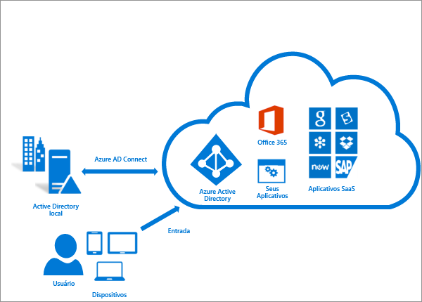
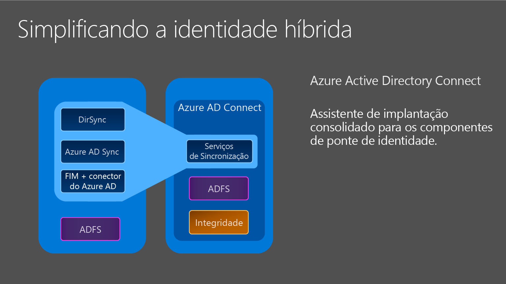

<properties
	pageTitle="Integrando suas identidades locais com o Azure Active Directory. | Microsoft Azure"
	description="Este é o Azure AD Connect que descreve o que ele é e por que usá-lo."
	services="active-directory"
	documentationCenter=""
	authors="andkjell"
	manager="stevenpo"
	editor="curtand"/>

<tags
	ms.service="active-directory"
	ms.workload="identity"
	ms.tgt_pltfrm="na"
	ms.devlang="na"
	ms.topic="get-started-article"
	ms.date="10/13/2015"
	ms.author="andkjell;billmath"/>

# Integração de suas identidades locais com o Active Directory do Azure
O Azure AD Connect é a ferramenta para integrar seu sistema de identidade local como o Active Directory do Windows Server com o Active Directory do Azure e conectar seus usuários ao Office 365, ao Azure e a milhares de aplicativos SaaS. Este tópico fornece um guia abrangente para preparar e implantar os componentes necessários para que os usuários finais acessem os serviços de nuvem com a mesma identidade que usam atualmente para acessar os aplicativos corporativos existentes.

## Por que usar o Azure AD Connect
A integração de seus diretórios locais ao AD do Azure torna os usuários mais produtivos ao fornecer uma identidade comum para acesso aos recursos na nuvem e locais. Com essa integração, os usuários e as organizações podem se beneficiar do seguinte:

- Os usuários podem usar uma única identidade para acessar aplicativos locais e serviços na nuvem, como o Office 365.

- Ferramenta única para fornecer uma experiência de implantação fácil de sincronização e entrada.

- Fornece os recursos mais recentes para seus cenários. O Azure AD Connect substitui as versões mais antigas das ferramentas de integração de identidade, como DirSync e Azure AD Sync. Para obter mais informações, confira [Comparação das ferramentas de integração de diretórios](active-directory-aadconnect-get-started-tools-comparison.md).

### Como o Azure AD Connect funciona

O Azure Active Directory Connect é composto de três partes principais. Elas são: os serviços de sincronização, a parte opcional de Serviços de Federação do Active Directory e a parte de monitoramento que é feita usando o [Azure AD Connect Health](active-directory-aadconnect-health.md).

 

- Sincronização - Esta parte é composta de componentes e funcionalidades lançados anteriormente, como [Dirsync e Azure AD Sync](active-directory-aadconnect-get-started-tools-comparison.md). Essa é a parte responsável pela criação de usuários e grupos. Ela também é responsável por garantir que as informações sobre usuários e grupos em seu ambiente local correspondam às da nuvem.
- AD FS - Esta é uma parte opcional do Azure AD Connect e pode ser usada para configurar um ambiente híbrido usando uma infraestrutura de AD FS local. Esta parte pode ser usada pelas organizações para abordar implantações complexas que incluem itens como SSO de ingresso no domínio, imposição de política de logon de AD e cartão inteligente ou MFA de terceiros.
- Monitoramento de Integridade - O Azure AD Connect Health pode fornecer monitoramento robusto de servidores do AD FS e fornecer um local central no portal do Azure para exibir essa atividade. Para obter informações adicionais, consulte [Azure Active Directory Connect Health](active-directory-aadconnect-health.md).

## Instalar o Azure AD Connect

Você pode encontrar o download para o Azure AD Connect no [Centro de Download da Microsoft.](http://go.microsoft.com/fwlink/?LinkId=615771).

| Solução | Cenário |
| ----- | ----- |
| [Configurações expressas](active-directory-aadconnect-get-started-express.md) | <li>Opção padrão e recomendada , se você tiver uma única floresta do AD.</li> <li>Entrada do usuário com a mesma senha usando a sincronização de senha.</li>
| [Configurações personalizadas](active-directory-aadconnect-get-started-custom.md) | <li>Usadas quando você tem várias florestas. Dá suporte a várias [topologias](active-directory-aadconnect-topologies.md) locais.</li> <li>Personalize sua opção de entrada, como o ADFS para federação, ou use um provedor de identidade de terceiros.</li> <li>Personalize os recursos de sincronização, como filtragem e write-back.</li>
| [Atualização do DirSync](active-directory-aadconnect-dirsync-upgrade-get-started.md) | <li>Se você tiver um servidor DirSync existente já em execução.</li>
| Atualização do Azure AD Sync | <li>Essa é uma atualização in-loco simples.</li>

[Após a instalação](active-directory-aadconnect-whats-next.md), verifique se ele está funcionando conforme o esperado e atribua licenças aos usuários.

### Próximas etapas para instalar o Azure AD Connect

| Tópico | |
| --------- | --------- |
| Hardware e pré-requisitos | [Azure AD Connect: hardware e pré-requisitos](active-directory-aadconnect-prerequisites.md) |
| Baixar o Azure AD Connect | [Baixar o Azure AD Connect](http://go.microsoft.com/fwlink/?LinkId=615771) |
| Instalar usando as Configurações expressas | [Instalação expressa do Azure AD Connect](active-directory-aadconnect-get-started-express.md) |
| Instalar usando Configurações personalizadas | [Instalação personalizada do Azure AD Connect](active-directory-aadconnect-get-started-custom.md) |
| Atualizar do DirSync | [Atualização da ferramenta de sincronização do Azure AD (DirSync)](active-directory-aadconnect-dirsync-upgrade-get-started.md) |
| Após a instalação | [Verifique a instalação e atribua licenças ](active-directory-aadconnect-whats-next.md) |

### Saiba mais sobre como instalar o Azure AD Connect

Você também deve se preparar para questões [operacionais](active-directory-aadconnectsync-operations.md). Talvez você queira ter um servidor em espera para que possa facilmente recorrer a ele em caso de [desastre](active-directory-aadconnectsync-operations.md#disaster-recovery). Se planeja fazer alterações de configuração frequentes, você deve planejar um servidor de [modo de preparo](active-directory-aadconnectsync-operations.md#staging-mode).

| Tópico | |
| --------- | --------- |
| Topologias com suporte | [Topologias para o Azure AD Connect](active-directory-aadconnect-topologies.md) |
| Conceitos de design | [Conceitos de design do Azure AD Connect](active-directory-aadconnect-design-concepts.md) |
| Contas usadas para instalação | [Mais informações sobre permissões e as credenciais de Conexão do AD do Azure](active-directory-aadconnect-accounts-permissions.md) |
| Planejamento operacional | [Sincronização do Azure AD Connect: considerações e tarefas operacionais](active-directory-aadconnectsync-operations.md) |

## Configurar recursos
O Azure Connect AD vem com vários recursos que você pode ativar opcionalmente ou que estão habilitados por padrão. Em alguns casos, alguns recursos podem exigir configuração adicional em certos cenários e topologias.

A [filtragem](active-directory-aadconnectsync-configure-filtering.md) é usada para limitar quais objetos são sincronizados ao Azure AD. Por padrão todos os usuários, contatos, grupos e computadores do Windows 10 são sincronizados, mas você pode limitar isso com base em domínios, UOs ou atributos.

A [sincronização de senha](active-directory-aadconnectsync-implement-password-synchronization.md) sincronizará o hash de senha no Active Directory para o Azure AD. Isso permite que o usuário use a mesma senha no local e na nuvem, mas a gerencie apenas em um único local. Como será usado seu Active Directory local, isso também permitirá que você use sua própria política de senha.

O [write-back de senha](active-directory-passwords-getting-started.md) permitirá aos usuários alterar e redefinir suas senhas na nuvem e ter sua política de senha local aplicada.

O [write-back do dispositivo](active-directory-aadconnect-get-started-custom-device-writeback.md) permitirá que um dispositivo registrado no Azure AD seja gravado de volta no Active Directory local, para que possa ser usado para acesso condicional.

O recurso [impedir exclusões acidentais](active-directory-aadconnectsync-feature-prevent-accidental-deletes.md) é ativado por padrão e protegerá seu diretório na nuvem contra muitas exclusões ao mesmo tempo. Por padrão, ele permitirá 500 exclusões por execução, e isso pode ser alterado, dependendo do porte de sua organização.

### Próximas etapas para configurar recursos

| Tópico | |
| --------- | --------- |
| Configurar a filtragem | [Sincronização do Azure AD Connect: configurar a filtragem](active-directory-aadconnectsync-configure-filtering.md) |
| Sincronização de senha | [Azure AD Connect Sync: implementar a sincronização de senha](active-directory-aadconnectsync-implement-password-synchronization.md) |
| Write-back de senha | [Introdução ao gerenciamento de senhas](active-directory-passwords-getting-started.md) |
| Write-back de dispositivo | [Habilitando write-back de dispositivo no Azure AD Connect](active-directory-aadconnect-get-started-custom-device-writeback.md) |
| Impedir exclusões acidentais | [Sincronização do Azure AD Connect: impedir exclusões acidentais](active-directory-aadconnectsync-feature-prevent-accidental-deletes.md) |

## Personalizar a sincronização do Azure AD Connect
A sincronização do Azure AD Connect vem com uma configuração padrão que se destina a funcionar para a maioria dos clientes e das topologias. Porém, sempre há situações em que a configuração padrão não funcionará e deve ser ajustada. Há suporte para fazer alterações, conforme documentado nesta seção e nos tópicos vinculados.

Se você não trabalhou com uma topologia de sincronização antes, convém começar a entender os conceitos básicos e os termos usados, conforme descrito em [conceitos técnicos](active-directory-aadconnect-technical-concepts.md). O Azure AD Connect é a evolução de MIIS2003, ILM2007 e FIM2010. Mesmo que algumas coisas sejam idênticas, também houve muitas mudanças.

A configuração pressupõe que pode haver mais de uma floresta na configuração. Nessas topologias, um objeto de usuário pode ser representado como um contato em outra floresta. O usuário também pode ter uma caixa de correio vinculada em outra floresta de recursos. O comportamento da configuração padrão é descrito em [usuários e contatos](active-directory-aadconnectsync-understanding-users-and-contacts.md).

O modelo de configuração em sincronização é chamado de [provisionamento declarativo](active-directory-aadconnectsync-understanding-declarative-provisioning-expressions.md). Os fluxos de atributo avançados estão usando [funções](active-directory-aadconnectsync-functions-reference.md) para expressar transformações de atributos. Você pode ver e examinar a configuração inteira usando ferramentas que vêm com o Azure AD Connect. Se você precisar fazer alterações na configuração, siga as [práticas recomendadas](active-directory-aadconnectsync-best-practices-changing-default-configuration.md) para que seja mais fácil adotar novas versões, conforme elas forem disponibilizadas.

### Próximas etapas para personalizar a sincronização do Azure AD Connect

| Tópico | |
| --------- | --------- |
| Conceitos técnicos | [Sincronização do Azure AD Connect: conceitos técnicos](active-directory-aadconnect-technical-concepts.md) |
| Noções básicas sobre usuários e contatos | [Azure AD Connect Sync: noções básicas sobre usuários e contatos](active-directory-aadconnectsync-understanding-users-and-contacts.md) |
| Provisionamento declarativo | [Azure AD Connect Sync: noções básicas sobre expressões de provisionamento declarativo](active-directory-aadconnectsync-understanding-declarative-provisioning-expressions.md) |
| Referência a funções de provisionamento declarativo | [Azure AD Connect Sync: referência de funções](active-directory-aadconnectsync-functions-reference.md) |
| Práticas recomendadas | [Práticas recomendadas para alterar a configuração padrão](active-directory-aadconnectsync-best-practices-changing-default-configuration.md) |

## Mais informações e referências

| Tópico | |
| --------- | --------- |
| Histórico de versão | [Histórico de versão](active-directory-aadconnect-version-history.md) |
| Comparar o DirSync, Azure ADSync e o Azure AD Connect | [Comparação de ferramentas de integração de diretório](active-directory-aadconnect-get-started-tools-comparison.md) |
| Atributos sincronizados | [Atributos sincronizados](active-directory-aadconnectsync-attributes-synchronized.md) |
| Monitorando com o Azure AD Connect Health | [Azure AD Connect Health](active-directory-aadconnect-health.md) |
| Perguntas frequentes | [Perguntas frequentes do Azure AD Connect](active-directory-aadconnect-faq.md) |

**Recursos adicionais**

Apresentação Ignite 2015 sobre como expandir seus diretórios locais para a nuvem.

[AZURE.VIDEO microsoft-ignite-2015-extending-on-premises-directories-to-the-cloud-made-easy-with-azure-active-directory-connect]

<!---HONumber=Oct15_HO3-->