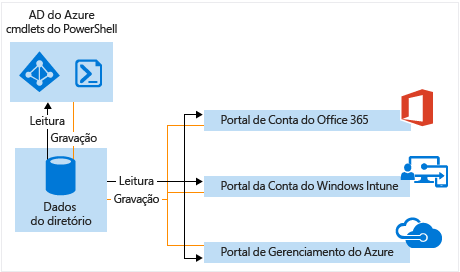

# Gerenciar seu diretório do Azure AD

## O que é um locatário AD Azure?
No Azure Active Directory (Azure AD), um locatário é uma instância dedicada de um diretório do Azure AD que sua organização recebe quando se inscreve em um serviço de nuvem da Microsoft, como o Azure ou Office 365. Cada diretório do Azure AD é distinto e separado de outros diretórios do Azure AD. Assim como um prédio de escritórios corporativos é um ativo seguro específico somente a sua organização, um diretório do Azure AD também foi projetado para ser um ativo seguro para ser usado somente por sua organização. A arquitetura do Azure AD isola os dados e as informações de identidade do cliente para que os usuários e administradores de um diretório do Azure AD não possam acessar acidentalmente ou maliciosamente dados em outro diretório.

## Como posso obter um diretório do Azure AD?
O Azure AD oferece os principais recursos de gerenciamento de diretório e de identidade por trás da maioria dos serviços de nuvem da Microsoft, incluindo:

* As tabelas
* Microsoft Office 365
* Microsoft Dynamics CRM Online
* Microsoft Intune

Você obtém um diretório do Azure quando se inscreve para qualquer um desses serviços em nuvem da Microsoft. Você pode criar diretórios adicionais conforme necessário. Por exemplo, você pode manter seu primeiro diretório como um diretório de produção e, em seguida, criar um outro diretório para teste ou preparo.

### Usar o diretório do Azure AD que vem com uma nova assinatura do Azure

É recomendável que você use a conta de administrador usada para seu primeiro serviço quando você se inscrever em outros serviços da Microsoft. As informações fornecidas na primeira vez que você se inscreve em um serviço da Microsoft são usadas para criar uma nova instância de diretório do Azure AD para sua organização. Se você usar esse diretório para autenticar tentativas de logon quando você se inscrever em outros serviços da Microsoft, eles podem usar as contas de usuário existentes, políticas, configurações ou integração de diretórios locais configurados no seu diretório padrão.

Por exemplo, se você se inscreve para uma assinatura do Microsoft Intune e, em seguida, sincronizar ainda mais o Active Directory local com o seu diretório do Azure AD, inscreva-se em outro serviço da Microsoft, como o Office 365 e obtenha facilmente os mesmos benefícios de integração de diretório que você já possui com o Microsoft Intune.

Para obter mais informações sobre como integrar seu diretório local ao Azure AD, consulte [Integração de diretório com o Azure AD Connect](active-directory-aadconnect.md).

### Associar um diretório existente do Azure AD a uma nova assinatura do Azure
Você pode associar uma nova assinatura do Azure ao mesmo diretório que autentica o logon para uma assinatura existente do Office 365 ou Microsoft Intune. Para obter mais informações sobre esse cenário, consulte [Transferir a propriedade de uma assinatura do Azure para outra conta](../billing/billing-subscription-transfer.md)

### Criar um diretório do Azure AD inscrevendo-se para um serviço de nuvem da Microsoft como uma organização
Se você ainda não tiver uma assinatura para um serviço de nuvem da Microsoft, você pode usar dos links a seguir para se inscrever. Ao inscrever-se no seu primeiro serviço um diretório do Azure AD automaticamente será criado automaticamente.

* [Microsoft Azure](https://account.azure.com/organization)
* [Office 365](http://products.office.com/business/compare-office-365-for-business-plans/)
* [Microsoft Intune](https://portal.office.com/Signup/Signup.aspx?OfferId=40BE278A-DFD1-470a-9EF7-9F2596EA7FF9&dl=INTUNE_A&ali=1#0%20)

### Como alterar o diretório padrão para uma assinatura

1. Entre no [Centro de Contas do Azure](https://account.windowsazure.com/Home/Index) com uma conta que seja o Administrador da Conta da assinatura para transferir a propriedade da assinatura.
2. Certifique-se de que o usuário que você deseja que seja o proprietário da assinatura esteja no diretório de destino.
3. Clique em **Transferir assinatura**.
4. Especifique o destinatário. O destinatário recebe automaticamente um email com um link de aceitação.
5. O destinatário clica no link e segue as instruções, incluindo inserir suas informações de pagamento. Quando o destinatário for bem-sucedido, a assinatura será transferida. 
6. Se a transferência de propriedade de assinatura for bem-sucedida, o diretório padrão da assinatura é alterado para o diretório onde o usuário está.

### Gerenciar o diretório padrão no Azure
Quando você se inscrever no Azure, um diretório do Azure AD padrão é associado à sua assinatura. Não há custos para usar o Azure AD e os diretórios são um recurso gratuito. Existem serviços do Azure AD pagos que são licenciados separadamente e fornecem funcionalidade adicional, como a identidade visual da empresa no momento do logon e redefinição de senha através de autoatendimento. Você também pode criar um domínio personalizado usando um nome DNS que você possui em vez do domínio padrão *.onmicrosoft.com.

## Como posso gerenciar dados de diretório?
Para administrar uma ou mais assinaturas de serviços de nuvem da Microsoft, você pode usar o [Centro de administração do Azure AD](https://aad.portal.azure.com), o portal de conta do Microsoft Intune ou o [Centro de Administração do Office 365](https://portal.office.com/) para gerenciar os dados de diretório da sua organização. Você também pode usar os [cmdlets do Azure Active Directory PowerShell](https://docs.microsoft.com/powershell/azure/active-directory) para ajudá-lo a gerenciar os dados armazenados no Azure AD.

A partir de qualquer um desses portais (ou cmdlets), você pode:

* Criar e gerenciar contas de usuário e de grupo
* Gerenciar serviços de nuvem relacionados das assinaturas da sua organização
* Configurar a integração local com os serviços de identidade e autenticação do Azure AD

O Centro de administração do Azure, o Centro de Administração do Office 365, o portal de conta do Microsoft Intune e os cmdlets do Azure AD realizam leituras e gravações a partir de uma única instância compartilhada do Azure AD que está associada ao diretório da sua organização. Cada uma dessas ferramentas age como uma interface de front-end que recebe e/ou modifica seus dados de diretório.

Quando você altera os dados da sua organização usando quaisquer dos portais ou cmdlets enquanto está conectado sob o contexto de um desses serviços, as alterações também são mostradas nos outros portais na próxima vez que você entrar. Esses dados são compartilhados entre os serviços de nuvem da Microsoft que você deseja assinar.

Por exemplo, se você usou o Centro de Administração do Office 365 para bloquear a conexão de um usuário, essa ação impedirá que o usuário faça logon em qualquer outro serviço ao qual sua organização esteja inscrita atualmente. Se você visualizar a mesma conta de usuário no portal de conta do Microsoft Intune, você também verá que o usuário está bloqueado.

## Como posso adicionar e gerenciar vários diretórios?
Você pode [adicionar um diretório do Azure AD no portal do Azure](https://portal.azure.com/#create/Microsoft.AzureActiveDirectory). Preencha as informações e selecione **Criar**.

Você pode gerenciar cada diretório como um recurso completamente independente: cada diretório é um par, com recursos completos e logicamente independente de outros diretórios que você gerencia; não há nenhuma relação de pai-filho entre os diretórios. Essa independência entre diretórios inclui independência de recursos, independência administrativa e independência de sincronização.

* **Independência de recursos**. Se você criar ou excluir um recurso em um diretório, ele não afeta nenhum recurso em outro diretório, com a exceção parcial de usuários externos. Se você usar um domínio personalizado "contoso.com" com um diretório, ele não pode ser usado com nenhum outro diretório.
* **Independência administrativa**.  Se um usuário que não é administrador do diretório "Contoso" criar um diretório de teste chamado "Teste", então:
  
  * Os administradores do diretório "Contoso" não têm privilégios administrativos diretos para o diretório "Teste", a menos que um administrador de "Teste" conceda especificamente esses privilégios a eles. Os administradores do "Contoso" podem controlar o acesso ao diretório "Teste" por meio de seu controle da conta do usuário que criou "Teste".
    
  * Se você atribuir ou remover uma função de administrador para um usuário em um diretório, a alteração não afeta nenhuma função de administrador que o usuário possa ter em outro diretório.
* **Independência de sincronização**. Você pode configurar cada locatário do Azure AD de maneira independente para sincronizar os dados de uma única instância da ferramenta de sincronização do diretório do Azure AD Connect.

Observe também que, ao contrário de outros recursos do Azure, seus diretórios não são recursos filho de uma assinatura do Azure. Então, se você cancelar ou permitir que a sua assinatura do Azure expire, ainda poderá acessar os dados de diretório usando o PowerShell do Azure AD, o Azure Graph API ou outras interfaces, como o Centro de Administração do Office 365. Você também pode associar outra assinatura ao diretório.

## Como preparar para excluir um diretório do Azure AD
Um administrador global pode excluir um diretório do Azure AD a partir do portal. Quando um diretório é excluído, todos os recursos que estão contidos no diretório também são excluídos. Verifique se você não precisa do diretório antes de excluí-lo.

> [!NOTE]
> Se o usuário estiver conectado com uma conta corporativa ou de estudante, ele não deve tentar excluir seu diretório base. Por exemplo, se o usuário estiver conectado como joe@contoso.onmicrosoft.com, esse usuário não poderá excluir o diretório que tiver contoso.onmicrosoft.com como seu domínio padrão.

O Azure AD requer que determinadas condições sejam atendidas para excluir um diretório. Isso reduz o risco de a exclusão de um diretório afetar negativamente os usuários ou aplicativos, como a capacidade dos usuários de entrar no Office 365 ou acessar recursos no Azure. Por exemplo, se um diretório para uma assinatura for acidentalmente excluído, então, os usuários não podem acessar os recursos do Azure para essa assinatura.

As seguintes condições são verificadas:

* O único usuário no diretório deve ser o administrador global, que excluirá o diretório. Quaisquer outros usuários devem ser excluídos antes que o diretório possa ser excluído. Se os usuários estiverem sincronizados no local, então a sincronização deve ser desativada e os usuários devem ser excluídos no diretório de nuvem usando o portal do Azure ou os cmdlets do Azure PowerShell. Não há nenhum requisito de excluir grupos ou contatos, tais como contatos adicionados a partir do Centro de Administração do Office 365.
* Não pode haver nenhum aplicativo no diretório. Qualquer aplicativo deve ser excluído antes que o diretório possa ser excluído.
* Nenhum provedor de autenticação multifator pode ser vinculado ao diretório.
* Não pode haver assinaturas para Microsoft Online Services, como o Microsoft Azure, Office 365 ou Azure AD Premium associadas ao diretório. Por exemplo, se um diretório padrão tiver sido criado para você no Azure, você não poderá excluir esse diretório se sua assinatura do Azure ainda depender desse diretório para autenticação. Da mesma forma, você não pode excluir um diretório se outro usuário tiver associado uma assinatura a ele. 

## Próximas etapas
* [Fórum do Azure AD](https://social.msdn.microsoft.com/Forums/home?forum=WindowsAzureAD)
* [Fórum de autenticação multifator do Azure](https://social.msdn.microsoft.com/Forums/home?forum=windowsazureactiveauthentication)
* [Perguntas do Stack Overflow para Azure](http://stackoverflow.com/questions/tagged/azure)
* [Azure Active Directory PowerShell](https://docs.microsoft.com/powershell/azure/active-directory)
* [Atribuindo funções de administrador no Azure AD](active-directory-assign-admin-roles.md)

