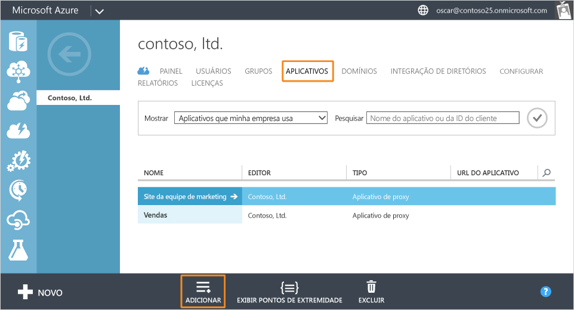
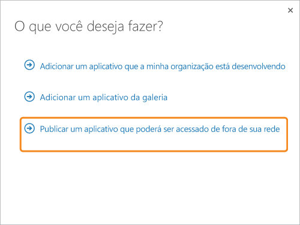
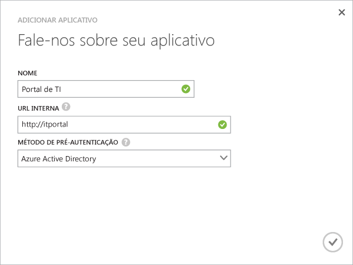
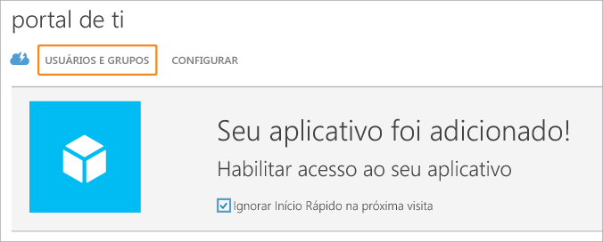
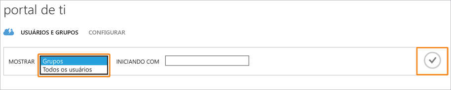
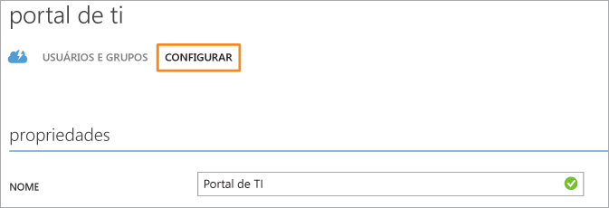

# Publicar aplicativos usando o Proxy de Aplicativo do AD do Azure

> [!div class="op_single_selector"]
> * [Portal do Azure](application-proxy-publish-azure-portal.md)
> * [Portal clássico do Azure](active-directory-application-proxy-publish.md)

O Proxy de Aplicativo do Azure AD o ajuda a dar suporte a funcionários remotos publicando aplicativos locais para serem acessados via Internet. Nesse ponto, você já deve ter [habilitado o Proxy de Aplicativo no portal clássico do Azure](active-directory-application-proxy-enable.md). Este artigo explica as etapas para publicar aplicativos que estão em execução em sua rede local e fornecer acesso remoto seguro de fora de sua rede. Depois de concluir este artigo, você estará pronto para configurar o aplicativo com informações personalizadas ou requisitos de segurança.

> [!NOTE]
> O Proxy de Aplicativo é um recurso que está disponível somente se você tiver atualizado para a edição Premium ou Básica do Active Directory do Azure. Para obter mais informações, consulte [Edições do Active Directory do Azure](active-directory-editions.md).
> 
> 

## Publicar um aplicativo usando o assistente
1. Entre como administrador no [portal clássico do Azure](https://manage.windowsazure.com/).
2. Acesse o Active Directory e selecione o diretório no qual você habilitou o Proxy de Aplicativo.
   
    
3. Clique na guia **Aplicativos** e no botão **Adicionar** na parte inferior da tela
   
    
4. Selecione **Publicar um aplicativo que estará acessível fora de sua rede**.
   
    
5. Forneça as seguintes informações sobre o aplicativo:
   
   * **Nome**: o nome amigável para o aplicativo. Ele deve ser exclusivo dentro no diretório.
   * **URL interna**: o endereço que o Conector de Proxy de Aplicativo usa para acessar o aplicativo dentro de sua rede privada. Você pode fornecer um caminho específico no servidor back-end para publicar, enquanto o restante do servidor é não publicado. Assim, você pode publicar sites diferentes no mesmo servidor e dar a cada um deles seu próprio nome e suas regras de acesso.
     
     > [!TIP]
     > Se você publicar um caminho, verifique se ele inclui todas as imagens, scripts e folhas de estilo necessários para seu aplicativo. Por exemplo, se seu aplicativo está em https://seuaplicativo/app e usa imagens localizadas em https://seuaplicativo/media, você deve publicar https://seuaplicativo/ como o caminho.
     > 
     > 
   * **Método de pré-autenticação**: como o Proxy de Aplicativo verifica os usuários antes de lhes dar acesso ao aplicativo. Escolha uma das opções no menu suspenso.
     
     * Azure Active Directory: o Proxy de Aplicativo redireciona os usuários para entrar com o Azure AD, que autentica as permissões para o diretório e o aplicativo.
     * Passagem: os usuários não precisam ser autenticados para acessar o aplicativo.
     
       
6. Para concluir o assistente, clique na marca de seleção na parte inferior da tela. O aplicativo agora está definido no AD do Azure.

## Atribuir usuários e grupos ao aplicativo
Para que os usuários acessem o aplicativo publicado, você precisa atribuí-los individualmente ou em grupos. (Lembre-se também de atribuir acesso a si mesmo.) Isso requer que cada usuário tenha uma licença para o Azure Basic ou superior. Você pode atribuir licenças individualmente ou em grupos. Veja [Atribuir usuários a um aplicativo](active-directory-applications-guiding-developers-assigning-users.md) para obter mais detalhes. 

Para aplicativos que exigem pré-autenticação, isso concede permissões para usar o aplicativo. Para aplicativos que não exigem pré-autenticação, os usuários ainda podem ser atribuídos ao aplicativo para que ele apareça na lista de aplicativos, como MyApps.

1. Após concluir o assistente Adicionar Aplicativo, você verá a página de Início Rápido para o aplicativo. Para gerenciar quem tem acesso ao aplicativo, selecione **Usuários e grupos**.
   
    
2. Pesquise grupos específicos no diretório ou mostre todos os usuários. Para exibir os resultados da pesquisa, clique na marca de seleção.
   
      
3. Selecione cada usuário ou grupo que você deseja atribuir a esse aplicativo e clique em **Atribuir**. Será solicitado que você confirme essa ação.

> [!NOTE]
> Para aplicativos de autenticação integrada do Windows, você pode atribuir apenas usuários e grupos que são sincronizados do Active Directory local. Usuários que entram com uma conta da Microsoft e convidados não podem ser atribuídos para aplicativos publicados com o Proxy de Aplicativo do Azure Active Directory. Verifique se os usuários estão entrando com as credenciais que fazem parte do mesmo domínio que o aplicativo sendo publicado.
> 
> 

## Testar seu aplicativo publicado
Depois de publicar seu aplicativo, você pode testá-lo navegando até a URL que você publicou. Verifique se você pode acessá-lo, se ele faz a renderização corretamente e se tudo funciona conforme o esperado. Se você tiver problemas ou receber uma mensagem de erro, tente o [guia de solução de problemas](active-directory-application-proxy-troubleshoot.md).

## Configurar seu aplicativo
Na página Configurar você pode modificar aplicativos publicados ou configurar opções avançadas. Nessa página, você pode personalizar o aplicativo alterando o nome ou carregando um logotipo,  além de poder gerenciar também as regras de acesso, como o método de pré-autenticação ou a autenticação multifator.

Depois de publicar aplicativos usando o Proxy de Aplicativo do Active Directory do Azure, eles aparecerão na lista de aplicativos do AD do Azure e será possível gerenciá-los de lá.

Se você desabilitar os serviços do Proxy de Aplicativo depois de publicar aplicativos, eles não poderão mais ser acessados de fora da rede privada. Isso não exclui os aplicativos.

Para exibir um aplicativo e verificar se ele está acessível, clique duas vezes no nome do aplicativo. Se o serviço do Proxy de Aplicativo estiver desabilitado e o aplicativo não estiver disponível, uma mensagem de aviso será exibida na parte superior da tela.

Para excluir um aplicativo, selecione-o na lista e clique em **Excluir**.

## Próximas etapas
* [Publicar aplicativos usando seu próprio nome de domínio](active-directory-application-proxy-custom-domains.md)
* [Habilitar o logon único](active-directory-application-proxy-sso-using-kcd.md)
* [Habilitar o acesso condicional](active-directory-application-proxy-conditional-access.md)
* [Trabalho com aplicativos com reconhecimento de declaração](active-directory-application-proxy-claims-aware-apps.md)

Para ver as últimas notícias e atualizações, confira o [blog Application Proxy](http://blogs.technet.com/b/applicationproxyblog/)

<!--HONumber=Jan17_HO2-->

