<properties
   pageTitle="Passo a passo detalhado usando a visualização de colaboração B2B do Active Directory do Azure| Microsoft Azure"
   description="A B2B do e diretório ativo do Active Directory do Azure suporta as relações entre empresas, permitindo que os parceiros de negócios acessem seletivamente seus aplicativos corporativos"
   services="active-directory"
   authors="viv-liu"
   manager="cliffdi"
   editor=""
   tags=""/>

<tags
   ms.service="active-directory"
   ms.devlang="NA"
   ms.topic="article"
   ms.tgt_pltfrm="NA"
   ms.workload="identity"
   ms.date="10/27/2015"
   ms.author="viviali"/>

# Passo a passo detalhado usando a visualização de colaboração B2B do Active Directory do Azure (AD do Azure)
Este passo a passo descreve como usar a colaboração B2B do AD do Azure. Como administradores de TI da Contoso, queremos compartilhar aplicativos com funcionários de três empresas parceiras. Nenhuma das empresas parceiras precisa ter o AD do Azure.

- Alice da Simple Partners Org
- Carlos, da Medium Partner Org, precisa ter acesso a um conjunto de aplicativos
- Brenda, da Complex Partner Org, precisa ter acesso a um conjunto de aplicativos e à associação em grupos na Contoso

Após o envio de convites a usuários de parceiros, podemos configurá-los no AD do Azure para conceder acesso aos aplicativos e associação a grupos por meio do portal do Azure. Vamos começar pela adição de Alice.

## Adicionando Alice ao diretório da Contoso
1. Crie um arquivo .csv com os cabeçalhos, conforme mostrado, preenchendo apenas o **Email**, **DisplayName** e **InviteContactUsUrl** de Alice. **DisplayName** é o nome que será exibido no convite e também o nome que será exibido no diretório do AD do Azure da Contoso. **InviteContactUsUrl** é uma maneira de Alice entrar em contato com a Contoso. No exemplo a seguir, é especificado o perfil da Contoso no LinkedIn. É importante que os títulos na primeira linha do arquivo .csv estejam na mesma ordem e escritos da mesma forma, conforme mostrado. Consulte a seção Formato CSV abaixo. 

2. No portal do Azure, adicionar um usuário no diretório da Contoso (Active Directory > Contoso > Usuários > Adicionar Usuário). Na lista suspensa "Tipo de Usuário", selecione "Usuários em empresas parceiras". Carregue o arquivo .csv. Feche o arquivo .csv antes do carregamento. 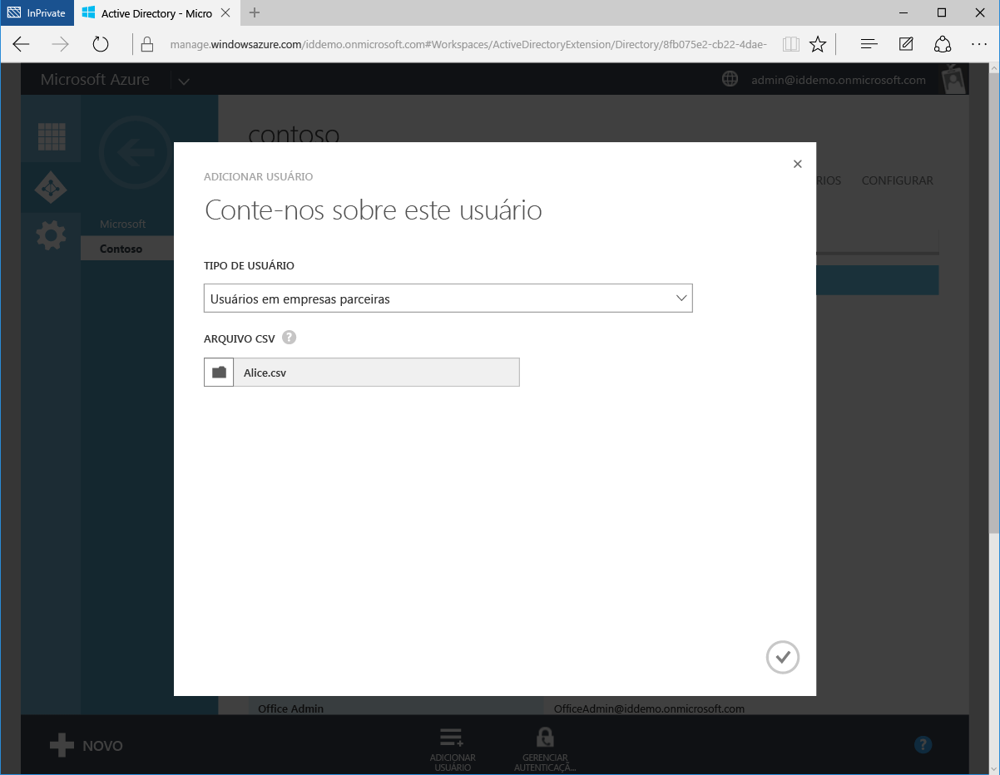

3. Alice agora é representada como um Usuário Externo no diretório do AD do Azure da Contoso. 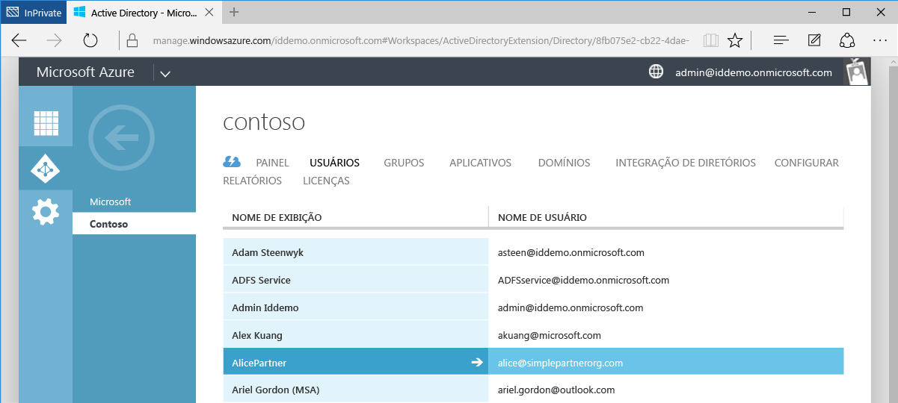

4. Do ponto de vista de Alice, ela receberá o email a seguir. 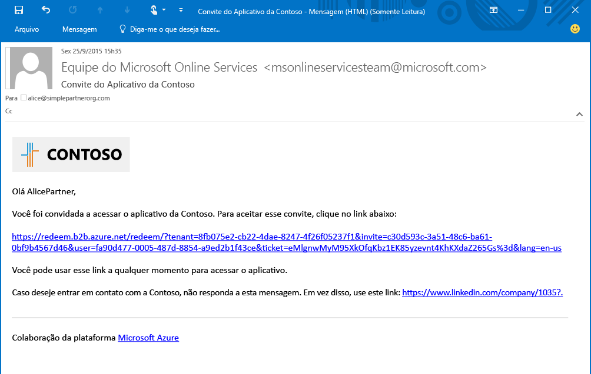

5. Alice clica no link e deverá aceitar o convite e fazer logon usando suas credenciais corporativas. Se Alice não estiver no diretório do AD do Azure, ela precisará se inscrever. 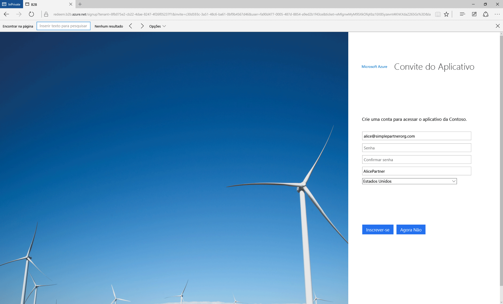

6. Alice é redirecionada para o Painel de Acesso do Aplicativo, vazio até que ela tenha acesso aos aplicativos. 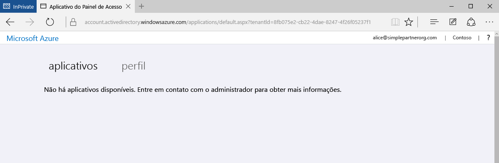

Essa é a forma mais simples de colaboração B2B. Como uma usuária no diretório do AD do Azure da Contoso, Alice pode ter acesso a aplicativos e grupos por meio do portal do Azure. Agora vamos adicionar Carlos, que precisa de acesso aos aplicativos Moodle e Salesforce.

## Adicionar de Carlos ao diretório da Contoso e conceder acesso aos aplicativos
1. Use o Windows PowerShell com o módulo do AD do Azure instalado para encontrar as IDs de aplicativo Moodle e Salesforce. As IDs podem ser recuperadas usando o cmdlet: `Get-MsolServicePrincipal | fl DisplayName, AppPrincipalId` Isso abre uma lista de todos os aplicativos disponíveis na Contoso e suas AppPrincialIds. 

2. Crie o arquivo .csv, preenchendo Email, DisplayName, **InviteAppID**, **InviteAppResources** e InviteContactUsUrl de Carlos. **InviteAppResources** é preenchido com a AppPrincipalIds do Moodle e da Salesforce encontradas a partir do PowerShell, separadas por um espaço. Isso é mostrado acima, na captura de tela do PowerShell, com as IDs destacadas nas caixas verde e azul. **InviteAppId** é preenchido com a mesma AppPrincipalId do Moodle para marcar as páginas de email e conexão. 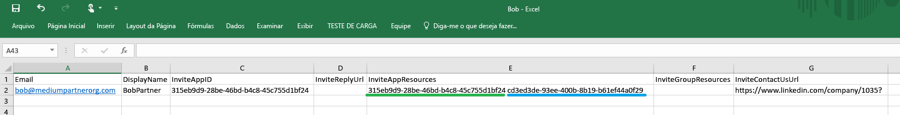

3. Carregue o arquivo .csv por meio do Portal do Azure assim como foi feito para Alice. Carlos agora é representado como uma usuário externo no diretório do AD do Azure da Contoso.

4. Carlos receberá o seguinte email. 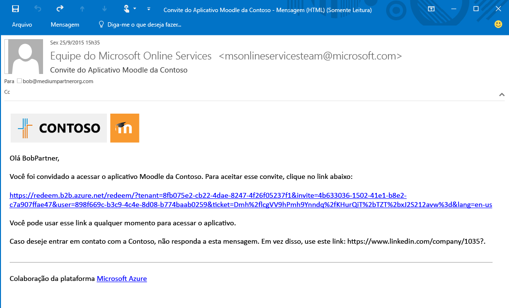

5. Carlos clica no link e é solicitado a aceitar o convite. Após conectar, ele é direcionado para o Painel de Acesso e já pode usar o Moodle e o Salesforce. 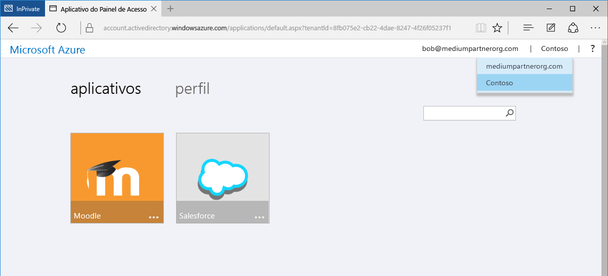

Adicionaremos Brenda em seguida, que precisa de acesso aos aplicativos, bem como a associação de grupos no diretório da Contoso.

## Adicionar Brenda ao diretório da Contoso, conceder acesso aos aplicativos e permitir a associação de grupo

1. Use o Windows PowerShell com o módulo do AD do Azure instalado para encontrar as IDs do aplicativo e as IDs de grupo da Contoso.
 - Recupere AppPrincipalId usando o cmdlet `Get-MsolServicePrincipal | fl DisplayName, AppPrincipalId`, assim como foi feito para Carlos
 - Recupere a ObjectId para grupos usando o cmdlet `Get-MsolGroup | fl DisplayName, ObjectId` Isso abre uma lista de todos os grupos da Contoso e suas ObjectIds. IDs de grupo também podem ser recuperadas como a ID de objeto na guia Propriedades do grupo no portal do Azure. 

2. Crie o arquivo .csv, preenchendo Email, DisplayName, InviteAppID, InviteAppResources, **InviteGroupResources** e InviteContactUsUrl de Brenda. **InviteGroupResources** é preenchida pelas ObjectIds dos grupos MeuGrupo1 e Externos, separados por um espaço. 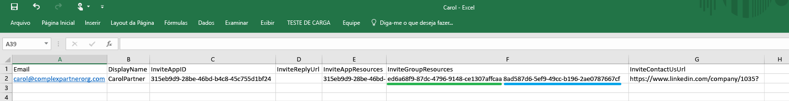

3. Carregue o arquivo .csv por meio do portal do Azure.

4. Brenda é uma usuária no diretório da Contoso e também é um membro dos grupos MeuGroupo1 e Externos, como visto no portal do Azure. 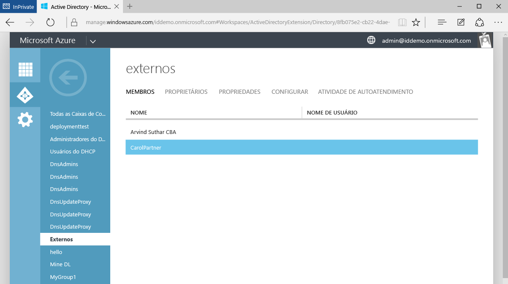

5. Brenda receberá um email contendo um link para aceitar o convite. Após conectar, ela será redirecionada para o Painel de Acesso de Aplicativo para ter acesso ao Moodle e ao Salesforce.

Isso é tudo que há para adicionar usuários de empresas parceiras em colaboração B2B do AD do Azure. Este passo a passo demonstrou a adição de Alice, Carlos e Brenda a três arquivos .csv separados, mas na verdade podem ser adicionados em conjunto a um arquivo .csv único para ser mais simples. 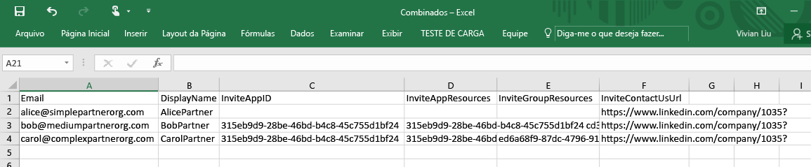

## Artigos relacionados
Procure nossos outros artigos sobre a colaboração B2B do AD do Azure:

- [O que é a colaboração B2B do AD do Azure?](active-directory-b2b-what-is-azure-ad-b2b.md)
- [Como funciona](active-directory-b2b-how-it-works.md)
- [Referência do formato de arquivo CSV](active-directory-b2b-references-csv-file-format.md)
- [Formato do token de usuário externo](active-directory-b2b-references-external-user-token-format.md)
- [Alterações de atributo do objeto de usuário externo](active-directory-b2b-references-external-user-object-attribute-changes.md)
- [Limitações de visualização atuais](active-directory-b2b-current-preview-limitations.md)

<!---HONumber=Nov15_HO1-->