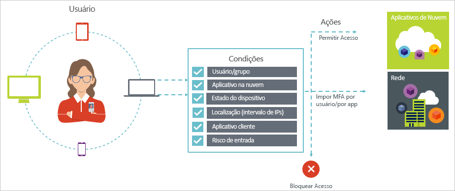

# Acesso condicional no Azure Active Directory

Segurança é uma grande preocupação para organizações que usam a nuvem. Um aspecto importante da segurança em nuvem é a identidade e o acesso quando o assunto é gerenciar os recursos em nuvem. Em um mundo primeiro o dispositivo móvel e a nuvem, os usuários podem acessar os recursos da organização usando uma grande variedade de dispositivos e aplicativos de qualquer lugar. Por causa disso, concentrar-se apenas em quem pode acessar um recurso não é mais suficiente. Para dominar o equilíbrio entre segurança e produtividade, os profissionais de TI também precisam considerar como um recurso está sendo acessado em uma decisão de controle de acesso. Com acesso condicional do Azure AD, você pode atender a esse requisito. Acesso condicional é um recurso do Azure Active Directory que permite impor controles sobre o acesso a aplicativos no ambiente com base em condições específicas em um local central. 

Este artigo apresenta uma visão geral conceitual do acesso condicional no Azure AD.

## Cenários comuns

Em um mundo móvel e em nuvem, o Azure Active Directory permite o logon único para dispositivos, aplicativos e serviços de qualquer lugar. Com a proliferação de dispositivos (incluindo BYOD), trabalho fora de redes corporativas e aplicativos de SaaS de terceiros, os profissionais de TI têm duas metas opostas:

- Capacitar os usuários para serem produtivos sempre e em qualquer lugar
- Proteger os ativos corporativos a qualquer momento

Usando políticas de acesso condicional, você pode aplicar os controles de acesso certos nas condições necessárias. O acesso condicional do AD Azure oferece segurança adicional quando necessário e fica fora do caminho do usuário quando não o é. 

Abaixo estão algumas preocupações de acesso comuns em que o acesso condicional pode ajudar:

- **[Risco de entrada](active-directory-conditional-access-conditions.md#sign-in-risk)**: o Azure AD Identity Protection detecta riscos de entrada. Como você restringe o acesso caso um risco de entrada detectado indique um mau ator? E se você quisesse obter uma prova mais sólida de que uma entrada foi realmente realizada pelo usuário legítimo, ou a dúvida é forte o suficiente para até mesmo bloquear o acesso de usuários específicos a um aplicativo?

- **[Local de rede](active-directory-conditional-access-locations.md)**: o Azure AD é acessível de qualquer lugar. E se uma tentativa de acesso for realizada em um local de rede que não esteja sob o controle do departamento de TI? O uso de uma combinação de nome de usuário e senha pode ser bom o suficiente como prova de identidade para tentativas de acesso aos recursos da rede corporativa. E se você exigir uma prova de identidade mais forte para tentativas de acesso iniciadas de outros países ou regiões do mundo inesperados? E se você ainda quiser bloquear tentativas de acesso de determinados locais?  

- **[Gerenciamento de dispositivos](active-directory-conditional-access-conditions.md#device-platforms)**: no Azure AD, os usuários podem acessar aplicativos em nuvem em uma grande variedade de dispositivos, inclusive dispositivos para dispositivos móveis e também pessoais. E se você exigir que uma tentativa de acesso só deva ser realizada por um usuário com dispositivos gerenciados pelo departamento de TI? E se você ainda quiser bloquear determinados tipos de dispositivo de acessar aplicativos em nuvem no ambiente? 

- **[Aplicativo cliente](active-directory-conditional-access-conditions.md#client-apps)**: atualmente, você pode acessar muitos aplicativos em nuvem usando tipos de aplicativos diferentes, como aplicativos baseados na web, aplicativos móveis ou aplicativos da área de trabalho. E se uma tentativa de acesso for realizada usando-se um tipo de aplicativo cliente que causa problemas conhecidos? E se você precisar de um dispositivo gerenciado pelo departamento de TI para determinados tipos de aplicativo? 

Essas perguntas e as respostas relacionadas representam cenários de acesso comuns para acesso condicional do Azure AD. Acesso condicional é um recurso do Azure Active Directory que permite processar cenários de acesso usando uma abordagem baseada em política.

## Políticas de acesso condicional

Política de acesso condicional é a definição de um cenário de acesso que usa o seguinte padrão:

**Em seguida, isso** define a resposta da política. É importante observar que o objetivo de uma política de acesso condicional não é conceder acesso a um aplicativo de nuvem. No Azure AD, a concessão do acesso a aplicativos de nuvem é assunto de atribuições do usuário. Com uma política de acesso condicional, você controla como usuários autorizados (usuários que receberam acesso a um aplicativo de nuvem) podem acessar aplicativos de nuvem em condições específicas. Na resposta, você impõe requisitos adicionais, como autenticação multifator, um dispositivo gerenciado e outros. No contexto de acesso condicional do Azure AD, os requisitos que a política impõe são chamados de controles de acesso. Na formulário mais restritiva, a política pode bloquear o acesso. Para obter mais informações, consulte [Controles de acesso no acesso condicional do Azure Active Directory](active-directory-conditional-access-controls.md).
     

**Quando isso acontece** define o motivo de disparar a política. Esse motivo é caracterizado por um grupo de condições que foram atendidas. No acesso condicional do Azure AD, as duas condições de atribuição desempenham um papel especial:

- **[Usuários](active-directory-conditional-access-conditions.md#users-and-groups)**: os usuários que realizam uma tentativa de acesso (**Quem**). 

- **[Aplicativos de nuvem](active-directory-conditional-access-conditions.md#cloud-apps)**: os destinos de uma tentativa de acesso (**O quê**).    

Essas duas condições são obrigatórias em uma política de acesso condicional. Além das duas condições obrigatórias, você também pode incluir condições adicionais que descrevam como a tentativa de acesso é realizada. Os exemplos comuns estão usando dispositivos móveis ou locais que estejam fora da rede corporativa. Para saber mais, confira [Condições no acesso condicional do Azure Active Directory](active-directory-conditional-access-conditions.md).   

A combinação de condições e seus controles de acesso representa uma política de acesso condicional. 

Com o acesso condicional do Azure AD, você pode controlar como os usuários autorizados podem acessar seus aplicativos na nuvem. O objetivo de uma política de acesso condicional é impor controles de acesso adicionais em uma tentativa de acesso a um aplicativo de nuvem controlado por como uma tentativa de acesso é realizada.

Uma vantagem de usar uma abordagem baseada em política para proteger o acesso aos aplicativos de nuvem é poder começar esboçando os requisitos de política para o ambiente usando a estrutura descrita neste artigo, sem se preocupar com a implementação técnica. 

## Próximas etapas

- Se você quiser saber mais sobre:
    - Condições, consulte [Condições no acesso condicional do Azure Active Directory](active-directory-conditional-access-conditions.md).

    - Controles de acesso, consulte [Controles de acesso no acesso condicional do Azure Active Directory](active-directory-conditional-access-controls.md).

- Se você quiser experimentar a configuração de políticas de acesso condicionais, consulte [Introdução ao acesso condicional no Azure Active Directory](active-directory-conditional-access-azure-portal-get-started.md).

- Se você estiver pronto para configurar políticas de acesso condicional para seu ambiente, confira as [melhores práticas para o acesso condicional no Azure Active Directory](active-directory-conditional-access-best-practices.md). 
