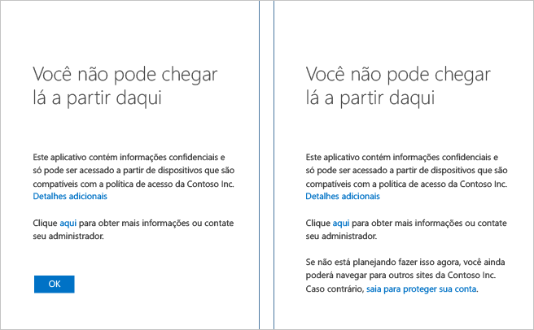
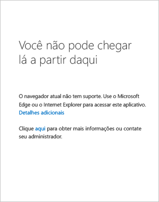

<properties
	pageTitle="Correção de usuário ao acessar aplicativos protegidos com acesso condicional baseado em dispositivo do Azure AD | Microsoft Azure"
	description="Este tópico o ajuda a identificar se há etapas de correção que possa seguir para acessar o aplicativo desejado."
	services="active-directory"
	keywords="acesso condicional baseado em dispositivo, registro de dispositivo, habilitar registro de dispositivo, registro de dispositivo e MDM"
	documentationCenter=""
	authors="markusvi"
	manager="femila"
	editor=""/>

<tags
	ms.service="active-directory"
	ms.workload="identity"
	ms.tgt_pltfrm="na"
	ms.devlang="na"
	ms.topic="get-started-article"
	ms.date="08/15/2016"
	ms.author="markvi"/>

# Correção de usuário ao acessar aplicativos protegidos com acesso condicional baseado em dispositivos do Azure AD

Você obteve uma página de acesso negado ao acessar um aplicativo como o SharePoint Online do Office 365. Agora, o que fazer?

Este guia o ajuda a identificar se há etapas de correção que possa seguir para acessar o aplicativo desejado.

Em qual plataforma de dispositivos o dispositivo está sendo executado? A resposta a essa pergunta determina a seção certa neste tópico para você:
 

-	Dispositivo Windows

-	Dispositivo iOS (iPhone ou iPad)

-	Dispositivo Android

## Acesso por meio de um dispositivo Windows

Se o dispositivo for do Windows 10, Windows 8.1, Windows 8.0, Windows 7, Windows Server 2016, Windows Server 2012 R2, Windows Server 2012 ou Windows Server 2008 R2, escolha a causa apropriada, identificando a página que você obteve ao tentar acessar o aplicativo.

### O dispositivo não está registrado

Se o dispositivo não estiver registrado no Azure Active Directory e o aplicativo estiver protegido com uma política baseada em dispositivo, você poderá ver uma página com o seguinte conteúdo:

 

Se o dispositivo for unido ao domínio para o Active Directory de sua organização, você poderá tentar o seguinte:

1.	Verifique se você está conectado ao Windows usando sua conta corporativa (conta do Active Directory).

2.	Conecte-se à rede corporativa por meio de VPN ou Acesso Direto.

3.	Quando você estiver conectado, bloqueie a sessão do Windows usando a tecla Windows + a tecla 'L'.

4.	Desbloqueie a sessão do Windows inserindo as credenciais de sua conta corporativa.

5.	Aguarde um minuto e tente acessar o aplicativo novamente.

6.	Se você obtiver a mesma página, contate o administrador e forneça os detalhes depois de clicar no link 'Mais detalhes'.

Se o dispositivo não estiver unido ao domínio e executar o Windows 10, você terá duas opções:

1. Executar o Ingresso do Azure AD
2. Adicione sua conta corporativa ou de estudante ao Windows.

Para obter informações sobre as diferenças entre os dois, confira [Usando dispositivos Windows 10 em seu local de trabalho](active-directory-azureadjoin-windows10-devices.md).

Para executar o Ingresso do Azure AD, faça o seguinte (não disponível no Windows Phone):

**Atualização de Aniversário do Windows 10**

1.	Inicie o aplicativo Configurações.

2.	Vá para 'Contas' e, depois, para 'Acessar trabalho ou escola'.

3.	Clique em 'Conectar'.

4.	Escolha 'Unir este dispositivo ao Azure AD' na parte inferior da página.

5.	Autentique para sua organização, forneça comprovação MFA, se necessário, e siga as etapas até a conclusão.

6.	Saia e entre usando sua conta corporativa.

7.	Tente acessar o aplicativo novamente.

**Atualização do Windows de 10 de novembro de 2015**

1.	Inicie o aplicativo Configurações.

2.	Vá para 'Sistema' e, depois, para 'Sobre'.
	
3.	Clique em 'Ingresso do Azure AD'.

4.	Autentique para sua organização, forneça comprovação MFA, se necessário, e siga as etapas até a conclusão.

5.	Saia e entre usando sua conta corporativa (conta do Azure AD).

6.	Tente acessar o aplicativo novamente.

Para adicionar sua conta corporativa ou de estudante, faça o seguinte:

**Atualização de Aniversário do Windows 10**

1.	Inicie o aplicativo Configurações.

2.	Vá para 'Contas' e, depois, para 'Acessar trabalho ou escola'.

3.	Clique em 'Conectar'.

4.	Autentique para sua organização, forneça comprovação MFA, se necessário, e siga as etapas até a conclusão.

5.	Tente acessar o aplicativo novamente.

**Atualização do Windows de 10 de novembro de 2015**
	
1.	Inicie o aplicativo Configurações.
2.	Vá para 'Contas' e para 'Suas contas'.
3.	Clique em 'Adicionar conta corporativa ou de estudante'.
4.	Autentique para sua organização, forneça comprovação MFA, se necessário, e siga as etapas até a conclusão.
5.	Tente acessar o aplicativo novamente.

Se o dispositivo não estiver unido ao domínio e executar o Windows 8.1, você poderá executar o Workplace Join e registrar-se no Microsoft Intune fazendo o seguinte:

1.	Inicie as Configurações do PC.

2.	Vá para 'Rede' e, em seguida, 'Local de Trabalho'.

3.	Clique em 'Ingressar'.

4.	Autentique para sua organização, forneça comprovação MFA, se necessário, e siga as etapas até a conclusão.

5.	Clique em 'Ativar'.

6.	Aguarde a conclusão.

7.	Tente acessar o aplicativo novamente.

## Navegador sem suporte

Se estiver acessando o aplicativo por meio dos navegadores a seguir, você verá uma página semelhante à página mostrada abaixo:

1.	Chrome, Firefox ou outro navegador que não seja o Microsoft Edge ou o Microsoft Internet Explorer no Windows 10 ou no Windows Server 2016.

2.	Firefox no Windows 8.1, Windows 7, Windows Server 2012 R2, Windows Server 2012 ou Windows Server 2008 R2.
 

A única correção é usar um navegador com suporte para a plataforma de dispositivo.

## Acesso por meio de um dispositivo iOS

Confira regularmente para obter instruções para iPhones ou iPads.

## Acesso por meio de um dispositivo Android

Confira novamente em breve para obter instruções para telefones ou tablets Android.

## Próximas etapas

[Acesso condicional ao Azure Active Directory](active-directory-conditional-access.md)

<!---HONumber=AcomDC_0817_2016-->