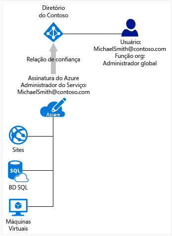

# Como as assinaturas do Azure são associadas ao Azure Active Directory
Este artigo aborda informações sobre a relação entre uma assinatura do Azure e o Azure Active Directory (Azure AD).

## Relação da sua assinatura do Azure com o Azure AD
A sua assinatura do Azure tem uma relação de confiança com o Azure AD, o que significa que ela confia no diretório para autenticar usuários, serviços e dispositivos. Várias assinaturas podem confiar no mesmo diretório, mas cada assinatura confia em apenas um diretório. 

Essa relação de confiança que uma assinatura tem com um diretório é diferente da relação que uma assinatura tem com todos os outros recursos no Azure (sites, bancos de dados e assim por diante). Se uma assinatura expira, o acesso aos outros recursos associados à assinatura também é interrompido. Mas o diretório permanece no Azure e você pode associar outra assinatura a ele e continuar a gerenciar os usuários do diretório.

O Azure AD não funciona como outros serviços da sua assinatura do Azure. Outros serviços do Azure são subordinados à assinatura do Azure. Mas o que você vê no Azure AD não varia com base na assinatura. Permite acesso a diretórios com base no usuário conectado.

Todos os usuários têm um único diretório inicial que os autentica, mas eles também podem ser convidados em outros diretórios. No Azure AD, você pode ver somente os diretórios dos quais a sua conta de usuário é um membro. Um diretório também pode ser sincronizado com o Active Directory local.

## Azure AD e assinaturas do serviço de nuvem
O Azure AD oferece os principais recursos de gerenciamento de diretório e de identidade por trás da maioria dos serviços de nuvem da Microsoft, incluindo:

* As tabelas
* Microsoft Office 365
* Microsoft Dynamics CRM Online
* Microsoft Intune

Você obtém o serviço gratuito do Azure AD quando se inscreve em qualquer um desses serviços de nuvem da Microsoft. Se você deseja adicionar uma assinatura do Azure adicional para um diretório do Azure AD, você pode fazer isso apenas se estiver conectado com uma conta da Microsoft. Por exemplo, se você se inscrever no Azure usando uma conta da Microsoft e também se inscrever em um serviço de nuvem diferente da Microsoft usando uma conta corporativa ou de estudante, você tem duas instâncias do Azure AD:
1. O diretório padrão da sua assinatura do Azure. Você pode adicionar outra assinatura do Azure a este diretório ou a outros diretórios que você criar se estiver conectado com uma conta da Microsoft, porque você pode ser autenticado pelo Azure.
2. O diretório inicial da sua conta corporativa ou de estudante. Se você tiver entrado no Azure com uma conta corporativa ou de estudante, você não pode adicionar uma assinatura do Azure a um diretório existente, porque sua conta corporativa ou de estudante não pode ser autenticada diretamente pelo Azure. 
 
Para saber mais sobre como alterar administradores para uma assinatura do Azure, consulte [Transferir a propriedade de uma assinatura do Azure para outra conta](../billing/billing-subscription-transfer.md)

## Sugestões para gerenciar uma assinatura e um diretório
As funções administrativas para uma assinatura do Azure gerenciam recursos vinculados à assinatura do Azure. Esta seção explica as diferenças entre os administradores de assinatura do Azure e os administradores de diretório do Azure AD. Funções administrativas e outras sugestões para usá-las para gerenciar sua assinatura estão descritas em [Atribuindo funções de administrador no Azure Active Directory](active-directory-assign-admin-roles.md).

Por padrão, a função de administrador de serviços é atribuída a você quando você se inscreve. Se outros usuários precisarem entrar e acessar serviços usando a mesma assinatura, você pode adicioná-los como coadministradores. 

O AD do Azure tem um conjunto diferente de funções administrativas para gerenciar o diretório e os recursos relacionados à identidade. Por exemplo, o administrador global de um diretório pode adicionar usuários e grupos ao diretório ou exigir autenticação multifator para usuários. A função de administrador global é atribuída a um usuário que cria um diretório e ele pode atribuir funções administrativas a outros usuários. Funções administrativas do AD do Azure também são usadas por outros serviços, como o Office 365 e Microsoft Intune. 

Mas o ponto importante aqui é que os administradores de assinatura do Azure e os administradores de diretório do Azure AD são duas funções separadas. 
* Os administradores de assinatura do Azure podem gerenciar recursos no Azure e podem usar o Azure AD no portal do Azure (porque o portal do Azure em si é um recurso do Azure). 
* Os administradores de diretório podem gerenciar propriedades somente no diretório do Azure AD.

Uma pessoa pode desempenhar ambas as funções, mas isso não é obrigatório. A função de administrador global do diretório pode ser atribuída a um usuário, mas não é possível atribuir a esse usuário as funções de administrador ou coadministrador de serviços de uma assinatura do Azure. Sem ser um administrador da assinatura, o usuário pode entrar no portal do Azure, mas não é possível gerenciar os diretórios para essa assinatura no portal. Esse usuário pode gerenciar diretórios usando outras ferramentas como o Azure AD PowerShell ou o Centro de Administração do Office 365.

## Próximas etapas
* Para saber mais sobre como alterar administradores para uma assinatura do Azure, consulte [Transferir a propriedade de uma assinatura do Azure para outra conta](../billing/billing-subscription-transfer.md)
* Para saber mais sobre como o acesso aos recursos é controlado no Microsoft Azure, confira [Noções básicas sobre o acesso aos recursos do Azure](active-directory-understanding-resource-access.md)
* Para saber sobre como atribuir funções no AD do Azure, veja [Atribuindo funções de administrador no Active Directory do Azure](active-directory-assign-admin-roles-azure-portal.md)

<!--Image references-->
[1]: ./media/active-directory-how-subscriptions-associated-directory/WAAD_PassThruAuth.png
[2]: ./media/active-directory-how-subscriptions-associated-directory/WAAD_OrgAccountSubscription.png
[3]: ./media/active-directory-how-subscriptions-associated-directory/WAAD_SignInDisambiguation.PNG

