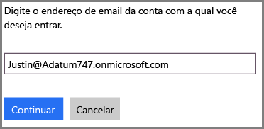
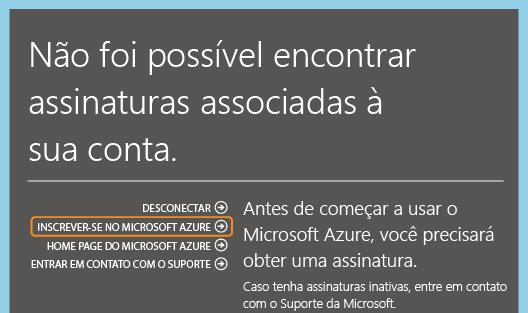
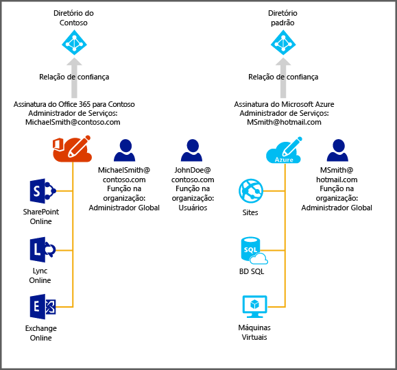

<properties
   pageTitle="Gerenciar o diretório para sua assinatura do Office 365 no Azure | Microsoft Azure"
   description="Gerenciando um diretório de conta de assinatura do Office 365 usando o Active Directory do Azure e o portal clássico do Azure"
   services="active-directory"
   documentationCenter=""
   authors="curtand"
   manager="stevenpo"
   editor=""/>

<tags
   ms.service="active-directory"
   ms.devlang="na"
   ms.topic="get-started-article"
   ms.tgt_pltfrm="na"
   ms.workload="identity"
   ms.date="05/16/2016"
   ms.author="curtand"/>

#Gerenciar o diretório para sua assinatura do Office 365 no Azure

Este artigo descreve como gerenciar um diretório criado para uma assinatura do Office 365 no portal clássico do Azure. As etapas para fazer isso diferem dependendo de você já ter uma assinatura do Azure. Você deve ser o administrador de serviços ou o coadministrador de uma assinatura do Azure para entrar no portal clássico do Azure.

Se ainda não tiver uma assinatura do Azure, você precisa inscrever-se usando a mesma conta corporativa ou de estudante que você usa para entrar no Office 365.

Uma assinatura correspondente para o Azure não será localizada, mas você pode clicar em **Inscrever-se no Azure** e as informações relevantes da conta do Office 365 serão preenchidas no formulário de inscrição. A mesma conta será atribuída à função de administrador de serviços por padrão.

Depois de concluir a assinatura do Azure, você pode entrar no portal clássico do Azure e acessar serviços do Azure. Clique na extensão do Active Directory para gerenciar o mesmo diretório que autentica os usuários do Office 365.

Se você já tiver uma assinatura do Azure, o processo para gerenciar um diretório adicional também é simples. O diagrama a seguir pode ajudar a ilustrar o processo.

Neste exemplo, Michael Smith tem uma assinatura do Office 365 para Contoso.com. Ele tem uma assinatura do Azure na qual se inscreveu usando sua conta da Microsoft, msmith@hotmail.com. Nesse caso, ele gerencia dois diretórios.

| Assinatura | Office 365 | As tabelas |
|  -------------- | ------------- | ------------------------------- |
| Nome de exibição | Contoso | Diretório padrão |
| Nome de domínio | contoso.com | msmithhotmail.onmicrosoft.com |

Ele deseja gerenciar as identidades de usuário no diretório Contoso enquanto está conectado ao Azure usando sua conta da Microsoft, para que possa habilitar os recursos do Azure AD, como a autenticação multifator.

Nesse caso, os dois diretórios são independentes um do outro.

##Para gerenciar dois diretórios independentes
Para que Michael Smith gerencie os dois diretórios enquanto está inscrito no Azure como msmith@hotmail.com, ele precisa concluir as etapas a seguir:

> [AZURE.NOTE]
Essas etapas só podem ser realizadas quando o usuário está conectado com uma conta da Microsoft. Se o usuário estiver conectado com uma conta corporativa ou de estudante, a opção **Usar diretório existente** não estará disponível porque uma conta corporativa ou de estudante pode ser autenticada apenas por seu diretório-base (ou seja, o diretório em que a conta corporativa ou de estudante é armazenada, e que é propriedade da corporação ou instituição educacional).

1.	Entre no portal clássico do Azure como msmith@hotmail.com.
2.	Clique em **Novo** > **Serviços de Aplicativos** > **Active Directory** > **Diretório** > **Criação Personalizada**.
3.	Clique em Usar diretório existente e marque a caixa de seleção **Estou pronto para sair agora**.
4.	Entre no portal clássico do Azure como administrador global de Contoso.onmicrosoft.com (por exemplo, msmith@contoso.com).
5.	Quando for solicitado a **Usar diretório Contoso com o Azure?**, clique em **Continuar**.
6.	Clique em **Sair agora**.
7.	Entre no portal clássico do Azure como msmith@hotmail.com. O diretório da Contoso e o diretório padrão aparecem na extensão do Active Directory.

Depois de concluir essas etapas, msmith@hotmail.com é um administrador global no diretório Contoso.

##Para administrar recursos como administrador global
Agora vamos supor que John Doe precise entrar no portal clássico do Azure e administrar os recursos do banco de dados e sites que estão associados com a assinatura do Azure de msmith@hotmail.com. Para fazer isso, Michael Smith precisa concluir estas etapas adicionais:

1.	Entrar no portal clássico do Azure usando a conta de administrador de serviços da assinatura do Azure (neste exemplo, msmith@hotmail.com).
2.	Transferir a assinatura para o diretório Contoso: clique em **Configurações** > **Assinaturas** > selecione a assinatura > **Editar diretório** > selecione **Contoso (Contoso.com)**. Como parte da transferência, qualquer conta de trabalho ou escola que atuar como coadministrador da assinatura será removida.
3.	Adicionar John Doe como coadministrador da assinatura: clique em **Configurações** > **Administradores** > selecione a assinatura > **Adicionar** > digite * **JohnDoe@Contoso.com**.

##Próximas etapas
Para obter mais informações sobre a relação entre assinaturas e diretórios, consulte [Como uma assinatura é associada a um diretório](active-directory-how-subscriptions-associated-directory.md).

<!---HONumber=AcomDC_0518_2016-->