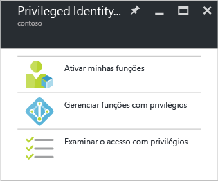

# Introdução ao Azure AD Privileged Identity Management
Com o Privileged Identity Management do Azure Active Directory (AD), você pode gerenciar, controlar e monitorar o acesso em sua organização. Isso inclui o acesso a recursos no Azure AD e outros serviços online da Microsoft, como o Office 365 ou o Microsoft Intune.

Este artigo lhe mostra como adicionar o aplicativo do Azure AD PIM o painel do portal do Azure.

## Adicionar o aplicativo Privileged Identity Management
Antes de usar o Azure AD Privileged Identity Management, você precisa adicionar o aplicativo ao painel do portal do Azure.

1. Entre no [portal do Azure](https://portal.azure.com/) como um administrador global do seu diretório.
2. Se sua organização tiver mais de um diretório, selecione seu nome de usuário no canto superior direito do portal do Azure. Selecione o diretório onde você usará o PIM.
3. Selecione **Mais serviços** e use a caixa de texto Filtrar para procurar **Azure AD Privileged Identity Management**.
4. Marque **Fixar no painel** e então clique em **Criar**. O aplicativo Privileged Identity Management é aberto.

Se você for a primeira pessoa a usar o Azure AD Privileged Identity Management em seu diretório, o [assistente segurança](active-directory-privileged-identity-management-security-wizard.md) o guia pela experiência de atribuição inicial. Depois disso, você se tornará automaticamente o primeiro **Administrador de segurança** e um **Administrador de função com privilégios** do diretório. Somente um administrador com função privilegiada pode acessar esse aplicativo para gerenciar o acesso de outros administradores.  

## Navegue até as tarefas
Depois que o Azure AD Privileged Identity Management estiver configurado, você verá a folha de navegação sempre que abrir o aplicativo. Use essa folha para realizar suas tarefas de gerenciamento de identidade.

* **Ativar minhas funções** leva à lista de funções atribuídas a você. É aqui que você ativará as funções para as quais está qualificado.
* **Gerenciar funções privilegiadas** é o painel onde os administradores de função com privilégios gerenciam atribuições de função, alteram configurações de ativação de função, iniciam revisões de acesso e muito mais. As opções desse painel estão desabilitadas para todos que não forem administradores de função com privilégios.
* **Examinar acesso privilegiado** leva você a qualquer revisão de acesso pendente que tenha de ser concluída, esteja você examinando o acesso para si mesmo ou para outra pessoa. 

<!--Every topic should have next steps and links to the next logical set of content to keep the customer engaged-->
## Próximas etapas
A [visão geral do Azure AD Privileged Identity Management](active-directory-privileged-identity-management-configure.md) inclui mais detalhes sobre como você pode gerenciar o acesso administrativo em sua organização.

[!INCLUDE [active-directory-privileged-identity-management-toc](../../includes/active-directory-privileged-identity-management-toc.md)]

<!--Image references-->

[1]: ./media/active-directory-privileged-identity-management-configure/PIM_EnablePim.png

<!--HONumber=Nov16_HO2-->

