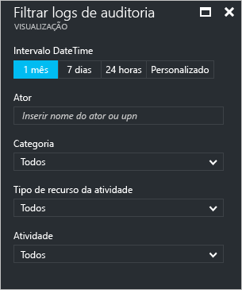
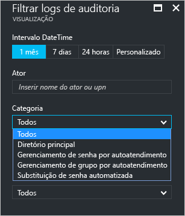
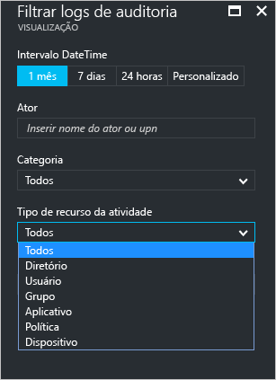
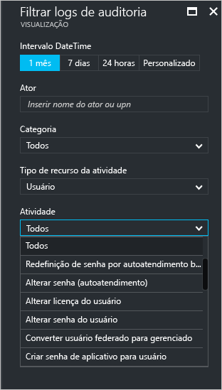
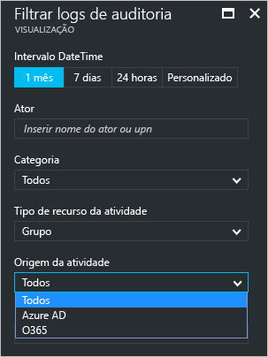

# Auditoria de relatórios de atividade no portal do Azure Active Directory – versão prévia

Com o relatório na [versão prévia](active-directory-preview-explainer.md) do Azure Active Directory, você obtém todas as informações de que precisa para determinar como seu ambiente está se comportando.

A arquitetura de relatório no Azure Active Directory consiste nos seguintes componentes:

- **Atividade** 
    - **Atividades de entrada** – informações sobre o uso de aplicativos gerenciados e de atividades de entrada do usuário
    - **Logs de auditoria** – informações de atividade do sistema sobre o gerenciamento de usuários e de grupos, sobre os aplicativos gerenciados e sobre as atividades de diretório.
- **Segurança** 
    - **Entradas arriscadas** - uma entrada arriscada é um indicador para uma tentativa de logon que pode ter sido realizada por alguém que não é o proprietário legítimo de uma conta de usuário. Para obter mais detalhes, veja Entradas de risco.
    - **Usuários sinalizados para riscos** - um usuário arriscado é um indicador de uma conta de usuário que pode ter sido comprometida. Para obter mais detalhes, consulte Usuários sinalizados para risco.

Este tópico fornece uma visão geral das atividades de auditoria.
 
## Logs de auditoria

Os logs de auditoria no Azure Active Directory fornecem registros de atividades do sistema para fins de conformidade.

Há três categorias principais de auditoria de atividades relacionadas no portal do Azure:

- Usuários e grupos   

- aplicativos

- Diretório   

Para obter uma lista completa de atividades de relatório de auditoria, consulte o [lista de eventos de relatório de auditoria](active-directory-reporting-audit-events.md#list-of-audit-report-events).

O ponto de entrada para todos os dados de auditoria é **Logs de auditoria**, na seção **Atividade** do **Azure Active Directory**.

Um log de auditoria tem um modo de exibição de lista que mostra os atores (*quem*), as atividades (*o que*) e os destinos.

Ao clicar em um item na exibição de lista, você poderá obter mais detalhes sobre ele.

## Logs de auditoria de usuários e grupos

Com relatórios de auditoria baseados em grupos e usuários, você pode obter respostas a perguntas como:

- Que tipos de atualizações foram aplicadas os usuários?

- Quantos usuários foram alterados?

- Quantas senhas foram alteradas?

- O que um administrador fez em um diretório?

- Quais são os grupos que foram adicionados?

- Existem grupos com alterações de associação?

- Os proprietários do grupo foram alterados?

- Quais licenças foram atribuídas a um grupo ou a um usuário?

Se você quiser examinar os dados de auditoria relacionados aos usuários e aos grupos, poderá encontrar uma exibição filtrada em **Logs de auditoria** na seção **Atividade** de **Usuários e Grupos**.

## Logs de auditoria de aplicativo
Com relatórios de auditoria baseados em aplicativos, você pode obter respostas a perguntas como:

* Quais aplicativos foram adicionados ou atualizados?
* Quais aplicativos foram removidos?
* Um princípio de serviço para um aplicativo foi alterado?
* Os nomes de aplicativos foram alterados?
* Quem deu permissão a um aplicativo?

Se você quiser examinar os dados de auditoria relacionados aos aplicativos, poderá encontrar uma exibição filtrada em **Logs de auditoria** na seção **Atividade** de **Aplicativos empresariais**.

## Filtragem de logs de auditoria
Você pode filtrar entradas para limitar a quantidade de dados exibidos, usando os campos a seguir:

- Data e hora

- Nome UPN do ator

- Categoria

- Tipo de recurso de atividade

- Atividade

O filtro **Categoria** permite restringir o escopo de seu relatório de auditoria com base nas seguintes categorias:

- Diretório principal

- Gerenciamento de senhas de auto-atendimento

- Gerenciamento de grupos de autoatendimento

- Substituição de senha automática 

O conteúdo da lista **Tipo de recurso de atividade** está vinculado ao seu ponto de entrada para esta folha.  
Se o ponto de entrada for o Azure Active Directory, essa lista conterá todos os tipos de atividade possíveis:

- Diretório

- Usuário

- Agrupar 

- Aplicativo 

- Política

- Dispositivo

As atividades listadas são delimitadas por tipo de atividade.
Por exemplo, se você tiver **Usuário** selecionado como **Tipo de Atividade**, a lista **Atividade** conterá apenas atividades relacionadas ao grupo.   

Se você selecionar **Grupo** como **Tipo de Atividade**, obterá outra opção de filtro que também permite filtrar com base nas seguintes **Fontes de Atividade**:

- AD do Azure

- O365

Outro método para filtrar as entradas de um log de auditoria é procurar itens específicos.

## Próximas etapas
Veja o [Guia de relatórios do Azure Active Directory](active-directory-reporting-guide.md).

