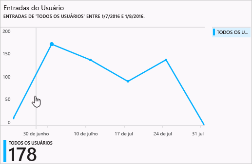

# Relatórios de atividades de entrada no portal do Azure Active Directory – versão prévia

Com o relatório na [versão prévia](active-directory-preview-explainer.md) do Azure Active Directory, você obtém todas as informações de que precisa para determinar como seu ambiente está se comportando.

A arquitetura de relatório no Azure Active Directory consiste nos seguintes componentes:

- **Atividade** 
    - **Atividades de entrada** – informações sobre o uso de aplicativos gerenciados e de atividades de entrada do usuário
    - **Logs de auditoria** – informações de atividade do sistema sobre o gerenciamento de usuários e de grupos, sobre os aplicativos gerenciados e sobre as atividades de diretório.
- **Segurança** 
    - **Entradas arriscadas** - uma entrada arriscada é um indicador para uma tentativa de logon que pode ter sido realizada por alguém que não é o proprietário legítimo de uma conta de usuário. Para obter mais detalhes, veja Entradas de risco.
    - **Usuários sinalizados para riscos** - um usuário arriscado é um indicador de uma conta de usuário que pode ter sido comprometida. Para obter mais detalhes, consulte Usuários sinalizados para risco.

Este tópico fornece uma visão geral das atividades de entrada.

## Atividades de entrada

Com as informações fornecidas pelo relatório de entrada de usuário, você encontra respostas para perguntas como:

* O que é o padrão de entrada de um usuário?
* Quantos usuários entraram em uma semana?
* Qual é o status dessas entradas?

O ponto de entrada para esses dados é o gráfico de entrada do usuário na seção **Visão geral** em **Usuários e grupos**.

 

O gráfico de entrada do usuário mostra agregações semanais de entradas para todos os usuários em um determinado período de tempo. O padrão para o período é de 30 dias.

Quando você clica em um dia no gráfico de entradas, obtém uma lista detalhada das atividades de entrada.

Cada linha na lista de atividades de entrada oferece as informações detalhadas sobre a entrada selecionada, como:

* Quem entrou?
* Qual era o UPN relacionado?
* Qual aplicativo era o destino da entrada?
* Qual é o endereço IP da entrada?
* Qual era o status da entrada?

## Uso de aplicativos gerenciados

Com uma exibição centrada no aplicativo de seus dados de entrada, você pode responder a perguntas como:

* Quem está usando meus aplicativos?
* Quais são os três principais aplicativos em sua organização?
* Recentemente, eu implantei um aplicativo. Como ele está se saindo?

Seu ponto de entrada para esses dados é composto pelos três principais aplicativos em sua organização no relatório dos 30 últimos dias, presente na seção **Visão geral**, em **Aplicativos empresariais**.

 

As agregações semanais ao gráfico de uso do aplicativo de entradas para seus três principais aplicativos em um determinado período de tempo. O padrão para o período é de 30 dias.

Se desejar, você pode definir o foco em um aplicativo específico.

Quando você clica em um dia no gráfico de uso do aplicativo, pode obter uma lista detalhada das atividades de entrada.

A opção **Entradas** oferece uma visão geral completa de todos os eventos de entrada para seus aplicativos.

Usando o seletor de coluna, você pode selecionar os campos de dados que deseja exibir.

## Filtragem de entradas
Você pode filtrar entradas para limitar a quantidade de dados exibidos, usando os campos a seguir:

* Data e hora 
* Nome UPN do usuário
* Nome do aplicativo
* Nome do cliente
* Status de entrada

Outro método para filtrar as entradas das atividades de entrada é procurar itens específicos.
O método search permite que você defina o escopo de suas entradas em torno de **usuários**, **grupos** ou **aplicativos** específicos.

## Próximas etapas
Veja o [Guia de relatórios do Azure Active Directory](active-directory-reporting-guide.md).

