<properties
   pageTitle="Relatórios do Azure Active Directory - visualização | Microsoft Azure"
   description="Lista os diversos relatórios disponíveis na visualização do Azure Active Directory"
   services="active-directory"
   documentationCenter=""
   authors="markusvi"
   manager="femila"
   editor=""/>

<tags
   ms.service="active-directory"
   ms.devlang="na"
   ms.topic="get-started-article"
   ms.tgt_pltfrm="na"
   ms.workload="identity"
   ms.date="09/30/2016"
   ms.author="markvi"/>

# Relatórios do Azure Active Directory - visualização

> [AZURE.SELECTOR]
- [Portal do Azure](active-directory-reporting-azure-portal.md)
- [Portal clássico do Azure](active-directory-reporting-guide.md)

*Esta documentação é parte do [Guia de Relatórios do Active Directory do Azure](active-directory-reporting-guide.md).*

Com o relatório na visualização do Azure Active Directory, você obtém todas as informações de que precisa determinar como seu ambiente está se comportando. [O que há na visualização?](active-directory-preview-explainer.md)

Há duas áreas principais de relatórios:

- **Atividades de entrada** – informações sobre o uso de aplicativos gerenciados e de atividades de entrada do usuário

- **Logs de auditoria** - informações de auditoria sobre o gerenciamento de usuários e de grupos, os aplicativos gerenciados e as atividades de diretório

Dependendo do escopo dos dados que você estiver procurando, será possível acessar esses relatórios clicando em **Usuários e grupos** ou em **Aplicativos empresariais** na lista de serviços no [portal do Azure](https://portal.azure.com).

## Atividades de entrada

### Atividades de entrada do usuário

Com as informações fornecidas pelo relatório de entrada de usuário, você encontra respostas para perguntas como:

- O que é o padrão de entrada de um usuário?
- Quantos usuários entraram em uma semana?
- Qual é o status dessas entradas?

O ponto de entrada para esses dados é o gráfico de entrada do usuário na seção **Visão geral** em **Usuários e grupos**.

 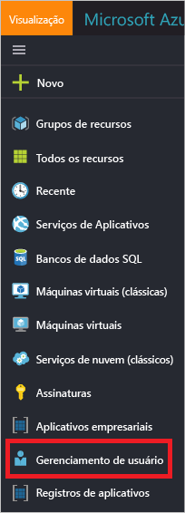

O gráfico de entrada do usuário mostra agregações semanais de entradas para todos os usuários em um determinado período de tempo. O padrão para o período é de 30 dias.

Quando você clica em um dia no gráfico de entradas, obtém uma lista detalhada das atividades de entrada.

Cada linha na lista de atividades de entrada oferece as informações detalhadas sobre a entrada selecionada, como:

- Quem entrou?

- Qual era o UPN relacionado?

- Qual aplicativo era o destino da entrada?

- Qual é o endereço IP da entrada?

- Qual era o status da entrada?

### Uso de aplicativos gerenciados

Com uma exibição centrada no aplicativo de seus dados de entrada, você pode responder a perguntas como:

- Quem está usando meus aplicativos?

- Quais são os três principais aplicativos em sua organização?

- Recentemente, eu implantei um aplicativo. Como ele está se saindo?

Seu ponto de entrada para esses dados é composto pelos três principais aplicativos em sua organização no relatório dos 30 últimos dias, presente na seção **Visão geral**, em **Aplicativos empresariais**.

 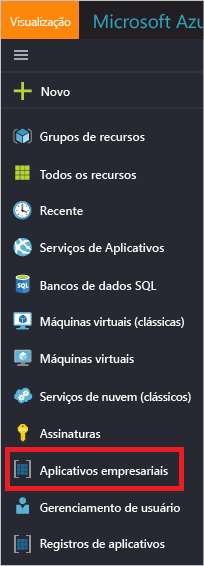

As agregações semanais ao gráfico de uso do aplicativo de entradas para seus três principais aplicativos em um determinado período de tempo. O padrão para o período é de 30 dias.

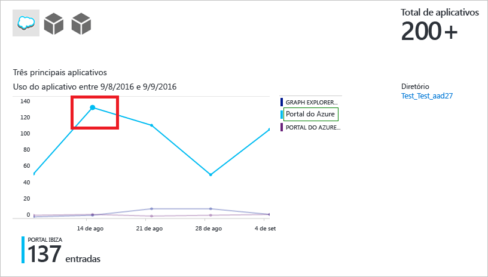

Se desejar, você pode definir o foco em um aplicativo específico.

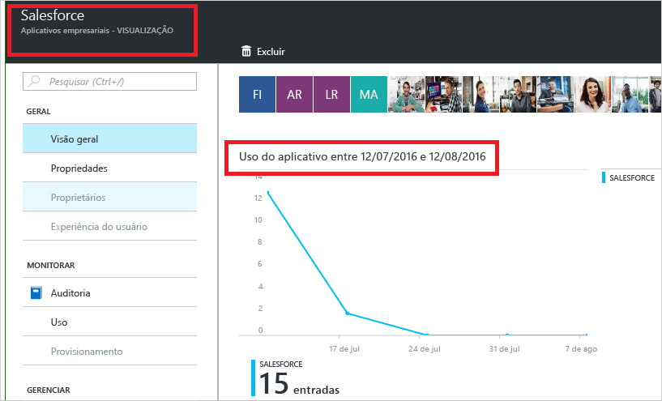

Quando você clica em um dia no gráfico de uso do aplicativo, pode obter uma lista detalhada das atividades de entrada.

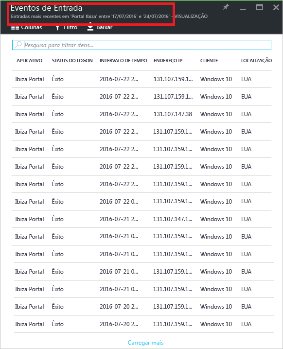

A opção **Entradas** oferece uma visão geral completa de todos os eventos de entrada para seus aplicativos.

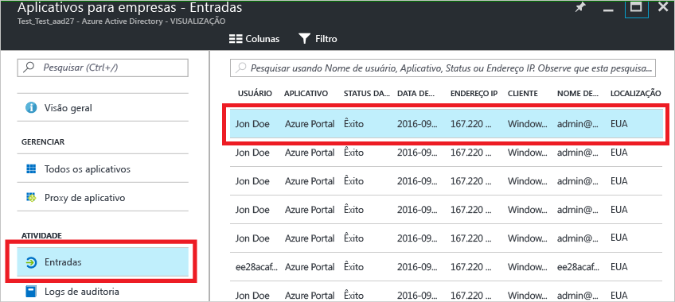

Usando o seletor de coluna, você pode selecionar os campos de dados que deseja exibir.

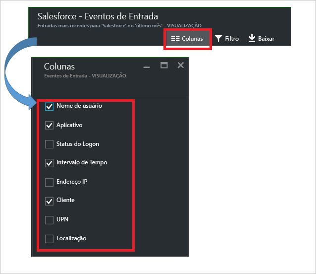

### Filtragem de entradas

Você pode filtrar entradas por um intervalo de tempo para limitar a quantidade de dados exibidos.

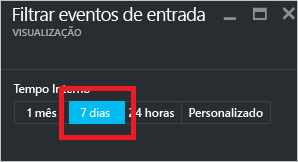

Outro método para filtrar as entradas das atividades de entrada é procurar itens específicos. O método search permite que você defina o escopo de suas entradas em torno de **usuários**, de **grupos** ou de **aplicativos** específicos.

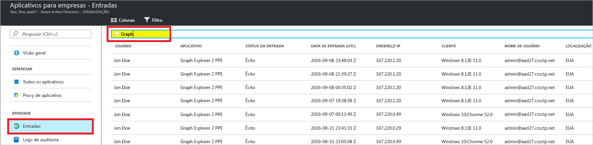

## Logs de auditoria

Os logs de auditoria no Azure Active Directory fornecem registros de atividades do sistema para fins de conformidade.

Há três categorias principais de auditoria de atividades relacionadas no portal do Azure:

- Usuários e grupos

- Aplicativos

- Diretório

Para obter uma lista completa de atividades de relatório de auditoria, consulte o [lista de eventos de relatório de auditoria](active-directory-reporting-audit-events.md#list-of-audit-report-events).

O ponto de entrada para todos os dados de auditoria é **Logs de auditoria**, na seção **Atividade** do **Azure Active Directory**.

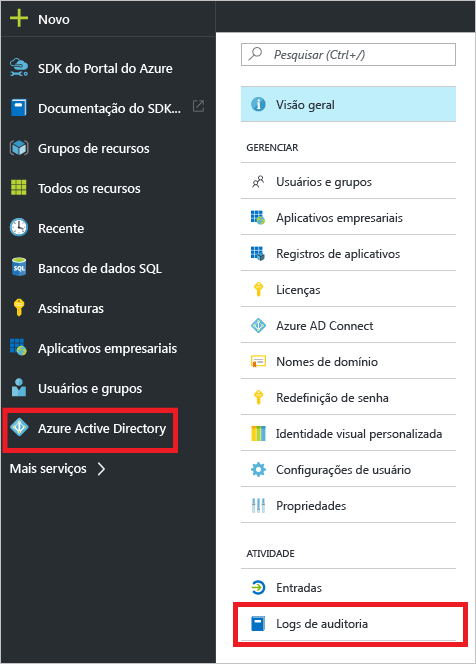

Um log de auditoria tem um modo de exibição de lista que mostra os atores (quem), as atividades (o que) e os destinos.

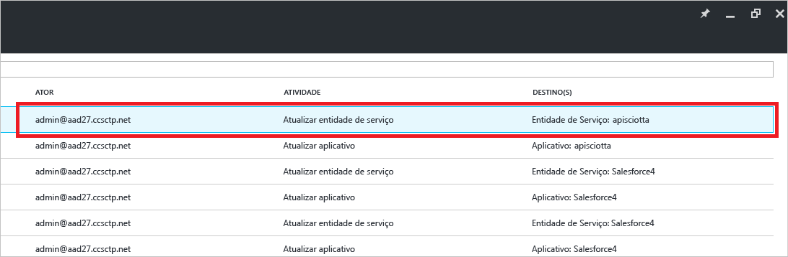

Ao clicar em um item na exibição de lista, você poderá obter mais detalhes sobre ele.

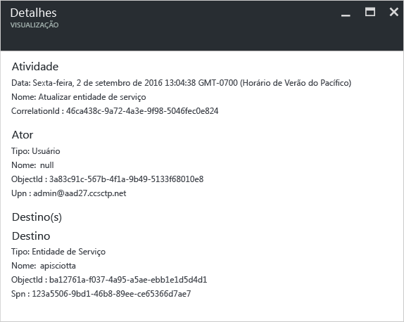

### Logs de auditoria de usuários e grupos

Com relatórios de auditoria baseados em grupos e usuários, você pode obter respostas a perguntas como:

- Que tipos de atualizações foram aplicadas os usuários?

- Quantos usuários foram alterados?

- Quantas senhas foram alteradas?

- O que um administrador fez em um diretório?

- Quais são os grupos que foram adicionados?

- Existem grupos com alterações de associação?

- Os proprietários do grupo foram alterados?

- Quais licenças foram atribuídas a um grupo ou a um usuário?

Se você quiser analisar os dados de auditoria relacionados aos usuários e aos grupos, poderá encontrar uma exibição filtrada em **Logs de auditoria** na seção **Atividade** de **Usuários e Grupos**.

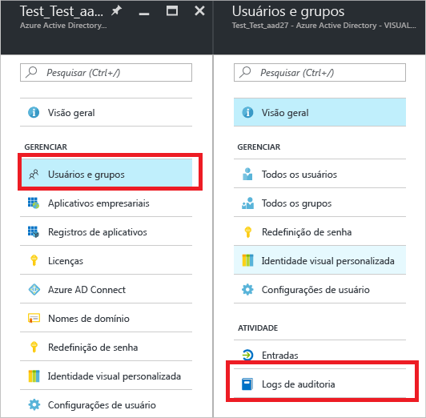

### Logs de auditoria de aplicativo

Com relatórios de auditoria baseados em aplicativos, você pode obter respostas a perguntas como:

- Quais aplicativos foram adicionados ou atualizados?

- Quais aplicativos foram removidos?

- Um princípio de serviço para um aplicativo foi alterado?

- Os nomes de aplicativos foram alterados?

- Quem deu permissão a um aplicativo?

Se você quiser analisar os dados de auditoria relacionados aos aplicativos, poderá encontrar uma exibição filtrada em **Logs de auditoria** na seção **Atividade** de **Aplicativos empresariais**.

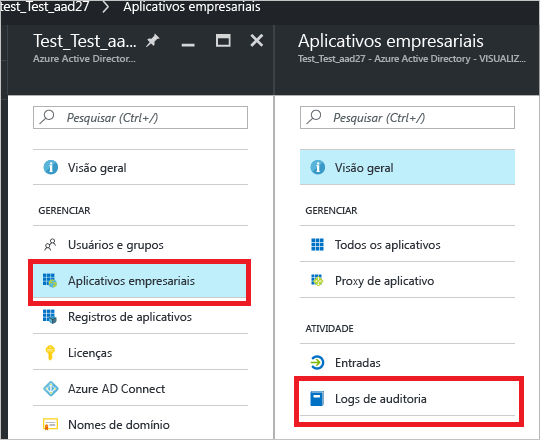

### Filtragem de logs de auditoria

Você pode filtrar um relatório de auditoria por um intervalo de tempo para limitar a quantidade de dados exibidos.

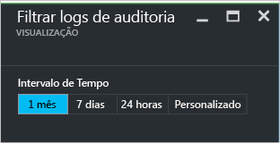

Outro método para filtrar as entradas de um log de auditoria é procurar itens específicos.

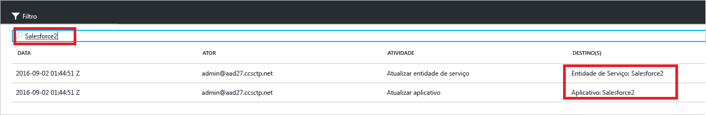

## Próximas etapas

Veja o [Guia de relatórios do Azure Active Directory](active-directory-reporting-guide.md).

<!---HONumber=AcomDC_1005_2016-->