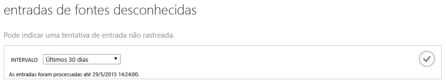
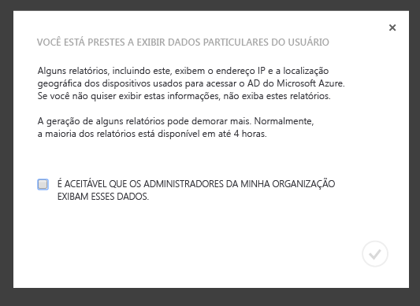
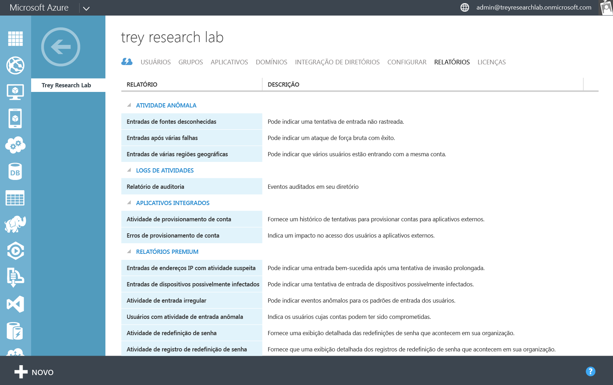
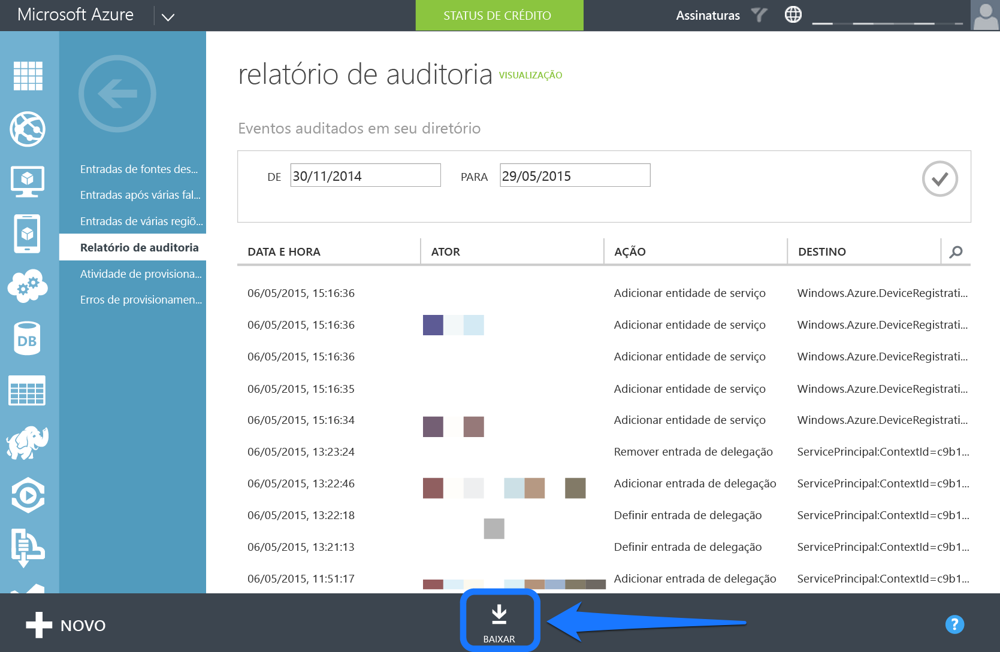
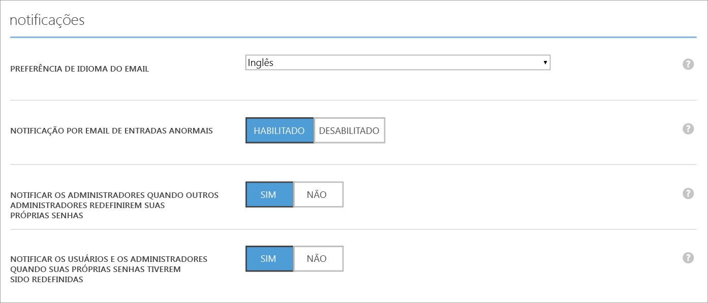
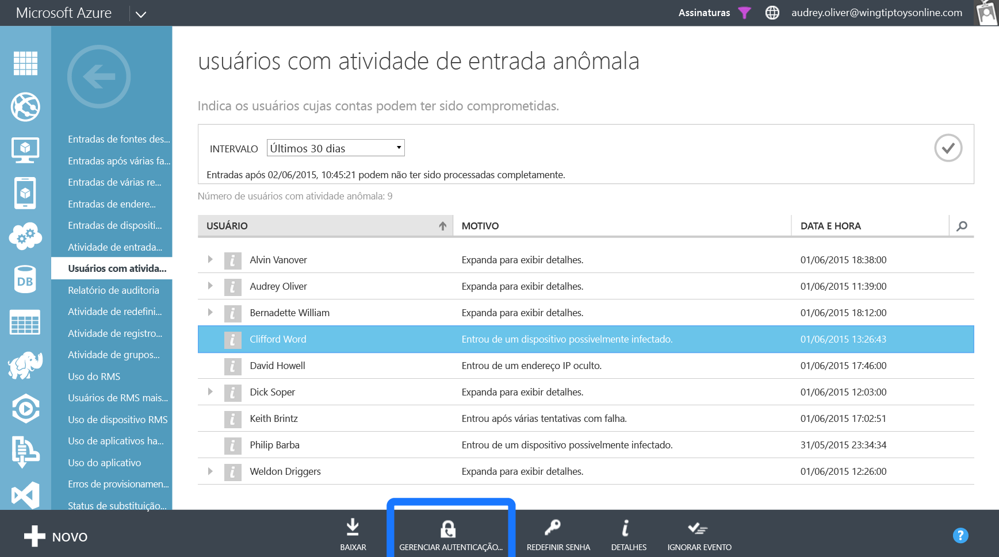

<properties
   pageTitle="Relatórios do AD do Azure: Introdução"
   description="Lista os diversos relatórios disponíveis nos relatórios do Active Directory do Azure"
   services="active-directory"
   documentationCenter=""
   authors="curtand"
   manager="stevenpo"
   editor=""/>

<tags
   ms.service="active-directory"
   ms.devlang="na"
   ms.topic="article"
   ms.tgt_pltfrm="na"
   ms.workload="identity"
   ms.date="09/21/2015"
   ms.author="curtand;kenhoff"/>

# Introdução aos Relatórios do AD do Azure

## O que é

O Active Directory do Azure inclui relatórios de auditoria, atividade e segurança para seu diretório. Aqui está uma lista dos relatórios incluídos:

### Relatórios de segurança

- Entradas de fontes desconhecidas
- Entradas após várias falhas
- Entradas de várias regiões geográficas
- Entradas de endereços IP com atividade suspeita
- Atividade de conexão anômala
- Entradas de dispositivos possivelmente infectados
- Usuários com atividade de entrada anômala

### Relatórios de atividades

- Uso do aplicativo: resumo
- Uso do aplicativo: detalhado
- Painel do aplicativo
- Erros de provisionamento de conta
- Dispositivos de usuário individual
- Atividade de usuário individual
- Relatório de atividade de grupos
- Relatório de atividade de registro de redefinição de senha
- Atividade de redefinição de senha

### Relatórios de auditoria

- Relatório de auditoria de diretório

> [AZURE.TIP]Para obter mais documentação sobre os Relatórios do AD do Azure, consulte [Exibir relatórios de acesso e uso](active-directory-view-access-usage-reports.md).

## Como ele funciona

### Pipeline de relatórios

O pipeline de relatórios consiste em três etapas principais. Sempre que um usuário entrar ou uma autenticação for feita, acontecerá o seguinte:

- Primeiro, o usuário é autenticado (com êxito ou não), e o resultado é armazenado nos bancos de dados de serviço do Active Directory do Azure.
- Em intervalos regulares, todas as entradas recentes são processadas. Neste ponto, nossos algoritmos de atividade anômala e segurança estão procurando atividades suspeitas em todas as entradas recentes.
- Após o processamento, os relatórios são gravados, armazenados em cache e disponibilizados no Portal de Gerenciamento do Azure.

### Tempos de geração dos relatórios

Devido ao grande volume de autenticações e entradas processadas pela plataforma do AD do Azure, as entradas mais recentes processadas têm, em média, uma hora de duração. Em casos raros, pode levar até oito horas para as entradas mais recentes serem processadas.

É possível encontrar a entrada processada mais recente examinando o texto de ajuda na parte superior de cada relatório.

> [AZURE.TIP]Para obter mais documentação sobre os Relatórios do AD do Azure, consulte [Exibir relatórios de acesso e uso](active-directory-view-access-usage-reports.md).

## Introdução

### Entre no Portal de Gerenciamento do Azure

Primeiro, será necessário entrar no [Portal de Gerenciamento do Azure](https://manage.windowsazure.com) como um administrador global ou de conformidade. Também será necessário ser um administrador ou coadministrador de serviço de assinatura do Azure ou usar a assinatura do Azure "Acesso ao AD do Azure".

### Navegue até Relatórios

Para exibir relatórios, navegue até a guia Relatórios na parte superior do diretório.

Se esta for a primeira vez que você exibe relatórios, será preciso aceitar uma caixa de diálogo antes de conseguir exibir os relatórios. Isso é para garantir que a exibição desses dados, que podem ser considerados informações particulares em alguns países, seja aceitável aos administradores em sua organização.

### Explore cada relatório

Navegue até cada relatório para ver os dados coletados e as entradas processadas. É possível encontrar uma [lista com todos os relatórios aqui](active-directory-reporting-what-it-is.md).

### Baixe os relatórios como CSV

Cada relatório pode ser baixado como um arquivo CSV (valores separados por vírgula). É possível usar esses arquivos no Excel, no PowerBI ou em programas de análise de terceiros para analisar os dados ainda mais.

Para baixar qualquer relatório como CSV, navegue até o relatório e clique em "Baixar" na parte inferior.

> [AZURE.TIP]Para obter mais documentação sobre os Relatórios do AD do Azure, consulte [Exibir relatórios de acesso e uso](active-directory-view-access-usage-reports.md).

## Próximas etapas

### Personalizar alertas para atividade de entrada anômala

Navegue até a guia "Configurar" de seu diretório.

Role até a seção "Notificações".

Habilite ou desabilite a seção "Notificações por Email de Entradas Anômalas".

### Integrar com a API de Relatório do AD do Azure

Consulte [Introdução à API de Relatório](active-directory-reporting-api-getting-started.md).

### Acione Multi-Factor Authentication nos usuários

Selecione um usuário em um relatório.

Clique no botão "Habilitar MFA" na parte inferior da tela.

> [AZURE.TIP]Para obter mais documentação sobre os Relatórios do AD do Azure, consulte [Exibir relatórios de acesso e uso](active-directory-view-access-usage-reports.md).

## Saiba mais

### Eventos de auditoria

Saiba mais sobre quais eventos são auditados no diretório em [Eventos de auditoria de Relatórios do Active Directory do Azure](active-directory-reporting-audit-events.md).

### Integração da API

Consulte [Introdução à API de Relatório](active-directory-reporting-api-getting-started.md) e a [documentação de referência da API](https://msdn.microsoft.com/library/azure/mt126081.aspx).

### Entre em contato

Envie um email para [aadreportinghelp@microsoft.com](mailto:aadreportinghelp@microsoft.com) para qualquer dúvida, ajuda ou comentário!

> [AZURE.TIP]Para obter mais documentação sobre os Relatórios do AD do Azure, consulte [Exibir relatórios de acesso e uso](active-directory-view-access-usage-reports.md).

<!---HONumber=Oct15_HO3-->