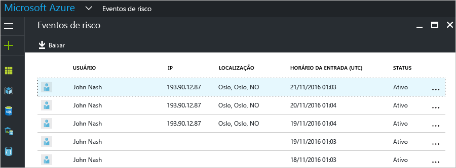
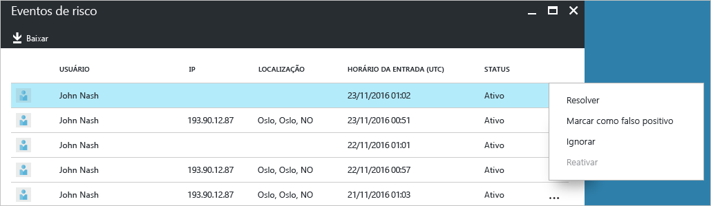
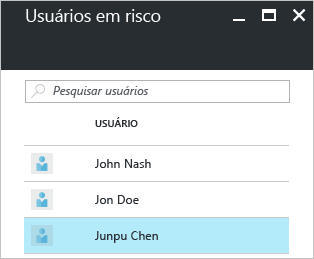
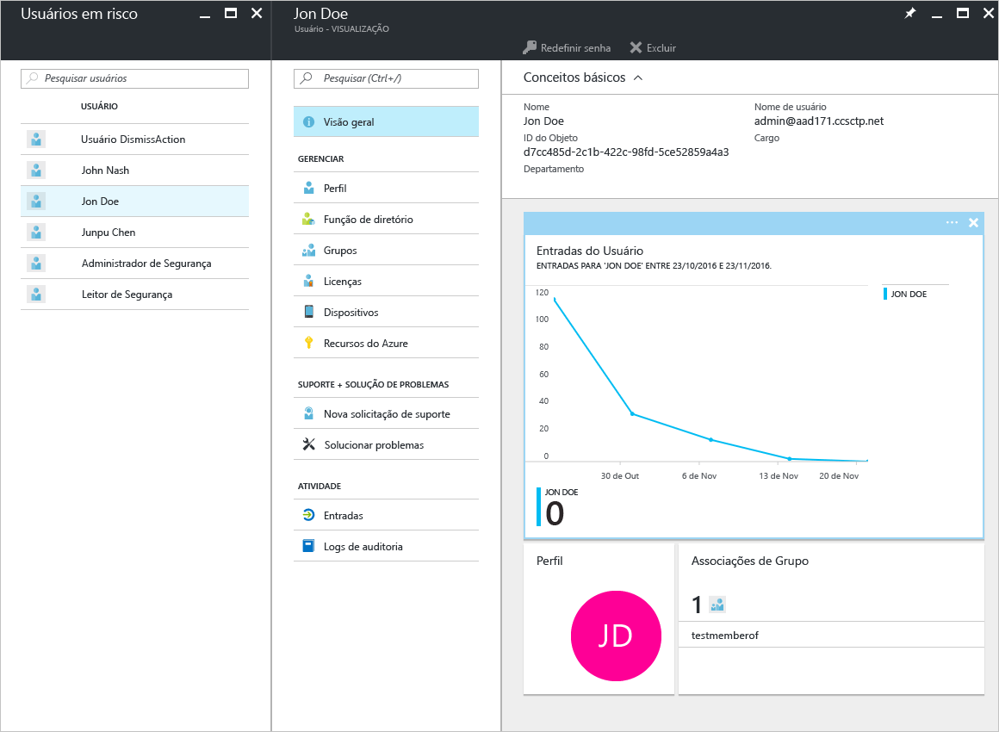

# Relatórios de segurança na edição Gratuita e Básica do Azure Active Directory - visualização

Com os relatórios de segurança na [visualização](active-directory-preview-explainer.md) do Azure Active Directory, você pode obter informações sobre a probabilidade de contas de usuário comprometidas em seu ambiente. 

O Azure Active Directory detecta ações suspeitas relacionadas às suas contas de usuário. Para cada ação detectada, um registro chamado *evento de risco* é criado. Para obter mais detalhes, veja [Eventos de risco do Azure Active Directory](active-directory-identity-protection-risk-events.md). 

Os eventos de risco detectados são usados para calcular:

- **Entradas arriscadas** - uma entrada arriscada é um indicador para uma tentativa de logon que pode ter sido realizada por alguém que não é o proprietário legítimo de uma conta de usuário. Para obter mais detalhes, veja [Entradas arriscadas](active-directory-identityprotection.md#risky-sign-ins). 

- **Usuários sinalizados para riscos** - um usuário arriscado é um indicador de uma conta de usuário que pode ter sido comprometida. Para obter mais detalhes, veja [Usuários sinalizados para riscos](active-directory-identityprotection.md#users-flagged-for-risk).  

## Relatório de entradas arriscadas

As edições gratuita e básica do Azure Active Directory fornecem uma lista de entradas arriscadas detectadas relatadas para seus usuários. O relatório de eventos de risco oferece:

- **Usuário** - o nome do usuário usado durante a operação de entrada
- **IP** - o endereço IP do dispositivo usado para se conectar ao Azure Active Directory
- **Local** - o local usado para se conectar ao Azure Active Directory
- **Hora da entrada** - o horário em que a entrada foi realizada
- **Status** - o status da entrada

Esse relatório fornece uma opção para baixar os dados do relatório.

Com base em sua investigação da entrada arriscada, você poderá fazer comentários ao Azure Active Directory na forma das seguintes ações:

- Resolver
- Marcar como falso positivo
- Ignorar
- Reativar

Para obter mais detalhes, veja [Fechando eventos de risco manualmente](active-directory-identityprotection.md#closing-risk-events-manually).

## Usuários no relatório de risco

A edição gratuita do Azure Active Directory fornece uma lista de contas de usuário que podem ter sido comprometidas. 

Clicar em um usuário na lista abre a folha de dados do usuário relacionado.
Para os usuários em risco, examine o histórico de entrada do usuário e redefina a senha, se necessário.

## Próximas etapas

- Para obter mais detalhes sobre os relatórios do Azure Active Directory, confira o [Guia de relatórios do Azure Active Directory](active-directory-reporting-guide.md).
- Para saber mais sobre o Azure Active Directory Identity Protection, veja [Azure Active Directory Identity Protection](active-directory-identityprotection.md).

<!--HONumber=Jan17_HO3-->

