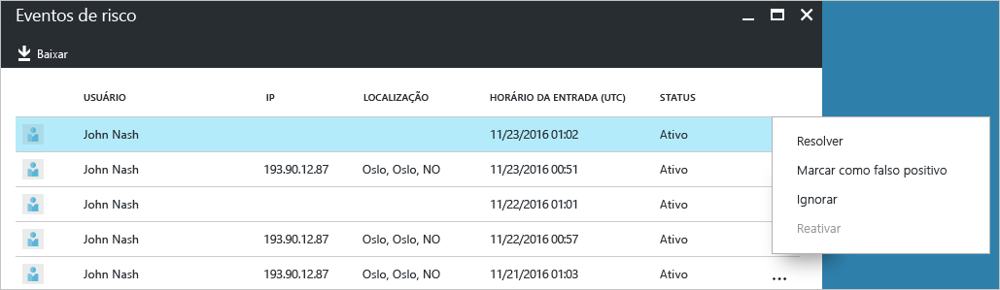
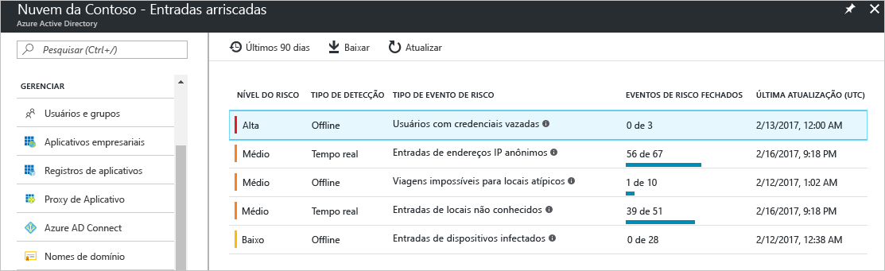
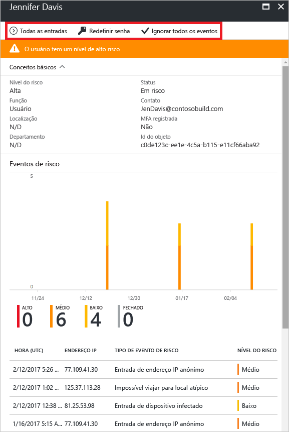
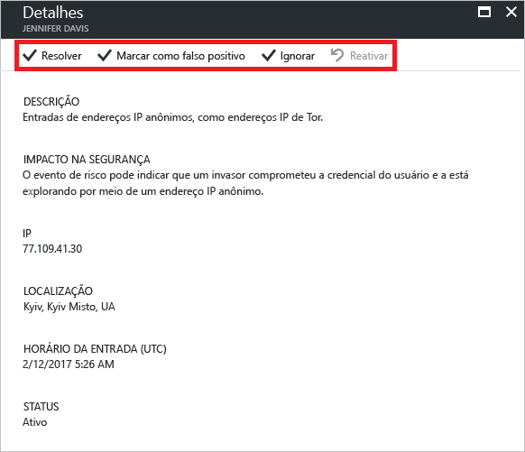

# Relatório de entradas de risco no portal do Azure Active Directory

Com os relatórios de segurança no Azure Active Directory (Azure AD) você pode obter informações sobre a probabilidade de contas de usuário comprometidas em seu ambiente. 

O Azure AD detecta ações suspeitas relacionadas às suas contas de usuário. Para cada ação detectada, um registro chamado *evento de risco* é criado. Para obter mais detalhes, veja [Eventos de risco do Azure Active Directory](active-directory-identity-protection-risk-events.md). 

Os eventos de risco detectados são usados para calcular:

- **Entradas arriscadas** - uma entrada arriscada é um indicador para uma tentativa de logon que pode ter sido realizada por alguém que não é o proprietário legítimo de uma conta de usuário. Para obter mais detalhes, veja [Entradas arriscadas](active-directory-identityprotection.md#risky-sign-ins). 

- **Usuários sinalizados para riscos** - um usuário arriscado é um indicador de uma conta de usuário que pode ter sido comprometida. Para obter mais detalhes, veja [Usuários sinalizados para riscos](active-directory-identityprotection.md#users-flagged-for-risk).  

Você pode encontrar os relatórios de segurança no [Portal do Azure](https://portal.azure.com) na folha **Azure Active Directory** na seção **Segurança**. 

## Edições gratuita e básica do Azure Active Directory

As edições gratuita e básica do Azure Active Directory fornecem uma lista de entradas de risco que foram detectadas dos seus usuários. O relatório de eventos de risco oferece:

- **Usuário** - o nome do usuário usado durante a operação de entrada
- **IP** - o endereço IP do dispositivo usado para se conectar ao Azure Active Directory
- **Local** - o local usado para se conectar ao Azure Active Directory
- **Hora da entrada** - o horário em que a entrada foi realizada
- **Status** - o status da entrada

Esse relatório fornece uma opção para baixar os dados do relatório.

Com base em sua investigação da entrada arriscada, você poderá fazer comentários ao Azure Active Directory na forma das seguintes ações:

- Resolver
- Marcar como falso positivo
- Ignorar
- Reativar

Para obter mais detalhes, veja [Fechando eventos de risco manualmente](active-directory-identityprotection.md#closing-risk-events-manually).

## Edições premium do Azure Active Directory

O relatório de entradas de risco nas edições premium do Azure Active Directory oferece:

- Informações agregadas sobre os [tipos de eventos de risco](active-directory-identity-protection-risk-events.md) que foram detectados

- Uma opção para baixar o relatório

Ao selecionar um evento de risco, você obtém uma exibição detalhada do relatório deste evento de risco que habilita:

- Uma opção para configurar uma [política de correção de risco de usuário](active-directory-identityprotection.md#user-risk-security-policy)  

- O exame do cronograma de detecção do evento de risco  

- O exame de uma lista de usuários para os quais esse evento de risco foi detectado

- Que você [feche manualmente eventos de risco](active-directory-identityprotection.md#closing-risk-events-manually) ou reative um evento de risco fechado manualmente. 

Ao selecionar um usuário, você obtém uma exibição detalhada do relatório deste usuário, que lhe habilita a:

- Abrir a exibição Todas as entradas

- Redefinir a senha do usuário

- Descartar todos os eventos

- Investigar os eventos de risco relatados para o usuário. 

Para investigar um evento de risco, selecione um na lista.  
Isso abre a folha de **Detalhes** para este evento de risco. Na folha **Detalhes**, você tem a opção de [fechar manualmente um evento de risco](active-directory-identityprotection.md#closing-risk-events-manually) ou reativar um evento de risco fechado manualmente. 

## Próximas etapas

- Para saber mais sobre o Azure Active Directory Identity Protection, veja [Azure Active Directory Identity Protection](active-directory-identityprotection.md).

