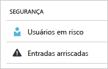
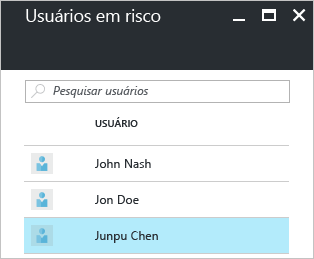
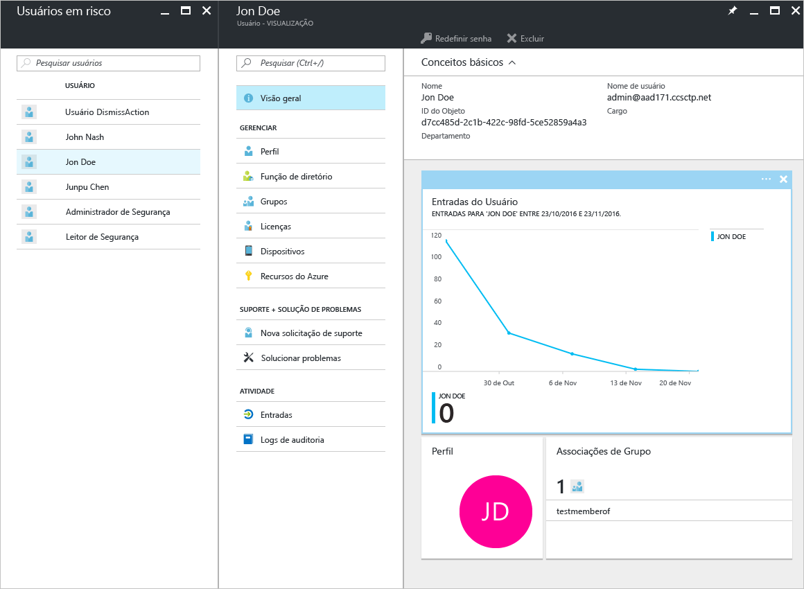
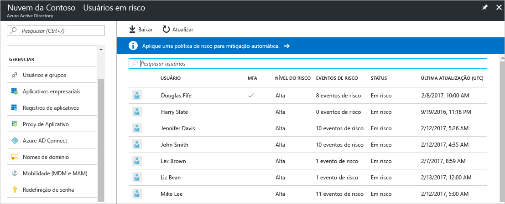

# Usuários sinalizados para o relatório de risco na segurança no portal do Azure Active Directory

Com os relatórios de segurança no Azure Active Directory (Azure AD), você pode obter informações sobre a probabilidade de contas de usuário comprometidas em seu ambiente. 

O Azure Active Directory detecta ações suspeitas relacionadas às suas contas de usuário. Para cada ação detectada, um registro chamado *evento de risco* é criado. Para saber mais, veja [Eventos de risco do Azure Active Directory](active-directory-identity-protection-risk-events.md). 

Os eventos de risco detectados são usados para calcular:

- **Entradas arriscadas** - uma entrada arriscada é um indicador para uma tentativa de logon que pode ter sido realizada por alguém que não é o proprietário legítimo de uma conta de usuário. Para obter mais informações, consulte [Entradas de risco](active-directory-identityprotection.md#risky-sign-ins). 

- **Usuários sinalizados para riscos** - um usuário arriscado é um indicador de uma conta de usuário que pode ter sido comprometida. Para obter mais informações, consulte [Usuários sinalizados para risco](active-directory-identityprotection.md#users-flagged-for-risk).  

Você pode encontrar os relatórios de segurança no Portal do Azure na folha **Azure Active Directory** na seção **Segurança**.  

## Qual licença do Azure AD você precisa para acessar a atividade de entrada?  

Todas as edições do Azure Active Directory fornecem relatórios de usuários sinalizados como risco.  
No entanto, o nível de granularidade do relatório varia entre as edições: 

- Nas **edições do Azure Active Directory Gratuita e Basic**, você obtém uma lista de usuários sinalizados como risco. 

- A edição do **Azure Active Directory Premium 1** estende esse modelo, também permitindo que você examine alguns dos eventos de risco subjacentes que foram detectados para cada relatório. 

- A edição do **Azure Active Directory Premium 2** fornece as informações mais detalhadas sobre todos os eventos de risco subjacentes e permite configurar políticas de segurança que atendem automaticamente aos níveis de risco configurados.

## Edições gratuita e básica do Azure Active Directory

Os usuários sinalizados para relatório de risco nas edições gratuita e básica do Azure Active Directory fornece uma lista de contas de usuário que podem ter sido comprometidas. 

A seleção de um usuário abre a respectiva folha de dados de usuário.
Você pode examinar o histórico de entradas dos usuários em risco e redefinir a senha, se necessário.

## Edições premium do Azure Active Directory

Os usuários sinalizados para o relatório de risco nas edições premium do Azure Active Directory fornecem:

- Uma [lista de contas de usuário](active-directory-identityprotection.md#users-flagged-for-risk) que podem ter sido comprometidas 

- Informações agregadas sobre os [tipos de eventos de risco](active-directory-identity-protection-risk-events.md) que foram detectados

- Uma opção para baixar o relatório

- Uma opção para configurar uma [política de correção de risco de usuário](active-directory-identityprotection.md#user-risk-security-policy)  

Ao selecionar um usuário, você obtém uma exibição detalhada do relatório deste usuário, que lhe habilita a:

- Abrir a exibição Todas as entradas

- Redefinir a senha do usuário

- Descartar todos os eventos

- Investigar os eventos de risco relatados para o usuário. 

Para investigar um evento de risco, selecione um na lista para abrir a folha **Detalhes** para esse evento de risco. Na folha **Detalhes**, você tem a opção de [fechar manualmente um evento de risco](active-directory-identityprotection.md#closing-risk-events-manually) ou reativar um evento de risco fechado manualmente. 

## Próximas etapas

- Para saber mais sobre o Azure Active Directory Identity Protection, veja [Azure Active Directory Identity Protection](active-directory-identityprotection.md).

