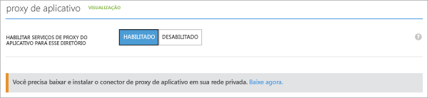

# Habilite o Proxy de Aplicativo no portal clássico e baixe conectores
Este artigo orienta você pelas etapas para habilitar o Proxy de Aplicativo do Microsoft Azure AD para seu diretório de nuvem no Azure AD.

Se você estiver familiarizado com o que o Proxy de Aplicativo pode ajudá-lo a fazer, saiba mais sobre [Como fornecer acesso remoto seguro a aplicativos locais](active-directory-application-proxy-get-started.md).

## Pré-requisitos de Proxy de aplicativo
Antes de habilitar e usar os serviços de Proxy de aplicativo, você precisa ter:

* Uma [assinatura premium ou básica](active-directory-editions.md) do Microsoft Azure AD e um diretório do Azure AD do qual você seja administrador global.
* Um servidor executando o Windows Server 2012 R2 ou 2016, em que você pode instalar o Conector de Proxy de Aplicativo. O servidor envia solicitações aos serviços de Proxy de Aplicativo na nuvem e precisa de uma conexão HTTP ou HTTPS para os aplicativos que você está publicando.
  * Para logon único para seus aplicativos publicados, essa máquina deve ser unida ao mesmo domínio do AD que os aplicativos que você está publicando. Para obter mais informações, consulte [Logon único com o Proxy de Aplicativo](active-directory-application-proxy-sso-using-kcd.md)
* Se a sua organização usa servidores proxy para se conectar à Internet, leia [Trabalhar com servidores proxy locais existentes](application-proxy-working-with-proxy-servers.md) para obter detalhes sobre como configurá-los.

## Abrir as portas

Para preparar o ambiente para o proxy de aplicativo do Azure AD, primeiro você precisa habilitar a comunicação com data centers do Azure. Se houver um firewall no caminho, verifique se o ele está aberto para que o Conector possa fazer solicitações HTTPS (TCP) para o Proxy de Aplicativo.

1. Abra as seguintes portas para o tráfego de **saída**:

   | Número da porta | Como ele é usado |
   | --- | --- |
   | 80 | Baixando as CRLs (listas de certificados revogados) ao validar o certificado SSL |
   | 443 | Toda a comunicação de saída com o serviço do proxy de aplicativo |

   Se o firewall reforça o tráfego de acordo com os usuários de origem, abra essas portas para o tráfego proveniente de serviços do Windows em execução como um serviço de rede.

   > [!IMPORTANT]
   > A tabela reflete os requisitos de porta para as versões do conector 1.5.132.0 e mais recentes. Se você ainda tiver uma versão mais antiga do conector, também precisará habilitar as seguintes portas: 5671, 8080, 9090, 9091, 9350, 9352 e 10100 – 10120.
   >
   >Para obter informações sobre como atualizar os conectores para a versão mais recente, consulte [Noções básicas sobre conectores de Proxy de Aplicativo do Azure AD](application-proxy-understand-connectors.md#automatic-updates).

2. Se seu firewall ou proxy permitir lista de permissões de DNS, você poderá adicionar as conexões a msappproxy.net e servicebus.windows.net à lista de permissões. Caso contrário, você precisará permitir o acesso aos [Intervalos de IP do DataCenter do Azure](https://www.microsoft.com/download/details.aspx?id=41653), que são atualizados a cada semana.

3. Use a [Ferramenta de Teste de Portas do Conector de Proxy de Aplicativo Azure AD](https://aadap-portcheck.connectorporttest.msappproxy.net/) para verificar se o conector pode alcançar o serviço Proxy de Aplicativo. No mínimo, verifique se a região EUA Central e a região mais próxima de você tem todas as marcas de seleção verdes. Além disso, um número maior de marcas de seleção verdes significa maior resiliência.

## Habilitar o Proxy de Aplicativo no Azure AD
1. Entre como administrador no [portal clássico do Azure](https://manage.windowsazure.com/).
2. Vá para o Active Directory e selecione o diretório no qual você deseja habilitar o Proxy de aplicativo.

    
3. Selecione **Configurar** na página de diretório e role para baixo até **Proxy de Aplicativo**.
4. Alterne **Habilitar Serviços de Proxy de Aplicativo para este Diretório** para **Habilitado**.

    
5. Selecione **Baixar agora**. O **Download do Conector do Proxy de Aplicativo do Azure AD** é aberto. Leia e aceite os termos de licença e clique em **Download** para salvar o arquivo do Windows Installer (.exe) do conector.

## Instalar e registrar o Conector
1. Execute **AADApplicationProxyConnectorInstaller.exe** no servidor que você preparou de acordo com os pré-requisitos.
2. Siga as instruções no Assistente para instalar.
3. Durante a instalação, é solicitado que você registre o conector com o Proxy de Aplicativo do seu locatário do Azure AD.

   * Forneça suas credenciais de administrador global do AD do Azure. Seu locatário de administrador global pode ser diferente das suas credenciais do Microsoft Azure.
   * Verifique se o administrador que registra o Conector está no mesmo diretório onde você habilitou o serviço Proxy de Aplicativo. Por exemplo, se o domínio de locatário for contoso.com, o administrador deve ser admin@contoso.com ou qualquer outro alias nesse domínio.
   * Se a **Configuração de Segurança Aprimorada do IE** estiver **Ativada** no servidor, a tela de registro poderá ser bloqueada. Siga as instruções na mensagem de erro para permitir o acesso. Certifique-se de que a Segurança Melhorada do Internet Explorer está desativada.
   * Se o registro do conector não for bem-sucedido, confira [Solucionar problemas de Proxy de Aplicativo](active-directory-application-proxy-troubleshoot.md).  
4. Quando a instalação for concluída, dois novos serviços são adicionados ao seu servidor:

   * **Conector de Proxy de Aplicativo do Microsoft AAD** habilita a conectividade

     * O **Atualizador do Conector de Proxy do Aplicativo Microsoft AAD** é um serviço de atualização automática. Periodicamente, ele verifica se há novas versões do conector e atualiza o conector conforme necessário.

     
5. Clique em **Concluir** na janela de instalação.

Para saber mais sobre conectores, veja [Noções básicas sobre conectores de proxy de aplicativo do Azure AD](application-proxy-understand-connectors.md).

Para fins de alta disponibilidade, você deve implantar pelo menos dois conectores. Para implantar mais conectores, repita as etapas 2 e 3. Cada conector deve ser registrado separadamente.

Se você deseja desinstalar o Conector, desinstale o serviço Conector e o serviço Atualizador. Reinicie o computador para remover completamente o serviço.

## Próximas etapas
Agora você está pronto para [Publicar aplicativos com o Proxy de Aplicativo](active-directory-application-proxy-publish.md).

Se tem aplicativos que estão em redes separadas ou em locais diferentes, você pode usar grupos de conector para organizar os conectores diferentes em unidades lógicas. Saiba mais sobre como [Trabalhar com conectores de Proxy de Aplicativo](active-directory-application-proxy-connectors-azure-portal.md).
