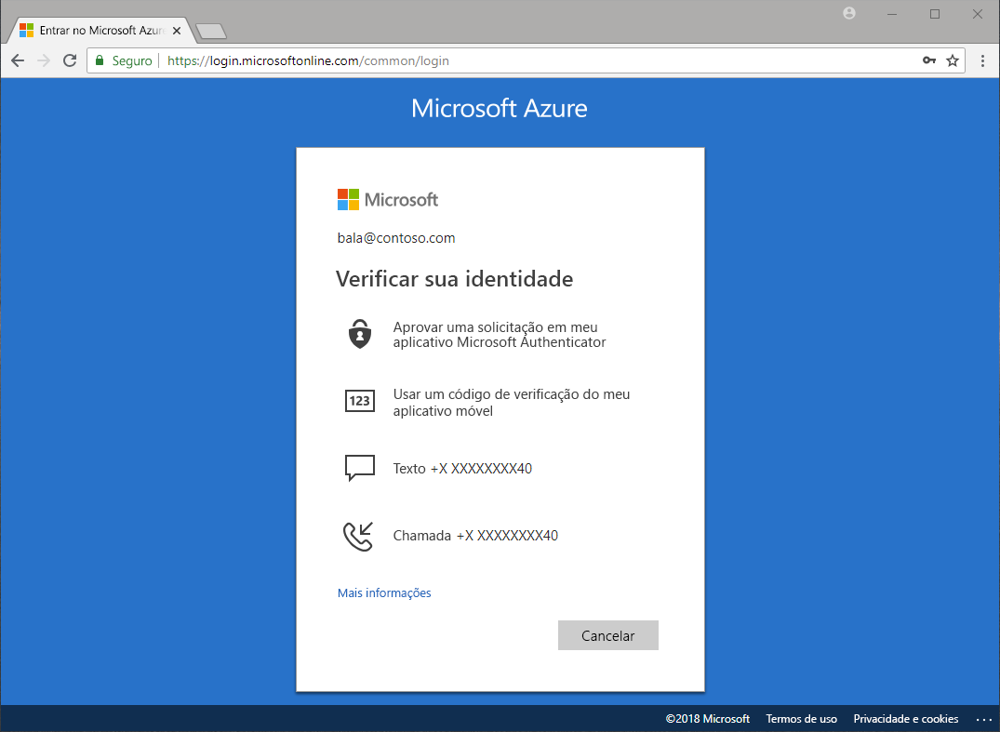

# Quais métodos estão disponíveis para autenticação?

Ouvimos relatórios nos noticiários, senhas roubadas e identidades sendo comprometidas. Exigir um segundo fator além de uma senha imediatamente aumenta a segurança da sua organização. O Microsoft Azure Active Directory (Azure AD) inclui recursos, como a Autenticação Multifator do Microsoft Azure (Azure MFA) e a redefinição de senha de autoatendimento do Azure AD (SSPR), para ajudar os administradores a proteger as organizações e os usuários com métodos de autenticação adicionais.

Quando um usuário precisa acessar um aplicativo confidencial, redefinir sua senha ou habilitar o Windows Hello, pode ser que ele tenha de fornecer verificação adicional de ele é quem diz ser.

Uma verificação adicional pode vir na forma de métodos de autenticação, como:

* Um código fornecido em uma mensagem de email ou de texto
* Uma chamada telefônica
* Uma notificação ou um código em seu telefone
* Respostas para perguntas de segurança

A redefinição de senha de autoatendimento do Azure MFA e o Azure AD oferece aos administradores controle sobre configuração, política, monitoramento e emissão de relatórios usando o Azure AD e o portal do Azure para proteger suas organizações.

## Redefinição de senha de autoatendimento

A redefinição de senha de autoatendimento fornece aos usuários a capacidade de redefinir sua senha, sem nenhuma intervenção do administrador, quando e onde eles precisam.

> [!VIDEO https://www.youtube.com/embed/hc97Yx5PJiM]

A redefinição de senha por autoatendimento inclui:

* **Alteração de senha:** sei minha senha, mas desejo alterá-la para uma nova.
* **Redefinição de senha:** não consigo entrar e desejo redefinir a minha senha usando um ou mais métodos de autenticação aprovados.
* **Desbloqueio de conta:** não consigo entrar porque a minha conta está bloqueada e quero desbloquear usando um ou mais métodos de autenticação aprovados.

## Autenticação Multifator

A Autenticação Multifator do Azure é uma solução de verificação em duas etapas da Microsoft. Usando métodos de autenticação aprovados pelo administrador, o Azure MFA ajuda a proteger o acesso a dados e a aplicativos, ao mesmo tempo que atende à demanda por um processo de logon simples.

## Próximas etapas

A próxima etapa é mergulhar e configurar a redefinição de senha de autoatendimento e a Autenticação Multifator do Azure.

Para se familiarizar com a redefinição de senha de autoatendimento, consulte o [artigo de início rápido para habilitar o SSPR](quickstart-sspr.md).

Saiba mais sobre a redefinição de senha de autoatendimento no artigo [Como funciona a redefinição de senha de autoatendimento do Azure AD](concept-sspr-howitworks.md)

Saiba mais sobre a Autenticação Multifator do Azure no artigo [Como funciona a Autenticação Multifator do Azure](concept-mfa-howitworks.md)