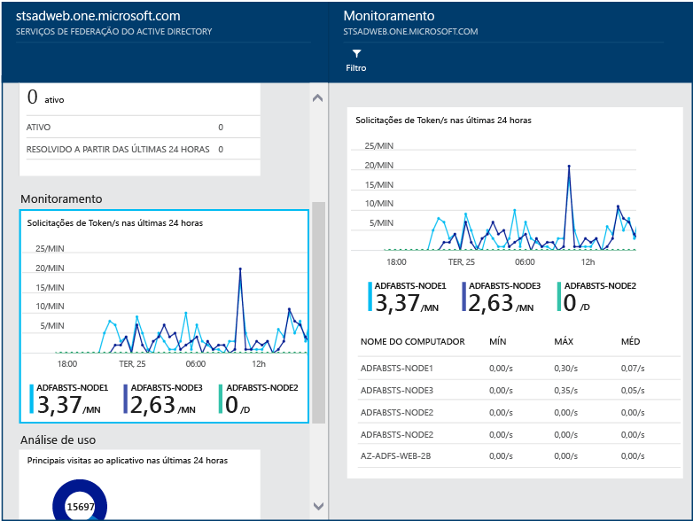

# Monitorar o AD FS usando o Azure AD Connect Health
A documentação a seguir é específica para monitorar a sua infraestrutura do AD FS com o Azure AD Connect Health. Para saber mais sobre como monitorar o Azure AD Connect (Sincronização) com o Azure AD Connect Health, confira [Usar o Azure AD Connect Health para Sincronização](active-directory-aadconnect-health-sync.md). Além disso, para obter informações sobre como monitorar os Serviços de Domínio do Active Directory com o Azure AD Connect Health, confira [Usar o Azure AD Connect Health com o AD DS](active-directory-aadconnect-health-adds.md).

## Alertas do AD FS
A seção de Alertas do Azure AD Connect Health fornece a lista de alertas ativos. Cada alerta inclui informações relevantes, etapas de resolução e links para documentação relacionada.

Clique duas vezes em um alerta ativo ou resolvido para abrir uma nova folha com as informações adicionais, as etapas a serem seguidas para resolver o alerta e os links para documentação relevante. Você também pode exibir dados históricos sobre alertas que foram resolvidas no passado.

## Análises de Uso do AD FS
A Análise de Uso do Azure AD Connect Health analisa o tráfego de autenticação de servidores de Federação. Você pode clicar duas vezes na caixa de análise de uso para abrir a folha de análise de uso, que mostra várias métricas e agrupamentos.

> [!NOTE]
> Para usar a análise de uso com o AD FS, você deve garantir que a auditoria do AD FS esteja habilitada. Para obter mais informações, consulte [Habilitar a auditoria do AD FS](active-directory-aadconnect-health-agent-install.md#enable-auditing-for-ad-fs).
>
>

Para selecionar métricas adicionais, especifique um intervalo de tempo ou, para alterar o agrupamento, clique no gráfico de análise de uso e selecione Editar gráfico. Em seguida, você pode especificar o intervalo de tempo, selecionar uma métrica diferente e alterar o agrupamento. Você pode exibir a distribuição do tráfego de autenticação com base em diferentes “métricas” e agrupar cada métrica usando parâmetros relevantes "agrupar por" descritos na seção a seguir:

**Métrica: Total de solicitações** – Número total de solicitações processadas por servidores AD FS.

|Agrupar Por | O que significa que o agrupamento e por que ele é útil? |
| --- | --- |
| Todos | Mostra a contagem do número total de solicitações processadas por todos os servidores AD FS.|
| Aplicativo | Agrupa o total de solicitações com base na terceira parte confiável de destino. Esse agrupamento é útil para entender qual aplicativo está recebendo o percentual do tráfego total. |
|  Servidor |Agrupa o total de solicitações com base no servidor que processa a solicitação. Esse agrupamento é útil para entender a distribuição de carga do tráfego total.
| Ingresso no local |Agrupa o total de solicitações com base em se as solicitações são provenientes de dispositivos que são ingressados no local (conhecido). Esse agrupamento é útil para compreender se os recursos são acessados usando dispositivos desconhecidos para a infraestrutura de identidades. |
|  Método de autenticação | Agrupa o total de solicitações com base no método de autenticação usado para autenticação. Esse agrupamento é útil para entender o método de autenticação comum que é usado para autenticação. Estes são os métodos de autenticação possíveis <ol> <li>Autenticação Integrada do Windows (Windows)</li> <li>Autenticação Baseada em Formulários (Formulários)</li> <li>SSO (Logon único)</li> <li>Autenticação de Certificado X509 (Certificado)</li>  Se os servidores de federação receberem a solicitação com um Cookie SSO, essa solicitação será contabilizada como SSO (logon único). Nesses casos, se o cookie for válido, o usuário não precisa fornecer credenciais e obtém acesso contínuo ao aplicativo. Esse comportamento é comum se você tiver várias partes confiáveis protegidas pelos servidores da Federação. |
| Local de rede | Agrupa o total de solicitações com base no local de rede do usuário. Pode ser qualquer intranet ou extranet. Esse agrupamento é útil para saber qual é a porcentagem do tráfego que está vindo da intranet em comparação com a extranet. |

**Métrica: Total de solicitações com falha** – O número total de solicitações com falha processadas pelo serviço de federação. (Essa métrica só está disponível no AD FS para o Windows Server 2012 R2)

|Agrupar Por | O que significa que o agrupamento e por que ele é útil? |
| --- | --- |
| Tipo de erro | Mostra o número de erros com base nos tipos de erro predefinidos. Esse agrupamento é útil para entender os tipos comuns de erros. <ul><li>Nome de usuário ou senha incorretos: erros causados por nome de usuário ou senha incorretos.</li> <li>"Bloqueio de extranet": falhas devido a solicitações recebidas de um usuário que foi bloqueado da extranet </li><li> "Senha expirada": falhas devido a usuários que fazem logon com uma senha expirada.</li><li>"Conta desabilitada": falhas devido a usuários que fazem logon com uma conta desabilitada.</li><li>"Autenticação do dispositivo": falhas devido a usuários que não foram autenticados usando a Autenticação do Dispositivo.</li><li>"Autenticação de Certificado de Usuário": falhas devido a usuários que não foram autenticados devido a um certificado inválido.</li><li>"MFA": falhas devido ao usuário que não foi autenticado usando a Autenticação Multifator.</li><li>"Outras Credenciais": "Autorização de Emissão": falhas devido a falhas de autorização.</li><li>"Delegação de Emissão": falhas devido a erros de delegação de emissão.</li><li>"Aceitação de Token": falhas causadas pelo ADFS rejeitando o token de um provedor de identidade de terceiros.</li><li>"Protocolo": falha devido a erros de protocolo.</li><li>"Desconhecido": envolve tudo. Quaisquer outras falhas que não se encaixam nas categorias definidas.</li> |
| Servidor | Agrupa os erros com base no servidor. Esse agrupamento é útil para entender a distribuição de erros entre servidores. A distribuição desigual poderia ser um indicador de um servidor em um estado com falha. |
| Local de rede | Agrupa os erros com base no local de rede das solicitações (intranet versus extranet). Esse agrupamento é útil para entender que tipo de solicitações está falhando. |
|  Aplicativo | Agrupa as falhas com base no aplicativo de destino (terceira parte confiável). Esse agrupamento é útil para entender qual aplicativo de destino está tendo maior número de erros. |

**Métrica: Contagem de usuários** – número médio de usuários exclusivos autenticando-se ativamente usando o AD FS

|Agrupar Por | O que significa que o agrupamento e por que ele é útil? |
| --- | --- |
|Todos |Essa métrica fornece uma contagem do número médio de usuários que usam o serviço de federação na fração de tempo selecionada. Os usuários não estão agrupados.  A média depende da fração de tempo selecionada. |
| Aplicativo |Agrupa o número médio de usuários com base no aplicativo de destino (terceira parte confiável). Esse agrupamento é útil para entender a quantos usuários estão usando o aplicativo. |

## Monitoramento de desempenho do AD FS
O Monitoramento de Desempenho do Azure Active Directory Connect Health fornece informações de monitoramento nas métricas. Selecionar a caixa Monitoramento abre uma nova folha com informações detalhadas sobre as métricas.

Ao selecionar a opção de filtro na parte superior da folha, você pode filtrar por servidor para ver as métricas individuais de um servidor. Para alterar as métricas, clique com o botão direito do mouse no gráfico de monitoramento na folha de monitoramento e selecione Editar Gráfico (ou selecione o botão Editar Gráfico). Na nova folha que é aberta, você pode selecionar métricas adicionais na lista suspensa e especificar um intervalo de tempo para exibir os dados de desempenho.

## Relatórios do AD FS
O Azure AD Connect Health fornece relatórios sobre a atividade e o desempenho do AD FS. Esses relatórios ajudam os administradores a obter percepções sobre as atividades nos servidores do AD FS.

### 50 principais usuários com logons com falha de nome de usuário/senha
Um dos motivos comuns para a falha de uma solicitação de autenticação em um servidor do AD FS é uma solicitação com credenciais inválidas, ou seja, um nome de usuário ou uma senha incorretos. Costuma acontecer par aos usuários devido a senhas complexas, senhas esquecidas ou erros de digitação.

Mas há outros motivos que podem resultar em um número inesperado de solicitações manipuladas pelos servidores do AD FS, tais como: um aplicativo que armazena em cache as credenciais de usuário e as credenciais expiram ou um usuário mal-intencionado tenta entrar em uma conta com uma série de senhas conhecidas. Estes dois exemplos são motivos válidos que poderiam levar a um aumento nas solicitações.

O Azure AD Connect Health para ADFS fornece um relatório sobre os 50 principais usuários com falhas em tentativas de logon devido a um nome de usuário ou uma senha inválidos. Esse relatório é obtido com o processamento dos eventos de auditoria gerados por todos os servidores do AD FS nos farms

Neste relatório, você tem acesso fácil às seguintes informações:

* Número total de solicitações com falha com nome de usuário/senha incorretos nos últimos 30 dias
* Número médio de usuários com falha de logon com um nome de usuário/senha inválidos por dia.

Ao clicar nessa opção, você é levado até a folha de relatório principal, que fornece detalhes adicionais. Esta folha inclui um gráfico com informações de tendência para ajudar a estabelecer uma linha de base sobre solicitações com nome de usuário ou senha incorretos. Além disso, ele fornece a lista dos 50 principais usuários com o maior número de tentativas com falha.

O gráfico fornece as seguintes informações:

* O número total de logons com falha devido a um nome de usuário/senha inválidos a cada dia.
* O número total de usuários exclusivos com logons com falha a cada dia.
* Endereço IP do cliente da última solicitação

O relatório fornece as seguintes informações:

| Item do relatório | Descrição |
| --- | --- |
| Id de Usuário |Mostra a ID de usuário que foi usada. Esse valor é o que o usuário digitou, que, em alguns casos, é o uso da ID de usuário errada. |
| Tentativas com falha |Mostra o número total de tentativas com falha para essa ID de usuário específica. A tabela é classificada com o maior número de tentativas com falha em ordem decrescente. |
| Última falha |Mostra o carimbo de data/hora quando a última falha ocorreu. |
| IP da última falha |Mostra o endereço IP do cliente da solicitação incorreta mais recente. |

> [!NOTE]
> Esse relatório é atualizado automaticamente a cada duas horas com as novas informações coletadas no momento. Como resultado, as tentativas de logon nas últimas duas horas podem não ser incluídas no relatório.
>
>

## Links relacionados
* [Azure AD Connect Health](active-directory-aadconnect-health.md)
* [Instalação do Agente do Azure AD Connect Health](active-directory-aadconnect-health-agent-install.md)
* [Operações de Azure AD Connect Health](active-directory-aadconnect-health-operations.md)
* [Usando o Azure AD Connect Health para sincronização](active-directory-aadconnect-health-sync.md)
* [Usar o Azure AD Connect Health com o AD DS](active-directory-aadconnect-health-adds.md)
* [Perguntas frequentes do Azure AD Connect Health](active-directory-aadconnect-health-faq.md)
* [Histórico de versão do Azure AD Connect Health](active-directory-aadconnect-health-version-history.md)
