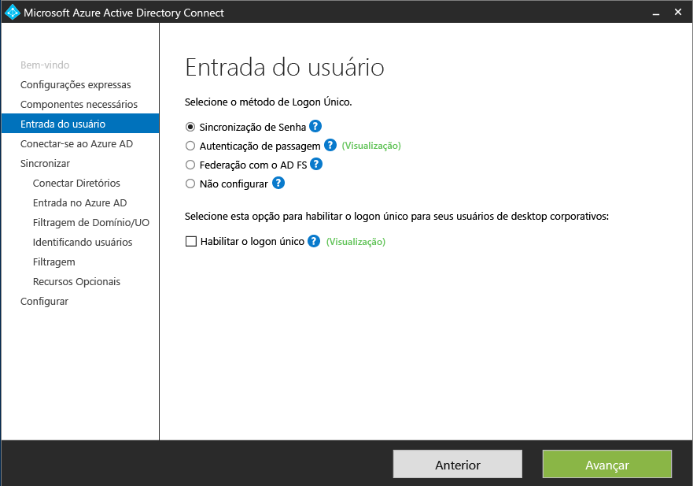
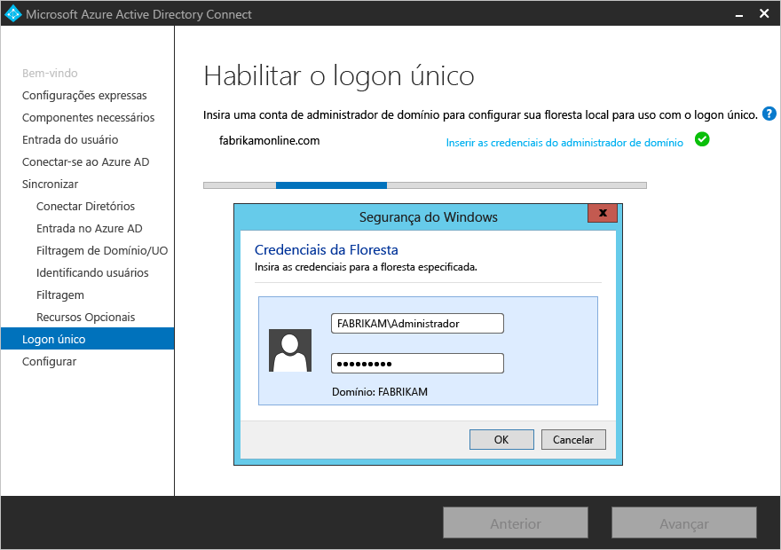
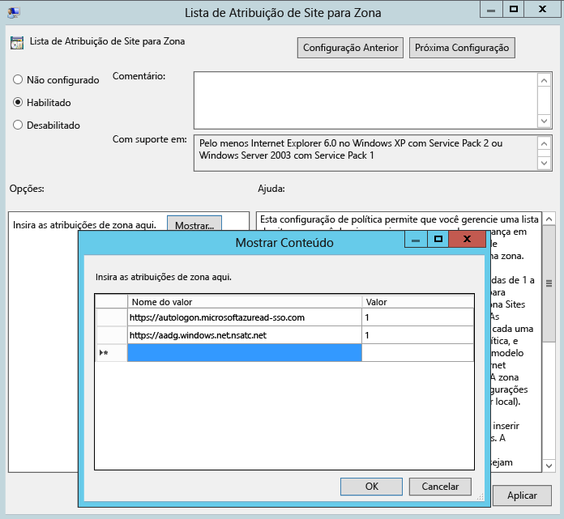

# Instalação personalizada do Azure AD Connect
As **Configurações personalizadas** do Azure AD Connect são usadas quando você deseja mais opções para a instalação. Essa opção é usada se você tem várias florestas ou se quer configurar recursos opcionais não incluídos na instalação expressa. Ela é usada em todos os casos em que a opção de [**instalação expressa**](active-directory-aadconnect-get-started-express.md) não satisfaz à sua implantação ou a topologia.

Antes de iniciar a instalação do Azure AD Connect, [baixe o Azure AD Connect](http://go.microsoft.com/fwlink/?LinkId=615771) e conclua as etapas de pré-requisito em [Azure AD Connect: hardware e pré-requisitos](active-directory-aadconnect-prerequisites.md). Também verifique se você tem as contas necessárias disponíveis, conforme descrito em [Contas e permissões do Azure AD Connect](active-directory-aadconnect-accounts-permissions.md).

Se as configurações personalizadas não corresponderem à sua topologia, por exemplo, para atualizar o DirSync, confira a [documentação relacionada](#related-documentation) para outros cenários.

## Instalação de configurações personalizadas do Azure AD Connect
### Configurações Expressas
Nessa página, clique em **Personalizar** para iniciar uma instalação de configurações personalizadas.

### Instalar componentes necessários
Quando você instala os serviços de sincronização, pode deixar a seção de configuração opcional desmarcada e o Azure AD Connect configura tudo automaticamente. Ele configura uma instância do LocalDB do SQL Server 2012 Express, cria os grupos apropriados e atribui permissões a eles. Se quiser alterar os padrões, você poderá usar a tabela a seguir para entender as opções de configuração opcionais disponíveis.

| Configuração opcional | Descrição |
| --- | --- |
| Usar um SQL Server existente |Permite que você especifique o nome do SQL Server e o nome da instância. Escolha essa opção se já tiver um servidor de banco de dados que você quer usar. Digite o nome da instância, seguido de uma vírgula e do número da porta em **Nome da Instância** , se o SQL Server não tiver a navegação habilitada. |
| Usar uma conta de serviço existente |Por padrão, o Azure AD Connect usa uma conta de serviço virtual para os serviços de sincronização a usar. Se você usar um SQL Server remoto ou um proxy que requer autenticação, precisará usar uma **conta de serviço gerenciado** ou uma conta de serviço no domínio e saber a senha. Nesses casos, insira a conta a usar. Verifique se o usuário que está executando a instalação é um SA no SQL para que um logon para a conta de serviço possa ser criado. Veja [Contas e permissões do Azure AD Connect](active-directory-aadconnect-accounts-permissions.md#azure-ad-connect-sync-service-account) |
| Especificar grupos de sincronização personalizados |Por padrão, o Azure Connect AD cria quatro grupos locais para o servidor quando os serviços de sincronização estiverem instalados. Esses grupos são: grupo de administradores, grupo de operadores, grupo de navegação e grupo de redefinição de senha. Você pode especificar seus próprios grupos aqui. Os grupos devem ser locais no servidor e não podem ser localizados no domínio. |

### Entrada do usuário
Depois de instalar os componentes necessários, será solicitado que você selecione o método de logon único de seus usuários. A tabela a seguir fornece uma breve descrição das opções disponíveis. Para obter uma descrição completa dos métodos de entrada, consulte [Entrada do usuário](active-directory-aadconnect-user-signin.md).

| Opção de logon único | Descrição |
| --- | --- |
| Sincronização de hash de senha |Os usuários podem entrar em serviços de nuvem da Microsoft, como o Office 365, usando a mesma senha usada na rede local deles. As senhas dos usuários são sincronizadas com o AD do Azure por meio de um hash de senha, e a autenticação ocorre na nuvem. Para obter mais informações, consulte [Sincronização de hash de senha](active-directory-aadconnectsync-implement-password-synchronization.md). |
|Autenticação de Passagem|Os usuários podem entrar em serviços de nuvem da Microsoft, como o Office 365, usando a mesma senha usada na rede local deles.  A senha dos usuários é passada para o controlador do Active Directory local a ser validado.
| Federação com o AD FS |Os usuários podem entrar em serviços de nuvem da Microsoft, como o Office 365, usando a mesma senha usada na rede local deles.  Os usuários são redirecionados para a instância local do AD FS para entrar e a autenticação ocorre no local. |
| Não configurar |Nenhum dos recursos é instalado e configurado. Escolha essa opção se você já tiver um servidor de federação de terceiros ou outra solução existente em vigor. |
|Habilitar o Logon Único|Essa opção está disponível com a sincronização de senha e a autenticação de passagem e fornece uma experiência de logon único para usuários da área de trabalho na rede corporativa.  Para obter mais informações, veja [Logon único](active-directory-aadconnect-sso.md).  Observação para os clientes do AD FS: essa opção não está disponível porque o AD FS já oferece o mesmo nível de logon único. (se PTA não for lançado ao mesmo tempo)
|Opção de Logon|Essa opção está disponível para clientes com sincronização de hash de senha e fornece uma experiência de logon único para usuários da área de trabalho na rede corporativa.   Para obter mais informações, veja [Logon único](active-directory-aadconnect-sso.md).  Observação para os clientes do AD FS: essa opção não está disponível porque o AD FS já oferece o mesmo nível de logon único.

### Conecte-se ao AD do Azure
Na tela Conectar ao AD do Azure, digite uma senha e uma conta de administrador global. Se você tiver selecionado **Federação com o AD FS** na página anterior, não entre com uma conta de um domínio que planeja habilitar para a federação. Uma recomendação é usar uma conta do domínio **onmicrosoft.com** padrão, que é fornecida com o diretório do Azure AD.

Lembre-se de que essa conta é usada apenas para criar uma conta de serviço no Azure AD e não é usada após a conclusão do assistente.  

Se sua conta de administrador global tiver o MFA habilitado, você precisará fornecer a senha novamente no pop-up de entrada e concluir o desafio do MFA. O desafio poderia ser fornecer um código de verificação ou uma chamada telefônica.  

A conta de administrador global também pode ter o [Privileged Identity Management](../active-directory-privileged-identity-management-getting-started.md) habilitado.

Se você encontrar um erro e tiver problemas de conectividade, confira [Solucionar problemas de conectividade](active-directory-aadconnect-troubleshoot-connectivity.md).

## Páginas na seção Sincronização

### Conectar seus diretórios
Para se conectar a seu Serviço de Domínio do Active Directory, o Azure AD Connect precisa do nome da floresta e das credenciais de uma conta com permissões suficientes.

Depois de inserir o nome da floresta e clicar em **Adicionar Diretório**, uma caixa de diálogo pop-up será exibida e indicará as seguintes opções:

| Opção | Descrição |
| --- | --- |
| Usar conta existente | Selecione esta opção se você deseja fornecer uma conta existente do AD DS para ser usada pelo Azure AD Connect para se conectar à floresta AD durante a sincronização de diretório. Você pode inserir a parte do domínio no formato NetBios ou FQDN, ou seja, FABRIKAM\syncuser ou fabrikam.com\syncuser. Essa conta pode ser uma conta de usuário regular, pois ele precisa apenas de permissões de leitura padrão. No entanto, dependendo do cenário, talvez você precise de mais permissões. Para saber mais, confira [Contas e permissões do Azure AD Connect](active-directory-aadconnect-accounts-permissions.md#create-the-ad-ds-account). |
| Criar nova conta | Selecione esta opção se deseja que o assistente do Azure AD Connect crie a conta do AD DS exigida pelo Azure AD Connect para se conectar à floresta AD durante a sincronização de diretório. Quando essa opção é selecionada, insira o nome de usuário e a senha de uma conta do administrador corporativo. A conta do administrador corporativo fornecida será usada pelo assistente do Azure AD Connect para criar a conta do AD DS necessária. Você pode inserir a parte do domínio no formato NetBios ou FQDN, ou seja, FABRIKAM\administrador ou fabrikam.com\administrador. |

### Configuração de entrada do Azure AD
Essa página permite que você examine os domínios UPN presentes no AD DS local e que foram verificados no Azure AD. Esta página também permite que você configure o atributo a ser usado para userPrincipalName.

  
Examine cada domínio marcado como **Não Adicionado** e **Não Verificado**. Confira se os domínios que você usa foram verificados no Azure AD. Clique no símbolo de Atualização quando tiver verificado os domínios. Para saber mais, confira [adicionar e verificar o domínio](../active-directory-add-domain.md)

**UserPrincipalName** ‒ o atributo userPrincipalName é o que os usuários usam ao entrarem no Azure AD e no Office 365. Os domínios usados, também conhecidos como sufixo UPN, devem ser verificados no AD do Azure antes que os usuários sejam sincronizados. A Microsoft recomenda manter o atributo padrão userPrincipalName. Se esse atributo não for roteável e não puder ser verificado, será possível selecionar outro atributo. Por exemplo, você pode selecionar o email como o atributo que contém a ID de entrada. O uso de um atributo diferente de userPrincipalName é conhecido como **ID Alternativa**. O valor do atributo da ID Alternativa deve seguir o padrão RFC822. Uma ID Alternativa pode ser usada com a sincronização de senha e com a federação.

>[!NOTE]
> Quando habilitar a autenticação de passagem, você deverá ter pelo menos um domínio verificado para continuar no assistente.

> [!WARNING]
> Usar uma ID alternativa não é compatível com todas as cargas de trabalho do Office 365. Para obter mais informações, confira [Configurando ID de logon alternativa](https://technet.microsoft.com/library/dn659436.aspx).
>
>

### Domínio e filtragem de unidade organizacional
Por padrão, todos os domínios e UOs são sincronizados. Se houver algum domínio ou UO que você não queira sincronizar com o AD do Azure, desmarque-os.  
  
Esta página do assistente está configurando a filtragem baseada em domínio e baseada em UO. Se você planeja fazer alterações, consulte [filtragem baseada em domínio](active-directory-aadconnectsync-configure-filtering.md#domain-based-filtering) e [filtragem baseada em unidade organizacional](active-directory-aadconnectsync-configure-filtering.md#organizational-unitbased-filtering) antes de fazer essas alterações. Algumas UOs são essenciais para a funcionalidade e não devem ser desmarcadas.

Se você usar a filtragem baseada em Unidade Organizacional com versão do Azure AD Connect anterior a 1.1.524.0, as novas OUs adicionadas posteriormente serão sincronizadas por padrão. Se você quiser que as novas UOs não sejam sincronizadas, você pode configurar este comportamento após o assistente concluir a [filtragem baseada em unidade organizacional](active-directory-aadconnectsync-configure-filtering.md#organizational-unitbased-filtering). Para o Azure AD Connect versão 1.1.524.0 ou posterior, você pode indicar se deseja que as novas OUs sejam sincronizados ou não.

Se você planeja usar a [filtragem baseada em grupo](#sync-filtering-based-on-groups), verifique se a UO com o grupo está incluída e não filtrada com filtragem de UO. A filtragem de UO é avaliada antes da filtragem baseada em grupo.

Também é possível que alguns domínios não estejam acessíveis devido a restrições de firewall. Esses domínios estão desmarcados por padrão e têm um aviso.  
  
Se for mostrado este aviso, verifique se os domínios realmente não podem ser acessados e se o aviso é esperado.

### Identificando seus usuários com exclusividade

#### Selecione como os usuários devem ser identificados em seus diretórios locais
A correspondência entre os recursos de florestas permite que você defina como os usuários de suas florestas do AD DS são representados no AD do Azure. Um usuário também pode ser representado somente uma vez em todas as florestas ou ter uma combinação de contas habilitadas e desabilitadas. O usuário também pode ser representado como um contato em algumas florestas.

| Configuração | Descrição |
| --- | --- |
| [Os usuários são representados apenas uma vez em todas as florestas](active-directory-aadconnect-topologies.md#multiple-forests-single-azure-ad-tenant) |Todos os usuários são criados como objetos individuais no AD do Azure. Os objetos não são associados ao metaverso. |
| [Atributo de email](active-directory-aadconnect-topologies.md#multiple-forests-single-azure-ad-tenant) |Essa opção associa usuários e contatos quando o atributo de email tem o mesmo valor em florestas diferentes. Será recomendável usar essa opção quando seus contatos tiverem sido criados com GALSync. Se esta opção for escolhida, os Objetos de usuário cujo Atributo de email não são preenchidos não serão sincronizados para o Azure AD. |
| [ObjectSID e msExchangeMasterAccountSID/ msRTCSIP-OriginatorSid](active-directory-aadconnect-topologies.md#multiple-forests-single-azure-ad-tenant) |Essa opção associa um usuário habilitado em uma floresta de conta com um usuário desabilitado em uma floresta de recursos. No Exchange, essa configuração é conhecida como uma caixa de correio vinculada. Essa opção também pode ser usada se você usar somente o Lync e o Exchange não estiver presente na floresta de recursos. |
| sAMAccountName e MailNickName |Essa opção une atributos onde é esperada a ID de entrada para que o usuário possa ser encontrado. |
| Um atributo específico |Essa opção permite que você selecione seu próprio atributo. Se esta opção for escolhida, os Objetos de usuário cujo Atributo (selecionado) de email não são preenchidos não serão sincronizados para o Azure AD. **Limitação:** escolha um atributo que já possa ser encontrado no metaverso. Se você escolher um atributo personalizado (que não esteja no metaverso), o assistente não poderá ser concluído. |

#### Selecione como os usuários devem ser identificados no Azure AD - âncora de origem
O atributo sourceAnchor é um atributo imutável durante o tempo de vida de um objeto de usuário. É a chave primária de vinculação de usuário local com o usuário no AD do Azure.

| Configuração | Descrição |
| --- | --- |
| Permitir que o Azure gerencie a âncora de origem para mim | Selecione esta opção se deseja que Azure AD escolha o atributo para você. Se você selecionar essa opção, o assistente do Azure AD Connect aplicará a lógica de seleção de atributo sourceAnchor descrita na seção do artigo [Azure AD Connect: conceitos de design - Usando o atributo msDS-ConsistencyGuid como sourceAnchor](active-directory-aadconnect-design-concepts.md#using-msds-consistencyguid-as-sourceanchor). O assistente informará qual atributo foi selecionado como atributo de âncora de origem após a conclusão da instalação personalizada. |
| Um atributo específico | Selecione esta opção se você quiser especificar um atributo existente do AD como o atributo sourceAnchor. |

Como o atributo não pode ser alterado, você deve planejar um bom atributo para usar. Um bom candidato é objectGUID. Esse atributo não será alterado, a menos que a conta de usuário seja movida entre florestas/domínios. Em um ambiente de várias floresta em que você move contas entre florestas, outro atributo deve ser usado, como um atributo com employeeID. Evite atributos que seriam alterados quando uma pessoa casasse ou mudasse de cargo. Você não pode usar atributos com um caractere @-sign, portanto, email e userPrincipalName não podem ser usados. O atributo também diferencia maiúsculas de minúsculas. Portanto, se você mover um objeto entre florestas, preserve as maiúsculas/minúsculas. Os atributos binários são codificados em base64, mas outros tipos de atributo permanecem no estado não codificado. Em cenários de federação e em algumas interfaces do AD do Azure, esse atributo também é conhecido como immutableID. Mais informações sobre a âncora de origem podem ser encontradas nos [conceitos de design](active-directory-aadconnect-design-concepts.md#sourceanchor).

### Filtragem de sincronização com base em grupos
A filtragem no recurso de grupos permite que você sincronize apenas um pequeno subconjunto de objetos para um piloto. Para usar esse recurso, crie um grupo para essa finalidade no seu Active Directory local. Em seguida, adicione usuários e grupos que devem ser sincronizados ao AD do Azure como membros diretos. Posteriormente, você pode adicionar e remover usuários nesse grupo para manter a lista de objetos que devem estar presentes no Azure AD. Todos os objetos que você deseja sincronizar devem ser membros diretos do grupo. Isso incluirá os usuários, os grupos, os contatos e os computadores/dispositivos. A associação de grupos aninhados não é resolvida. Quando você adiciona um grupo como um membro, o grupo em si é adicionado e não seus membros.

> [!WARNING]
> Esse recurso destina-se somente a oferecer suporte a uma implantação piloto. Não o utilize em uma implantação de produção completa.
>
>

Em uma implantação de produção completa, será ser difícil manter um único grupo com todos os objetos a sincronizar. Em vez disso, use um dos métodos em [Configurar filtragem](active-directory-aadconnectsync-configure-filtering.md).

### Recursos opcionais
Essa tela permite que você selecione os recursos opcionais para seus cenários específicos.

> [!WARNING]
> Se você tiver o DirSync ou a Sincronização do AD do Azure ativa, não ative os recursos de write-back no Azure AD Connect.
>
>

| Recursos opcionais | Descrição |
| --- | --- |
| Implantação híbrida do Exchange  |O recurso de implantação híbrida do Exchange permite a coexistência de caixas de correio do Exchange no local e no Office 365. O Azure AD Connect está sincronizando um conjunto específico de [atributos](active-directory-aadconnectsync-attributes-synchronized.md#exchange-hybrid-writeback) do Azure AD em seu diretório local. |
| Pastas públicas do Exchange Mail | O recurso Pastas públicas do Exchange Mail permite sincronizar objetos de pasta pública habilitada para email do seu Active Directory local com o Azure AD. |
| Aplicativo AD do Azure e filtragem de atributos |Ao habilitar o aplicativo AD do Azure e filtragem de atributo, o conjunto de atributos sincronizados pode ser adaptado. Essa opção adiciona mais duas páginas de configuração ao assistente. Para saber mais, confira [Aplicativo e filtragem de atributos do Azure AD](#azure-ad-app-and-attribute-filtering). |
| Sincronização de senha |Se você tiver selecionado a federação como a solução de entrada, então poderá habilitar essa opção. Em seguida, a sincronização de senha pode ser usada como uma opção de backup. Para saber mais, confira [Sincronização de senha](active-directory-aadconnectsync-implement-password-synchronization.md).   Se você selecionou Autenticação de Passagem, essa opção também poderá ser habilitada para garantir suporte para clientes herdados e como uma opção de backup. Para saber mais, confira [Sincronização de senha](active-directory-aadconnectsync-implement-password-synchronization.md).|
| Write-back de senha |Ao habilitar o write-back de senha, as alterações de senha que se originam no AD do Azure serão gravadas no diretório local. Para saber mais, confira [Introdução ao gerenciamento de senhas](../active-directory-passwords-getting-started.md). |
| Write-back de grupo |Se usar o recurso **Grupos do Office 365** , você poderá ter esses grupos representados no Active Directory local. Essa opção só estará disponível se você tiver o Exchange presente no seu Active Directory local. Para saber mais, confira [Write-back de grupo](active-directory-aadconnect-feature-preview.md#group-writeback). |
| Write-back de dispositivo |Permite o write-back de objetos de dispositivo no AD do Azure para seu Active Directory local para cenários de acesso condicional. Para saber mais, confira [Habilitar o write-back de dispositivo no Azure AD Connect](active-directory-aadconnect-feature-device-writeback.md). |
| Sincronização de atributo de extensão de diretório |Ao habilitar a sincronização de atributo de extensão de diretório, os atributos especificados serão sincronizados com o AD do Azure. Para saber mais, confira [Extensões de diretório](active-directory-aadconnectsync-feature-directory-extensions.md). |

### Aplicativo AD do Azure e filtragem de atributos
Se você quiser limitar quais atributos serão sincronizados ao AD do Azure, comece ao selecionar quais serviços você está usando. Se você fizer alterações de configuração nesta página, um novo serviço deve ser selecionado explicitamente por meio da de uma nova execução do assistente de instalação.

De acordo com os serviços selecionados na etapa anterior, essa página mostrará todos os atributos sincronizados. Esta lista é uma combinação de todos os tipos de objeto que estão sendo sincronizado. Se houver alguns atributos específicos que não devam ser sincronizados, você poderá desmarcar esses atributos.

> [!WARNING]
> A remoção de atributos pode afetar a funcionalidade. Para obter práticas recomendadas e recomendações, confira [atributos sincronizados](active-directory-aadconnectsync-attributes-synchronized.md#attributes-to-synchronize).
>
>

### Sincronização de atributo de extensão de diretório
Você pode estender o esquema no AD do Azure com atributos personalizados adicionados por sua organização ou outros atributos no Active Directory. Para usar esse recurso, selecione **Sincronização do atributo Extensão de Diretório** na página **Recursos Opcionais**. Você pode selecionar mais atributos para sincronizar nesta página.

Para saber mais, confira [Extensões de diretório](active-directory-aadconnectsync-feature-directory-extensions.md).

### Habilitando o SSO (Logon Único)
Configurar o logon único para uso com a autenticação de passagem ou sincronização de senha é um processo simples que você só precisa executar uma vez para cada floresta que está sendo sincronizada com o Azure AD. A configuração envolve duas etapas, da seguinte maneira:

1.  Crie a conta de computador necessária no seu Active Directory local.
2.  Configure a zona da intranet dos computadores cliente para dar suporte a logon único.

#### Crie a conta de computador no Active Directory
Para cada floresta que tenha sido adicionada por meio do AD Connect do Azure, você precisará fornecer credenciais de administrador de domínio para que a conta de computador possa ser criada em cada floresta. As credenciais só são usadas para criar a conta e não são armazenadas nem usadas para nenhuma outra operação. Basta adicionar as credenciais na página **Habilitar logon único** do assistente Azure AD Connect conforme mostrado:

>[!NOTE]
>Você poderá optar por ignorar uma determinada floresta se não desejar usar o Logon Único com essa floresta.

#### Configurar a Área da Intranet para computadores cliente
Para garantir que o cliente entre automaticamente na Área da Intranet, você precisa ter certeza de que as duas URLs fazem parte da Área da Intranet. Isso garante que o computador que ingressou no domínio envia automaticamente um tíquete Kerberos ao Azure AD quando ele estiver conectado à rede corporativa.
Em um computador que tem as ferramentas de Gerenciamento de Política de Grupo.

1.  Abrir as ferramentas de Gerenciamento de Política de Grupo
2.  Edite a política de grupo que será aplicada a todos os usuários. Por exemplo, a política de domínio padrão.
3.  Navegue até **Configuração do Usuário\Modelos Administrativos\Componentes do Windows\Internet Explorer\Painel de Controle da Internet\Página de Segurança** e selecione **Lista de Atribuição de Site para Zona** conforme a imagem abaixo.
4.  Habilite a política e insira dois itens a seguir na caixa de diálogo.

        Value: `https://autologon.microsoftazuread-sso.com`  
        Data: 1  
        Value: `https://aadg.windows.net.nsatc.net`  
        Data: 1

5.  O arquivo deve ser semelhante ao seguinte:  

6.  Clique em **Ok** duas vezes.

## Configurando a federação com o AD FS
Configurar o AD FS com o Azure AD Connect é simples, com apenas alguns cliques. É necessário o seguinte antes da configuração.

* Um servidor Windows Server 2012 R2 ou posterior para o servidor de federação com gerenciamento remoto habilitado
* Um servidor Windows Server 2012 R2 ou posterior para o servidor de proxy de aplicativo Web com gerenciamento remoto habilitado
* Um certificado SSL para o nome do serviço de federação que você pretende usar (por exemplo, sts.contoso.com)

>[!NOTE]
>Você pode atualizar o certificado SSL para o farm do AD FS usando o Azure AD Connect, mesmo se não usá-lo para gerenciar sua relação de confiança de federação.

### Pré-requisitos de configuração do AD FS
Para configurar o farm do AD FS usando o Azure AD Connect, verifique se o WinRM está habilitado nos servidores remotos. Além disso, confira o requisito de portas listado na [Tabela 3 ‒ Azure AD Connect e Servidores de Federação/WAP](active-directory-aadconnect-ports.md#table-3---azure-ad-connect-and-ad-fs-federation-serverswap).

### Criar um novo farm do AD FS ou usar um farm do AD FS existente
Você pode usar um farm do AD FS existente ou pode optar por criar um novo farm do AD FS. Se optar por criar um novo, você precisará fornecer o certificado SSL. Se o certificado SSL estiver protegido por senha, a senha será solicitada.

Se optar por usar um farm existente do AD FS, você será levado diretamente para a tela de configuração da relação de confiança entre o AD FS e o Azure AD.

>[!NOTE]
>O Azure AD Connect pode ser usado para gerenciar somente um farm do AD FS. Se você tiver uma relação de confiança de federação existente com o Azure AD configurada no farm do AD FS selecionado, a relação de confiança será recriada novamente do zero pelo Azure AD Connect.

### Especificar os servidores do AD FS
Insira os servidores específicos em que deseja instalar o AD FS. Você pode adicionar um ou mais servidores com base em sua necessidades de planejamento de capacidade. Una todos os servidores do Active Directory antes de executar essa configuração. A Microsoft recomenda instalar um único servidor do AD FS para implantações de teste e piloto. Em seguida, adicione e implante mais servidores para atender às suas necessidades de dimensionamento executando o Azure AD Connect novamente após a configuração inicial.

> [!NOTE]
> Verifique se todos os servidores foram adicionados a um domínio do AD antes de realizar essa configuração.
>
>

### Especificar os servidores proxy de aplicativo Web
Insira os servidores que deseja definir como os servidores proxy de Aplicativo Web. O servidor proxy de aplicativo Web é implantado em sua rede de DMZ (voltada para a extranet) e dá suporte a solicitações de autenticação da extranet. Você pode adicionar um ou mais servidores com base em sua necessidades de planejamento de capacidade. A Microsoft recomenda instalar um único servidor proxy de aplicativo Web para implantações de teste e piloto. Em seguida, adicione e implante mais servidores para atender às suas necessidades de dimensionamento executando o Azure AD Connect novamente após a configuração inicial. É recomendável ter um número equivalente de servidores proxy para satisfazer à autenticação da intranet.

> [!NOTE]
> <li> Se a conta usada não for um administrador local nos servidores do AD FS, suas credenciais de administrador serão solicitadas.</li>
> <li> Verifique se há conectividade HTTP/HTTPS entre o servidor do Azure AD Connect e o servidor de Proxy de Aplicativo Web antes de executar esta etapa.</li>
> <li> Verifique se há conectividade HTTP/HTTPS entre o Servidor de Aplicativos Web e o servidor do AD FS para permitir o fluxo de solicitações de autenticação.</li>
>

Você deverá inserir as credenciais para que o servidor de aplicativos Web possa estabelecer uma conexão segura com o servidor do AD FS. Essas credenciais precisam ser um administrador local no servidor do AD FS.

### Especifique a conta de serviço para o serviço AD FS
O serviço AD FS requer uma conta de serviço de domínio para autenticar usuários e informações de usuário de pesquisa no Active Directory. Ele pode dar suporte a dois tipos de contas de serviço:

* **Conta do Serviço Gerenciado de Grupo** ‒ introduzida nos Serviços de Domínio do Active Directory com o Windows Server 2012. Esse tipo de conta fornece serviços como o AD FS, uma única conta sem a necessidade de atualizar a senha da conta regularmente. Use essa opção se você já tiver controladores de domínio do Windows Server 2012 no domínio ao qual os servidores do AD FS pertencem.
* **Conta de Usuário de Domínio** ‒ esse tipo de conta exige que você forneça uma senha e atualize-a regularmente quando ela for alterada ou expirar. Use essa opção somente quando você não tiver controladores de domínio do Windows Server 2012 no domínio ao qual os servidores do AD FS pertencem.

Se você tiver selecionado a Conta de Serviço Gerenciado de Grupo e se esse recurso nunca tiver sido usado no Active Directory, suas credenciais de Administrador Corporativo serão solicitadas. Essas credenciais são usadas para iniciar o repositório de chaves e para habilitar o recurso no Active Directory.

> [!NOTE]
> O Azure AD Connect executa uma verificação para detectar se o serviço AD FS já está registrado como um SPN no domínio.  O AD DS não permitirá o registro de SPN duplicado de uma vez.  Se um SPN duplicado for encontrado, você não poderá continuar até que o SPN seja removido.

### Selecione o domínio do AD do Azure que você deseja federar
Essa configuração é usada para configurar a relação de federação entre o AD FS e o AD do Azure. Ela configura o AD FS para emitir tokens de segurança para o AD do Azure e configura o AD do Azure para confiar em tokens dessa instância específica do AD FS. Essa página só permite configurar um único domínio na instalação inicial. Você pode configurar mais domínios mais tarde executando novamente o Azure AD Connect.

### Verificar o domínio do Azure AD selecionado para federação
Quando você seleciona o domínio a ser federado, o Azure AD Connect fornece informações necessárias para verificar um domínio não verificado. Confira [Adicionar e verificar o domínio](../active-directory-add-domain.md) para saber como usar essas informações.

> [!NOTE]
> O AD Connect tenta verificar o domínio durante o estágio de configuração. Se você continuar a configurar sem adicionar os registros DNS necessários, o assistente não poderá concluir a configuração.
>
>

## Configurar e verificar páginas
A configuração ocorre nesta página.

> [!NOTE]
> Antes de continuar a instalação e se você tiver configurado a federação, verifique se configurou a [Resolução de nomes para servidores de federação](active-directory-aadconnect-prerequisites.md#name-resolution-for-federation-servers).
>
>

### Modo de preparo
É possível configurar um novo servidor de sincronização em paralelo com o modo de preparo. Há suporte apenas para ter um servidor de sincronização conectado a um diretório na nuvem. Porém, se você quiser mover de outro servidor, por exemplo, um que esteja executando o DirSync, poderá habilitar o Azure AD Connect no modo de preparo. Quando habilitado, o mecanismo de sincronização importa e sincroniza dados como normal, mas ele não exportará nada para o AD do Azure ou o AD. Os recursos sincronização de senha e write-back de senha são desabilitados durante o modo de preparo.

No modo de preparo, é possível fazer as alterações necessárias no mecanismo de sincronização e examinar o que está prestes a ser exportado. Quando a configuração parecer adequada, execute novamente o assistente de instalação e desabilite o modo de preparo. Agora, os dados são exportados para o AD do Azure deste servidor. Desabilite o outro servidor ao mesmo tempo, para que somente um servidor esteja exportando ativamente.

Para saber mais, confira [Modo de preparo](active-directory-aadconnectsync-operations.md#staging-mode).

### Verificar a configuração de federação
O Azure AD Connect verificará as configurações de DNS para você quando você clicar no botão Verificar.

**Verificações de conectividade da intranet**

* Resolver o FQDN da federação: o Azure AD Connect verifica se o FQDN da federação pode ser resolvido pelo DNS a fim de garantir a conectividade. Se o Azure AD Connect não puder resolver o FQDN, a verificação falhará. Certifique-se de que um exista um registro DNS para o FQDN do serviço de federação para concluir com êxito a verificação.
* Registro DNS A: o Azure AD Connect verifica se há um registro A para seu serviço de Federação. Na ausência de um registro A, a verificação falhará. Crie um registro A, e não um registro CNAME, para o FQDN da federação a fim de concluir com êxito a verificação.

**Verificações de conectividade da extranet**

* Resolver o FQDN da federação: o Azure AD Connect verifica se o FQDN da federação pode ser resolvido pelo DNS a fim de garantir a conectividade.

Além disso, execute as seguintes etapas de verificação:

* Valide que você pode entrar de um navegador de um computador adicionado ao domínio na intranet: conecte-se a https://myapps.microsoft.com e verifique a entrada com sua conta conectada. A conta interna de administrador do AD DS não está sincronizada e não pode ser usada para a verificação.
* Valide que você pode entrar em um dispositivo da extranet. Em um computador doméstico ou em um dispositivo móvel, conecte-se a https://myapps.microsoft.com e forneça suas credenciais.
* Valide a entrada do cliente avançado. Conecte-se a https://testconnectivity.microsoft.com, escolha a guia **Office 365** e escolha o **Teste de Logon Único do Office 365**.

## Próximas etapas
Após a instalação, saia e entre novamente no Windows antes de usar o Gerenciador de Serviços de Sincronização ou o Editor de Regra de Sincronização.

Agora que você tem o Azure AD Connect instalado, é possível [verificar a instalação e atribuir licenças](active-directory-aadconnect-whats-next.md).

Saiba mais sobre estes recursos, que foram habilitados com a instalação: [impedir exclusões acidentais](active-directory-aadconnectsync-feature-prevent-accidental-deletes.md) e [Azure AD Connect Health](../connect-health/active-directory-aadconnect-health-sync.md).

Saiba mais sobre estes tópicos comuns: [Agendador e como disparar a sincronização](active-directory-aadconnectsync-feature-scheduler.md).

Saiba mais sobre [Como integrar suas identidades locais ao Active Directory do Azure](active-directory-aadconnect.md).
