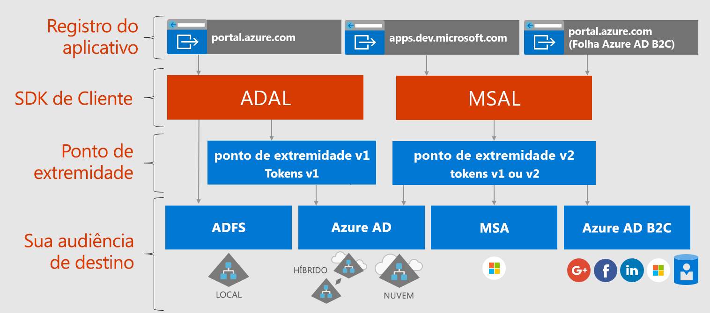

# Sobre a plataforma de identidade da Microsoft

A plataforma de identidade da Microsoft é uma evolução da plataforma de desenvolvedor e serviço de identidade do Azure AD (Azure Active Directory). Ela permite que os desenvolvedores criem aplicativos que se conectam a todas as identidades da Microsoft e obtenham tokens para chamar o Microsoft Graph, outras APIs da Microsoft ou APIs que os desenvolvedores criaram. Trata-se de uma plataforma completa que consiste em um serviço de autenticação, bibliotecas de software livre, registro de aplicativo e configuração (por meio de um portal de desenvolvedor e de uma API de aplicativo), documentação completa do desenvolvedor, exemplos de código e outros conteúdos do desenvolvedor. A plataforma de identidade da Microsoft dá suporte a protocolos padrão do setor, como OAuth 2.0 e OpenID Connect.

Até agora, a maioria dos desenvolvedores trabalhou com a plataforma v1.0 do Azure AD para autenticar identidades do Azure AD (contas corporativas e de estudante) solicitando tokens do ponto de extremidade do Azure AD v1.0, usando a ADAL (Biblioteca de Autenticação do Azure AD), o portal do Azure para registro e configuração de aplicativo e a API do Graph do Azure AD para configuração programática de aplicativo. A plataforma v1.0 do Azure AD é uma oferta de plataforma madura que continuará funcionando para aplicativos empresariais.

Para expandir e aprimorar os recursos da plataforma de identidade da Microsoft, agora você pode autenticar um conjunto mais amplo de identidades da Microsoft (identidades do Azure AD, contas da Microsoft [por exemplo, outlook.com e hotmail.com] e contas sociais e locais por meio do Azure AD B2C) usando o que tem sido chamado de ponto de extremidade v2.0 do Azure AD. Aqui, você usará a MSAL (Biblioteca de Autenticação da Microsoft) ou qualquer biblioteca de software livre do OAuth2.0 ou OpenID Connect, o portal do Azure para configuração e registro de aplicativo e a API do Microsoft Graph para configuração programática de aplicativo. A plataforma de identidade da Microsoft atualizada (em particular, as bibliotecas de MSAL e a experiência mais recente de registro de aplicativo do portal do Azure) evoluiu significativamente no último ano. Para finalizar esta versão, incentivamos os desenvolvedores a desenvolver e testar seus aplicativos usando a plataforma de identidade da Microsoft mais recente.

Aplicativos que usam a ADAL mais recente e a MSAL mais recente farão SSO entre si. Aplicativos atualizados da ADAL para a MSAL manterão o estado de entrada do usuário. Os desenvolvedores podem optar por atualizar seus aplicativos para a MSAL como acharem melhor, pois os aplicativos criados com a ADAL continuarão funcionando e terão suporte.

## Experiência da plataforma de identidade da Microsoft

O diagrama a seguir mostra a experiência de identidade da Microsoft de modo geral, incluindo a experiência de registro do aplicativo, SDKs, pontos de extremidade e identidades com suporte.

A plataforma de identidade da Microsoft tem dois pontos de extremidade (v1.0 e v2.0) e dois conjuntos de bibliotecas de cliente para lidar com esses pontos de extremidade. Ao desenvolver um novo aplicativo, considere as vantagens e o estado atual dos pontos de extremidade e das bibliotecas de autenticação. Considere também estes aspectos:

* Plataformas com suporte

    * A [ADAL](active-directory-authentication-libraries.md) dá suporte a .NET, JavaScript, iOS, Android, Java e Python
    * A [Versão prévia da MSAL](reference-v2-libraries.md) dá suporte a .NET, JavaScript, iOS e Android
    * Os dois pontos de extremidade dão suporte a middleware de servidor .NET e Node.js para proteger as APIs e a entrada. 

* A maior parte da inovação, como o consentimento dinâmico e o consentimento incremental, está acontecendo no ponto de extremidade v2.0 e na MSAL, enquanto continuamos dando suporte ao v1.0 e à ADAL.

    No portal do Azure, anteriormente você precisava identificar estaticamente todos os escopos de que seu aplicativo precisava. Com o ponto de extremidade v2.0 e os portais associados a ele, você pode definir os escopos estaticamente exatamente como antes ou pode solicitá-los dinamicamente conforme seu aplicativo precisar da permissão. A opção dinâmica fornece mais uma funcionalidade opcional, o consentimento incremental. O consentimento incremental permite que você solicite um subconjunto de escopos necessários quando um usuário é autenticado e solicite escopos adicionais conforme eles forem necessários. 
    
    Por exemplo, quando o usuário usa um aplicativo de câmera em um dispositivo móvel, é solicitado que ele permita que o aplicativo acesse a câmera, e somente após o consentimento do usuário o aplicativo terá permissão para acessar a câmera e tirar uma foto.  Quando estiver pronto para salvar a nova foto, o aplicativo poderá solicitar permissão para leitura/gravação de fotos. 

* Possíveis alterações de falha

    A MSAL é adequada para uso em um ambiente de produção. Fornecemos o mesmo suporte de nível de produção para a MSAL que fornecemos para nossas bibliotecas de produção atuais. Durante a versão prévia, podemos fazer alterações na API, no formato de cache interno e em outros mecanismos dessa biblioteca, o que você precisará aceitar junto com correções de bug ou melhorias de recursos. Isso pode afetar seu aplicativo. Por exemplo, uma alteração no formato de cache pode afetar os usuários, como a necessidade de se conectar novamente. Uma alteração na API pode exigir que você atualize o código. Quando fornecermos a versão de GA (disponibilidade geral), solicitaremos que você atualize para a versão de GA em até seis meses, pois aplicativos escritos usando uma versão prévia da biblioteca poderão deixar de funcionar.

## Próximas etapas

Saiba mais sobre o v1.0 e o v2.0.

* [Sobre a v1.0](azure-ad-developers-guide.md)
* [Sobre a v2.0](azure-ad-developers-guide.md)
