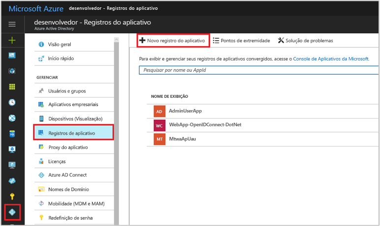
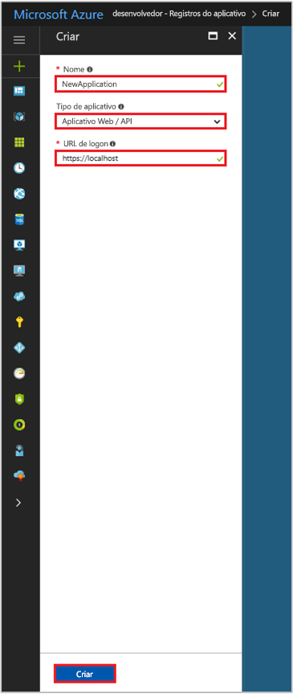

# Início rápido: Registrar um aplicativo com o ponto de extremidade v1.0 do Azure Active Directory

[!INCLUDE [active-directory-develop-applies-v1](../../../includes/active-directory-develop-applies-v1.md)]

Os desenvolvedores corporativos e provedores de SaaS (software como serviço) podem desenvolver serviços de nuvem comerciais ou aplicativos de linha de negócios que podem ser integrados ao Azure AD (Azure Active Directory) para fornecer conexão segura e autorização para seus serviços. Para integrar um aplicativo ou serviço ao Azure AD, um desenvolvedor deve primeiro registrar o aplicativo no Azure AD.

Para que você possa usar os recursos do AD do Azure em qualquer aplicativo desejado, primeiramente é preciso registrá-lo em um locatário do AD do Azure. Esse processo de registro envolve fornecer ao AD do Azure detalhes sobre seu aplicativo, como a URL em que ele está localizado, a URL à qual enviar respostas depois que um usuário é autenticado, o URI que identifica o aplicativo, etc.

Este início rápido mostra como adicionar e registrar um aplicativo no Azure AD usando a experiência de **Registros de aplicativo** existente no portal do Azure.

> [!NOTE]
> Registrando um novo aplicativo? Experimente o novo **Registros de aplicativos (Versão prévia)** no portal do Azure. Consulte [Registrar um aplicativo (Versão prévia)](quickstart-register-app.md) para começar a usar.

## Pré-requisitos

Para começar, tenha um locatário do Azure AD que você pode usar para registrar seus aplicativos. Se você ainda não tiver um locatário [saiba como obter um](quickstart-create-new-tenant.md).

## Registrar um novo aplicativo usando o portal do Azure

1. Entre no [Portal do Azure](https://portal.azure.com).
1. Se a sua conta der acesso a mais de um, selecione sua conta no canto superior direito e defina a sessão do portal para o locatário do Azure AD desejado.
1. No painel de navegação esquerdo, selecione o serviço do **Azure Active Directory**.
1. Selecione **Registros de aplicativo** e selecione **Novo registro de aplicativo**.

    

1. Quando a página **Criar** for exibida, insira as informações de registro do aplicativo: 

   - **Nome:** insira um nome significativo de aplicativo
   - **Tipo de Aplicativo:**
     - Selecione **Nativo** para [aplicativos cliente](developer-glossary.md#client-application) que são instalados localmente em um dispositivo. Essa configuração é usada para [clientes nativos](developer-glossary.md#native-client) públicos OAuth.
     - Selecione **aplicativo Web/API** para [aplicativos cliente](developer-glossary.md#client-application) e [aplicativos de API/recursos](developer-glossary.md#resource-server) que estão instalados em um servidor seguro. Essa configuração é usada para [clientes Web](developer-glossary.md#web-client) confidenciais OAuth e [clientes baseados em agente de usuário](developer-glossary.md#user-agent-based-client) públicos. O mesmo aplicativo também pode expor um cliente e o recurso/API.
   - **URL de Logon**: para aplicativos "API/aplicativo Web", informe a URL base do aplicativo. Por exemplo, `http://localhost:31544` pode ser uma URL para um aplicativo Web em execução no seu computador local. Os usuários usariam essa URL para entrar em um aplicativo cliente Web. 
   - **URI de redirecionamento:** para aplicativos "Nativos", informe o URI usado pelo Microsoft Azure AD para retornar respostas de token. Insira um valor específico para seu aplicativo, por exemplo, `http://MyFirstAADApp`

     

     Se você desejar exemplos específicos para aplicativos Web ou aplicativos nativos, confira os **Inícios rápidos** na nossa documentação.

1. Ao terminar, selecione **Criar**.

    O Azure AD atribui uma ID exclusiva do aplicativo para seu aplicativo e você é levado à página de registro principal de seu aplicativo. Dependendo de se o seu aplicativo é Web ou nativo, diferentes opções serão fornecidas para adicionar mais recursos ao aplicativo.

      > [!NOTE]
      > Por padrão, um aplicativo da Web recém-registrado é configurado para permitir que **apenas** usuários do mesmo locatário acessem seu aplicativo.

## Próximas etapas

- Veja [Estrutura de consentimento do Azure AD](consent-framework.md) para obter uma visão geral de consentimento.
- Para habilitar recursos adicionais de configuração em seu registro de aplicativo, como credenciais, permissões, habilitar entrada para usuários de outros locatários, veja [Atualizar um aplicativo no Azure AD](quickstart-v1-update-azure-ad-app.md).
- Saiba mais sobre os dois objetos do Azure AD que representam um aplicativo registrado e a relação entre eles, Veja [Objetos de aplicativo e objetos de entidade de serviço](app-objects-and-service-principals.md).
- Saiba mais sobre as diretrizes de identidade visual que você deve usar ao desenvolver aplicativos com o Azure Active Directory. Veja [Diretrizes de identidade visual para aplicativos](howto-add-branding-in-azure-ad-apps.md).
