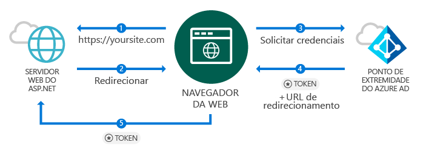
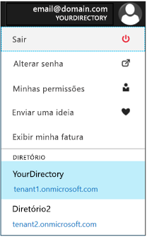
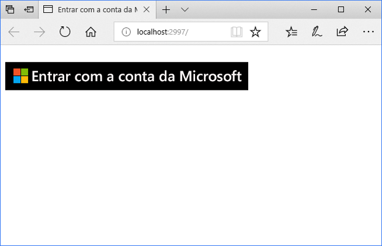
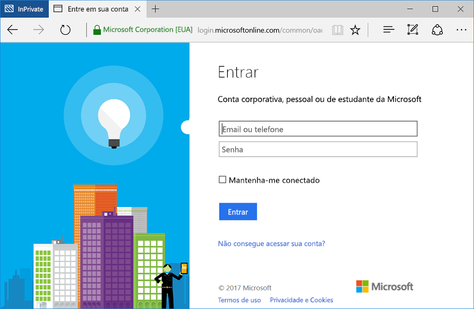

# <a name="quickstart-add-sign-in-with-microsoft-to-an-aspnet-web-app"></a>Início Rápido: Adicionar a opção Entrar com uma Conta da Microsoft a um aplicativo Web ASP.NET

[!INCLUDE [active-directory-develop-applies-v1](../../../includes/active-directory-develop-applies-v1.md)]

Neste início rápido, você aprenderá como implementar a entrada com a Microsoft usando uma solução ASP.NET MVC com um aplicativo tradicional baseado em navegador da Web usando o OpenID Connect. Você apenderá como habilitar entradas de contas corporativas e de estudantes em seu aplicativo ASP.NET.

No final deste início rápido, seu aplicativo aceitará entradas de contas corporativas e de estudantes de organizações integradas ao Azure AD (Azure Active Directory).

> [!NOTE]
> Se você precisar habilitar entradas para contas pessoais, além das contas corporativas e de estudantes, poderá usar o [ponto de extremidade v2.0](azure-ad-endpoint-comparison.md). Para obter mais informações, consulte [este tutorial do ASP.NET para o ponto de extremidade v2.0](tutorial-v2-asp-webapp.md), bem como [este artigo](active-directory-v2-limitations.md) que explica as limitações atuais do ponto de extremidade v2.0.

## <a name="prerequisites"></a>Pré-requisitos

Para começar, certifique-se de que estes pré-requisitos são atendidos:

* Ter o Visual Studio 2015 Atualização 3 ou o Visual Studio 2017 instalado. Ainda não tem? [Baixar o Visual Studio 2017 gratuitamente](https://www.visualstudio.com/downloads/)

## <a name="scenario-sign-in-users-from-work-and-school-accounts-in-your-aspnet-app"></a>Cenário: conectar usuários de contas corporativas e de estudantes em seu aplicativo ASP.NET



Neste cenário, um navegador acessa um site do ASP.NET e solicita que um usuário seja autenticado usando um botão Entrar. Nesse cenário, a maior parte do trabalho de renderização da página da Web ocorre no lado do servidor.

Este início rápido demonstra como realizar a entrada de usuários em um aplicativo Web ASP.NET começando com um modelo vazio e inclui etapas como adicionar um botão Entrar e cada controlador e métodos e discute os conceitos por trás dessas tarefas. Como alternativa, também é possível criar um projeto para realizar a entrada de usuários do Azure AD (contas corporativas e de estudantes) usando o [modelo Web do Visual Studio](https://docs.microsoft.com/aspnet/visual-studio/overview/2013/creating-web-projects-in-visual-studio#organizational-account-authentication-options) e selecionando **Contas organizacionais** e, em seguida, uma das opções de nuvem – essa opção usa um modelo mais avançado, com outros controladores, métodos e modos de exibição.

## <a name="libraries"></a>Bibliotecas

Este início rápido usa os seguintes pacotes:

| Biblioteca | DESCRIÇÃO |
|---|---|
| [Microsoft.Owin.Security.OpenIdConnect](https://www.nuget.org/packages/Microsoft.Owin.Security.OpenIdConnect/) | Middleware que permite que um aplicativo use OpenIdConnect para autenticação |
| [Microsoft.Owin.Security.Cookies](https://www.nuget.org/packages/Microsoft.Owin.Security.Cookies) |Middleware que permite que um aplicativo mantenha a sessão de usuário usando cookies |
| [Microsoft.Owin.Host.SystemWeb](https://www.nuget.org/packages/Microsoft.Owin.Host.SystemWeb) | Permite que os aplicativos baseado em OWIN sejam executados no IIS usando o pipeline de solicitação do ASP.NET |
|  |  |

## <a name="step-1-set-up-your-project"></a>Etapa 1: Configurar o seu projeto

Esta seção mostra como instalar e configurar o pipeline de autenticação por meio do middleware OWIN em um projeto do ASP.NET que usa o OpenID Connect.

Para baixar o projeto do Visual Studio deste exemplo, siga estas etapas:
1. [Baixe o projeto no GitHub](https://github.com/AzureADQuickStarts/WebApp-OpenIdConnect-DotNet/archive/GuidedSetup.zip).
1. Vá para a etapa de Configuração para configurar o exemplo de código antes da execução.

## <a name="step-2-create-your-aspnet-project"></a>Etapa 2: Criar seu projeto do ASP.NET

1. No Visual Studio, acesse **Arquivo > Novo > Projeto**.
2. Em **Visual C#\Web**, selecione **Aplicativo Web ASP.NET (.NET Framework)**.
3. Dê um nome ao aplicativo e selecione **OK**.
4. Selecione **Vazio** e, em seguida, marque a caixa de seleção para adicionar referências do **MVC**.

## <a name="step-3-add-authentication-components"></a>Etapa 3: Adicionar componentes de autenticação

1. No Visual Studio, acesse **Ferramentas > Gerenciador de Pacotes Nuget > Console do Gerenciador de Pacotes**.
2. Adicione **Pacotes NuGet do middleware OWIN** digitando o seguinte na janela do Console do Gerenciador de Pacotes:

    ```powershell
    Install-Package Microsoft.Owin.Security.OpenIdConnect
    Install-Package Microsoft.Owin.Security.Cookies
    Install-Package Microsoft.Owin.Host.SystemWeb
    ```

<!--start-collapse-->
> ### <a name="about-these-packages"></a>Sobre esses pacotes
>As bibliotecas acima possibilitam o SSO (logon único) usando o OpenID Connect por meio da autenticação baseada em cookie. Depois que a autenticação for concluída e o token que representa o usuário for enviado ao aplicativo, o middleware OWIN criará um cookie de sessão. Em seguida, o navegador usará esse cookie nas próximas solicitações, de forma que o usuário não precise se autenticar e nenhuma verificação adicional será necessária.
<!--end-collapse-->

## <a name="step-4-configure-the-authentication-pipeline"></a>Etapa 4: Configurar o pipeline de autenticação

Siga estas etapas para criar uma *Classe de inicialização* do middleware OWIN para configurar a autenticação do OpenID Connect. Essa classe é executada automaticamente.

> [!TIP]
> Se o projeto não tiver um arquivo `Startup.cs` na pasta raiz:<br/>
> 1. Clique com o botão direito do mouse na pasta raiz do projeto: > **Adicionar > Novo Item... > Classe de inicialização OWIN**<br/>
> 2. Nomeie-o `Startup.cs`<br/>
>
>> Verifique se a classe selecionada é uma Classe de Inicialização OWIN e não uma classe C# padrão. Confirme isso verificando se você consegue ver `[assembly: OwinStartup(typeof({NameSpace}.Startup))]` acima do namespace.

Para criar uma *Classe de inicialização* do middleware OWIN:

1. Adicione os namespaces *OWIN* e *Microsoft.IdentityModel* a `Startup.cs`:

    [!code-csharp[main](../../../WebApp-OpenIDConnect-DotNet/WebApp-OpenIDConnect-DotNet/Startup.cs?name=AddedNameSpaces "Startup.cs")]

2. Substitua a classe de Inicialização pelo seguinte código:

    [!code-csharp[main](../../../WebApp-OpenIDConnect-DotNet/WebApp-OpenIDConnect-DotNet/Startup.cs?name=Startup "Startup.cs")]

<!--start-collapse-->
> [!NOTE]
> Os parâmetros fornecidos em *OpenIDConnectAuthenticationOptions* servem como coordenadas para seu aplicativo se comunicar com o Azure AD. Como o middleware OpenID Connect usa cookies, você também precisa configurar a autenticação de cookie, conforme o código acima mostra. O valor *ValidateIssuer* informa OpenIdConnect para não restringir o acesso a uma organização específica.
<!--end-collapse-->

<!--end-setup-->

<!--start-use-->

## <a name="step-5-add-a-controller-to-handle-sign-in-and-sign-out-requests"></a>Etapa 5: Adicionar um controlador para manipular solicitações de entrada e saída

Crie um novo controlador para expor os métodos de entrada e de saída.

1.  Clique com o botão direito do mouse na pasta **Controladores** e selecione **Adicionar > Controlador**
2.  Selecione **Controlador MVC (versão do .NET) – Vazio**.
3.  Selecione **Adicionar**.
4.  Dê a ele o nome `HomeController` e selecione **Adicionar**.
5.  Adicione namespaces **OWIN** à classe:

    [!code-csharp[main](../../../WebApp-OpenIDConnect-DotNet/WebApp-OpenIDConnect-DotNet/Controllers/HomeController.cs?name=AddedNameSpaces "HomeController.cs")]

6. Adicione os seguintes métodos para manipular a entrada e saída do controlador iniciando um desafio de autenticação por meio de código:

    [!code-csharp[main](../../../WebApp-OpenIDConnect-DotNet/WebApp-OpenIDConnect-DotNet/Controllers/HomeController.cs?name=SigInAndSignOut "HomeController.cs")]

## <a name="step-6-create-the-apps-home-page-to-sign-in-users-via-a-sign-in-button"></a>Etapa 6: Criar a home page do aplicativo para conectar os usuários por meio de um botão de conexão

No Visual Studio, crie uma nova exibição para adicionar o botão de conexão e exibir informações de usuário após a autenticação:

1. Clique com o botão direito do mouse na pasta **Exibições\Início** e selecione **Adicionar exibição**.
1. Dê a ela o nome **Índice**.
1. Adicione o seguinte HTML, que inclui o botão de conexão, ao arquivo:

    [!code-html[main](../../../WebApp-OpenIDConnect-DotNet/WebApp-OpenIDConnect-DotNet/Views/Home/Index.cshtml "Index.cshtml")]

<!--start-collapse--> Esta página adiciona um botão Entrar no formato SVG com uma tela de fundo preta:<br/><br/> Para obter mais botões Entrar, acesse [Diretrizes de identidade visual para aplicativos](howto-add-branding-in-azure-ad-apps.md).
<!--end-collapse-->

## <a name="step-7-display-users-claims-by-adding-a-controller"></a>Etapa 7: Exiba as declarações do usuário adicionando um controlador

Esse controlador demonstra os usos do atributo `[Authorize]` para proteger um controlador. Esse atributo restringe o acesso ao controlador permitindo apenas usuários autenticados. O código a seguir usa o atributo para exibir as declarações de usuário que foram recuperadas como parte da conexão.

1. Clique com o botão direito do mouse na pasta **Controladores** e, em seguida, selecione **Adicionar > Controlador**.
1. Selecione **Controlador MVC {versão} – Vazio**.
1. Selecione **Adicionar**.
1. Dê a ele o nome **ClaimsController**.
1. Substitua o código da classe de controlador pelo código a seguir – isso adiciona o atributo `[Authorize]` à classe:

    [!code-csharp[main](../../../WebApp-OpenIDConnect-DotNet/WebApp-OpenIDConnect-DotNet/Controllers/ClaimsController.cs?name=ClaimsController "ClaimsController.cs")]

<!--start-collapse-->
> [!NOTE]
> Devido ao uso do atributo `[Authorize]`, todos os métodos desse controlador podem ser executados apenas se o usuário está autenticado. Se o usuário não estiver autenticado e tentar acessar o controlador, o OWIN iniciará um desafio de autenticação e forçará o usuário a se autenticar. O código acima examina a coleção de declarações do usuário em busca de atributos específicos incluídos no token do usuário. Esses atributos incluem o nome completo do usuário e o nome de usuário, bem como a entidade de identificador de usuário global. Também contém a *ID de Locatário*, que representa a ID da organização do usuário.
<!--end-collapse-->

## <a name="step-8-create-a-view-to-display-the-users-claims"></a>Etapa 8: Criar uma exibição para exibir as declarações do usuário

No Visual Studio, crie uma nova exibição para exibir as declarações do usuário em uma página da Web:

1. Clique com o botão direto do mouse na pasta **Exibições\Declarações** e, em seguida, selecione **Adicionar exibição**.
1. Dê a ela o nome **Índice**.
1. Adicione o seguinte HTML ao arquivo:

    [!code-html[main](../../../WebApp-OpenIDConnect-DotNet/WebApp-OpenIDConnect-DotNet/Views/Claims/Index.cshtml "Index.cshtml")]

<!--end-use-->

<!--start-configure-->

## <a name="step-9-configure-your-webconfig-and-register-an-application"></a>Etapa 9: Configurar seu *Web.config* e registrar um aplicativo

1. No Visual Studio, adicione o seguinte a `web.config` (localizado na pasta raiz), na seção `configuration\appSettings`:

    ```xml
    <add key="ClientId" value="Enter_the_Application_Id_here" />
    <add key="RedirectUrl" value="Enter_the_Redirect_Url_here" />
    <add key="Tenant" value="common" />
    <add key="Authority" value="https://login.microsoftonline.com/{0}" />
    ```
2. No Gerenciador de Soluções, selecione o projeto e examine a janela <i>Propriedades</i> (se uma janela Propriedades não for exibida, pressione F4)
3. Altere SSL habilitado para <code>True</code>
4. Copie URL de SSL do projeto para a área de transferência:<br/><br/><br />
5. Em <code>web.config</code>, substitua <code>Enter_the_Redirect_URL_here</code> pela URL do SSL do projeto.

### <a name="register-your-application-in-the-azure-portal-then-add-its-information-to-webconfig"></a>Registre seu aplicativo no Portal do Azure, em seguida, adicione as informações a *web.config*

1. Acesse o [Portal do Microsoft Azure – Registros de aplicativo](https://portal.azure.com/#blade/Microsoft_AAD_IAM/ActiveDirectoryMenuBlade/RegisteredApps) para registrar um aplicativo.
2. Selecione **Novo registro de aplicativo**.
3. Insira um nome para seu aplicativo.
4. Cole a *URL do SSL* do projeto do Visual Studio na **URL de logon**. Esta URL também é adicionada automaticamente à lista de URLs de resposta para o aplicativo que você está registrando.
5. Selecione **Criar** para registrar o aplicativo. Essa ação o levará de volta para a lista de aplicativos.
6. Agora, pesquise e/ou selecione o aplicativo que você acabou de criar para abrir suas propriedades.
7. Copie o GUID em **ID do aplicativo** para a área de transferência.
8. Volte ao Visual Studio e, em `web.config`, substitua `Enter_the_Application_Id_here` pela ID do Aplicativo que você acabou de registrar.

> [!TIP]
> Se sua conta está configurada para acesso a vários diretórios, verifique se você selecionou o diretório certo para a organização que deseja que o aplicativo seja registrado clicando no nome da sua conta no canto superior direito no Portal do Azure e, em seguida, verificando o diretório selecionado como indicado:<br/>

## <a name="step-10-configure-sign-in-options"></a>Etapa 10: Configurar opções de entrada

É possível configurar seu aplicativo para permitir apenas usuários que pertencem à instância do Azure AD de uma organização ou aceitar entradas de usuários que pertencem a qualquer organização. Siga as instruções de uma das seguintes opções:

### <a name="configure-your-application-to-allow-sign-ins-of-work-and-school-accounts-from-any-company-or-organization-multi-tenant"></a>Configurar seu aplicativo para permitir entradas de contas corporativas e de estudantes de qualquer empresa ou organização (multilocatário)

Siga as próximas etapas se desejar aceitar entradas de contas corporativas e de estudantes de qualquer empresa ou organização com integração ao Azure AD. Este é um cenário comum para *aplicativos SaaS*:

1. Volte para o [Portal do Microsoft Azure – Registros de aplicativo](https://portal.azure.com/#blade/Microsoft_AAD_IAM/ActiveDirectoryMenuBlade/RegisteredApps) e localize o aplicativo que você acabou de registrar.
2. Em **Todas as configurações**, selecione **Propriedades**.
3. Altere a propriedade **Multilocatário** para **Sim** e, em seguida, selecione **Salvar**.

Para obter mais informações sobre essa configuração e o conceito de aplicativos multilocatário, consulte [Multi-tenant overview](howto-convert-app-to-be-multi-tenant.md) (Visão geral de multilocatário).

### <a name="restrict-users-from-only-one-organizations-active-directory-instance-to-sign-in-to-your-application-single-tenant"></a>Restrinja usuários da instância do Active Directory de uma única organização entre no seu aplicativo (único locatário)

Essa opção é um cenário comum para aplicativos de linha de negócios.

Se desejar que seu aplicativo aceite entradas apenas de contas pertencentes a uma instância específica do Azure AD (incluindo *contas de convidados* dessa instância), siga estas etapas:

1. Substitua o parâmetro `Tenant` em *web.config* de `Common` pelo nome do locatário da organização– por exemplo, *contoso.onmicrosoft.com*.
1. Altere o argumento `ValidateIssuer` em sua [*Classe de inicialização OWIN*](#step-4-configure-the-authentication-pipeline) para `true`.

Para permitir usuários apenas de uma única lista de organizações específicas, siga estas etapas:

1. Defina `ValidateIssuer` como true.
1. Use o parâmetro `ValidIssuers` para especificar uma lista de organizações.

Outra opção é implementar um método personalizado para validar os emissores usando o parâmetro *IssuerValidator*. Para saber mais sobre `TokenValidationParameters`, veja [este artigo do MSDN](https://msdn.microsoft.com/library/system.identitymodel.tokens.tokenvalidationparameters.aspx "Artigo do MSDN TokenValidationParameters").

<!--end-configure-->

<!--start-configure-arp-->
<!--
## Configure your ASP.NET Web App with the application's registration information

In this step, you will configure your project to use SSL, and then use the SSL URL to configure your application’s registration information. After this, add the application’ registration information to your solution via *web.config*.

1.  In Solution Explorer, select the project and look at the `Properties` window (if you don’t see a Properties window, press F4)
2.  Change `SSL Enabled` to `True`
3.  Copy the value from `SSL URL` above and paste it in the `Redirect URL` field on the top of this page, then click *Update*:<br/><br/><br />
4.  Add the following in `web.config` file located in root’s folder, under section `configuration\appSettings`:

```xml
<add key="ClientId" value="[Enter the application Id here]" />
<add key="RedirectUri" value="[Enter the Redirect URL here]" />
<add key="Tenant" value="common" />
<add key="Authority" value="https://login.microsoftonline.com/{0}" /> 
```
-->
<!--end-configure-arp-->
<!--start-test-->

## <a name="step-11-test-your-code"></a>Etapa 11: Testar seu código

1. Pressione **F5** para executar o projeto no Visual Studio. O navegador é aberto e direciona você para `http://localhost:{port}`, em que é possível ver o botão **Entrar com uma conta da Microsoft**.
1. Selecione um botão para entrar.

### <a name="sign-in"></a>Entrar

Quando estiver pronto para testar, use uma conta corporativa (Azure AD) para entrar.





#### <a name="expected-results"></a>Resultados esperados

Depois de se conectar, o usuário é redirecionado para a home page do site, que é a URL HTTPS especificada nas informações de registro do aplicativo no Portal de Registro de Aplicativos da Microsoft. Essa página agora mostra *Olá, {User}* e um link para a saída, além de um link para consultar as declarações do usuário – que é um link para o controlador Autorizar criado anteriormente.

### <a name="see-users-claims"></a>Consultar as declarações do usuário

Selecione o hiperlink para consultar as declarações do usuário. Essa ação leva você para o controlador e a exibição que está disponível somente para usuários autenticados.

#### <a name="expected-results"></a>Resultados esperados

 Você deverá ver uma tabela que contém as propriedades básicas do usuário conectado:

| Propriedade | Valor | DESCRIÇÃO |
|---|---|---|
| NOME | {Nome completo do usuário} | Nome e sobrenome do usuário |
| Nome de Usuário | <span>user@domain.com</span> | O nome de usuário usado para identificar o usuário conectado |
| Assunto| {Subject} |Uma cadeia de caracteres para identificar exclusivamente o logon do usuário na Web |
| ID do locatário | {Guid} | Um *guid* para representar exclusivamente a organização do Azure AD do usuário |

Além disso, você pode ver uma tabela que inclui todas as declarações de usuário incluídas na solicitação de autenticação. Para obter uma lista de todas as declarações em um Token de ID e suas explicações, consulte [List of claims in ID token](https://docs.microsoft.com/azure/active-directory/develop/active-directory-token-and-claims) (Lista de declarações no Token de ID).

### <a name="optional-access-a-method-that-has-an-authorize-attribute"></a>(Opcional) Acesse um método que tem um atributo *[Autorizar]*

Nesta etapa, você testa o acesso ao controlador de Declarações como um usuário anônimo:<br/>
Selecione o link para desconectar o usuário e concluir o processo de saída.<br/>
Agora no navegador, digite http://localhost:{port}/claims para acessar o controlador que está protegido com o atributo `[Authorize]`

#### <a name="expected-results"></a>Resultados esperados

Você deverá receber o prompt exigindo a autenticação para ver a exibição.

## <a name="additional-information"></a>Informações adicionais

<!--start-collapse-->
### <a name="protect-your-entire-web-site"></a>Proteger todo o seu site

Para proteger todo o seu site, adicione o `AuthorizeAttribute` a `GlobalFilters` no método `Global.asax` `Application_Start`:

```csharp
GlobalFilters.Filters.Add(new AuthorizeAttribute());
```
<!--end-collapse-->

<div></div>
<br/>

<!--end-test-->

## <a name="next-steps"></a>Próximas etapas

Agora você pode passar para cenários de adicionais.

> [!div class="nextstepaction"]
> [Tutorial do ASP.NET](https://docs.microsoft.com/azure/active-directory/develop/tutorial-v2-asp-webapp)
