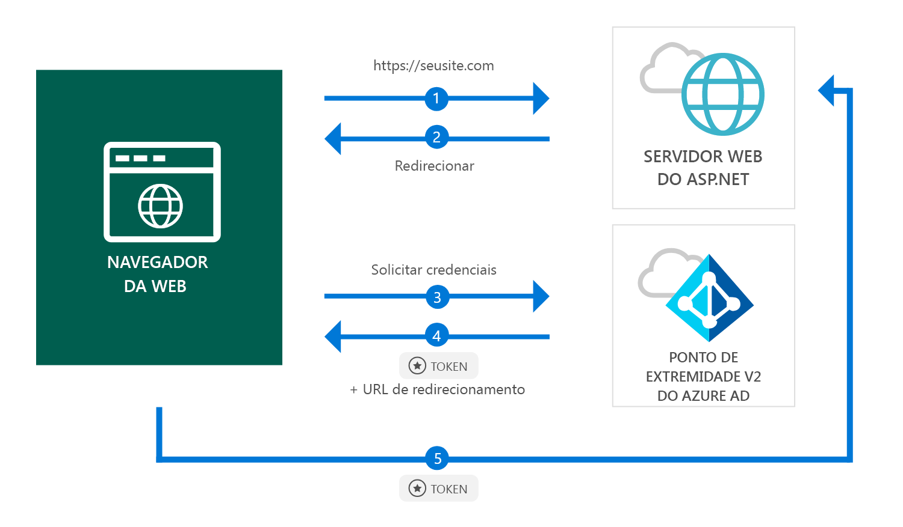

# <a name="quickstart-add-sign-in-with-microsoft-to-an-aspnet-web-app"></a>Início Rápido: adicionar entrada com a Microsoft a um aplicativo Web ASP.NET

[!INCLUDE [active-directory-develop-applies-v2](../../../includes/active-directory-develop-applies-v2.md)]

Neste início rápido, você aprenderá como um aplicativo Web ASP.NET pode entrar em contas pessoais (hotmail.com, outlook.com, outros) e contas corporativas e de estudante de qualquer instância do Azure AD (Azure Active Directory).



> [!div renderon="docs"]
> ## <a name="register-your-application-and-download-your-quickstart-app"></a>Registrar seu aplicativo e baixe seu aplicativo de início rápido
>
> ### <a name="register-and-configure-your-application-and-code-sample"></a>Registre e configure seu aplicativo e exemplo de código
> #### <a name="step-1-register-your-application"></a>Etapa 1: Registrar seu aplicativo
> 
> 1. Vá até o [Portal de Registro de Aplicativos da Microsoft](https://apps.dev.microsoft.com/portal/register-app).
> 1. Insira um nome para seu aplicativo, verifique se a opção **Instalação Guiada** está desmarcada e clique em **Criar**.
> 1. Clique em `Add Platform` e escolha `Web`.
> 1. Verifique se **Permitir Fluxo Implícito** está *marcado*.
> 1. Em **URLs de Redirecionamento**, insira `https://localhost:44368/`.
> 1. Role para baixo até a base da página e clique em **Salvar**.

> [!div class="sxs-lookup" renderon="portal"]
> #### <a name="step-1-configure-your-application-in-azure-portal"></a>Etapa 1: Configurar seu aplicativo no portal do Azure
> Para que o exemplo de código deste início rápido funcione, você precisa adicionar uma URL de resposta como `https://localhost:44368/`.
> > [!div renderon="portal" id="makechanges" class="nextstepaction"]
> > [Fazer essa alteração para mim]()
>
> > [!div id="appconfigured" class="alert alert-info"]
> >  Seu aplicativo já está configurado com esse atributo

#### <a name="step-2-download-your-project"></a>Etapa 2: Baixar o seu projeto

[Baixar a solução do Visual Studio 2017](https://github.com/AzureADQuickStarts/AppModelv2-WebApp-OpenIDConnect-DotNet/archive/master.zip)

#### <a name="step-3-configure-your-visual-studio-project"></a>Etapa 3: Configurar o projeto do Visual Studio

1. Extraia o arquivo zip para uma pasta local mais próxima da pasta raiz, por exemplo, **C:\Azure-Samples**
1. Abra a solução no Visual Studio (AppModelv2-WebApp-OpenIDConnect-DotNet.sln)
1. Edite **Web.config** e substitua `Enter_the_Application_Id_here` pela ID do Aplicativo referente ao aplicativo que você acabou de registrar:

    ```xml
    <add key="ClientId" value="Enter_the_Application_Id_here" />
    ```
    
> [!div class="sxs-lookup" renderon="portal"]
> [!IMPORTANT]
> Se seu aplicativo for um *aplicativo de locatário único* (direcionado a contas neste diretório somente), no arquivo **Web.config**, localize o valor para `Tenant` e substitua `common` pela **ID do locatário** ou pelo **Nome do locatário** (por exemplo, contoso.microsoft.com). Você pode obter o nome do locatário na **página Visão Geral**.

## <a name="more-information"></a>Mais informações

Esta seção apresenta uma visão geral do código necessário para a entrada de usuários. Isso pode ser útil para entender como o código funciona, os argumentos principais e também caso você queira adicionar entrada a um aplicativo ASP.NET existente.

### <a name="owin-middleware-nuget-packages"></a>Pacotes do NuGet de middleware OWIN

Você pode configurar o pipeline de autenticação com a autenticação baseada em cookies usando o OpenID Connect no ASP.NET com pacotes de Middleware OWIN. Você pode instalar esses pacotes executando os seguintes comandos no **Console do Gerenciador de Pacotes** do Visual Studio:

```powershell
Install-Package Microsoft.Owin.Security.OpenIdConnect
Install-Package Microsoft.Owin.Security.Cookies
Install-Package Microsoft.Owin.Host.SystemWeb
```

### <a name="owin-startup-class"></a>Classe de Inicialização OWIN

O middleware OWIN usa uma *classe de inicialização* que é executada quando o processo de hospedagem é inicializado (no caso deste início rápido, o arquivo *startup.cs* localizado na pasta raiz). O código a seguir mostra o parâmetro usado por este início rápido:

```csharp
public void Configuration(IAppBuilder app)
{
    app.SetDefaultSignInAsAuthenticationType(CookieAuthenticationDefaults.AuthenticationType);

    app.UseCookieAuthentication(new CookieAuthenticationOptions());
    app.UseOpenIdConnectAuthentication(
        new OpenIdConnectAuthenticationOptions
        {
            // Sets the ClientId, authority, RedirectUri as obtained from web.config
            ClientId = clientId,
            Authority = authority,
            RedirectUri = redirectUri,
            // PostLogoutRedirectUri is the page that users will be redirected to after sign-out. In this case, it is using the home page
            PostLogoutRedirectUri = redirectUri,
            Scope = OpenIdConnectScope.OpenIdProfile,
            // ResponseType is set to request the id_token - which contains basic information about the signed-in user
            ResponseType = OpenIdConnectResponseType.IdToken,
            // ValidateIssuer set to false to allow personal and work accounts from any organization to sign in to your application
            // To only allow users from a single organizations, set ValidateIssuer to true and 'tenant' setting in web.config to the tenant name
            // To allow users from only a list of specific organizations, set ValidateIssuer to true and use ValidIssuers parameter 
            TokenValidationParameters = new TokenValidationParameters()
            {
                ValidateIssuer = false
            },
            // OpenIdConnectAuthenticationNotifications configures OWIN to send notification of failed authentications to OnAuthenticationFailed method
            Notifications = new OpenIdConnectAuthenticationNotifications
            {
                AuthenticationFailed = OnAuthenticationFailed
            }
        }
    );
}
```

> |Where  |  |
> |---------|---------|
> | `ClientId`     | ID do aplicativo referente ao aplicativo registrado no portal do Azure |
> | `Authority`    | O ponto de extremidade do STS para o usuário autenticar. Geralmente https://login.microsoftonline.com/{tenant}/v2.0 para a nuvem pública, em que {tenant} é o nome do seu locatário, sua ID do locatário ou *common* para uma referência ao ponto de extremidade comum (usado para aplicativos multilocatário) |
> | `RedirectUri`  | URL à qual os usuários são enviados após a autenticação com relação ao ponto de extremidade do Azure AD v2.0 |
> | `PostLogoutRedirectUri`     | URL à qual os usuários são enviados após saírem |
> | `Scope`     | A lista de escopos que estão sendo solicitados, separados por espaços |
> | `ResponseType`     | Solicitação de que a resposta da autenticação contenha um token de ID |
> | `TokenValidationParameters`     | Uma lista de parâmetros para validação de token. Nesse caso, `ValidateIssuer` é definido como `false` para indicar que ele pode aceitar entradas de quaisquer tipos de conta corporativa ou de estudante ou pessoal |
> | `Notifications`     | Uma lista de delegados que podem ser executados em diferentes mensagens *OpenIdConnect* |

### <a name="initiate-an-authentication-challenge"></a>Iniciar um desafio de autenticação

Você pode forçar um usuário a entrar solicitando um desafio de autenticação em seu controlador:

```csharp
public void SignIn()
{
    if (!Request.IsAuthenticated)
    {
        HttpContext.GetOwinContext().Authentication.Challenge(
            new AuthenticationProperties{ RedirectUri = "/" },
            OpenIdConnectAuthenticationDefaults.AuthenticationType);
    }
}
```

> [!TIP]
> Solicitar um desafio de autenticação usando o método acima é opcional e normalmente é usado quando você deseja que uma exibição fique acessível para usuários autenticados e não autenticados. Como alternativa, você pode proteger os controladores usando o método descrito na próxima seção.

### <a name="protect-a-controller-or-a-controllers-method"></a>Proteger um controlador ou um método do controlador

Você pode proteger um controlador ou ações do controlador usando o atributo `[Authorize]`. Esse atributo restringe o acesso ao controlador ou ações permitindo que somente usuários autenticados possam acessar as ações no controlador, o que significa que o desafio de autenticação ocorrerá automaticamente quando um usuário *não autenticado* tentar acessar uma das ações ou controlador decoradas pelo atributo `[Authorize]`.

## <a name="next-steps"></a>Próximas etapas

Experimente o tutorial do ASP.NET para um guia passo a passo completo sobre a criação de aplicativos e novos recursos, incluindo uma explicação completa deste início rápido.

### <a name="learn-the-steps-to-create-the-application-used-in-this-quickstart"></a>Conheça as etapas para criar o aplicativo usado neste início rápido

> [!div class="nextstepaction"]
> [Tutorial de entrada](.\tutorial-v2-asp-webapp.md)

[!INCLUDE [Help and support](../../../includes/active-directory-develop-help-support-include.md)]