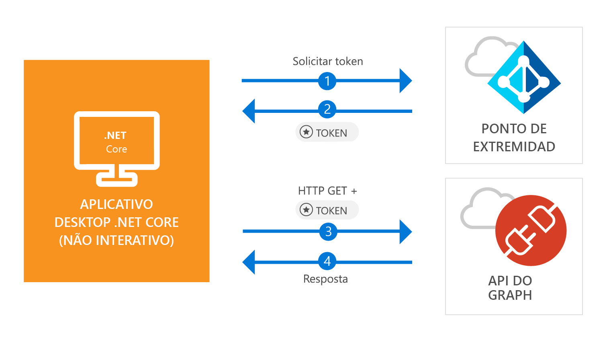

# <a name="quickstart-acquire-a-token-and-call-microsoft-graph-api-from-a-console-app-using-apps-identity"></a>Início Rápido: Adquirir um token e chamar a API do Microsoft Graph de um aplicativo de console usando a identidade do aplicativo

[!INCLUDE [active-directory-develop-applies-v2-msal](../../../includes/active-directory-develop-applies-v2-msal.md)]

Neste início rápido, você aprenderá a escrever um aplicativo .NET Core que pode obter um token de acesso usando a identidade do aplicativo e, em seguida, chamar a API do Microsoft Graph para exibir uma [lista de usuários](https://docs.microsoft.com/graph/api/user-list) no diretório. Esse cenário é útil para situações em que o trabalho autônomo e sem periféricos, ou um serviço de janela, precisa ser executado com uma identidade do aplicativo em vez de uma identidade de usuário.



## <a name="prerequisites"></a>Pré-requisitos

Este início rápido exige o [.NET Core 2.1](https://www.microsoft.com/net/download/dotnet-core/2.1).

> [!div renderon="docs"]
> ## <a name="register-and-download-your-quickstart-app"></a>Registrar e baixar o aplicativo de início rápido

> [!div renderon="docs" class="sxs-lookup"]
>
> Você tem duas opções para iniciar o aplicativo de início rápido:
> * [Express] [Opção 1: Registrar e configurar o aplicativo automaticamente e, em seguida, baixar seu exemplo de código](#option-1-register-and-auto-configure-your-app-and-then-download-your-code-sample)
> * [Manual] [Opção 2: Registrar e configurar manualmente o aplicativo e o exemplo de código](#option-2-register-and-manually-configure-your-application-and-code-sample)
>
> ### <a name="option-1-register-and-auto-configure-your-app-and-then-download-your-code-sample"></a>Opção 1: Registrar e configurar o aplicativo automaticamente e, em seguida, baixar seu exemplo de código
>
> 1. Vá para o [portal do Azure – Registro de Aplicativo (Versão Prévia)](https://portal.azure.com/?Microsoft_AAD_RegisteredApps=true#blade/Microsoft_AAD_RegisteredApps/applicationsListBlade/quickStartType/DotNetCoreDaemonQuickstartPage/sourceType/docs).
> 1. Insira um nome para seu aplicativo e selecione **Registrar**.
> 1. Siga as instruções para baixar e configurar automaticamente o novo aplicativo com apenas um clique.
>
> ### <a name="option-2-register-and-manually-configure-your-application-and-code-sample"></a>Opção 2: Registrar e configurar manualmente o aplicativo e o exemplo de código

> [!div renderon="docs"]
> #### <a name="step-1-register-your-application"></a>Etapa 1: Registre seu aplicativo
> Para registrar seu aplicativo e adicionar as informações de registro do aplicativo à solução manualmente, siga estas etapas:
>
> 1. Entre no [portal do Azure](https://portal.azure.com) usando uma conta corporativa ou de estudante ou uma conta pessoal da Microsoft.
> 1. Se sua conta fornecer acesso a mais de um locatário, selecione sua conta no canto superior direito e defina sua sessão do portal para o locatário desejado do Azure AD.
> 1. No painel de navegação à esquerda, selecione o serviço **Azure Active Directory** e selecione **Registros de aplicativo (Versão prévia)** > **Novo registro**.
> 1. Na seção **Nome**, insira um nome de aplicativo relevante que será exibido aos usuários do aplicativo, por exemplo, `Daemon-console`, e selecione **Registrar** para criar o aplicativo.
> 1. Após o registro, selecione o menu **Certificados e segredos**.
> 1. Em **Segredos do cliente**, selecione **+ Novo segredo do cliente**. Dê a ele um nome e selecione **Adicionar**. Copie o segredo em um local seguro. Você precisará dele em seu código.
> 1. Agora, selecione o menu **Permissões de API**, selecione o botão **+ Adicionar uma permissão** e selecione **Microsoft Graph**.
> 1. Selecione **Permissões de aplicativo**.
> 1. No nó **Usuário**, selecione **User.Read.All** e selecione **Adicionar permissões**

> [!div class="sxs-lookup" renderon="portal"]
> ### <a name="download-and-configure-your-quickstart-app"></a>Baixar e configurar seu aplicativo de início rápido
> 
> #### <a name="step-1-configure-your-application-in-azure-portal"></a>Etapa 1: Configurar seu aplicativo no portal do Azure
> Para o exemplo de código deste início rápido funcionar, você precisará criar um segredo do cliente e adicionar a permissão de aplicativo **User.Read.All** da API do Graph.
> > [!div renderon="portal" id="makechanges" class="nextstepaction"]
> > [Fazer essas alterações para mim]()
>
> > [!div id="appconfigured" class="alert alert-info"]
> >  Seu aplicativo já está configurado com esses atributos.

#### <a name="step-2-download-your-visual-studio-project"></a>Etapa 2: Baixar seu projeto do Visual Studio

[Baixar o projeto do Visual Studio](https://github.com/Azure-Samples/active-directory-dotnetcore-daemon-v2/archive/master.zip)

#### <a name="step-3-configure-your-visual-studio-project"></a>Etapa 3: Configurar o projeto do Visual Studio

1. Extraia o arquivo zip para uma pasta local mais próxima da raiz do disco, por exemplo, **C:\Azure-Samples**.
1. Abra a solução no Visual Studio – **daemon-console.sln** (opcional).
1. Edite **appsettings.json** e substitua os valores dos campos `ClientId`, `Tenant` e `ClientSecret` pelo seguinte:

    ```json
    "Tenant": "Enter_the_Tenant_Id_Here",
    "ClientId": "Enter_the_Application_Id_Here",
    "ClientSecret": "Enter_the_Client_Secret_Here"
    ```
    > > [!div renderon="portal" id="certandsecretspage" class="sxs-lookup"]
    > > [Gerar um novo segredo do cliente]()
    
    > [!div renderon="docs"]
    >> Em que:
    >> * `Enter_the_Application_Id_Here` - é a **ID do aplicativo (cliente)** que você registrou.
    >> * `Enter_the_Tenant_Id_Here` – substitua esse valor pela **ID do locatário** ou pelo **Nome do locatário** (por exemplo, contoso.microsoft.com)
    >> * `Enter_the_Client_Secret_Here` – substitua esse valor pelo segredo do cliente criado na etapa 1.

    > [!div renderon="docs"]
    > > [!TIP]
    > > Para encontrar os valores de **ID do aplicativo (cliente)**, **ID de diretório (locatário)**, acesse a página **Visão Geral** do aplicativo no portal do Azure. Para gerar uma nova chave, acesse a página **Certificados e segredos**.
    
#### <a name="step-4-admin-consent"></a>Etapa 4: Consentimento do administrador

Se você tentar executar o aplicativo neste ponto, receberá o erro *HTTP 403 – Proibido*: `Insufficient privileges to complete the operation`. Isso acontece porque qualquer *permissão somente do aplicativo* exige o consentimento do administrador, ou seja, um administrador global do seu diretório precisa dar consentimento ao seu aplicativo. Selecione uma das opções abaixo, dependendo de sua função:

##### <a name="global-tenant-administrator"></a>Administrator de locatário global

> [!div renderon="docs"]
> Se você for um administrador de locatário global, acesse a página **Permissões de API** no Registro de Aplicativo do Portal do Azure (versão prévia) e selecione **Dar consentimento de administrador para {nome do locatário}** (em que {nome do locatário} é o nome do seu diretório).

> [!div renderon="portal" class="sxs-lookup"]
> Se você for um administrador global, acesse a página **Permissões de API**, selecione **Dar consentimento de administrador para Insira_o_nome_do_locatário_aqui**
> > [!div id="apipermissionspage"]
> > [Acesse a página Permissões de API]()

##### <a name="standard-user"></a>Usuário padrão

Se você for usuário padrão do seu locatário, precisará pedir consentimento do administrador ao administrador global do seu aplicativo. Para fazer isso, dê a seguinte URL ao administrador:

```url
https://login.microsoftonline.com/Enter_the_Tenant_Id_Here/adminconsent?client_id=Enter_the_Application_Id_Here
```

> [!div renderon="docs"]
>> Em que:
>> * `Enter_the_Tenant_Id_Here` – substitua esse valor pela **ID do locatário** ou pelo **Nome do locatário** (por exemplo, contoso.microsoft.com)
>> * `Enter_the_Application_Id_Here` - é a **ID do aplicativo (cliente)** que você registrou.

> [!NOTE]
> Você pode ver o erro *'AADSTS50011: nenhum endereço de resposta está registrado para o aplicativo'* após dar o consentimento ao aplicativo usando a URL anterior. Isso ocorre porque esse aplicativo e a URL não têm um URI de redirecionamento; ignore o erro.

#### <a name="step-5-run-the-application"></a>Etapa 5: Executar o aplicativo

Se você estiver usando o Visual Studio, pressione **F5** para executar o aplicativo; caso contrário, execute o aplicativo por meio do prompt de comando ou console:

```console
cd {ProjectFolder}\daemon-console
dotnet run
```

> Em que:
> * *{ProjectFolder}* é a pasta onde você extraiu o arquivo zip. Exemplo **C:\Azure-Samples\active-directory-dotnetcore-daemon-v2**

Você deverá ver uma lista de usuários em seu diretório do Azure AD como resultado.

> [!IMPORTANT]
> Este aplicativo de início rápido usa um segredo do cliente para se identificar como cliente confidencial. Como o segredo do cliente é adicionado como texto sem formatação a seus arquivos de projeto, por motivos de segurança, é recomendável que você use um certificado, em vez de um segredo do cliente, antes de considerar o aplicativo como aplicativo de produção. Para obter mais informações sobre como usar um certificado, confira [estas instruções](https://github.com/Azure-Samples/active-directory-dotnetcore-daemon-v2/#variation-daemon-application-using-client-credentials-with-certificates) no repositório do GitHub para este exemplo.

## <a name="more-information"></a>Mais informações

### <a name="msalnet"></a>MSAL.NET

MSAL ([Microsoft.Identity.Client](https://www.nuget.org/packages/Microsoft.Identity.Client)) é a biblioteca usada para conectar usuários e solicitar tokens usados para acessar uma API protegida pelo Azure AD (Microsoft Azure Active Directory). Conforme descrito, este início rápido solicita tokens usando a identidade do próprio aplicativo, em vez de permissões delegadas. O fluxo de autenticação usado nesse caso é conhecido como *[fluxo OAuth de credenciais do cliente](v2-oauth2-client-creds-grant-flow.md)*. Para saber mais sobre como usar MSAL.NET com fluxo de credenciais de cliente, confira [este artigo](https://aka.ms/msal-net-client-credentials).

 Você pode instalar o MSAL.NET executando o comando abaixo no **Console do Gerenciador de Pacotes** do Visual Studio:

```powershell
Install-Package Microsoft.Identity.Client
```

Como alternativa, se você não estiver usando o Visual Studio, poderá executar o seguinte comando para adicionar MSAL ao seu projeto:

```console
dotnet add package Microsoft.Identity.Client
```

### <a name="msal-initialization"></a>Inicialização da MSAL

Você pode adicionar a referência da MSAL adicionando o seguinte código:

```csharp
using Microsoft.Identity.Client;
```

Em seguida, inicialize a MSAL usando o seguinte código:

```csharp
ClientCredential clientCredentials = new ClientCredential(secret: config.ClientSecret);

var app = new ConfidentialClientApplication(
    clientId: config.ClientId, 
    authority: config.Authority, 
    redirectUri: "https://daemon", 
    clientCredential: clientCredentials, 
    userTokenCache: null, 
    appTokenCache: new TokenCache()
);
```

> | Em que: ||
> |---------|---------|
> | `secret` | É o segredo do cliente criado para o aplicativo no portal do Azure. |
> | `clientId` | É a **ID do aplicativo (cliente)** relativa ao aplicativo registrado no portal do Azure. Você pode encontrar esse valor na página **Visão Geral** do aplicativo no portal do Azure. |
> | `Authority`    | (Opcional) O ponto de extremidade do STS para o usuário autenticar. Normalmente, https://login.microsoftonline.com/{tenant} para a nuvem pública, em que {tenant} é o nome do seu locatário ou ID do seu locatário.|
> | `redirectUri`  | URL para onde os usuários são enviados após a autenticação. Nesse caso, como esse é um aplicativo de console/não interativo, esse parâmetro não é usado |
> | `clientCredentials`  | O objeto de credenciais do cliente, que contém o segredo ou o certificado |
> | `userTokenCache`  | Instância de um cache de token para o usuário. Nesse caso, como esse aplicativo é executado no contexto do aplicativo, e não do usuário, esse valor é nulo|
> | `appTokenCache`  | Instância de um cache de token para o aplicativo|

Para saber mais, confira a [documentação de referência do `ConfidentialClientApplication`](https://docs.microsoft.com/dotnet/api/microsoft.identity.client.confidentialclientapplication.-ctor?view=azure-dotnet#Microsoft_Identity_Client_ConfidentialClientApplication__ctor_System_String_System_String_System_String_Microsoft_Identity_Client_ClientCredential_Microsoft_Identity_Client_TokenCache_Microsoft_Identity_Client_TokenCache)

### <a name="requesting-tokens"></a>Solicitando tokens

Para solicitar um token usando a identidade do aplicativo, use o método `AcquireTokenForClientAsync`:

```csharp
result = await app.AcquireTokenForClientAsync(scopes);
```

> |Em que:| |
> |---------|---------|
> | `scopes` | Contém os escopos solicitados. Para clientes confidenciais, ele deve usar um formato semelhante a `{Application ID URI}/.default` para indicar que os escopos solicitados são os estaticamente definidos no objeto de aplicativo definido no portal do Azure (no caso do Microsoft Graph, `{Application ID URI}` aponta para `https://graph.microsoft.com`). Para APIs da Web personalizadas, o `{Application ID URI}` é definido na seção **Expor uma API** no Registro de Aplicativo do portal do Azure (versão prévia). |

Para saber mais, confira a [documentação de referência do `AcquireTokenForClientAsync`](https://docs.microsoft.com/dotnet/api/microsoft.identity.client.confidentialclientapplication.acquiretokenforclientasync?view=azure-dotnet#Microsoft_Identity_Client_ConfidentialClientApplication_AcquireTokenForClientAsync_System_Collections_Generic_IEnumerable_System_String__)

[!INCLUDE [Help and support](../../../includes/active-directory-develop-help-support-include.md)]

## <a name="next-steps"></a>Próximas etapas

Saiba mais sobre permissões e consentimento:

> [!div class="nextstepaction"]
> [Permissões e consentimento](v2-permissions-and-consent.md)

Para saber mais sobre o fluxo de autenticação para este cenário, consulte o fluxo de credenciais de cliente Oauth 2.0:

> [!div class="nextstepaction"]
> [Fluxo de credenciais do cliente Oauth](v2-oauth2-client-creds-grant-flow.md)

> [!div class="nextstepaction"]
> [Fluxos de credencial de cliente com MSAL.NET](https://aka.ms/msal-net-client-credentials)
