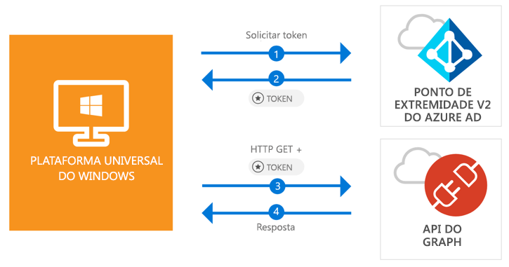

# <a name="quickstart-call-the-microsoft-graph-api-from-a-universal-windows-platform-uwp-application"></a>Início Rápido: Chamar a API do Microsoft Graph de um aplicativo da UWP (Plataforma Universal do Windows)

[!INCLUDE [active-directory-develop-applies-v2-msal](../../../includes/active-directory-develop-applies-v2-msal.md)]

Este início rápido contém um exemplo de código que demonstra como um aplicativo UWP (Plataforma Universal do Windows) pode conectar usuários com contas corporativas, pessoais ou de estudante, obter um token de acesso e chamar a API do Microsoft Graph.



> [!div renderon="docs"]
> ## <a name="register-and-download-your-quickstart-app"></a>Registrar e baixar o aplicativo de início rápido
> [!div renderon="docs" class="sxs-lookup"]
> Você tem duas opções para iniciar o aplicativo de início rápido:
> * [Expresso] [Opção 1: registrar e configurar o aplicativo automaticamente e, em seguida, baixar seu exemplo de código](#option-1-register-and-auto-configure-your-app-and-then-download-your-code-sample)
> * [Manual] [Opção 2: registrar e configurar manualmente o aplicativo e o exemplo de código](#option-2-register-and-manually-configure-your-application-and-code-sample)
>
> ### <a name="option-1-register-and-auto-configure-your-app-and-then-download-your-code-sample"></a>Opção 1: registrar e configurar o aplicativo automaticamente e, em seguida, baixar seu exemplo de código
>
> 1. Vá para o [portal do Azure – Registro de Aplicativo](https://portal.azure.com/?Microsoft_AAD_RegisteredApps=true#blade/Microsoft_AAD_RegisteredApps)
> 1. Insira um nome para o aplicativo e clique em **Registrar**.
> 1. Siga as instruções para baixar e configurar automaticamente o novo aplicativo com apenas um clique.
>
> ### <a name="option-2-register-and-manually-configure-your-application-and-code-sample"></a>Opção 2: registrar e configurar manualmente o aplicativo e o exemplo de código
> [!div renderon="docs"]
> #### <a name="step-1-register-your-application"></a>Etapa 1: Registrar seu aplicativo
> Para registrar seu aplicativo e adicionar as informações de registro do aplicativo à solução, siga estas etapas:
> 1. Entre no [portal do Azure](https://portal.azure.com) usando uma conta corporativa ou de estudante ou uma conta pessoal da Microsoft.
> 1. Se sua conta fornecer acesso a mais de um locatário, selecione sua conta no canto superior direito e defina sua sessão do portal para o locatário desejado do Azure AD.
> 1. No painel de navegação à esquerda, selecione o serviço **Azure Active Directory** e selecione **Registros de aplicativo (Versão prévia)** > **Novo registro**.
> 1. Quando a página **Registrar um aplicativo** for exibida, insira as informações de registro do aplicativo:
>      - Na seção **Nome**, insira um nome de aplicativo relevante que será exibido aos usuários do aplicativo, por exemplo, `UWP-App-calling-MsGraph`.
>      - Na seção **Tipos de conta com suporte**, selecione **Contas em qualquer diretório organizacional e contas pessoais da Microsoft (por exemplo, Skype, Xbox, Outlook.com)**.
>      - Selecione **Registrar** para criar o aplicativo.
> 1. Na lista de páginas para o aplicativo, selecione **Autenticação**.
> 1. Na seção **URIs de redirecionamento**, localize a seção **URIs de redirecionamento sugeridos para clientes públicos (dispositivos móvel, área de trabalho)** e selecione **"urn:ietf:wg:oauth:2.0:oob**.
> 1. Clique em **Salvar**.

> [!div renderon="portal" class="sxs-lookup alert alert-info"]
> #### <a name="step-1-configure-your-application"></a>Etapa 1: Configurar seu aplicativo
> Para que o exemplo de código deste Início Rápido funcione, você precisa adicionar um URI de redirecionamento como **urn:ietf:wg:oauth:2.0:oob**.
> > [!div renderon="portal" id="makechanges" class="nextstepaction"]
> > [Fazer essa alteração para mim]()
>
> > [!div id="appconfigured" class="alert alert-info"]
> >  Seu aplicativo já está configurado com esses atributos.

#### <a name="step-2-download-your-visual-studio-project"></a>Etapa 2: Baixar o projeto do Visual Studio

 - [Baixar o projeto do Visual Studio 2017](https://github.com/Azure-Samples/active-directory-dotnet-native-uwp-v2/archive/master.zip)

#### <a name="step-3-configure-your-visual-studio-project"></a>Etapa 3: Configurar o projeto do Visual Studio

1. Extraia o arquivo zip para uma pasta local mais próxima da raiz do disco, por exemplo, **C:\Azure-Samples**.
1. Abra o projeto no Visual Studio.
1. Edite **App.Xaml.cs** e substitua a linha que começa com `private static string ClientId` pelo seguinte código:

    ```csharp
    private static string ClientId = "Enter_the_Application_Id_here";
    ```

## <a name="more-information"></a>Mais informações

Esta seção fornece mais informações sobre o início rápido.

### <a name="msalnet"></a>MSAL.NET

MSAL ([Microsoft.Identity.Client](https://www.nuget.org/packages/Microsoft.Identity.Client)) é a biblioteca usada para conectar usuários e solicitar tokens usados para acessar uma API protegida pelo Microsoft Azure Active Directory. Você pode instalar a MSAL executando o comando abaixo no *Console do Gerenciador de Pacotes* do Visual Studio:

```powershell
Install-Package Microsoft.Identity.Client -Pre
```

### <a name="msal-initialization"></a>Inicialização da MSAL

Você pode adicionar a referência da MSAL adicionando o seguinte código:

```csharp
using Microsoft.Identity.Client;
```

Em seguida, é possível inicializar a MSAL usando o seguinte código:

```csharp
public static PublicClientApplication PublicClientApp = new PublicClientApplication(ClientId);
```

> |Em que: ||
> |---------|---------|
> | `ClientId` | É a **ID do aplicativo (cliente)** relativa ao aplicativo registrado no portal do Azure. Você pode encontrar esse valor na página **Visão Geral** do aplicativo no portal do Azure. |

### <a name="requesting-tokens"></a>Solicitando tokens

A MSAL tem dois métodos para adquirir tokens: `AcquireTokenAsync` e `AcquireTokenSilentAsync`.

#### <a name="get-a-user-token-interactively"></a>Obter um token de usuário interativamente

 Algumas situações exigem obrigar os usuários a interagir com o ponto de extremidade v 2.0 do Azure Active Directory por meio de uma janela pop-up para validar suas credenciais ou dar consentimento. Alguns cenários de exemplo incluem:

- A primeira vez que um usuário entra no aplicativo
- Quando um usuário precisa reinserir as credenciais porque sua senha expirou
- Seu aplicativo está solicitando acesso a um recurso com o qual o usuário precisa concordar
- Quando a autenticação de dois fatores é necessária

```csharp
authResult = await App.PublicClientApp.AcquireTokenAsync(scopes);
```

> |Em que:||
> |---------|---------|
> | `scopes` | Contém os escopos que estão sendo solicitados, por exemplo, `{ "user.read" }` para o Microsoft Graph ou `{ "api://<Application ID>/access_as_user" }` para as APIs Web personalizadas. |

#### <a name="get-a-user-token-silently"></a>Obter um token de usuário no modo silencioso

Você não quer que os usuários tenham que validar suas credenciais sempre que precisarem acessar um recurso. Na maioria das vezes, o ideal é ter aquisição e renovação de tokens sem nenhuma interação do usuário. `AcquireTokenSilentAsync` é o método utilizado frequentemente para obter tokens e acessar recursos protegidos após o método `AcquireTokenAsync` inicial:

```csharp
var accounts = await App.PublicClientApp.GetAccountsAsync();
authResult = await App.PublicClientApp.AcquireTokenSilentAsync(scopes, accounts.FirstOrDefault());
```

> |Em que: ||
> |---------|---------|
> | `scopes` | Contém os escopos que estão sendo solicitados, por exemplo, `{ "user.read" }` para o Microsoft Graph ou `{ "api://<Application ID>/access_as_user" }` para as APIs Web personalizadas |
> | `accounts.FirstOrDefault()` | Especifica o primeiro usuário no cache (a MSAL dá suporte a vários usuários em um único aplicativo) |

[!INCLUDE [Help and support](../../../includes/active-directory-develop-help-support-include.md)]

## <a name="next-steps"></a>Próximas etapas

Experimente o tutorial da área de trabalho do Windows para ver um guia passo a passo completo sobre a criação de aplicativos e recursos, incluindo uma explicação completa deste início rápido.

> [!div class="nextstepaction"]
> [Tutorial UWP – Chamar a API do Graph](tutorial-v2-windows-uwp.md)
