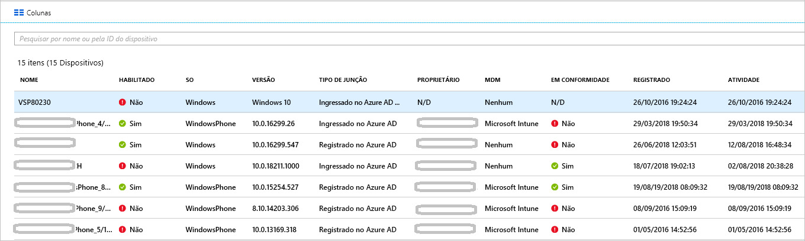

# <a name="how-to-manage-the-stale-devices-in-azure-ad"></a>Como: gerenciar os dispositivos obsoletos no Azure AD

O ideal é que, para concluir o ciclo de vida, o registro dos dispositivos registrados seja cancelado quando eles não forem mais necessários. No entanto, devido a dispositivos perdidos, roubados ou quebrados, por exemplo, ou reinstalações do sistema operacional, normalmente você tem dispositivos obsoletos em seu ambiente. Como administrador de TI, você provavelmente deseja ter um método para remover dispositivos obsoletos para poder focar em seus recursos ao gerenciar dispositivos que realmente requerem gerenciamento.

Neste artigo, você aprenderá como gerenciar com eficiência dispositivos obsoletos em seu ambiente.
  

## <a name="what-is-a-stale-device"></a>O que é um dispositivo obsoleto?

Um dispositivo obsoleto é um dispositivo que foi registrado com o Azure AD, mas não foi usado para acessar nenhum aplicativo de nuvem durante período específico. Os dispositivos obsoletos afetam sua capacidade de gerenciar e dar suporte aos seus dispositivos e aos usuários no locatário, porque: 

- Os dispositivos duplicados podem dificultar a identificação realizada por sua equipe de suporte de qual dispositivo está ativo no momento.

- Um maior número de dispositivos cria write-backs de dispositivo desnecessários, aumentando o tempo para sincronizações de conexão do AAD.

- Como uma higiene geral e para cumprir a conformidade, talvez convenha ter um estado de dispositivos limpo. 


Os dispositivos obsoletos no Azure AD podem interferir nas políticas de ciclo de vida gerais para dispositivos em sua organização.


## <a name="detect-stale-devices"></a>Detectar dispositivos obsoletos

Como um dispositivo obsoleto é definido como dispositivo registrado que não foi usado para acessar nenhum aplicativo de nuvem durante um período específico, detectar dispositivos obsoletos requer uma propriedade relacionada ao carimbo de data/hora. No Azure AD, essa propriedade é chamada **ApproximateLastLogonTimestamp** ou **carimbo de data/hora de atividade**. Se o delta entre agora e o valor do **carimbo de data/hora da atividade** exceder o período de tempo definido para dispositivos ativos, um dispositivo será considerado obsoleto. Este **carimbo de data/hora de atividade** agora está em versão prévia pública.

## <a name="how-is-the-value-of-the-activity-timestamp-managed"></a>Como o valor do carimbo de data/hora da atividade é gerenciado?  

A avaliação do carimbo de data/hora da atividade é disparada por uma tentativa de autenticação de um dispositivo. O Azure AD avalia o carimbo de data/hora da atividade quando:

- Políticas de acesso condicional que exigem [dispositivos gerenciados](../conditional-access/require-managed-devices.md) ou [aplicativos cliente aprovados](../conditional-access/app-based-conditional-access.md) foram disparadas.

- Os dispositivos Windows 10 ingressados no Azure AD ou ingressados no Azure AD híbridos estão ativos na rede. 

- Os dispositivos gerenciados pelo Intune fizeram check-in no serviço.


Se o delta entre o valor existente do carimbo de data/hora da atividade e o valor atual for maior do que 14 dias, o valor existente será substituído pelo novo valor.
    

## <a name="how-do-i-get-the-activity-timestamp"></a>Como fazer para obter o carimbo de data/hora da atividade?

Você tem duas opções para recuperar o valor do carimbo de data/hora da atividade:

- A coluna **Atividade** na [página de dispositivos](https://portal.azure.com/#blade/Microsoft_AAD_IAM/DevicesMenuBlade/Devices) no portal do Azure

    


- O cmdlet [Get-MsolDevice](https://docs.microsoft.com/powershell/module/msonline/get-msoldevice?view=azureadps-1.0)

    


## <a name="plan-the-cleanup-of-your-stale-devices"></a>Planejar a limpeza dos seus dispositivos obsoletos

Para limpar com eficiência os dispositivos obsoletos em seu ambiente, você deve definir uma política relacionada. Essa política ajuda você a garantir que capturou todas as considerações relacionadas a dispositivos obsoletos. As seções a seguir fornecem exemplos de considerações de política comuns. 

### <a name="cleanup-account"></a>Conta de limpeza

Para atualizar um dispositivo no Azure AD, é necessária uma conta que tenha uma das seguintes funções atribuídas:

- Administrador global

- Administrador do dispositivo de nuvem (Nova função disponível agora!)

- Administrador de serviços do Intune

Em sua política de limpeza, selecione as contas que têm as funções necessárias atribuídas. 


### <a name="timeframe"></a>Período de tempo

Defina um período de tempo que é seu indicador para um dispositivo obsoleto. Ao definir seu período de tempo, fatore a janela de 14 dias para atualizar o carimbo de data/hora da atividade em seu valor. Por exemplo, você não deve considerar um carimbo de data/hora menor do que 14 dias como indicador para um dispositivo obsoleto. Há cenários que podem fazer um dispositivo parecer obsoleto mesmo ele não sendo. Por exemplo, o proprietário do dispositivo afetado pode estar de férias ou de licença.  que excede seu período de tempo para dispositivos obsoletos.

### <a name="disable-devices"></a>Desabilitar dispositivos

Não é aconselhável excluir imediatamente um dispositivo que parece obsoleto, porque não é possível desfazer uma exclusão no caso de falsos positivos. Como melhor prática, desabilite um dispositivo por um período de carência antes de excluí-lo. Em sua política, defina um período para desabilitar um dispositivo antes de excluí-lo.


### <a name="mdm-controlled-devices"></a>Dispositivos controlados pelo MDM

Se seu dispositivo estiver sob o controle do Intune ou de qualquer outra solução MDM, desative o dispositivo no sistema de gerenciamento antes de desabilitá-lo ou excluí-lo.


### <a name="system-managed-devices"></a>Dispositivos gerenciados pelo sistema

Não exclua os dispositivos gerenciados pelo sistema. Em geral, esses são dispositivos como o piloto automático. Depois de excluídos, esses dispositivos não podem ser provisionados novamente. O novo cmdlet `get-msoldevice` exclui dispositivos gerenciados pelo sistema por padrão. 


### <a name="hybrid-azure-ad-joined-devices"></a>Dispositivos adicionados ao Azure AD híbrido

Seus dispositivos ingressados no Azure AD híbridos devem seguir suas políticas para gerenciamento de dispositivos obsoletos locais. 

Para limpar o Azure AD:

- **Dispositivos Windows 10** – Desabilite ou exclua dispositivos Windows 10 em seu AD local e deixe o Azure AD Connect sincronizar o status do dispositivo alterado com o Azure AD.

- **Windows 7/8** – Desabilite ou exclua os dispositivos Windows 10 no Azure AD. Não é possível usar o Azure AD Connect para desabilitar ou excluir dispositivos Windows 7/8 no Azure AD.


### <a name="azure-ad-joined-devices"></a>Dispositivos adicionados ao Azure AD

No Azure AD, desabilite ou exclua dispositivos ingressados no Azure AD.


### <a name="azure-ad-registered-devices"></a>Dispositivos registrados no Azure AD

No Azure AD, desabilite ou exclua dispositivos registrados no Azure AD.


## <a name="clean-up-stale-devices-in-the-azure-portal"></a>Limpar dispositivos obsoletos no portal do Azure  

Embora seja possível limpar dispositivos obsoletos no portal do Azure, é mais eficiente manipular esse processo usando um script do PowerShell. Use o módulo mais recente do PowerShell V1 para usar o filtro de carimbo de data/hora e para filtrar dispositivos gerenciados pelo sistema como o piloto automático. Neste ponto, não é recomendável usar o PowerShell V2.


Uma rotina típica é composta das seguintes etapas:

1. Conectar-se ao Azure Active Directory usando o cmdlet [Connect-MsolService](https://docs.microsoft.com/powershell/module/msonline/connect-msolservice?view=azureadps-1.0)

2. Obter a lista de dispositivos

3. Desabilite o dispositivo usando o cmdlet [Disable-MsolDevice](https://docs.microsoft.com/powershell/module/msonline/disable-msoldevice?view=azureadps-1.0). 

4. Aguarde o período de cortesia com o número de dias escolhido por você antes de excluir o dispositivo.

5. Remova o dispositivo usando o cmdlet [Remove-MsolDevice](https://docs.microsoft.com/powershell/module/msonline/remove-msoldevice?view=azureadps-1.0).

### <a name="get-the-list-of-devices"></a>Obter a lista de dispositivos

Para obter todos os dispositivos e armazenar os dados retornados em um arquivo CSV:

```powershell
Get-MsolDevice -all | select-object -Property Enabled, DeviceId, DisplayName, DeviceTrustType, Approxi
mateLastLogonTimestamp | export-csv devicelist-summary.csv
```

se tiver um grande número de dispositivos em seu diretório, use o filtro do carimbo de data/hora para restringir o número de dispositivos retornados. Para obter todos os dispositivos com um carimbo de data/hora mais antigo do que a data específica e armazenar os dados retornados em um arquivo CSV: 

```powershell
$dt = [datetime]’2017/01/01’
Get-MsolDevice -all -LogonTimeBefore $dt | select-object -Property Enabled, DeviceId, DisplayName, DeviceTrustType, ApproximateLastLogonTimestamp | export-csv devicelist-olderthan-Jan-1-2017-summary.csv
```


## <a name="what-you-should-know"></a>O que você deve saber

### <a name="why-is-the-timestamp-not-updated-more-frequently"></a>Por que o carimbo de data/hora não é atualizado com mais frequência?

O carimbo de data/hora é atualizado para dar suporte a cenários de ciclo de vida do dispositivo. Isso não é uma auditoria. Use os logs de auditoria de entrada para obter atualizações mais frequentes sobre o dispositivo.

### <a name="why-should-i-worry-about-my-bitlocker-keys"></a>Por que eu deveria me preocupar com minhas chaves do BitLocker?

Quando configuradas, as chaves do BitLocker para dispositivos Windows 10 são armazenadas no objeto do dispositivo no Azure AD. Se você excluir um dispositivo obsoleto, você também excluirá as chaves do BitLocker armazenadas no dispositivo. Você deve determinar se sua política de limpeza se alinha com o ciclo de vida real do seu dispositivo antes de excluir um dispositivo obsoleto. 

### <a name="how-do-i-know-all-the-type-of-devices-joined"></a>Como fazer para conhecer todos os tipos de dispositivos ingressados?

Para saber mais sobre os diferentes tipos, consulte a [visão geral do gerenciamento de dispositivo](overview.md).

### <a name="what-happens-when-i-disable-a-device"></a>O que acontecerá quando eu desabilitar um dispositivo?

Qualquer autenticação em que um dispositivo está sendo usado para autenticar-se no Azure AD é negada. Alguns exemplos comuns são:

- **Dispositivo híbrido ingressado no Azure AD** – Os usuários talvez devam usar o dispositivo para entrar em seu domínio local. No entanto, eles não podem acessar os recursos do Azure AD como o Office 365.

- **Dispositivo ingressado no Azure AD** – usuários não podem usar o dispositivo para entrar. 

- **Dispositivos móveis** – o usuário não pode acessar os recursos do Azure AD como o Office 365. 


## <a name="next-steps"></a>Próximas etapas

Para obter uma visão geral de como gerenciar dispositivos no portal do Azure, consulte [Gerenciar dispositivos usando o portal do Azure](device-management-azure-portal.md)


