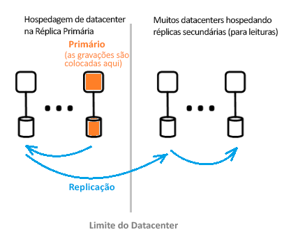

# Qual é a arquitetura do Active Directory do Azure?
O Azure AD (Azure Active Directory) o habilita a gerenciar o acesso a recursos e serviços do Azure para os usuários. Está incluído no Azure AD um conjunto completo de recursos de gerenciamento de identidade. Para obter informações sobre os recursos do Azure AD, confira [O que é o Azure Active Directory?](active-directory-whatis.md)

Com o Azure AD, você pode criar e gerenciar usuários e grupos e habilitar as permissões para permitir e negar acesso aos recursos da empresa. Para obter informações sobre o gerenciamento de identidade, confira [Os fundamentos do gerenciamento de identidades do Azure](active-directory-whatis.md).

## Arquitetura do Azure AD
A arquitetura distribuída geograficamente do Azure AD combina recursos abrangentes de monitoramento, reencaminhamento automatizado, failover e recuperação, que oferecem disponibilidade e desempenho para os clientes em toda a empresa.

Os seguintes elementos de arquitetura são abordados neste artigo:
 *  Design de arquitetura de serviço
 *  Facilidade de uso 
 *  Disponibilidade contínua
 *  Data centers

### Design de arquitetura de serviço
A maneira mais comum para criar um sistema rico em dados, acessível e utilizável, é através de blocos de construção independentes ou unidades de escala. Para a camada de dados do Azure AD, as unidades de escala são chamadas de *partições*. 

A camada de dados tem vários serviços de front-end que fornecem a capacidade de leitura/gravação. O diagrama abaixo mostra como os componentes de uma partição de diretório único são entregues em data centers distribuídos geograficamente. 

  

Os componentes da arquitetura do Azure AD incluem uma réplica principal e uma secundária.

**Réplica primária**

A *réplica principal* recebe todas as *gravações* para a partição à qual ela pertence. Qualquer operação de gravação é imediatamente replicada em uma réplica secundária em um datacenter diferente antes de retornar êxito para o chamador, garantindo assim a redundância geográfica com durabilidade das gravações.

**Réplicas secundárias**

Todas as *leituras* de diretório são realizadas por meio de *réplicas secundárias*, que estão em data centers fisicamente localizados em regiões diferentes. Há várias réplicas secundárias, pois os dados são replicados de forma assíncrona. As leituras de diretório, como solicitações de autenticação, são atendidas em datacenters próximos aos clientes. As réplicas secundárias são responsáveis pela escalabilidade de leitura.

### Escalabilidade

A escalabilidade é a capacidade de expandir um serviço para atender às necessidades crescentes de desempenho. A escalabilidade de gravação é obtida por meio do particionamento de dados. A escalabilidade de leitura é obtida com a replicação de dados de uma partição para várias réplicas secundárias distribuídas em todo o mundo.

As solicitações de aplicativos de diretório são roteadas para o datacenter ao qual são fisicamente mais próximas. As gravações são redirecionadas de forma transparente para a réplica primária para fornecer consistência de leitura/gravação. Réplicas secundárias estendem significativamente a escalas de partições, porque os diretórios normalmente atendem a leituras na maioria das vezes.

Os aplicativos de diretório se conectam aos data centers mais próximos. Essa conexão melhora o desempenho e, portanto, a expansão é possível. Como uma partição de diretório pode ter várias réplicas secundárias, as réplicas secundárias podem ser colocadas mais perto dos clientes de diretório. Somente componentes de serviço internos que fazem uso intensivo de gravação direcionam a réplica principal ativa diretamente.

### Disponibilidade contínua

A disponibilidade (ou tempo de atividade) define a capacidade de um sistema de funcionar sem interrupções. A chave para a alta disponibilidade do Azure AD é que os serviços podem mudar rapidamente o tráfego em vários datacenters distribuídos geograficamente. Cada data center é independente, o que habilita modos de falha não correlacionados.

O design da partição do Azure AD é simplificado em comparação com o design do AD corporativo, usando um design de mestre único que inclui um processo de failover de réplica primária cuidadosamente orquestrado e determinístico.

**Tolerância a falhas**

Um sistema está mais disponível se é tolerante a falhas de hardware, rede e software. Para cada partição do diretório, há uma réplica mestre altamente disponível: a réplica primária. Apenas as gravações na partição são executadas nessa réplica. Esta réplica está sendo monitorada continuamente e com atenção, e as gravações poderão ser transferidas imediatamente para outra réplica (que se torna o novo principal) se for detectada uma falha. Durante o failover, pode haver uma perda de disponibilidade de gravação normalmente de 1 a 2 minutos. A disponibilidade de leitura não é afetada durante esse tempo.

Operações de leitura (que ultrapassam o número de gravações por várias ordens de magnitude) só vão para réplicas secundárias. Como as réplicas secundárias são idempotentes, a perda de qualquer réplica em determinada partição é compensada facilmente direcionando as leituras para outra réplica, normalmente no mesmo datacenter.

**Durabilidade dos dados**

Uma gravação é confirmada de forma durável para pelo menos dois data centers antes de ser reconhecida. Isso ocorre primeiro com a confirmação da gravação no principal e, depois, com a replicação imediata da gravação para pelo menos um outro data center. Essa ação de gravação garante que uma possível perda catastrófica do data center que hospeda o primário não resulte em perda de dados.

O Azure AD mantém um [RTO (Recovery Time Objective)](https://en.wikipedia.org/wiki/Recovery_time_objective) zero para não perder dados em failovers. Isso inclui:
-  Edição de tokens e leituras de diretórios
-  Permitindo apenas cerca de 5 minutos de RTO para gravações de diretório

### Data centers

As réplicas do Azure AD são armazenadas em data centers no mundo todo. Para obter mais informações, confira [Datacenters do Azure](https://azure.microsoft.com/overview/datacenters).

O Azure AD opera em data centers com as seguintes características:

 * Autenticação, gráfico e outros serviços de AD residem atrás do serviço de gateway. O Gateway gerencia o balanceamento de carga desses serviços. Ele falhará automaticamente se algum servidor não íntegro for detectado usando probes de integridade transacionais. Com base nesses testes de integridade, o Gateway roteia dinamicamente o tráfego para os data centers íntegros.
 * Para *leituras*, o diretório tem réplicas secundárias e serviços de front-end correspondentes em uma configuração ativo-ativo operando em vários data centers. Em caso de falha de um data center inteiro, o tráfego será roteado para um data center diferente automaticamente.
 *  Para *gravações*, o diretório apresentará failover na réplica principal (mestre) nos datacenters por meio de procedimentos planejados (o novo primário é sincronizado com o primário antigo) ou de failover de emergência. A durabilidade dos dados é obtida por meio da replicação de qualquer confirmação para pelo menos dois data centers.

**Consistência de dados**

O modelo de diretório é uma das consistências eventuais. Um problema típico dos sistemas de replicação assíncrona distribuídos é que os dados retornados de uma réplica “particular” podem não estar atualizados. 

O Azure AD oferece consistência de leitura e gravação para aplicativos destinados a uma réplica secundária roteando suas gravações para a réplica principal e incluindo as gravações de forma síncrona novamente na réplica secundária.

As gravações de aplicativo usando a API do Graph do Azure AD são abstraídas da afinidade de manutenção para uma réplica do diretório para consistência de leitura/gravação. O serviço Azure AD Graph mantém uma sessão lógica, que tem afinidade para uma réplica secundária usada para leituras; a afinidade é capturada em um "token de réplica" que o serviço do graph armazena em cache usando um cache distribuído. Esse token é usado para operações subsequentes na mesma sessão lógica. 

 >[!NOTE]
 >As gravações são replicadas imediatamente para a réplica secundária para a qual foram emitidas leituras lógicas da sessão.
 >

**Proteção de backup**

O diretório implementa exclusões a quente, em vez de exclusões irreversíveis, para usuários e locatários, para fácil recuperação no caso de exclusões acidentais por um cliente. Se o administrador do seu locatário excluir acidentalmente os usuários, eles poderão desfazer e restaurar facilmente os usuários excluídos. 

O Azure AD implementa backups diários de todos os dados e, assim, pode restaurar os dados em caso de quaisquer exclusões lógicas ou corrupção. A camada de dados emprega códigos de correção de erros, para que possa verificar erros e corrigir automaticamente determinados tipos de erros de disco.

**Métricas e monitores**

Executar um serviço de alta disponibilidade requer métricas de classe mundial e recursos de monitoramento. O Azure AD analisa e relata continuamente critérios de sucesso e métricas de integridade de serviço principais para cada um de seus serviços. Há também desenvolvimento e ajuste contínuos de métricas e monitoramento e alertas para cada cenário, dentro de cada serviço do Azure AD e em todos os serviços.

Se algum serviço do Azure AD não estiver funcionando conforme o esperado, uma ação será executada imediatamente para restaurar a funcionalidade o mais rápido possível. A métrica mais importante do Azure AD é a rapidez com que os problemas de site ao vivo podem ser detectados e atenuados para os clientes. Investimos muito no monitoramento e nos alertas para minimizar o tempo para detectar (Alvo de TTD: <5 minutos) e a preparação operacional para minimizar o tempo para mitigar (Alvo de TTM: <30 minutos).

**Operações seguras**

Usando controles operacionais, como a autenticação multifatores (MFA) para qualquer operação, bem como a auditoria de todas as operações. Além disso, usar um sistema de elevação just-in-time para conceder acesso temporário necessário a qualquer tarefa operacional sob demanda de maneira contínua. Para obter mais informações, confira [A nuvem confiável](https://azure.microsoft.com/support/trust-center).

## Próximas etapas
[Guia do desenvolvedor do Active Directory do Azure](https://docs.microsoft.com/azure/active-directory/develop/active-directory-developers-guide)

