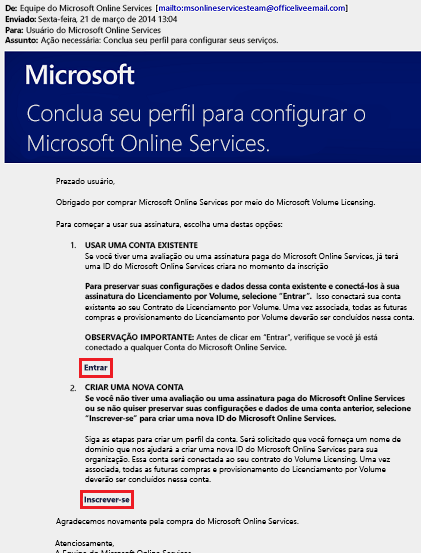
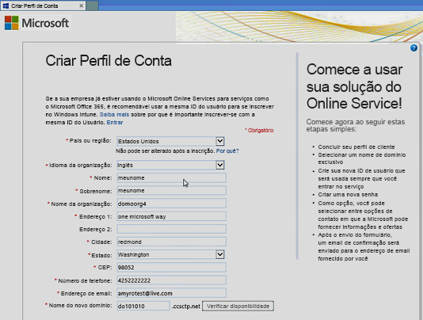
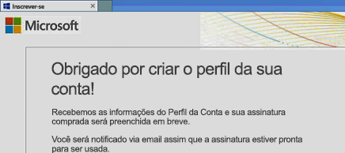
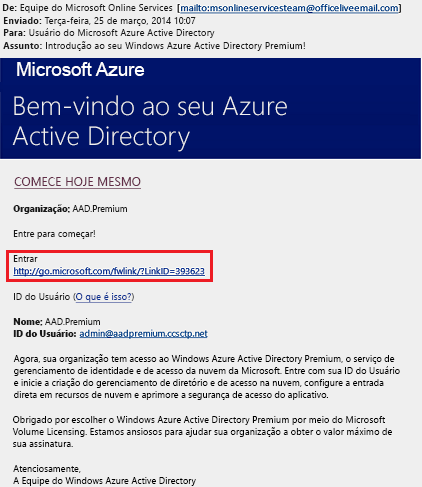
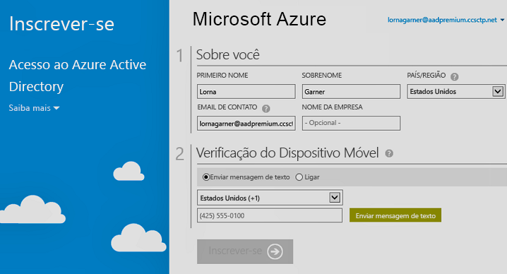

# Inscreva-se nas edições do Azure Active Directory Premium
Você pode comprar e associar as edições do Azure Active Directory (Azure AD) Premium à sua assinatura do Azure. Se você precisar criar uma nova assinatura do Azure, também precisará ativar seu plano de licenciamento e o acesso ao serviço do Azure AD.

> [!NOTE]
>As edições Azure AD Premium e Básico estão disponíveis para clientes na China por meio da instância mundial do Azure Active Directory. Atualmente, as edições Azure AD Premium e Básico não têm suporte no serviço do Azure operado pela 21Vianet na China. Para obter mais informações, fale conosco usando o [Fórum do Azure Active Directory](https://feedback.azure.com/forums/169401-azure-active-directory/).

Antes de se inscrever no Active Directory Premium 1 ou Premium 2, primeiro determine qual assinatura existente ou plano você deseja usar:

- Por meio da assinatura existente do Azure ou Office 365

- Por meio do plano de licenciamento Enterprise Mobility + Security

- Por meio de um plano de Licenciamento por Volume da Microsoft

Se você se inscrever usando sua assinatura do Azure com licenças do Azure AD previamente compradas e ativadas, isso ativará automaticamente as licenças no mesmo diretório. Se não for o caso, você ainda deverá ativar seu plano de licença e o acesso ao Azure AD. Para obter mais informações sobre como ativar seu plano de licença, veja [Ativar seu novo plano de licença](#activate-your-new-license-plan). Para obter mais informações sobre como ativar o acesso ao Azure AD, veja [Ativar o acesso ao Azure AD](#activate-your-azure-ad-access). 

## Inscrever-se usando a assinatura existente do Azure ou Office 365
Como assinante do Azure ou do Office 365, você pode comprar as edições do Azure Active Directory Premium online. Para obter etapas detalhadas, confira [Como comprar o Azure Active Directory Premium ‒ clientes existentes](https://channel9.msdn.com/Series/Azure-Active-Directory-Videos-Demos/How-to-Purchase-Azure-Active-Directory-Premium-Existing-Customer) ou [Como comprar o Azure Active Directory Premium ‒ novos clientes](https://channel9.msdn.com/Series/Azure-Active-Directory-Videos-Demos/How-to-Purchase-Azure-Active-Directory-Premium-New-Customers).

## Inscrever-se usando o plano de licenciamento Enterprise Mobility + Security
O Enterprise Mobility + Security é um pacote composto pelo Azure AD Premium, pela Proteção de Informações do Azure e pelo Microsoft Intune. Se você já tiver uma licença do EMS, poderá começar com o Azure AD usando uma destas opções de licenciamento:

Para obter mais informações sobre o EMS, veja o site [Enterprise Mobility + Security](https://www.microsoft.com/cloud-platform/enterprise-mobility-security).

- Experimente o EMS com uma [assinatura de avaliação do Enterprise Mobility + Security E5 ](https://signup.microsoft.com/Signup?OfferId=87dd2714-d452-48a0-a809-d2f58c4f68b7&ali=1) gratuita

- Comprar [licenças do Enterprise Mobility + Security E5](https://signup.microsoft.com/Signup?OfferId=e6de2192-536a-4dc3-afdc-9e2602b6c790&ali=1)

- Comprar [licenças do Enterprise Mobility + Security E3](https://signup.microsoft.com/Signup?OfferId=4BBA281F-95E8-4136-8B0F-037D6062F54C&ali=1)

## Inscrever-se usando o plano de Licenciamento por Volume da Microsoft
Por meio de seu plano de licenciamento por Volume da Microsoft, você pode se inscrever no Azure AD Premium usando um destes dois programas, com base no número de licenças que você deseja obter:

- **Para 250 ou mais licenças.** [Contrato Enterprise da Microsoft](https://www.microsoft.com/en-us/licensing/licensing-programs/enterprise.aspx)

- **Para 5 a 250 licenças.** [Abrir Licenciamento por Volume](https://www.microsoft.com/en-us/licensing/licensing-programs/open-license.aspx)

Para obter mais informações sobre as opções de compra do licenciamento por volume, veja [Como comprar com o licenciamento por Volume](https://www.microsoft.com/en-us/licensing/how-to-buy/how-to-buy.aspx).

## Ativar seu novo plano de licença
Se você se inscreveu usando um novo plano de licença do Azure AD, ative-o para sua organização usando o email de confirmação enviado após a compra.

### Para ativar seu plano de licença
- Abra o email de confirmação recebido da Microsoft depois que você se inscreveu e, em seguida, clique em **Entrar** ou **Criar conta**.
   
    

    - **Entrar.** Escolha este link se você tiver um locatário existente e entre usando sua conta de administrador existente. Você precisa ser um administrador global no locatário em que as licenças estão sendo ativadas.

    - **Criar conta.** Escolha este link se você quiser abrir a página **Criar Perfil da Conta** e criar um novo locatário do Azure AD para seu plano de licenciamento.

        

Quando você terminar, verá uma caixa de confirmação agradecendo a ativação do plano de licença para seu locatário.

## Ativar o acesso ao Azure AD
Se você estiver adicionando novas licenças do Azure AD Premium a uma assinatura existente, o acesso ao Azure AD já deverá estar ativado. Caso contrário, você precisará ativar o acesso ao Azure AD depois de receber o **email de boas-vindas**.  

Depois que suas licenças compradas forem provisionadas em seu diretório, você receberá uma **email de boas-vindas**. Esse email confirma que você pode começar a gerenciar suas licenças e recursos do Azure AD Premium ou Enterprise Mobility + Security. 

> [!TIP]
> Você não poderá acessar o Azure AD do seu novo locatário até ativar o acesso ao diretório do Azure AD no email de boas-vindas.

### Para ativar o acesso ao Azure AD

1. Abra o **email de boas-vindas** e, em seguida, clique em **Entrar**.
   
    

2. Depois de entrar com êxito, você passará pela verificação em duas etapas usando um dispositivo móvel.
   
    

O processo de ativação geralmente leva apenas alguns minutos e, em seguida, você pode usar seu locatário do Azure AD. 

## Próximas etapas
Agora que você tem o Azure AD Premium, pode [personalizar seu domínio](add-custom-domain.md), adicionar sua [identidade visual corporativa](customize-branding.md), [criar um locatário](active-directory-access-create-new-tenant.md) e [adicionar grupos](active-directory-groups-create-azure-portal.md) e [usuários](add-users-azure-active-directory.md).
